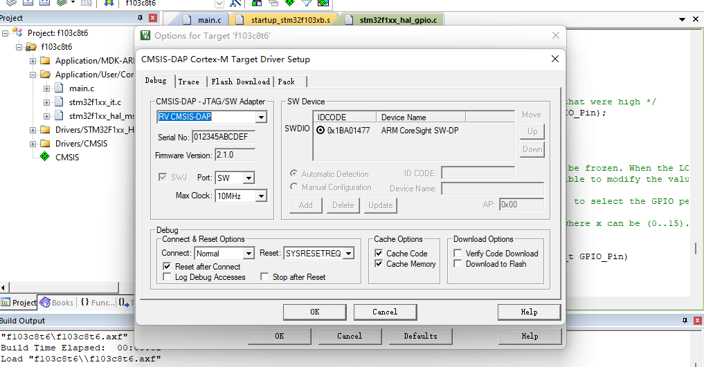

SLogic Combo8 具备高速DAP-Link功能，适用于各种常规芯片，尤其是在Windows下使用IDE调试的STM32等芯片

## 开启DAPLink功能

按下切换按键，将指示灯切换为绿色

> 验证SLogic功能是否开启的方法:

> Linux：使用lsusb命令可以看到出现了CMSIS-DAP HS的USB设备

### 开始使用

以STM32F103C8T6芯片在Windows MDK IDE为例介绍具体使用步骤：连接，下载、调试固件，演示使用的MDK版本为当前最新版（V5.38）

- 首先通过STM32CUBEMX快速生成工程项目，注意生成项目的最低版本号
- 使用MDK连接DAPLink

- 使用MDK下载固件

- 使用MDK调试固件

