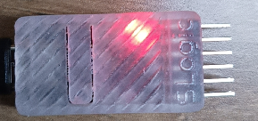
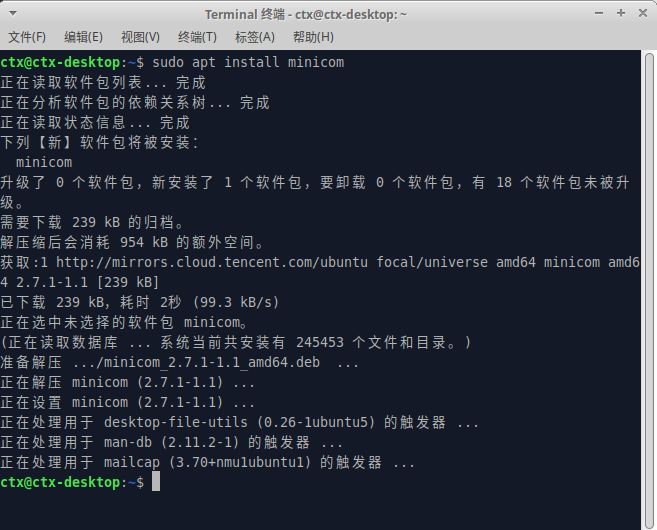

SLogic Combo8 具备4路独立高速串口功能，前两路基于UART可同时达到20Mbps的超高速波特率，后两路通过IO模拟最高可达1Mbps。非常适合批量烧录，生产测试等场景。

## 开启串口模块功能

按下切换按键，将指示灯切换为红色



> 验证SLogic功能是否开启的方法:

> Linux：使用lsusb命令可以看到出现了UARTx4 HS的USB设备


## 开始使用

注意：Linux由于系统原因，当设备拥有大于一个的ttyACM后，Linux会认为其为调制解调器，会临时占用发送AT指令。此时无法打开串口，会报资源占用设备忙碌，属正常现象，稍等片刻即可恢复正常。要解决该问题，可以添加udev规则来规避该问题,参考以下指令：
```shell
sudo touch /etc/udev/rules.d/49-sipeed.rules
sudo echo "ATTRS{idVendor}==\"359f\", ATTRS{idProduct}==\"3101\", ENV{ID_MM_DEVICE_IGNORE}=\"1\"" > /etc/udev/rules.d/49-sipeed.rules
sudo udevadm control --reload
```

### 引脚连接


SLogic combo8总共有4个串口，UART0和UART1最高支持20M波特率，UART3和UART4最高支持1M波特率。

注意：
1. 保证模块与目标设备共地，防止出现乱码等情况。
2. Windows平台的设备号可能是乱序的，需要手动尝试来找到对应的串口

### 数据收发

Linux可使用picocom或minicom作为串口收发工具，安装指令为：

```Bash
sudo apt install picocom
sudo apt install minicom
```

以minicom为例，使用`CTRL+ALT+T`打开Linux终端，输入安装指令，将会提示输入该Linux系统管理员用户密码，输入密码后回车，静待软件包安装完成

  

完成安装后，使用UART0与测试设备进行通信，于终端输入命令：

```Bash
sudo minicom -b 2000000 -D /dev/ttyACM0
```

-b参数指定所需的波特率，与测试设备UART串口设置波特率相同即可
-D参数指定监听的端口号


命令输入后即与测试设备进行通信，收到信息将于终端进行打印；以及向测试设备发送数据。

#### 串口回传测试：


(上：串口模块接线图)

回传测试结果：

