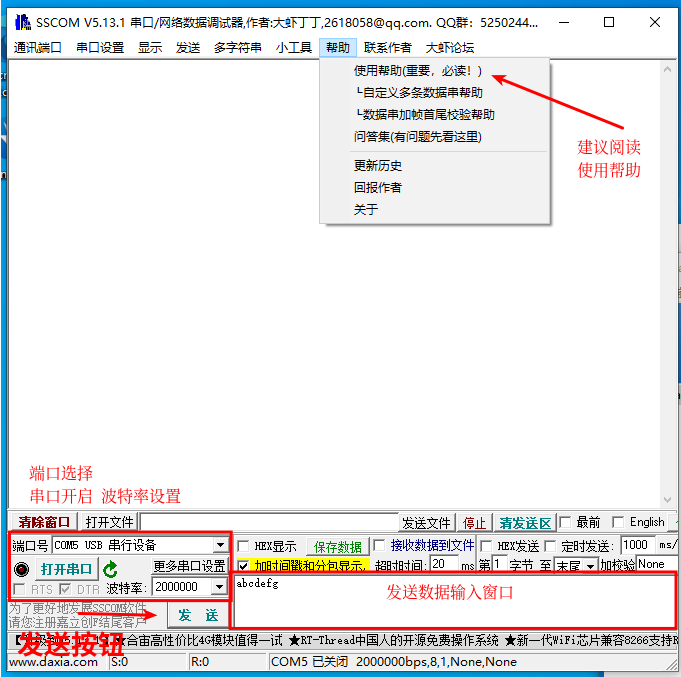
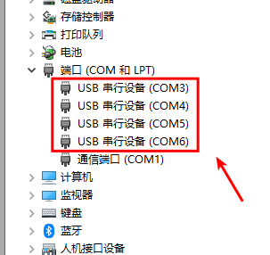
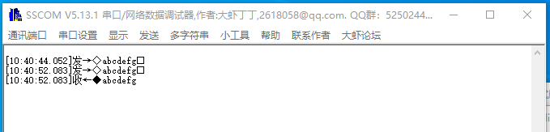
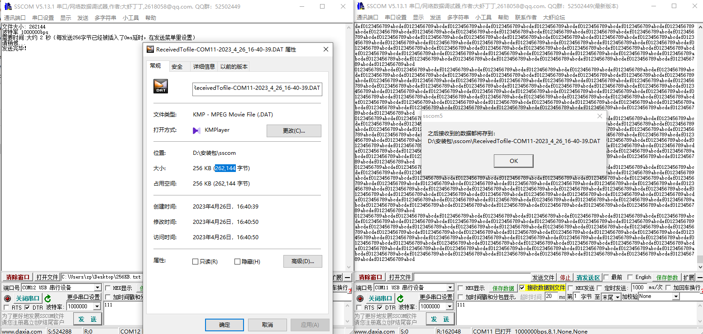
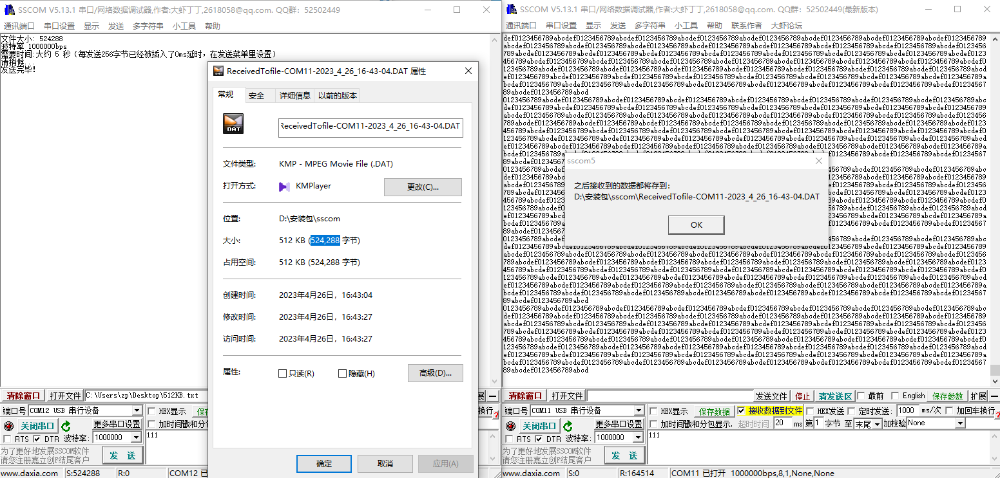
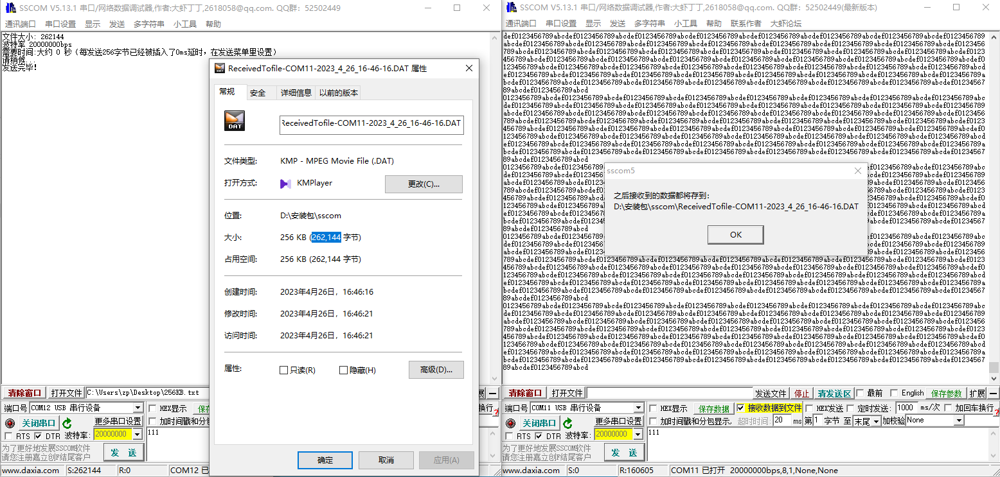

SLogic Combo 8 具备4路独立高速串口功能，前两路基于UART可同时达到20Mbps的超高速波特率，后两路通过IO模拟最高可达1Mbps。非常适合批量烧录，生产测试等场景。

## 开启串口模块功能

按下切换按键，将指示灯切换为红色


> 验证SLogic功能是否开启的方法:
> Windows环境打开设备管理器，Linux环境使用lsusb命令，可以找到"UARTx4 HS"设备。

## 开始使用

### 引脚连接


SLogic Combo 8总共有4个串口，UART0和UART1最高支持20M波特率，UART3和UART4最高支持1M波特率。

注意：
1. 保证模块与目标设备共地，防止出现乱码等情况。
2. Windows平台的设备号可能是乱序的，需要手动尝试来找到对应的串口

### Linux

注意：Linux由于系统原因，当设备拥有大于一个的ttyACM后，Linux会认为其为调制解调器，会临时占用发送AT指令。此时无法打开串口，会报资源占用设备忙碌，属正常现象，稍等片刻即可恢复正常。要解决该问题，可以添加udev规则来规避该问题,参考以下指令：
```shell
sudo touch /etc/udev/rules.d/49-sipeed.rules
sudo echo "ATTRS{idVendor}==\"359f\", ATTRS{idProduct}==\"3101\", ENV{ID_MM_DEVICE_IGNORE}=\"1\"" > /etc/udev/rules.d/49-sipeed.rules
sudo udevadm control --reload
```
#### 数据收发

Linux可使用picocom或minicom作为串口收发工具，安装指令为：

```Bash
sudo apt install picocom
sudo apt install minicom
```

以minicom为例，使用`CTRL+ALT+T`打开Linux终端，输入安装指令，将会提示输入该Linux系统管理员用户密码，输入密码后回车，静待软件包安装完成

  
完成安装后，使用UART0与测试设备进行通信，于终端输入命令：

```Bash
sudo minicom -b 2000000 -D /dev/ttyACM0
```

-b参数指定所需的波特率，与测试设备UART串口设置波特率相同即可

-D参数指定监听的端口号


命令输入后即与测试设备进行通信，收到信息将于终端进行打印；以及向测试设备发送数据。

#### 串口回传测试：


(上：串口模块接线图)

回传测试结果：


### Windows

在Windows系统中，您可以使用SSCOM、MobaXterm等串口助手作为串口收发工具。以下以**SSCOM**为例，演示如何使用SSCOM进行串口通信测试

1. 首先，下载SSCOM，该软件为开源软件，请自行百度下载

2. 下载完成后，解压并启动串口助手。您将看到如下界面：

   

3. 将模块连接到PC上。然后在Windows设备管理器中（快捷键`Win + X + M`）查看是否成功连接，以及获取串口号信息

   

   由于Windows系统的特性，串口号可能会是乱序的。因此，您可以按照以下步骤测试对应的串口号：

   - 连接模块的TX*和RX*引脚（*为0-3）
   - 设置波特率，通常使用115200
   - 开启串口
   - 逐个尝试不同的端口号设备，点击“发送”按钮，检查是否收到数据，以确认每个端口对应的串口号

   

4. 确认了每个串口的端口号后，您可以在数据输入窗口中输入需要发送的数据。同时，接收到的数据也会显示在窗口中

#### 收发测试

   使用SLogic 4xUART模块进行串口通信测试，前两路虚拟串口最高速率可达20Mbps。以下以使用SSCOM测试性能为例
   
##### 测试 1Mbps（256kbps，512kbps）

   1. 连接TX2和RX3
   2. 启动两个SSCOM实例，分别连接到两个串口
   3. 将波特率设置为1000000，然后开启串口
   4. 创建一个256KB的文本文件，其中的内容为重复的常见字符
   5. 使用SSCOM的文件发送功能，选择刚创建的文本文件并发送
   6. 另一个SSCOM实例将接收数据并检查接收到的文件内容

   以下是1Mbps测试的结果，检查文件大小以及数据内容确认1Mbps时，收发256kb数据测试成功

   

   将文本文件的数据增大至512KB，并重复测试，确认1Mbps时，收发512kb数据测试成功

   

##### 测试 20Mbps（256kbps）

   1. 连接TX0和RX1
   2. 启动两个SSCOM实例，分别连接到两个串口
   3. 将波特率设置为20000000，然后开启串口
   4. 创建一个256KB的文本文件，其中的内容为重复的常见字符
   5. 使用SSCOM的文件发送功能，选择刚创建的文本文件并发送
   6. 另一个SSCOM实例将接收数据并检查接收到的文件内容

   以下是测试结果截图，可以通过检查文件大小和数据内容来确认测试是否成功

   
