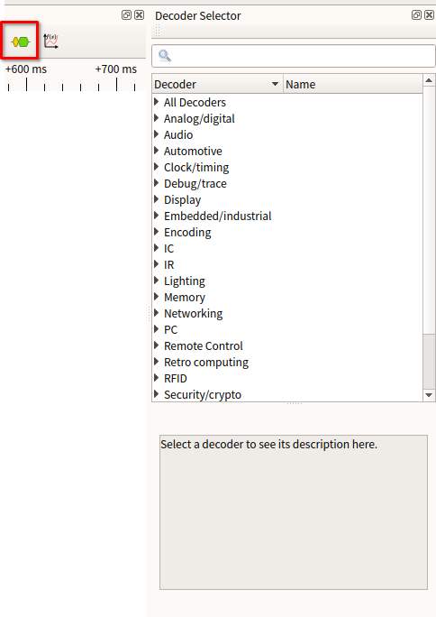
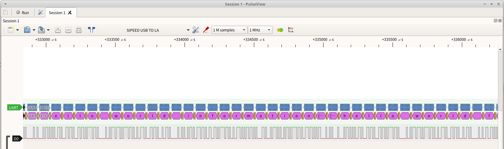

## 开启逻辑分析仪功能

按下按键将指示灯切换为蓝色。如下图所示：


## 验证逻辑分析仪功能是否开启

Linux:

使用lsusb命令可以看到出现了USB TO LA的USB设备


## 使用USB TO LA

> 目前逻辑分析仪仅支持Linux系统使用

### 快速使用

#### 连接SLogic和目标设备

将目标设备的待测信号点连接至SLogic任意空闲CH端口，并确保待测设备的GND与SLogic的GND相连接


#### 连接SLogic和电脑

需下载[上位机]()软件供数据解码与可视化，下载后进入文件所在目录，使用`CTRL+ALT+T`打开Linux终端，输入以下命令，为其**添加权限**并**以管理员权限运行**该程序：：

```bash
chmod +x PulseView-x86_64-032323-1101.AppImage
sudo ./PulseView-x86_64-032323-1101.AppImage
```

**连接步骤**
1.  选择连接设备
2.  选择驱动程序 **Sipeed Slogic Analyzer(sipeed-slogic-analyzer)**
3.  选择连接方式为USB
4.  扫描符合要求的设备
5.  选择已找到的设备


> 若第三步未找到设备 可尝试切换模块功能 重新切换至逻辑分析仪模式 并重复第三步

### 开始采样

1. 配置PulseView的通道数、采样点数和采样率

注意！！！需要保证采样带宽不能等于或超过320MHz,即通道数 * 采样率必须小于320MHz。例如：设置通道数为8，那么采样率就只能设置为32MHz或更低，不能设置成40MHz，否则可能引起上位机故障。

下图设置通道数为**8**，采样点数为**1M samples**,采样率为**10Mhz**


2. 设置D0通道的触发方式为**上下边沿触发**

点击D0通道的标签图案来设置触发方式


3. 启动采集，并获得采样结果


### 详细配置

#### 通道设置

打开顶部工具栏中的 **“红色探针”** 图标，选择所需启用的通道，以及逻辑分析仪的采样通道数，可选的选项有1ch、2ch、4ch和8ch。同时设有快捷键，对满足相应条件的通道进行快捷开关


#### 采样参数

采样参数包括有采样样本数量、采样频率和采样时间

1.  采集样本数量：样本数量根据需求选择合适数值即可
2.  采样频率：根据被测信号频率选择，**推荐选择大于10倍被测信号频率**
3.  采样时间：采样时间根据采集**样本数量**以及**采样频率**进行计算，计算公式为：</br>**时间（秒）= 样本数 / 采样率**</br>例如1M samples，1Mhz时，采样时间为1s


> 设置完成采集样本数量、采样频率后，将鼠标至于采集样本数量选择框上，会显示当前参数的采样时间

#### 通道参数

点击通道的标签来设置通道参数，通道参数包括有标签名、标签颜色、通道波形显示窗口宽度和信号触发方式

1. 标签名：可根据采样信号意义设置，便于多信号采样分辨信号
2. 标签颜色：根据个人喜好设置，便于多信号采样分辨不同信号 
3. 通道波形显示窗口宽度：根据信号幅值设置，单位为像素，信号幅值变化大时，可提高该参数便于观察信号幅值变化
4. **信号触发方式**：具有**直接采样**、**高电平触发**、**低电平触发**、**下降沿触发**、**上升沿触发**以及**边沿触发**


### 调试波形

#### 视图操作

> -   **波形缩放**：鼠标滚轮（中键）向上滚动放大波形、向下滚动缩小波形
> -   **拖动波形**：鼠标左键按住可以左右上下拖动波形显示区
> -   **区域放大**：鼠标双击某区域可放大该区域波形
> -   **通道滚动**：“波形显示区”使用 Ctrl+鼠标滚轮（中键）可以快速上下滚动通道
> -   **时间测量**：您可以通过，在所需的位置右键点击鼠标点击"创建标记点（Create Marker Here）"来标记位置，当您重复标记其他位置时，软件会自动计算并在时间轴上显示两个标记点之间的时间长度
> -   **调整通道顺序**：鼠标拖动通道标签即可拖动通道至指定位置


#### 协议解码

> 从顶部工具栏点击**黄蓝波形图标**会列出目前已支持的协议列表，列表上可直接搜索所需解码的协议即可新增协议，新增协议可在波形显示区中查看



> 在波形图上，新增协议将会占据一行通道波形显示窗口，点击**协议标签**，您可以设置协议的基本参数。以UART协议为例，设置UART协议频率为115200、数据位为8位、使用ascii格式解码。设置完毕后，系统将会对所选通道的波形进行解码，以便更直观地观察和分析通信数据。


> 完成设置后，在波形显示区域将显示波形对应的协议解码结果



### 注意事项

逻辑分析仪连接被测系统时，需要注意以下事项：

1. **逻辑分析仪与电脑是共地的，如果待测设备是强电系统，务必使用"USB隔离器"来进行隔离措施。否则，很可能会造成逻辑分析仪或电脑损坏的风险**
2. GND 通道与被测系统的 GND 必须可靠连接，尽可能的短
3. 信号通道必须可靠连接至被测系统的待测信号位置，不可随意“嫁接”，导致干扰的引入
4. 若如果不注意接线方式，很可能会引入很多毛刺，导致软件无法分析数据