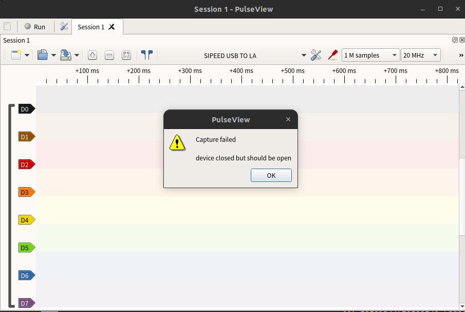

## 开启逻辑分析仪功能

按下按键将指示灯切换为蓝色。如下图所示：


> 验证逻辑分析仪功能是否开启:
> Windows环境打开设备管理器，Linux环境使用lsusb命令，可以找到"USB TO LA"设备

## 开始使用

> 注意：
> 1. Linux环境下SLogic combo 8最大传输带宽320Mb/s，典型配置80M@4CH 40M@8CH。
> 2. Windows环境下SLogic combo 8最大传输带宽160Mb/s，典型配置80M@2CH 20M@8CH。
> 3. 如果上位机启动过程中，设备出现断连的情况，需要重新扫描并连接设备

### 快速使用

#### 引脚连接


上图为SLogic 8个通道的线序图，将目标设备的待测信号点连接至SLogic任意空闲CH端口，并确保待测设备的GND与SLogic的GND相连接

#### 下载和运行上位机

点击[这里](https://dl.sipeed.com/shareURL/SLogic/SLogic_combo_8/4_application/PulseView)下载最新版本的上位机软件，用于观察数字信号和解码。Windows用户下载exe文件，Linux用户下载AppImage文件，建议下载日期最新的版本。

**Linux环境：**

1. 下载完成后，进入软件所在目录，使用快捷键`CTRL+ALT+T`打开终端，使用以下命令为软件赋予执行权限并以管理员身份运行：

```bash
chmod +x PulseView-x86_64-032323-1101.AppImage
sudo ./PulseView-x86_64-032323-1101.AppImage
```

**Windows环境：**

1. 下载完成后，点击exe文件并开始安装，根据安装引导一直点击next即可安装完成。
2. 安装完成后，在快捷菜单界面可以找到上位机图标，双击运行

> 注：在Linux环境最大可支持80M@4通道、40M@8通道采样；由于Windows环境下USB传输不稳定的限制，在Windows上最大只能支持到80M@2通道、20M@8通道采样。

#### 连接SLogic和电脑

**连接步骤**
1.  选择连接设备
2.  选择驱动程序 **Sipeed Slogic Analyzer(sipeed-slogic-analyzer)**
3.  选择连接方式为USB
4.  扫描符合要求的设备
5.  选择已找到的设备

   

> 若第三步未找到设备 可尝试切换模块功能 重新切换至逻辑分析仪模式 并重复第三步

### 开始采样

1. 配置PulseView的通道数、采样点数和采样率

   _下图设置通道数为**8**，采样点数为**1M samples**,采样率为**10Mhz**_
   

2. 设置D0通道的触发方式为**上下边沿触发**

   _点击D0通道的标签图案来设置触发方式_
   

3. 启动采集，并获得采样结果

   

> 若在采样过程中未使用D7通道，可能会观察到该通道的电平反转现象，该现象为正常情况不影响正常使用

### 详细配置

#### 采样参数

采样参数包括有采样样本数量、采样频率和采样时间

1.  采集样本数量：样本数量根据需求选择合适数值即可
2.  采样频率：根据被测信号频率选择，**推荐选择大于10倍被测信号频率**(可参考奈奎斯特定理)
3.  采样时间：采样时间根据采集**样本数量**以及**采样频率**进行计算，计算公式为：</br>**时间（秒）= 样本数 / 采样率**</br>例如1M samples，1Mhz时，采样时间为1s

   

> 设置完成采集样本数量、采样频率后，将鼠标至于采集样本数量选择框上，会显示当前参数的采样时间

#### 通道参数

点击通道的标签来设置通道参数，通道参数包括有标签名、标签颜色、通道波形显示窗口宽度和信号触发方式

1. 标签名：可根据采样信号意义设置，便于多信号采样分辨信号
2. 标签颜色：根据个人喜好设置，便于多信号采样分辨不同信号 
3. 通道波形显示窗口宽度：根据信号幅值设置，单位为像素，信号幅值变化大时，可提高该参数便于观察信号幅值变化
4. **信号触发方式**：具有**直接采样**、**高电平触发**、**低电平触发**、**下降沿触发**、**上升沿触发**以及**边沿触发**
   (采集信号之前，可能存在许多无效信号，根据信号的规律来设置触发方式可以有效地过滤掉无效信号，从而提高采样效率和准确性。)


### 调试波形

#### 视图操作

通过操作视图，可以更详细的观察波形


**波形缩放**：鼠标滚轮（中键）向上滚动放大波形、向下滚动缩小波形
**拖动波形**：鼠标左键按住可以左右上下拖动波形显示区
**区域放大**：鼠标双击某区域可放大该区域波形
**通道滚动**：“波形显示区”使用 Ctrl+鼠标滚轮（中键）可以快速上下滚动通道
**时间测量**：您可以通过，在所需的位置右键点击鼠标点击"创建标记点（Create Marker Here）"来标记位置，当您重复标记其他位置时，软件会自动计算并在时间轴上显示两个标记点之间的时间长度
**调整通道顺序**：鼠标拖动通道标签即可拖动通道至指定位置

#### 协议解码

在抓取所需的数据后，为了便于对数据进行分析，可以使用协议解码功能对数据进行解码，以下为一些常见协议的解码过程。


##### UART协议数据解码

1. 将串口的TX引脚到D0通道

2. 点击顶部工具栏**黄蓝波形图标**，搜索UART，双击选择串行接口类UART

   

3. 点击波形显示窗口新增的UART通道的**协议标签**。
   设置TX对应通道，数据格式，信号波特率以及字节序

   

4. 抓取数据，解析结果如下：

   示例为UART的TX脚发送数据 “Hello SLogic！” （数据格式为ascii，波特率115200，小端字节序)

   
   


##### I2C协议数据解码

1. 将I2C的SCL引脚连接到D0通道，SDA引脚连接到D1通道

2. 点击顶部工具栏**黄蓝波形图标**，搜索I2C，双击选择第一项

    

3. 点击波形显示窗口新增的I2C通道的**协议标签**。
   点击新增的I2C**协议标签**，设置的SCL、SDA所在通道

   

4. 抓取数据，解析结果如下：
   
   示例为I2C发送0x68

   
   
##### SPI协议数据解码

1. 将SPI的MISO、MOSI、CLK、CS引脚依次连接至D0、D1、D2、D3通道

2. 点击顶部工具栏**黄蓝波形图标**，搜索SPI，双击选择串行接口类SPI

   

3. 点击波形显示窗口新增的SPI通道的**协议标签**。
   设置CLK、MISO、MOSI、CS对应通道，片选信号有效电平

   

4. 抓取数据，测试结果如下：

   示例为SPI发送0x00~0X09(时钟10Mhz，片选低电平有效)
   
   


   示例为SPI发送0x00~0X09(时钟26Mhz，片选低电平有效)

   


### 常见问题

1. 点击run后弹窗提示"device closed but should be open"

    

    这可能是接触不稳定导致设备断连了，尝试重新插拔设备后再重新连接即可。


### 注意事项

逻辑分析仪连接被测系统时，需要注意以下事项：

1. 逻辑分析仪与电脑是共地的，如果待测设备是强电系统，务必使用"USB隔离器"来进行隔离措施。否则，很可能会造成逻辑分析仪或电脑损坏的风险
2. GND 通道与被测系统的 GND 必须可靠连接，尽可能的短
3. 信号通道必须可靠连接至被测系统的待测信号位置，不可随意“嫁接”，导致干扰的引入
4. 如果不注意接线方式，很可能会引入很多毛刺，导致软件无法分析数据