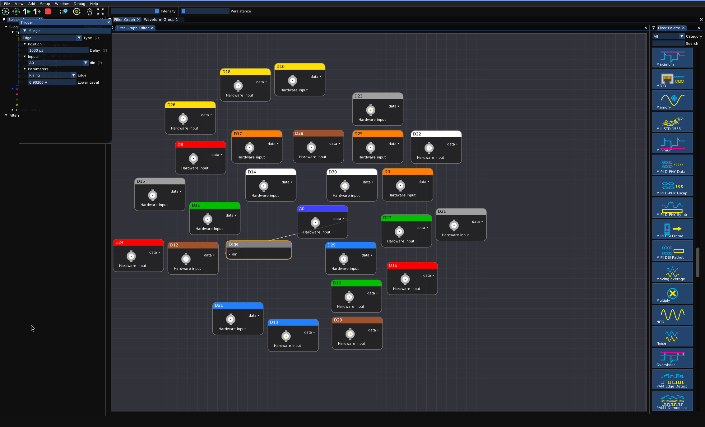

# ngscopeclient × Sipeed SLogic 上手指南

> 让 Sipeed SLogic 系列逻辑分析仪在 ngscopeclient 上跑起来——从下载到看见第一条波形

---


## 这是什么

Sipeed SLogic 是一系列高性价比 USB 逻辑分析仪硬件。本项目把它接到了 [ngscopeclient](https://www.ngscopeclient.org/)——一个开源、跨平台、基于 GPU 加速的示波器/分析仪 GUI——上面，让你能用 ngscopeclient 强大的波形显示、协议解码、自动化测试能力来操作 SLogic 硬件。

ngscopeclient 现为**单个可执行程序**：下载即运行，连接、采集模式与参数都在 UI 中配置，无需单独的后台程序或命令行参数。

| 你需要知道的 | 说明 |
|---|---|
| 支持的硬件 | [**SLogic Combo 8**](https://wiki.sipeed.com/slogic_combo_8)</br>[**SLogic 16U3**](https://wiki.sipeed.com/slogic16u3)（当前主力）</br>[**SLogic 32U3**](https://wiki.sipeed.com/slogic32u3)（**正在众筹**，本项目的重点支持型号）</br>其它厂商型号暂未在分发版本中加入 |
| 支持的系统 | Windows 10/11 x64、Linux x86_64、macOS——三大系统均支持下载即运行 |
| 你需要装的东西 | 单个绿色可执行程序——**没有任何系统级安装，下载即运行** |
| 独门特性 | 除了常规数字逻辑分析，还可以在 UI 中开启模拟模式，把对应硬件管脚的采样**作为 8-bit 模拟信号**观测——同一台 SLogic 既能当 LA 也能当采样示波器(*需搭配 ADC 套件*) |

> 📷 **系列产品展示**

<div class="three-row" style="display:flex;gap:8px;align-items:stretch;">
  <div class="slide" style="flex:1 1 0;height:220px;overflow:hidden;">
    
  </div>
  <div class="slide" style="flex:1 1 0;height:220px;overflow:hidden;">
    
  </div>
  <div class="slide" style="flex:1 1 0;height:220px;overflow:hidden;">
    
  </div>
</div>

---

## 下载

多平台上位机从 **GitHub Release** 获取最新版，下载站为备份镜像：

- **GitHub Release（推荐，最新）**：<https://github.com/sipeed/SLogic/releases/latest>
- 下载站（备份镜像）：<https://dl.sipeed.com/shareURL/SLogic/ngscopeclient>

| 平台 | 下载内容 |
|---|---|
| Windows x64 | `ngscopeclient-SLogic-x.y.z-windows-x86_64.exe`（直接运行） |
| Linux x86_64 | `ngscopeclient-SLogic-x.y.z-linux-x86_64.AppImage`（赋可执行权限即运行） |
| macOS (Apple Silicon) | `ngscopeclient-SLogic-x.y.z-macos-arm64.dmg`（打开即运行） |

> 单个绿色可执行程序，零依赖、免安装，放到任意目录皆可。

---

## 第一次跑起来

插上 SLogic（Windows 免驱即插即用；Linux 需装一次 udev 规则，见下），运行 ngscopeclient，再通过菜单 **File → Add → Oscilloscope** 打开 Add Instrument，在各项下拉里选：

| 字段 | 值 |
|---|---|
| Driver | `SLogic` |
| Transport | `slogic` |
| Path | `null` |

点 Connect，通道面板出现对应通道数（SLogic16U3 16 路、SLogic32U3 32 路）。各平台启动与连接演示如下。

### Windows

双击 `ngscopeclient-*-windows-x86_64.exe` 直接运行。无需安装驱动（SLogic 默认即 WinUSB 设备，即插即用）；系统要求 Windows 10 1903+，**不需要** Visual C++ Redistributable。

<video src="../../../zh/logic_analyzer/ngscopeclient/ngscope-connect-windows.mp4" autoplay loop muted playsinline></video>

### Linux

给 AppImage 加可执行权限，装一次 udev 规则（否则普通用户访问不了 USB），然后运行：

```bash
chmod +x ngscopeclient-*-linux-x86_64.AppImage
sudo cp 60-sigrok-slogic.rules /etc/udev/rules.d/
sudo udevadm control --reload && sudo udevadm trigger
./ngscopeclient-*-linux-x86_64.AppImage
```

<details>
<summary>udev 规则文件内容（装完拔插一次设备生效）</summary>

```
SUBSYSTEM!="usb|usb_device", GOTO="sipeed_rules_end"
ACTION!="add", GOTO="sipeed_rules_end"
ATTRS{idVendor}=="359f", MODE="0666", GROUP="uucp", TAG+="uaccess", ENV{ID_MM_DEVICE_IGNORE}="1"
LABEL="sipeed_rules_end"
```
</details>

<video src="../../../zh/logic_analyzer/ngscopeclient/ngscope-connect-linux.mp4" autoplay loop muted playsinline></video>

### macOS

下载 macOS 版，打开即运行；若首次被系统阻止，在「系统设置 → 隐私与安全性」放行即可。

---

## 用法

### 数字逻辑分析（默认模式）

每个通道是一路独立的数字电平（高/低），这是最常用的工作模式，也是打开程序后的默认模式。

**基本流程**：

1. **选通道**：在通道面板勾选你要采的通道。
2. **设采样率**：从下拉里选，例如 200 MS/s。
3. **设采样深度**：每次采集存多少点。一般 1 MS（即 100 万点）够用。
4. **配触发**：在 Trigger 面板选触发源通道、上升沿/下降沿/任意沿。
5. **运行**：
   - **Run**——连续采集，刷新显示
   - **Single**——采一帧后停下来仔细看
   - **Force**——不等待触发的采一帧

<video src="../../../zh/logic_analyzer/ngscopeclient/ngscope-usage.mp4" autoplay loop muted playsinline></video>

> 上方动图：从 Stream Browser 设采样率与 Channel mode（32ch@200MHz … 4ch@1400MHz），到采集 32 通道数字波形的完整流程。

ngscopeclient 支持**软件触发**，无需硬件触发线即可按条件捕获：

<video src="../../../zh/logic_analyzer/ngscopeclient/ngscope-soft-trigger.mp4" autoplay loop muted playsinline></video>

**进一步：协议解码**

把数字波形拖进 [Protocol Analyzer](https://www.ngscopeclient.org/protocol-analysis) 就能解 UART、I²C、SPI、CAN 等协议——这是 ngscopeclient 比传统 sigrok GUI 强的地方。

ngscopeclient 用 **Filter Graph** 把解码、数学运算、测量都表示成可连接的节点：



解码结果会标注在波形上：


### 把硬件当采样示波器用（模拟模式）

这是本项目独有的能力之一：把 SLogic 的并行数字采样当作 ADC 数据流，让一台 SLogic 同时兼任**逻辑分析仪 + 8-bit 采样示波器**。在 ngscopeclient 的 UI 中开启模拟模式即可。

效果：原本的 D0–D7 / D8–D15 会被合并成 2 路 8-bit 模拟通道（A0、A1），如还有 D16–D23 / D24–D31 则一共合并成 4 路 8-bit 模拟通道（A0、A1、A2、A3），可以直接在 ngscopeclient 里像看模拟示波器一样看波形——量程、坐标轴、自动测量、FFT 等模拟示波器特性都自动可用。

<video src="../../../zh/logic_analyzer/ngscopeclient/ngscope-analog.mp4" autoplay loop muted playsinline></video>

> 上方动图：模拟模式下对 A0 通道的采集与软件触发。

<details>
<summary>须知</summary>

> ⚠️ 模拟模式需要硬件支持外接 ADC 模块（SLogic16U3 / SLogic32U3），部分特性仍在打磨中。
</details>

---

## 常见问题

#### Linux 下报 "Permission denied" 或 "LIBUSB_ERROR_ACCESS"

USB 权限没配好。回到上面 Linux 一节装 udev 规则，然后**拔插一次**设备。

#### ngscopeclient 连上了但通道列表是空的

没识别到设备。检查硬件是否插好、设备管理器（Windows）/ `lsusb`（Linux）能否看到 SLogic；Linux 上确认已装 udev 规则并拔插过设备。

#### 想换其它厂商或型号的逻辑分析仪能用吗

当前分发版本只对 Sipeed SLogic 系列做了适配，其它型号暂未添加，后续会考虑。

---

## 反馈

遇到 Bug、想要新功能、或使用上有任何疑问，请发邮件到 **<support@sipeed.com>**。

发邮件时请附上：

- ngscopeclient 版本（菜单 *Help → About*）
- 硬件型号 + 固件版本
- 操作系统版本（Windows / Linux / macOS）

---

> 📷 **项目家族合照**： SLogic 硬件实物 + ngscopeclient 屏幕画面 + 终端日志，三件套同屏。
>
> 
