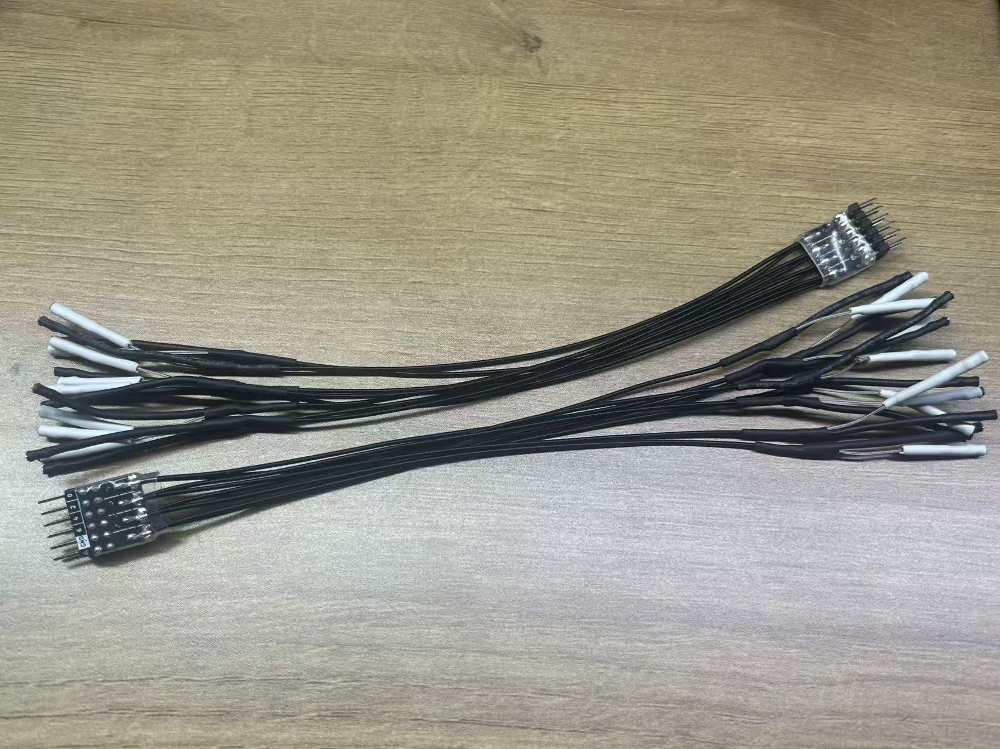
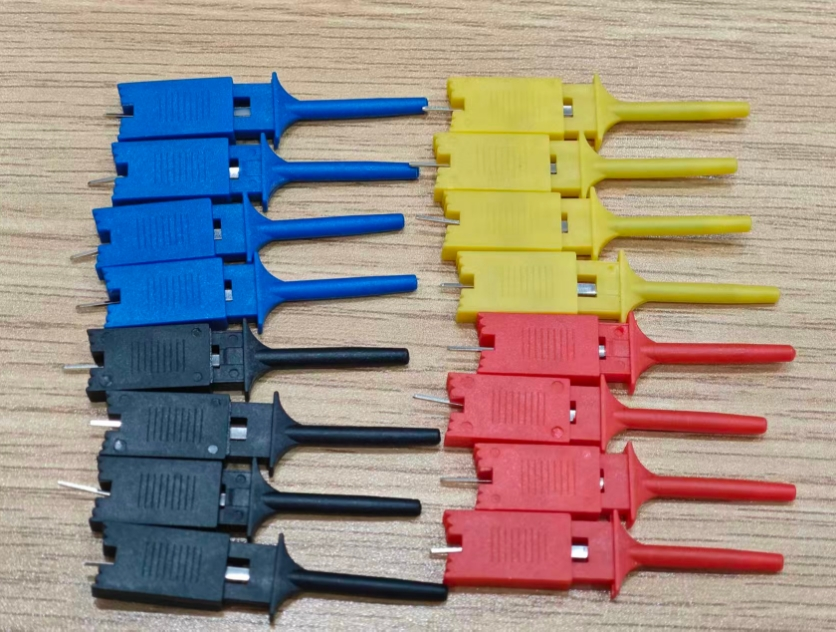
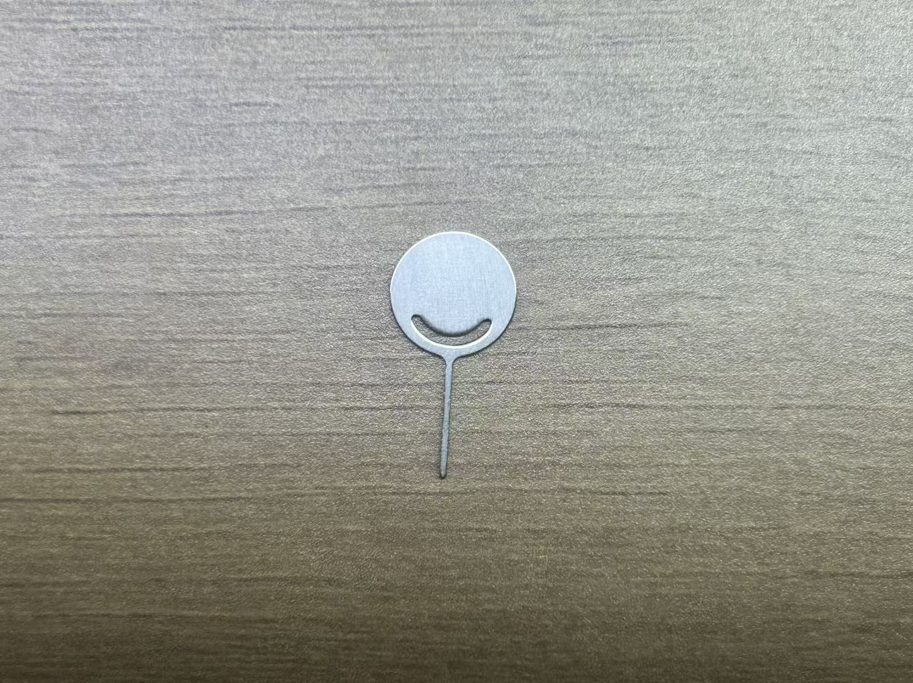
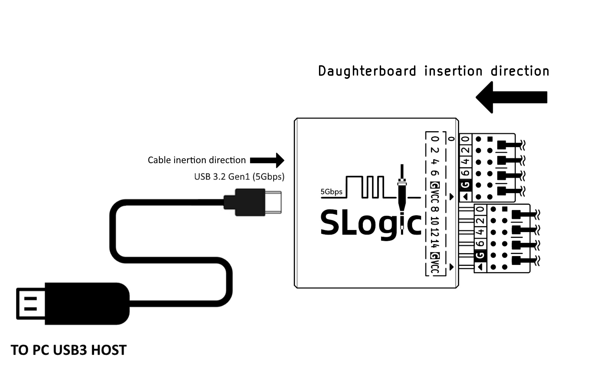

此章节介绍 **SLogic16 U3** 硬件相关的使用与操作。

## 硬件概览

### 配件一览

一套完整的硬件包括 **SLoigc16 U3 主机** 和 **包装内附件**，如下所示：
- <!DOCTYPE html>
  <html lang="zh-CN">
  <head>
    <meta charset="UTF-8">
    <title>CSS Indentation</title>
    
  </head>
  <body>
    

      
<b>SLoigc16 U3 主机</b> x1
  

      
    

  </body>
  </html>
- **包装内附件:** （注：杜邦线和同轴线为二选一） 
    - <!DOCTYPE html>
      <html lang="zh-CN">
      <head>
        <meta charset="UTF-8">
        <title>CSS Indentation</title>
        
      </head>
      <body>
        

          
<b>2x6P 公对母杜邦线</b> x2
      

          
        

      </body>
      </html>
    - <!DOCTYPE html>
      <html lang="zh-CN">
      <head>
        <meta charset="UTF-8">
        <title>CSS Indentation</title>
        
      </head>
      <body>
        

          
<b>2x4P 同轴线模组</b> x2
      

          
        

      </body>
      </html>
    - <!DOCTYPE html>
      <html lang="zh-CN">
      <head>
        <meta charset="UTF-8">
        <title>CSS Indentation</title>
        
      </head>
      <body>
        

          
<b>逻辑分析仪测试夹</b> x16
      

          
        

      </body>
      </html>
    - <!DOCTYPE html>
      <html lang="zh-CN">
      <head>
        <meta charset="UTF-8">
        <title>CSS Indentation</title>
        
      </head>
      <body>
        

          
<b>0.5m A+C to C USB3 数据线</b> x1
      

          
        

      </body>
      </html>
    - <!DOCTYPE html>
      <html lang="zh-CN">
      <head>
        <meta charset="UTF-8">
        <title>CSS Indentation</title>
        
      </head>
      <body>
        

          
<b>不锈钢SIM卡针</b> x1
      

          
        

      </body>
      </html>
    - <!DOCTYPE html>
      <html lang="zh-CN">
      <head>
        <meta charset="UTF-8">
        <title>CSS Indentation</title>
        
      </head>
      <body>
        

          
<b>说明卡片</b> x1
      

          
        

      </body>
      </html>
    - <!DOCTYPE html>
      <html lang="zh-CN">
      <head>
        <meta charset="UTF-8">
        <title>CSS Indentation</title>
        
      </head>
      <body>
        

          
<b>拉链收纳包</b> x1
      

          
        

      </body>
      </html>

> 各批次配件的外观可能存在细微差异，最终样式请以实物为准。

### 连接方式
<!DOCTYPE html>
<html lang="zh-CN">
<head>
  <meta charset="UTF-8">
  <title>CSS Indentation</title>
  
</head>
<body>
  

    
点击此处查看SLoigc16 U3的硬件连接示意图

    
  

   
</body>
</html>

**同轴线子板**/**杜邦线组** 都具有方向性，其插入方向见上图，线上的三角标记 **▴** 对准外壳上的三角标记 **▾** 为正。

**同轴线** 的远端有 **2** 个接线端子。其中白色的端子和信号源连接，黑色的端子和GND连接。

**杜邦线** 每组只有 **2** 个单独的GND，在其连接线上的三角标记  **▴** 和外壳对准插入时，黑色的线束就是GND，红色为VCC。

#### 逻辑分析仪背面

逻辑分析仪的背面是 **2x12P** 排母，其间距是2.54mm。排母的引脚定义见上图（逻辑分析仪后视图）。

其中数字编号 **0-15** 为采样通道的编号，对应上位机中的通道编号，共计16通道。

**G** 代表 **GND**，使用时请连接被采样装置和逻辑分析仪的GND，共计4通道。

**VCC** 代表电源输出，其输出能力为 **3.3V @500mA**，共计2通道（2通道共享电流输出能力）。

**CK** 代表预留的采样时钟输入/触发输出通道，其功能暂未实现，共计2通道。

#### 逻辑分析仪正面

上图为逻辑分析仪正视图，从左至右依次为：

**USB-C** 接口标准是3.2 Gen1 (5Gbps)，使用逻辑分析仪功能需要使用有对应能力（USB3.0）的线缆。

**MODE** 小孔中有一个隐藏式按键，可以用SIM卡针捅入后按下，其功能详见[MODE按键](#mode按键)章节描述。

**ACT** 是 **状态指示灯**，具体状态见下方[ACT指示灯](#act指示灯)章节描述。

### 开始使用

首先，连接 **PC USB3** → **USB-A/C to USB-C** →  **SLogic** → **杜邦线**/**同轴线子板**

<!DOCTYPE html>
<html lang="zh-CN">
<head>
  <meta charset="UTF-8">
  <title>CSS Indentation</title>
  
</head>
<body>
  

    
点击此处查看SLoigc16 U3的硬件连接图

    
  

   
</body>
</html>

> 目前SLogic16仅有 **USB3** 模式支持，使用附赠的 **USB-A/C to USB-C** 线缆即可兼容。

将目标设备的待测信号点通过**杜邦线**/**同轴线**连接至 **SLogic** 任意空闲CH数字端口，并确保待测设备的GND与SLogic的GND相连接。

> 注意，在信号源奈奎斯特频率大于或等于 50 MHz 的情况下，推荐使用同轴线进行采样，以获得更佳的稳定性。

可以根据实际情况决定是否使用 **逻辑分析仪测试夹** 连接至待测信号点。

> 为了提升采样稳定性，SLogic 的 GND 线应尽量靠近待测点，即便仅缩短 **1 mm** 也可能带来改善。在使用同轴线采样时，建议您在连接每个采样信号 **CH** 的同时，也连接对应的 **GND**。

最后启动 [**plusview**](./User_Guide.md#软件使用) 开始采集操作。

关于软件的安装和相关操作，可以参考[这里](./User_Guide.md#软件)。

## ACT指示灯

**ACT指示灯** 位于逻辑分析仪正面，靠近机身外侧。

### 颜色&功能

指示灯是一颗3色RGB，每一种颜色代表一种状态，不同状态组合指示当前设备状态

| **颜色**   | 蓝灯    | 绿灯 | 红灯 |
| ---------- | -------------------------------------- | ------------------------------------- | ----------------------------------  | 
| **功能**   | 电源                                    | USB LINK 指示                         | 运行状态指示                         | 

---

下表是不同颜色对应的正常运行时候的装置状态

| **状态**     | **颜色**                                                                       | <b>备注</b>                                                                                                    |
| ----------- | ------------------------------------------------------------------------------ | -------------------------------------------------------------------------------------------------------------- | 
| **正常连接** | 青色                                           | 蓝 + 绿                                        |
| **数据传输** | 青色 + 红色快闪 | 蓝 + 绿 + 红快闪 |
| **DFU模式**  | 青色 + 红色慢闪 | 蓝 + 绿 + 红慢闪 |

---

下表的指示灯颜色对应的装置的异常状态

  | **状态**        | **颜色**                           | **备注**                                    |
  | -------------- | ---------------------------------- | ------------------------------------------- | 
  | **USB连接失败** | 蓝 | 只亮蓝灯    |
  | **Flash加载异常** | 红| 只亮红灯     |

  - 除表中已列举的状态外，其余状态（如只亮绿灯/三灯常亮）皆属于未定义的状态
  - 如果出现未定义的状态，请尝试重新拔插USB。若无法解决则应高度怀疑硬件损坏。

> ⚠注意：任何时候绿灯如果熄灭都意味着USB连接出现问题，请尝试重新连接以解决问题。此时红灯的状态没有意义。

---

### 异常状态
- **检查清单**：<b>只亮蓝灯</b>  
    - 使用的USB线缆不支持**USB3**（常见于手机充电线）
    - PC的USB接口不支持**USB3**
    - 连接到了Desktop PC 机箱的前面板的USB
    - 连接到了不兼容的**USB hub**（请尽量保证SLogic直连PC USB）
    - 连接到了供电能力不足的**USB端口**
    - 连接线太长（请尽量使用1m以内的连接线）
- **检查清单**：<b>只亮红灯</b>  
    - 使用的USB线缆质量太差，线上压降过大
    - PC的USB接口故障：可能由于保险丝老化导致供电能力不足
    - SLogic硬件损坏，请保持装置断电并联络售后

## MODE按键

**MODE按键** 位于逻辑分析仪正面，在 **USB-C 连接器** 和 **ACT指示灯** 之间。这是一个隐藏式按键，需要使用SIM卡针品插入外壳才能按动。

装置上电后默认功能是 **逻辑分析仪**，正常情况下[ACT指示灯](#act指示灯)显示青色。
同时出现一个新的 **USB3** 装置：**SLogic16 U3**（逻辑分析仪）

<!--  -->

**按下MODE按键**切换功能，切换成功后可以看到**指示灯变化：** 红灯慢闪。
同时出现一个新的 **USB2** 装置：**SLogic DFU** （升级模式）

> **SLogic** 模式使用 **USB3** 模式，而 **DFU** 模式使用 **USB2** 模式。

<!--  -->

再次按下 **MODE** 则切换回 **SLogic16 U3**，重复按下 **MODE** 再进入**SLogic DFU**，如此往复循环在两个模式中来回切换。

> Windows环境打开设备管理器或使用 *USB treeview*，Linux/macOS环境使用 *lsusb* 命令，可以找到 "*SLogic16 U3/SLogic DFU*" 装置

## 更新固件

首先，[进入DFU MODE](#mode按键)：上电后按下 **MODE按键**，等待红灯慢闪 。

确认"*SLogic DFU*" 设备出现后，使用 [**DFU工具**](./Introduction.md#固件更新) 进行更新。

> Windows环境打开设备管理器或使用 *USB treeview*，Linux/macOS环境使用 *lsusb* 命令，可以找到 "*SLogic DFU*" 装置

DFU工具的说明详见[固件更新](./Introduction.md#固件更新)章节。

> 理论上，OTA操作只会更新SLogic固件，无法影响 **DFU** 功能。因此即使OTA失败也不要紧，装置会锁定在 **DFU** 模式，直到SLogic固件更新成功。

## 安全 & 注意事項

- **SLogic** 的 ***VCC*** 是电源输出，两个 ***VCC*** 端口共享同一路电源。电源供电能力为：***3.3V @ 500mA MAX***
- **切勿** 将 **SLogic** 的 ***VCC*** 直接和 ***GND*** 短接，以免发生短路过流
- **SLogic** 具备过流保护设计。但为了确保使用安全，我们仍建议您尽量避免发生短路情况，因为主机侧 **USB** 端口的过流保护能力可能存在差异
- 当 **SLogic** 与市电供电的计算机配合使用时，其接地端会与计算机接地端相连。此时，为了保护设备与主机安全，请仅将探头接地端连接到等电位的接地点，**切勿**连接至热地或电位不一致的点
