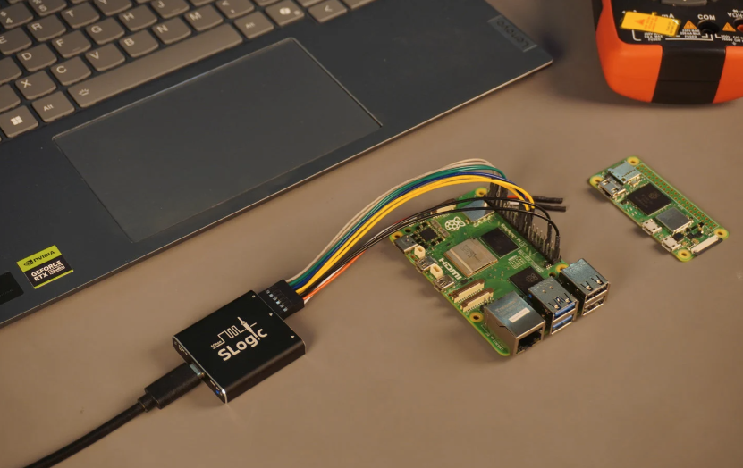
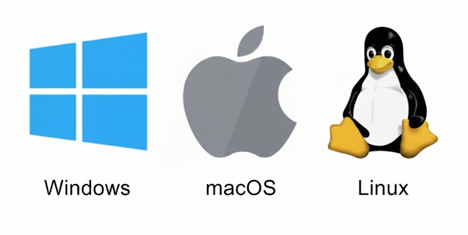
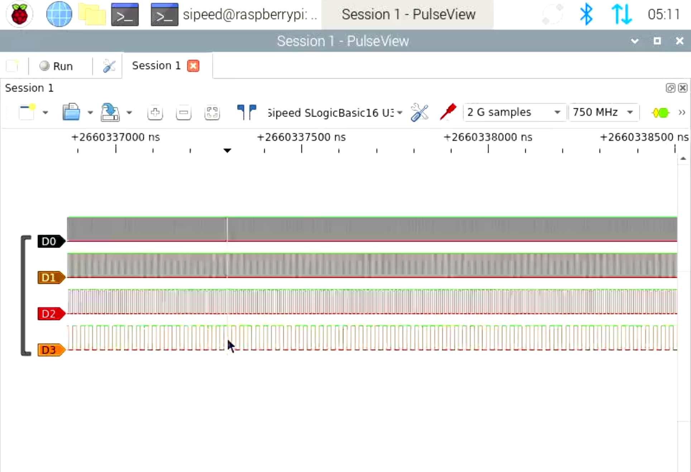
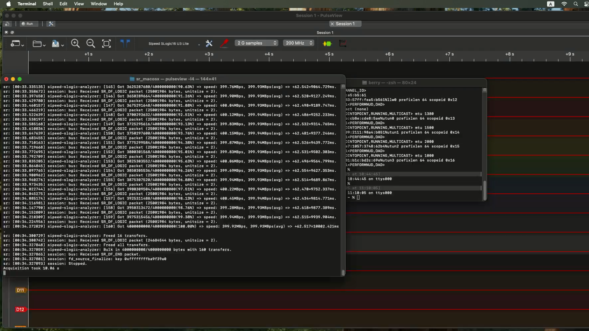

# 简介

---

## 简介
SLogic16U3 是新一代 USB3 逻辑分析仪。它在紧凑的 40×40×10 mm 超小尺寸外壳中通过 5Gbps USB3 接口实现高采样率：4 通道 800M、8 通道 400M、16 通道 200M。它支持软件（软）触发和可配置的电压阈值。且仅需399￥起！



---

## 特点与规格
| 属性 | SLogic Combo8 | SLogic16U3 | SLogic32U3 |
| - | - | - | - |
| 型号 | SLogic Combo8 | SLogic16U3 | SLogic32U3 |
| USB 类型 | USB2.0 | USB3.0 | USB3.2 Gen2 |
| 最大采样率 | 80M | 800M | 1500M |
| 最大通道数 | 8 | 16 | 32 |
| 最大带宽 | 0.3Gbps | 3.2Gbps | 6.4Gbps |
| Typical Comb. (stream, unlimited) | 80M@4CH, 40M@8CH | 800M@4CH, 400M@8CH, 200M@16CH | 1500M@4CH, 800M@8CH, 400M@16CH, 200M@32CH |
| 兼容 Sigrok | Y | Y | Y |
| 可调阈值 | N | Y | Y |
| 外壳材质 | 塑料 | 铝合金 | 铝合金 |
| 额外特性 | DAP-Link, CK-Link, 4-UART |  | Extend ADC -> Oscilloscope |
| 尺寸 | 20x40x10mm | 40x40x10mm | 50x50x10mm |
| 价格 | ￥69 | ￥399 | ￥999 |

---

## 产品图

- 尺寸：40x40x10mm
- 视图：顶/前/后

<div style="display: flex; flex-wrap: wrap; gap: 10px; width: 100%;">
  
  
  
  
  
</div>

---

## 软件安装

### 支持的操作系统

- Windows 10/11 (x86_64)
  - 受限于 Windows 驱动不够激进，无法满速，原生 exe 版本只能降速运行（最大支持 200M@8CH）
  - 另 Linux 虚拟机可满速运行
  - 
- Linux (x86_64, aarch64)
- macOS (Apple Silicon M4)
- Raspberry Pi 5
  - 

### 下载
- 软件下载: https://dl.sipeed.com/shareURL/SLogic
- 源代码（slogic-dev 分支）: https://github.com/sipeed/libsigrok/tree/slogic-dev

#### Windows

- 解压便携版压缩包并双击 `pulseview.exe` 启动。
- 若需启用调试模式，在终端运行：
```cmd
pulseview-debug.exe -l5
```


#### Linux

```bash
chmod +x Pulseview.appimage
./Pulseview.appimage
# ./Pulseview.appimage -l5   # 启用调试模式
```


#### macOS

- 下载并打开 `Pulseview.dmg` 即可直接运行。



---

## 相关链接
- 购买（淘宝）：http://addme
- 购买（AliExpress）：http://addme
- MaixHub: [maixhub.com](https://maixhub.com/discussion/slogic)
- 支持邮箱：support@sipeed.com
- GitHub（libsigrok slogic-dev）：https://github.com/sipeed/libsigrok/tree/slogic-dev
- Sipeed GitHub: https://github.com/sipeed
- GitHub（SLogic16U3 Tools）：https://github.com/sipeed/slogic16u3-tools
- 社区（Discord）：https://discord.com/channels/1359800784375644291/1359802057569206323
