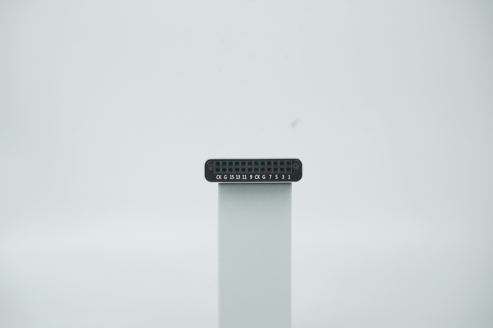
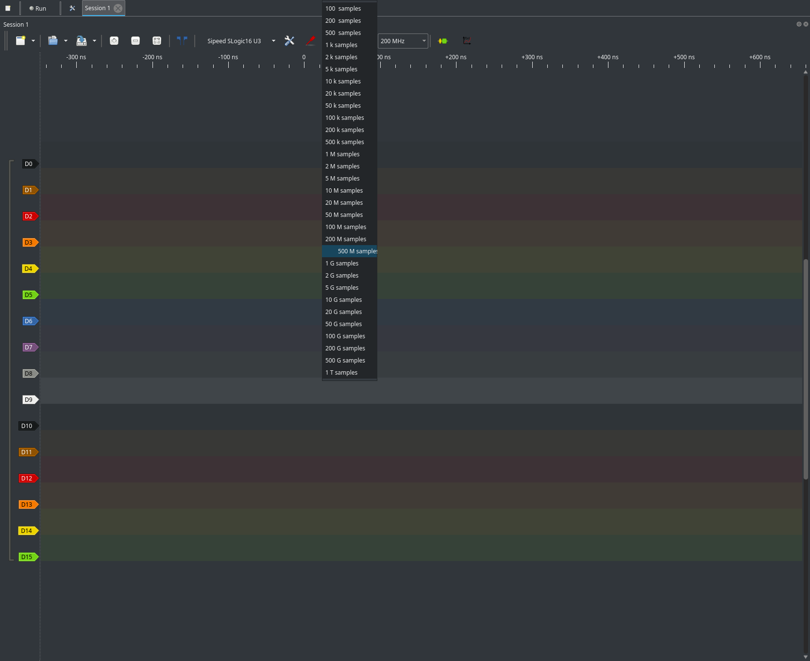
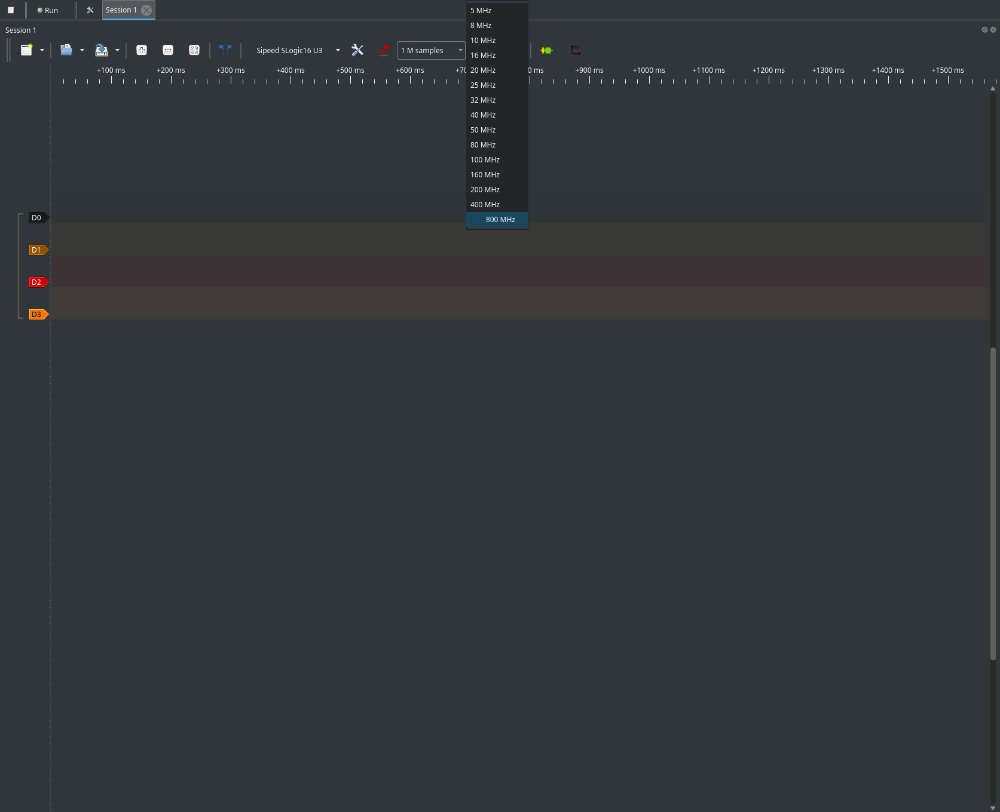
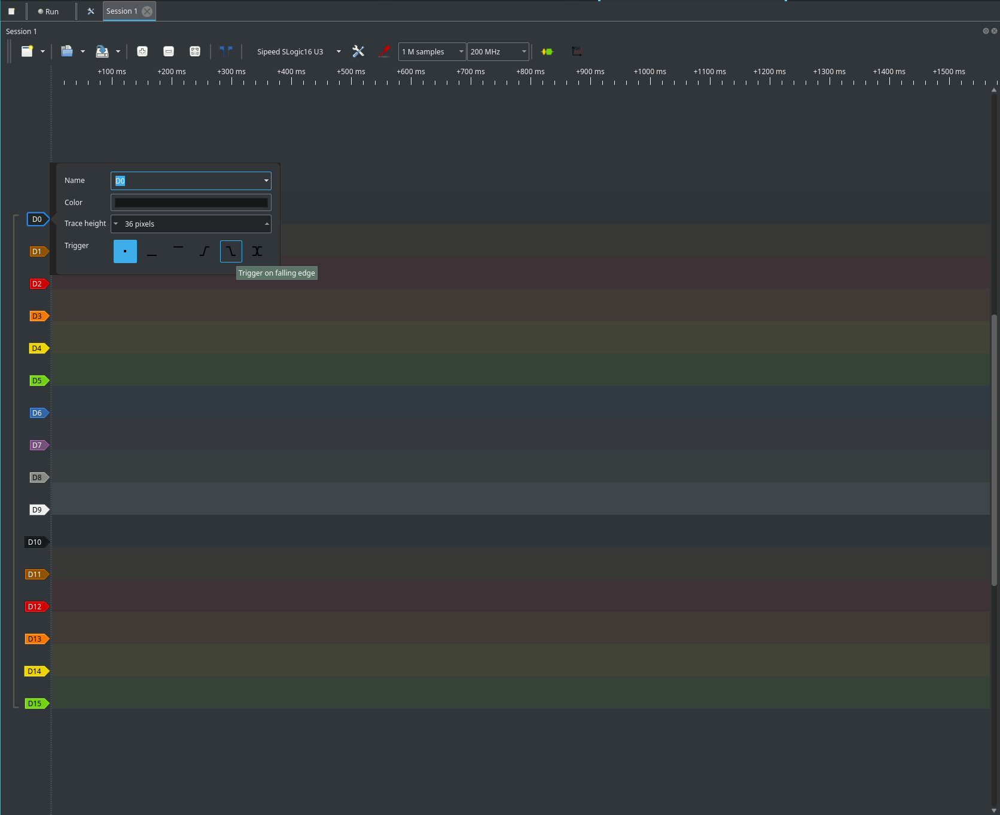

# Slogic16U3 用户指南

👷‍♂️ 本指南正在积极撰写中 — 感谢您的耐心！

---

## 修订历史

| 日期       | 版本    | 作者       | 描述             |
|------------|---------|------------|------------------|
| 2024-09-23 | v0.1    | Sipeed 团队 | 初始草稿         |

---

## 目录

1. [概述](#概述)
2. [规格](#规格)
3. [硬件连接](#硬件连接)
4. [软件安装](#软件安装)
5. [软件使用](#软件使用)
6. [从源码构建软件](#从源码构建软件)
7. [固件更新](#固件更新)
8. [常见问题](#常见问题)

---

## 概述

Slogic16U3 是一款用于数字信号调试与分析的高性能逻辑分析仪。

<div style="display: flex; flex-wrap: wrap; gap: 10px; width: 100%;">
  
  
  
</div>

---

## 规格

- **通道数:** 16
- **最大采样率:** 800 MHz
- **存储深度:** 无限
- **接口:** USB 3.0 (5 Gbps)
- **供电:** USB 供电 (5V 900mA)
- **尺寸:** 150 × 100 × 30 mm

---

## 硬件连接

- **USB-C to C** 或 **USB-A to C** 数据线：
    1. PC USB-A → USB-A/C 转 USB-C → 连接 SLogic
    2. PC USB-C → USB-C to USB-C → 连接 SLogic
- **指示灯:** 多色（见常见问题）
- **附件:** 标准杜邦线，高速屏蔽线

---

## 软件

### 支持的操作系统与测试平台

| 操作系统 / 平台    | 支持     | 示例平台                 |
|--------------------|----------|--------------------------|
| Windows (x86_64)   | 是       | Ultra 5 125H             |
| Linux (x86_64)     | 是       | 第8代 Core i5+           |
| Linux (aarch64)    | 是       | RPI5                     |
| macOS (aarch64)    | 是       | Apple Silicon M4         |

### 支持的协议

支持多种协议，包括：  
AC '97、I²C、SPI、UART、CAN、JTAG、1-Wire、PWM、USB 等等。  
*最新支持协议请参考软件内的解码器选择面板。*

### 安装

#### Windows

- 解压便携版并双击 `pulseview.exe` 启动。


- 若需启用调试模式，在终端运行：
```cmd
pulseview-debug.exe -l5
```


#### Linux

```bash
chmod +x Pulseview.appimage
./Pulseview.appimage
# ./Pulseview.appimage -l5   # 启用调试模式
```


#### macOS

- 下载并打开 `Pulseview.dmg` 安装。


**相关链接：**  
淘宝、AliExpress、MaixHub  
邮箱: support@sipeed.com

---

## 软件使用

- 界面和工作流程与 DSView 类似。
- 配置通道、采样率、采样点/时间和其他参数后进行采集。
- 使用软件触发、采集、浏览、测量、协议解码与文件管理。

### 更改采样深度

- 采样深度决定每次采集的数据点数量。
- 可在主控面板中设置采样深度，通常以数据点数表示。
- 更高的采样深度能够捕获更长或更详细的信号，但需要更多内存并可能增加传输时间。
- 如果只需捕获短事件，可减小采样深度以加快操作。
- 在开始采集前调整采样深度以满足分析需求。
- **如果磁盘空间充足，采样深度可以视为无限；数据可以直接流式写入存储。**



### 更改采样率

- **最大采样率：** 800 MHz（受激活通道数影响）
    - **16 通道：** 最高 200 MHz
    - **8 通道：** 最高 400 MHz
    - **4 通道：** 最高 800 MHz
- 在主控面板中设置采样率。
- 若无法使用更高速率，请禁用未使用的通道。




### 选择激活通道

- 可在 **16**, **8**, 或 **4** 通道配置间切换。
- 在配置区域启用/禁用通道。
- 减少激活通道数可提高最大采样率。


### 调整电压阈值

- 阈值可在 **0.1V 到 6.0V** 之间以 **0.1V 步进** 设置。
- 在通道/设备配置面板中调整。
- 按照逻辑电平选择阈值（例如 3.3V CMOS 约设为 1.0V）。
- 在采集前应用更改。


提示：对于 3.3V CMOS/TTL，阈值可设为约 1.0V（大约 3.3V 的 30%）。

### 边沿触发

- 配置边沿触发以在特定信号跳变时开始采集。
- 在触发面板中选择通道和触发类型（上升沿、下降沿或双边沿）。




---

## 从源码构建软件

软件为开源。

- [Sipeed 的 libsigrok GitHub 仓库](https://github.com/sipeed/libsigrok/tree/slogic-dev)

**推荐：** 使用 [sigrok-util](https://github.com/sigrokproject/sigrok-util) 的构建脚本，获得跨平台的简单体验。

**步骤：**
1. 克隆 sigrok-util 并按照其 README 安装依赖。
2. 编辑构建脚本以使用 Sipeed 的 libsigrok fork：
    ```bash
    $GIT_CLONE https://github.com/sipeed/libsigrok -b slogic-dev
    ```
3. （可选）添加选项以加速构建并减小体积：
    ```
    --disable-all-drivers --enable-sipeed-slogic-analyzer --disable-bindings --enable-cxx
    ```
4. 运行适合目标平台的构建脚本（例如 `./sigrok-cross-linux`、`./sigrok-cross-mingw`、`./sigrok-cross-macosx`）。

更多高级或手动构建请参考 upstream sigrok 与 PulseView 文档。

---

## 固件更新

固件更新通过 Python / PyQt GUI 工具提供。

- [固件更新工具仓库](https://github.com/sipeed/slogic16u3-tools)

**更新步骤：**
1. 克隆或下载仓库：
    ```bash
    git clone https://github.com/sipeed/slogic16u3-tools.git
    ```
2. 安装依赖并设置环境：
    ```bash
    source .venv/bin/activate
    ```
3. 进入 `pt` 目录：
    ```bash
    cd pt
    ```
4. 运行 GUI 工具：
    ```bash
    python src/gui.py
    ```
5. 按下设备上的 **mode** 按钮。GUI 应显示 "SLogic16U3 OTA"。
6. 在 GUI 中选择固件文件。
7. 点击 **OTA** 开始更新。
8. 等待完成并按界面指引操作。

> **注意：** 将很快发布该更新工具的二进制版本。


---

## 常见问题

### 在 Linux 中为什么找不到 SLogic16U3 设备？

普通用户默认无法访问 USB 设备。  
使用 sudo 运行 Pulseview：

```bash
sudo ./Pulseview.appimage
```

或者设置 udev 规则（见下文）。

### 如何为 Linux 设置 udev 规则？

创建新的 udev 规则文件：

```bash
sudo tee /etc/udev/rules.d/60-sipeed.rules <<EOF
SUBSYSTEM!="usb|usb_device", GOTO="sipeed_rules_end"
ACTION!="add", GOTO="sipeed_rules_end"
ATTRS{idVendor}=="359f", MODE="0666", GROUP="plug_dev", TAG+="uaccess"
ENV{ID_MM_DEVICE_IGNORE}="1"
LABEL="sipeed_rules_end"
EOF
```

重新加载 udev 规则并触发：

```bash
sudo udevadm control --reload
sudo udevadm trigger
```

拔掉并重新连接设备。  
现在可以以普通用户身份运行 Pulseview。

### 为什么不能使用更高采样率？只显示 200M。

最大采样率取决于激活通道数量和 USB 带宽。  
Slogic16U3 的 USB 3.0 提供约 ~400MB/s 带宽。  
要使用更高速率（400M/800M），请禁用未使用的通道。
