# 软件使用指南

SLogic32U3 可以用多套上位机驱动。本页先帮你选，再分别讲各自的用法。硬件接线见[硬件使用指南](./Hardware_Specification.md)，第一次使用见[快速上手](./Quick_Start.md)。

---

## 先选一个上位机

**默认用 SLogicView。** 它是 Sipeed 自行维护的图形界面，也是当前主推的方向，绝大多数调试任务用它就够。

| 上位机 | 优势 | 适合谁 | 安装 |
| - | - | - | - |
| **SLogicView** | Sipeed 自研维护的图形界面，**默认选它** | **大多数人** | 需安装 |
| **ngscopeclient** | GPU 加速渲染、Filter Graph、混合信号 | 复杂分析；配 ADC 模组当示波器用 | 需安装 |
| **sigrok-cli** | 命令行，可脚本化 | 自动化、CI、无头采集、AI Agent | 需安装 |
| **ALL LOGIC** | 社区优秀上位机，基于 DSView 二次开发 | **熟悉 DSView / DSLogic 的用户** | 需安装 |
| **SLogicWeb（网页版）** | **免安装、免驱动，支持安卓** | 临时调试、手机/平板、不想装软件 | **无需安装** |

> **ALL LOGIC 是社区项目**，在 DreamSourceLab 开源的 DSView 基础上二次开发而成，Sipeed 向其提交过贡献。用惯 DSView 的话会非常顺手。

> **关于"免安装"**：桌面程序都需要下载并安装或解压后运行。真正打开浏览器就能用的只有网页版 **[slogic.sipeed.com](https://slogic.sipeed.com)**。

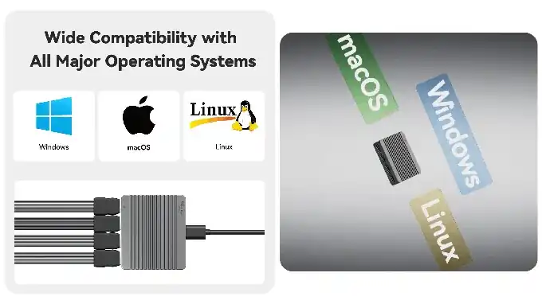

### 下载

全部桌面程序在同一个 Release 里，按平台选对应文件：

| 平台 | 文件后缀 | 运行方式 |
| - | - | - |
| Windows 10/11 x64 | `-windows-x86_64.exe` | 运行安装程序 |
| Linux x86_64 | `-linux-x86_64.AppImage` | `chmod +x` 后直接运行 |
| macOS (Apple Silicon) | `-macos-arm64.dmg` | 打开 dmg 后拖入「应用程序」 |

- GitHub Release（推荐）：https://github.com/sipeed/SLogic/releases/latest
- 下载站（备份镜像）：https://dl.sipeed.com/shareURL/SLogic
- libsigrok 驱动名：`sipeed-slogic-analyzer`

---

## SLogicWeb（网页版）

打开 **[slogic.sipeed.com](https://slogic.sipeed.com)** 即可使用，这是最快上手、也是唯一真正免安装的方式。

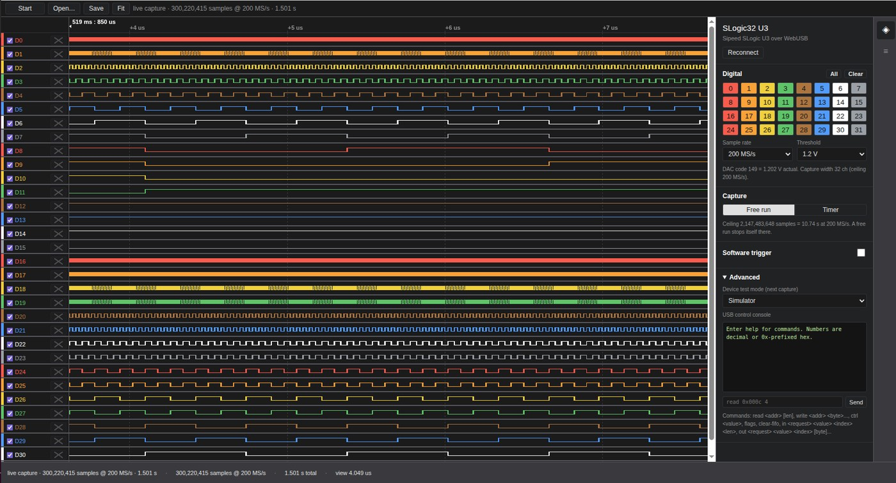

上图为浏览器中实际连接 SLogic32U3 的采集画面：32 通道全开、200 MS/s 实时采集，状态栏显示已收下 3 亿样本。右侧面板可直接设采样率、阈值、触发与采集模式，功能并不比桌面端少。

### 特点

- **免安装、免驱动**：不用下载任何程序，浏览器直接连设备。
- **支持安卓**：手机、平板用 Chrome 打开就能采集，适合现场调试。
- **授权记忆**：首次连接会弹出设备选择框，授权后该站点会记住，之后直接连。
- **可离线分析**：支持打开已有的 `.sr` 和 `.lwcap` 波形文件，不插设备也能看。
- **全速采集**：32 通道 200 MS/s 在浏览器里同样跑得满，不因为是网页版而缩水。

### 浏览器要求

网页版通过 **WebUSB** 与设备通信，必须用 **Chromium 内核浏览器**：

- 可用：Chrome、Edge、Brave（桌面与**安卓**均可）
- 不可用：Firefox、Safari（不支持 WebUSB）

> 若页面提示 `WebUSB is unavailable in this browser`，说明当前浏览器不支持，换 Chrome 或 Brave 即可。

### 使用步骤

1. 用 Chrome 打开 [slogic.sipeed.com](https://slogic.sipeed.com)。
2. 点 **Connect device**，在弹出的列表中选择 SLogic16/32 U3 并授权。
3. 设置采样率、通道与阈值，点 **Start** 开始采集。
4. 用 **Fit** 自适应缩放查看波形，**Save** 可保存为 `.lwcap`。
5. 已有波形文件可用 **Open…** 直接载入分析。

---

## SLogicView

> [!NOTE]
> 本节配图暂用同源的 PulseView 界面截图，SLogicView 的操作逻辑与之一致。截图将在后续版本更新为 SLogicView 实机界面。

### 连接设备

最佳做法：**先把设备连到 USB3 口，再启动软件**，让它在启动时自动检测。

若软件已在运行，点 **Connect to Device**，选择驱动后点 **Scan**，再选中扫描到的设备。

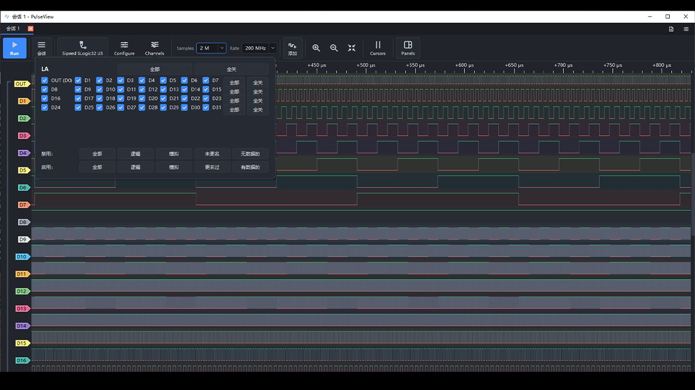

主界面分为几个区域：

- **顶部工具栏**：设备选择、采样深度、采样率、运行/停止、缩放与光标工具
- **左侧通道栏**：通道开关、通道颜色、电压阈值设置
- **中间波形区**：波形显示、解码结果标注
- **解码器面板**：添加与配置协议解码器

> 扫描不到设备时，先看 ACT 指示灯是不是青色。只亮蓝灯说明 USB3 链路没建立。Linux 下还要确认已配置 udev 规则。详见[常见问题](./FAQ.md)。

### Stream 采集

SLogic32U3 采用 **Stream（流式）模式**：数据实时回传上位机，采集时长理论不限，仅受磁盘容量限制。板载 2 Gbit DDR3 作弹性缓存，平滑 USB 传输抖动，实际可持续回传 800 MB/s（6.4 Gbps）。

这意味着不需要在"采样深度"和"采样率"之间做取舍，可以长时间连续抓取而不被设备端缓存容量卡住。

### 采样率与通道数的关系

| 使能通道数 | 最高采样率 | 数据率 |
| - | - | - |
| 4 ch | 1400 MHz | 5.6 Gbps |
| 8 ch | 800 MHz | 6.4 Gbps |
| 16 ch | 400 MHz | 6.4 Gbps |
| 32 ch | 200 MHz | 6.4 Gbps |

8 / 16 / 32 通道均已跑满 6.4 Gbps 带宽上限；4 通道受最高采样时钟 1400 MHz 约束。

> **使能通道越少，可用采样率越高**。只启用本次采集真正需要的通道，是提高采样率最直接的办法。

作为参照，USB3.0 方案的 DreamSourceLab DSLogic U3Pro32 在 Stream 模式下约为 16ch@125MHz、32ch@50MHz（据其公开 Datasheet）；SLogic32U3 对应为 16ch@400MHz、32ch@200MHz，Stream 采样率约为其 3 ~ 4 倍。

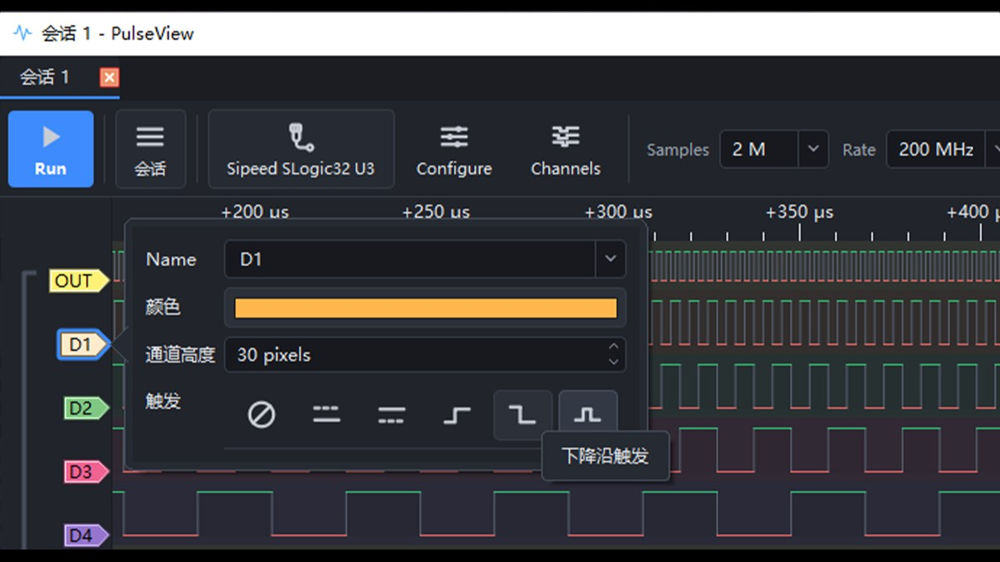

32 路通道可以自由启用、改色、调整高度与排列顺序，把相关的总线放到一起看：

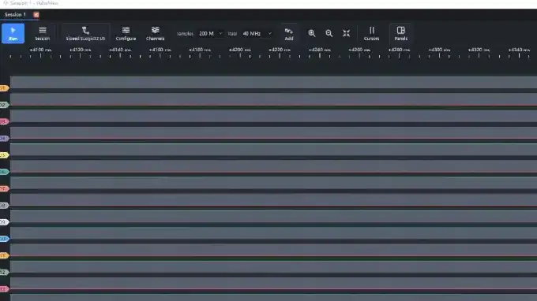

### 采样率怎么选

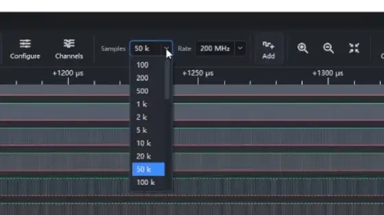

- 经验法则：取被测信号最高频率的 **10 ~ 100 倍**。
- 采样率过低会错过边沿，导致波形失真甚至解码失败。
- 采样率过高则会采到无意义的毛刺，并占用更多内存和磁盘。
- 采样率 × 采样深度决定占用空间，长时间采集前先确认磁盘剩余容量。

### 电压阈值

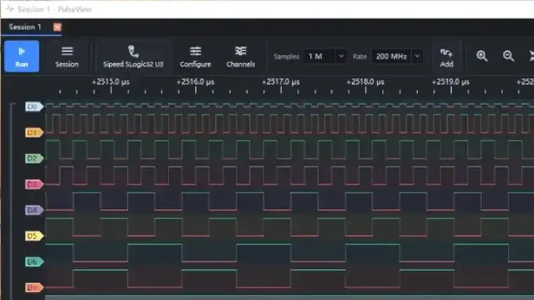

在左侧通道栏设置逻辑判决阈值，范围 0 ~ 6 V，步进 0.1 V。低于阈值判为 0，高于判为 1。常见逻辑电平的建议阈值见[硬件使用指南](./Hardware_Specification.md#阈值电压)。

### 触发

SLogic32U3 支持**多通道、多边沿组合触发**。可对多个通道分别设定上升沿、下降沿、任意边沿或电平条件并组合使用，也支持**预触发**，用于观察事件发生之前的现象。

| 场景 | 触发设置 |
| - | - |
| 抓 UART 一帧 | RX 线下降沿（起始位） |
| 抓 I²C 事务 | SDA 下降沿 且 SCL 为高（起始条件） |
| 抓 SPI 片选周期 | CS 下降沿 |
| 抓复位异常 | RESET 线下降沿 |

### 浏览与光标测量

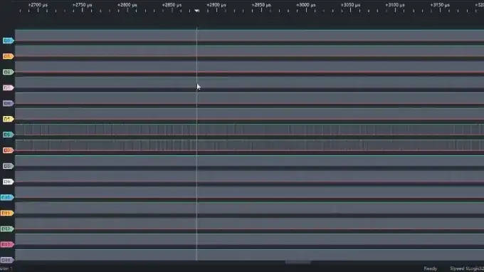

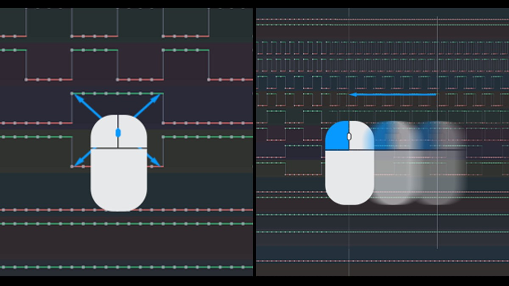

| 操作 | 方式 |
| - | - |
| 水平缩放 | 鼠标滚轮 |
| 水平平移 | 左键拖动，或 Shift + 滚轮 |
| 垂直平移 | Ctrl + 滚轮 |
| 创建测量光标 | Shift + 拖动 |

用光标测量两点时间差，可直接换算波特率、脉宽、事件间隔等参数。

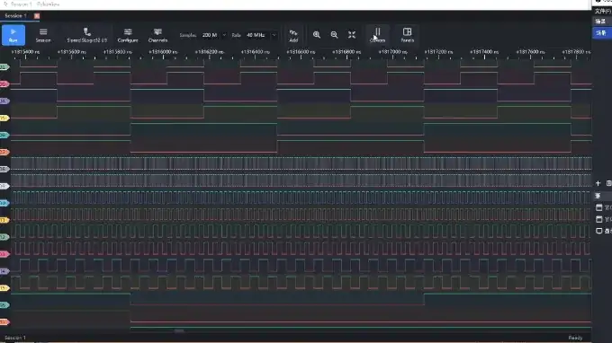

### 协议解码

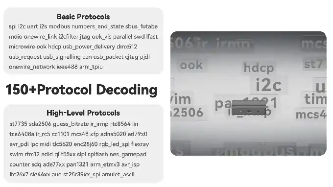


sigrok 生态提供 150+ 协议解码器，覆盖 I²C、SPI、UART、CAN、SDIO、1-Wire、USB、Modbus 等常见总线。

1. 打开 Decoder 面板，选择要用的协议。
2. 配置引脚映射，把解码器的每个信号对应到实际接线的通道。
3. 配置协议参数：波特率、字节序、时钟极性/相位、片选极性等。
4. 解码结果以标注形式叠加在波形下方，点击可查看详情。
5. 支持解码器**堆叠（stack）**，例如在 I²C 之上叠加 `eeprom24xx` 直接解出存储器读写。

**常见解码失败原因**：

| 现象 | 多半是 |
| - | - |
| 完全没有解码输出 | 引脚映射错误，或协议参数不对（波特率、极性） |
| 解码结果零散、报错多 | 采样率不足，提高采样率重采 |
| 波形本身就是方块状/失真 | 阈值设置不当，或采样率太低 |
| 偶发错帧 | 接地不良，就近加地线 |

> 解码输出为空只说明当前配置没有产生标注，**不能证明波形里没有通信**。先回到波形确认电平变化是否正常。

### 文件操作

- **保存会话**：保存采样数据、通道配置、触发与解码器状态。
- **导出**：支持 CSV、VCD 等格式，VCD 可用 GTKWave 打开。
- **导入**：可直接加载已有的 `.sr` 波形文件，离线分析不需要连接设备。

---

## ALL LOGIC（社区项目）

[ALL LOGIC](https://github.com/sipeed/ALL-LOGIC) 是社区维护的一款优秀上位机，在 DreamSourceLab 开源的 **[DSView](https://github.com/DreamSourceLab/DSView)** 基础上二次开发而成（DSView 本身又源自 sigrok 的 PulseView）。

它的思路是做一个**多厂商通用上位机**：在 DSView 原有代码上增加各家逻辑分析仪的社区驱动，让一套软件能驱动市面上多种设备。

**适合谁**：如果你已经用惯了 DSView 或 DSLogic 的界面，ALL LOGIC 的操作方式完全一致，迁移零成本。

已接入的设备包括 Sipeed SLogic Combo 8 / 16U3 / 32U3、CH32H417 开源逻辑分析仪、PXLogic32U3、正点原子 ATK-Logic、nanoDLA / FX2 等，原 DSView 支持的 DreamSourceLab 仪器也仍可用。

其他特点：

- 内置 **MCP 接口**，方便 AI 客户端直接控制采集与解码。
- 与官方上位机共用 libsigrok 系列驱动与解码器，协议覆盖一致。

> ALL LOGIC 由社区维护，问题与需求请到 [项目 Issue](https://github.com/Doukeyi-X/ALL-LOGIC/issues) 反馈。

## ngscopeclient

适合需要 GPU 加速渲染、Filter Graph 分析与混合信号观测的场景。完整安装与连接见 [ngscopeclient 上手指南](../ngscopeclient/ngscopeclient.md)。

32U3 相关要点：

- **单二进制、全 UI 配置**：直接运行即可，连接、采集模式与参数都在 UI 中设置。
- **连接设备**：在界面中添加并选择 SLogic 设备，连上后通道面板会出现 32 路通道。
- **Filter Graph**：把协议解码、数学运算与测量统一为 Filter 节点，可串成处理链。
- **ADC 模拟模式**：在 UI 中启用后，把数字管脚合并为 4 路 8-bit 模拟通道 A0–A3，像采样示波器一样观测。需配合[可选 ADC 模组](./Hardware_Specification.md#选配adc-示波器模组)。

---

## sigrok-cli（命令行）

用于自动化、CI 与无头采集。

```bash
# 扫描设备
sigrok-cli --scan

# 查看设备能力（支持的采样率、通道等）
sigrok-cli -d sipeed-slogic-analyzer --show

# 采集：只启用 D0，10 MHz 采 500k 样本，存为 .sr
sigrok-cli -d sipeed-slogic-analyzer \
  --config samplerate=10m -C D0 \
  --samples 500k -o capture.sr

# 解码已有波形
sigrok-cli -i capture.sr -P uart:rx=D0:baudrate=115200 -A uart

# 导出为 VCD 供 GTKWave 查看
sigrok-cli -i capture.sr -O vcd > capture.vcd
```

常用参数：

| 参数 | 含义 |
| - | - |
| `--config samplerate=` | 采样率，可写 `10m`、`200m` 等 |
| `-C` | 启用的通道，逗号分隔，如 `D0,D1,D2` |
| `--samples` | 采样数量 |
| `--time` | 采集时长（毫秒），与 `--samples` 二选一 |
| `--triggers` | 触发条件，如 `D0=f` 表示 D0 下降沿 |
| `-P` | 协议解码器及其参数 |
| `-o` / `-i` | 输出 / 输入波形文件 |

> 采样时间（秒）= 样本数 ÷ 采样率。例如 10 MHz 采 500k 样本即 50 ms。

---

## 已知限制

| 限制 | 说明 |
| - | - |
| 触发（ngscopeclient） | ngscopeclient 集成当前仅支持单通道、单边沿触发。需要多通道或多边沿组合触发请改用 SLogicView 或 sigrok-cli |
| 采样率随通道数下降 | 8 / 16 / 32 通道已跑满 6.4 Gbps 带宽上限，无法再提高；只能通过减少使能通道换取更高采样率 |
| 长时间采集受磁盘约束 | Stream 模式采集时长理论不限，但采样率 × 深度直接决定磁盘占用 |
| 网页版浏览器要求 | SLogicWeb 依赖 WebUSB，Firefox 与 Safari 不可用 |
| ADC 与数字采集并用 | 可选 ADC 模组会占用对应的数字管脚，两者能否同时使用取决于通道分配，具体以实机为准 |

---

## 接入 AI Agent

配合 `sigrok-cli-slogic-plugin`，可以用自然语言让 Agent 代跑扫描、采集与解码。完整教程见 [SLogic 接入 AI Agent](../slogic_agent/readme.md)。
