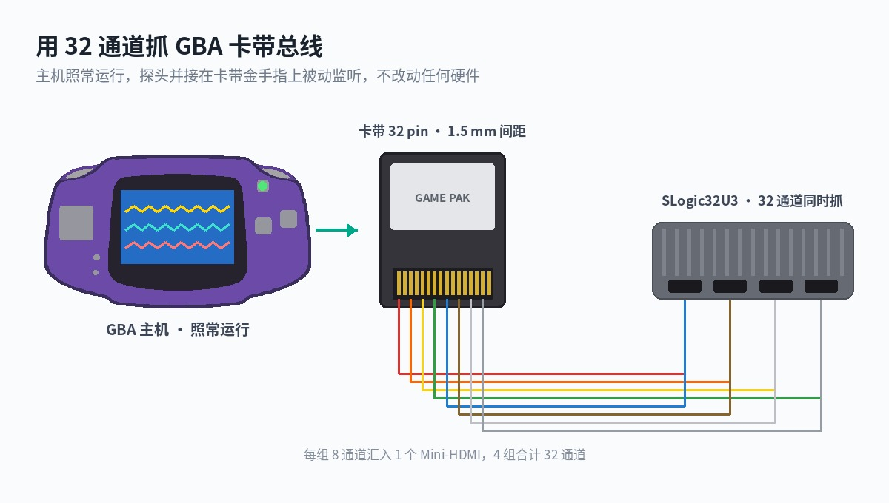
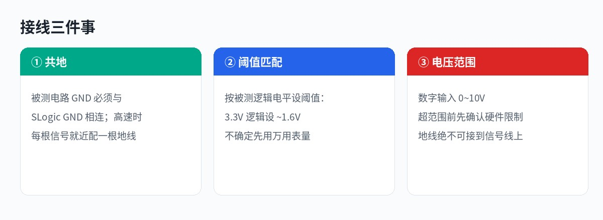
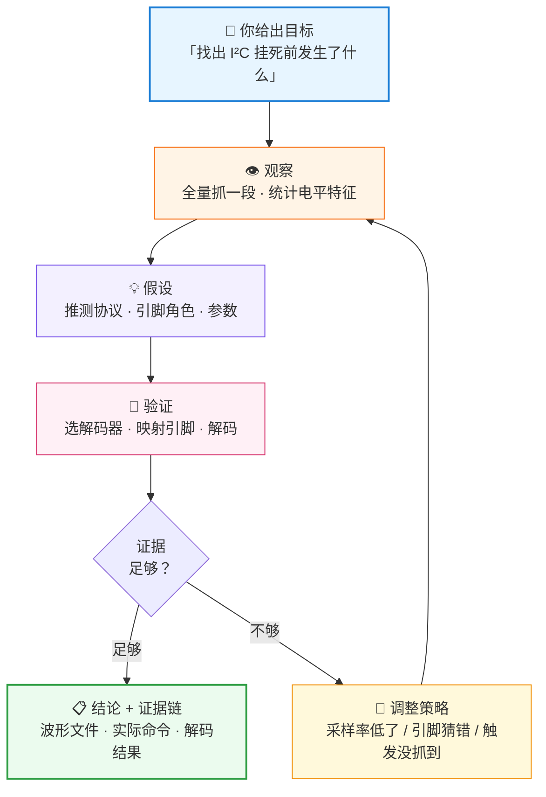
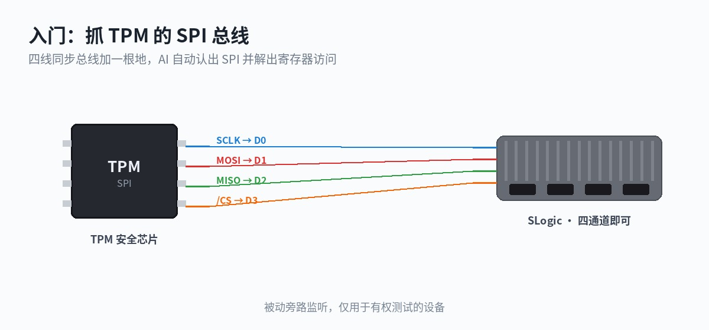
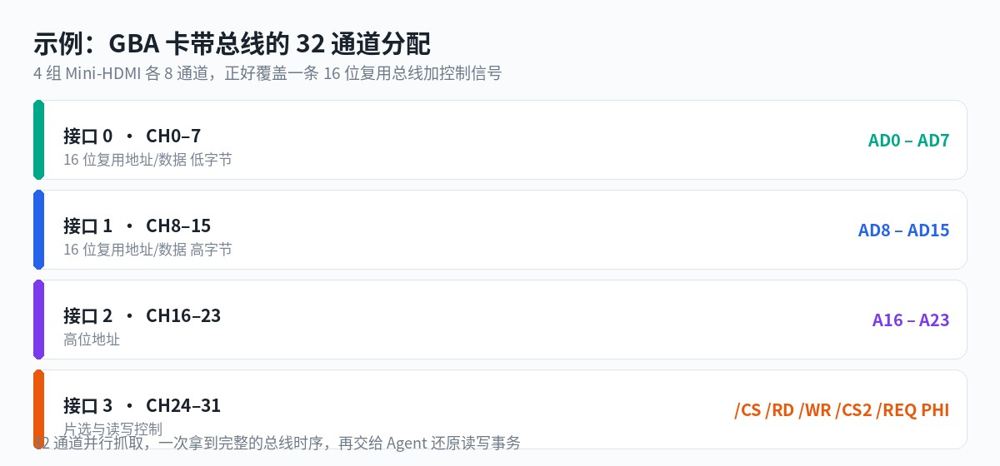
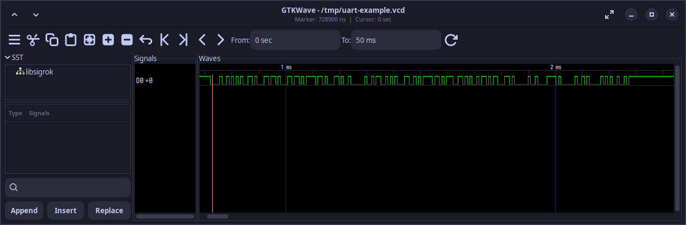
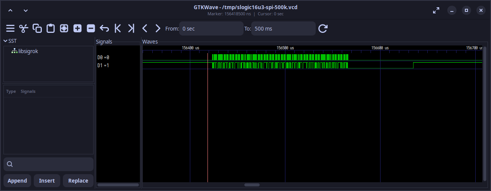

过去三十年，逻辑分析仪的交互范式几乎没变过：**你设参数，它出波形，然后你自己看。**

设多高的采样率、开哪几个通道、触发条件怎么配、解码器引脚怎么映射，每一步都要你先知道答案。仪器只负责忠实地把电平记下来，**理解信号这件事，全部压在工程师身上**。

SLogic 想换一种做法。接上 AI Agent 之后，你交给仪器的不再是参数，而是**目标**：

> 这块板子的 I²C 偶尔会挂死，帮我找出挂死前最后发生了什么。

> 这是一条我没见过的总线，32 根线都在跳，分析一下它的协议结构。

> 把这张卡带里的程序读出来，并验证读得对不对。

剩下的事情由 Agent 自己完成：决定抓什么、抓多快、怎么触发，采完回看结果，发现采样率不够就调高重采，发现引脚猜错就换映射重解，直到拿出一个**有证据、可复现**的结论。

这不是把自然语言翻译成按钮操作，而是把**观察、假设、验证、收敛**这一整套调试方法交给机器执行。SLogic 在其中的角色，从"记录仪"变成了 Agent 的**感知前端**。



> 只想快速看一眼波形、连软件都不想装？直接用浏览器打开 **[slogic.sipeed.com](https://slogic.sipeed.com)**，免安装，安卓手机也能采。本页讲的是另一条路：把分析本身交出去。

---

## 它能替你做什么

下面四类场景，是传统"设参数看波形"做起来最费时间、而 Agent 介入后收益最明显的。

### 未知总线逆向

手上的设备没有文档，只知道有一排信号线在动。

传统做法是人工逐根量、猜周期、试解码器，反复几轮。Agent 的做法是先用多通道全量抓一段，再从**电平统计**入手：哪根线像时钟（周期稳定、占空比固定），哪根像片选（长期为高、偶尔拉低且包住一段活动），哪些线在片选期间同步翻转（数据总线），哪些单调递增（地址总线）。

有了这组假设，它再挑合适的解码器去验证，验证不过就修正假设重来。整个过程你只需要回答它几个确认性的问题。

### 偶发异常围猎

"跑几个小时才出一次"的问题，最耗人。

Stream 模式下 SLogic32U3 的采集时长只受硬盘限制，Agent 可以长时间挂着抓，边抓边解码，**按你描述的异常特征去筛**：校验错、应答丢失、帧间隔异常、某个状态机卡在中间态。抓到以后把前后文一起留下来，而不是只报一个"出错了"。

### 协议一致性与回归

固件改完要确认没把时序改坏。

Agent 可以按同一套参数反复采集、解码、比对，给出的是"这版和上版在哪一帧开始不一样"，而不是两张要你自己对的波形图。

### 离线波形复盘



现场抓到的 `.sr` 文件，事后可以直接丢给 Agent 分析，**不需要连接设备**。同事抓的、几个月前抓的、甚至别的型号抓的，只要是 sigrok 格式都能复盘。

---

## 它是怎么做到的

Agent 不是一次把参数填对，而是**跑一个闭环**：



关键在于**闭环**两个字。传统流程里，"采样率不够"这件事要等你看完波形才发现，然后手动重来；Agent 则是解码失败后自己意识到边沿不足，提高采样率重采。这一轮一轮的收敛，正是人类工程师的工作方式。

同时它必须交出**证据链**：用的哪台设备、什么参数、实际执行的命令、`.sr` 文件在哪。结论可以被你复现和推翻，而不是一句"我觉得是 I²C"。

> Agent 的推理能力来自大模型本身，Plugin 只负责忠实执行扫描、采集和解码。**Plugin 不会替你猜协议**，猜测由模型完成、由你确认、再由 Plugin 验证。

想直接看它怎么用在真实电路上？跳到 [实战案例](#实战案例)：一个 SPI 入门，一个 32 通道逆向 GBA 卡带总线。

---

## 两条接入路径

SLogic 生态目前有两种让 AI 参与调试的方式，按需选择：

| 路径 | 原理 | 适合 |
|---|---|---|
| **sigrok-cli Plugin**（本页） | Agent 调用命令行 `sigrok-cli` 完成扫描、采集与解码 | 任意支持 Plugin/Skill 的 Agent；可脚本化、易复现 |
| **ALL LOGIC 内置 MCP** | 社区上位机 [ALL LOGIC](https://github.com/sipeed/ALL-LOGIC) 内置 MCP 接口，AI 客户端直接控制其采集与解码 | 习惯图形界面，想让 AI 在 GUI 里代操作 |

两者互不冲突，可同时安装。本页只讲第一种。

---

## 快速开始

三步，十分钟。

### 1. 装 Plugin

把链接发给支持 Plugin 或 Skill 的 Agent，由它自己完成安装：

> 请安装这个 SLogic plugin：`https://dl.sipeed.com/fileList/SLogic/sigrok-cli-slogic-plugin.zip`。安装完成后检查 `sigrok-cli-slogic` 是否已经加载，并告诉我是否需要重启。暂时不要访问 USB 设备或开始采集。

### 2. 备好 sigrok-cli

> 打开 SLogic Release 页面 (https://github.com/sipeed/SLogic/releases/latest) ，识别当前操作系统，下载对应的最新版 `sigrok-cli-SLogic`，保存到 `<工具目录>`。完成运行准备后，把可执行文件绝对路径写入全局配置，再运行版本检查，并查询 UART decoder 确认解码器能加载。告诉我结果，不要扫描设备或开始采集。

### 3. 先握手，再干活

第一次连设备**只扫描、不采集**，让 Agent 摸清这台设备的能力边界：

> 扫描已连接的 SLogic，读取设备能力。不要采集。报告设备标识、通道、可用采样率和配置项。

拿到能力清单之后，就可以开始提真正的目标了。

> 详细的安装、权限配置与平台差异见[附录 B](#附录-b环境准备)。

---

## 怎样提一个好目标

Agent 的产出质量，取决于你给的是**目标**还是**半成品参数**。

| 不太好 | 更好 |
| - | - |
| 用 10 MHz 采 50 ms | 这条 UART 大概 115200，帮我确认波特率并解出内容 |
| 把 D0 按 I²C 解码 | D0/D1 是一对疑似 I²C，设备偶尔不应答，找出不应答的那几帧 |
| 抓 1 秒波形 | 复位之后到第一次通信之间发生了什么，重点看时序间隔 |

把这些信息一并给它，可以少走很多弯路：

- **接线事实**：哪根线接到哪个通道，这是 Agent 无法猜的
- **你已知的**：电压、大致速率、协议猜测，哪怕不确定也说出来
- **你要什么**：是要结论、要数据、还是要一个可复现的脚本
- **约束**：能接受多长的采集时间、磁盘空间够不够


如果连协议都不知道，直接说不知道：

> D0 和 D1 的用途暂时未知。请分析波形中的电平变化、周期和通道关系，列出可能的协议及判断依据。先不要运行 decoder；请同时列出开始解码前还需确认的协议参数和引脚映射。

---

## 怎样验收结果

一次完整任务至少应包含以下结果：

| 结果 | 验收内容 |
|---|---|
| 设备 | 完整 scan spec，避免多设备混淆 |
| 采集 | 通道、采样率、时长/样本数/帧数 |
| 波形 | `.sr` 文件绝对路径 |
| 解码 | decoder、引脚映射和全部 option |
| 内容 | 是否产生 annotation，以及请求的字符或数据 |
| 异常 | warning、错误信息及对应样本位置 |
| 复现 | 采集操作的实际命令；解码使用的 decoder、引脚映射和选项 |

解码输出为空，只表示当前 decoder、引脚映射和 option 没有产生 annotation，不能证明波形中没有通信。此时应依次核对原始波形是否存在边沿、通道映射、采样率和协议参数。

一句话原则：**结论必须可复现**。拿到 `.sr` 文件和实际命令，你应该能自己跑一遍得到同样的结果。

---

## 实战案例

两个案例，从入门到旗舰。入门的 SPI 只有四根线，是协议解码的"Hello World"；旗舰的 GBA 复用总线要 32 通道一次全抓，是传统少通道分析仪做不了的事。

### 入门案例：解码 TPM 的 SPI 总线

TPM（可信平台模块）是主板上的安全芯片，和南桥之间大多走 **SPI** 总线。SPI 干净规整，只有四根线加一根地，非常适合拿来认识"AI 怎么从零解一条总线"。



> 这也是硬件安全圈的经典演示：早期不少社区作者用 SLogic16U3 之类的分析仪抓过 TPM 的 SPI 流量，用来说明**未加密的 TPM 总线是一种硬件安全风险**。正因如此，现在普遍推荐 TPM+PIN、总线加密等防护。本案例只演示协议解码本身，用于教学；相关安全研究见文末链接。

#### 接线

SPI 是四线同步总线，加一根地，五根线即可，SLogic 任意型号都够用：

```text
SCLK (时钟)  -> D0
MOSI (DI)    -> D1
MISO (DO)    -> D2
/CS  (片选)  -> D3
GND          -> GND
```

#### 交给 Agent 的目标

注意，这里不告诉它 CPOL/CPHA、位序、片选极性，让它自己定：

> D0–D3 接了一条 SPI 总线，分别是 SCLK、MOSI、MISO、CS，接在一块 TPM 芯片上。请抓一段总线活动，先确认这确实是 SPI，再自动判断时钟极性、相位和位序，解出 MOSI 和 MISO 上的字节流。如果能认出 TPM 的寄存器访问结构，一并告诉我。

#### 它应该能做到

- 从 CS 的拉低拉高框出一次次事务，从 SCLK 的规整时钟确认这是同步串行总线，从而判定是 **SPI**；
- 对照 CS 期间 SCLK 的空闲电平和采样边沿，定出 **CPOL / CPHA**；
- 解出 MOSI / MISO 的字节流，识别出 TPM 的 **TIS 寄存器地址**（比如状态寄存器、数据 FIFO 的固定地址前缀），从而把一串字节讲成"这是一次对某寄存器的读/写"。

SPI 的解码器是现成的，难点不在解码而在**自动定参数**和**把字节还原成协议语义**，这正是 AI 介入的价值。

#### 采样率怎么定

TPM 的 SPI 时钟通常 10~66 MHz。按至少 4 倍、建议 10 倍的经验，想干净抓到 33 MHz 的总线，采样率应取 200 MS/s 以上。SLogic32U3 在 8 通道下可达 800 MS/s，余量充足。Agent 会先读设备能力再定这个值。

> 延伸阅读（第三方安全研究，仅供了解原理）：[Pulse Security: Extracting BitLocker keys from a TPM](https://pulsesecurity.co.nz/articles/TPM-sniffing)、[WithSecure Labs: bitlocker-spi-toolkit](https://github.com/WithSecureLabs/bitlocker-spi-toolkit)。请仅在你**有权测试的设备**上做此类研究。

### 旗舰案例：32 通道逆向 GBA 卡带总线

这是最能体现 32 通道价值的例子：**一条 16 位地址/数据复用总线，加上完整的控制信号，一次全抓**。


#### 为什么它难

Game Boy Advance 的卡带口把地址和数据**复用在同一组线**上：`/CS` 下降沿时，AD0–AD15 上是地址的低 16 位；之后每个 `/RD` 脉冲，同一组线上变成读回的 16 位数据，并且地址自动递增。

通道少的分析仪只能分几次抓、再人工拼时序。32 通道可以把整条总线连同控制线一次拿全，时序关系天然对齐。

#### 通道怎么分



正好 4 组 Mini-HDMI，每组 8 通道，一一对应。

#### 交给 Agent 的目标

注意这里给的是**目标和已知条件**，不是采集参数：

> SLogic32U3 的 32 个通道已经并接到 GBA 卡带金手指上，分组是：CH0–7 接 AD0–7，CH8–15 接 AD8–15，CH16–23 接 A16–23，CH24–31 依次是 /CS、/RD、/WR、/CS2、/REQ、PHI。
>
> 主机已开机运行游戏。请抓一段总线活动，分析这条总线的读时序：地址在什么时刻有效、数据在什么时刻有效、地址是怎么递增的。给出你的判断依据。

Agent 会先扫描设备确认能力，再选一个足以分辨 `/RD` 脉冲的采样率采集，然后从波形里找规律。

#### 它应该能看出什么

GBA 主时钟 16.78 MHz，默认等待态下顺序读大约每 179 ns 一次，`/RD` 低电平约占一半。**200 MS/s 下每个读周期有 35 个采样点**，边沿关系非常清楚。Agent 应当能观察到：

- `/CS` 下降沿处 AD 线上出现一组值，之后保持；
- 每个 `/RD` 低脉冲期间 AD 线上出现另一组值，且**一次 `/CS` 内连续多个 `/RD`**；
- 每个 `/RD` 上升沿之后，若把 AD 当地址看则**单调加一**。

据此推出"地址锁存 + 顺序读 + 自动递增"的复用总线结构。

#### 再往下走

确认时序之后，可以继续提目标：

> 按你刚才总结的时序，把这段波形里所有的读事务还原成「地址 → 数据」列表，并按地址排序导出 CSV。

> ROM 头部 0x04 开始有一段固定的任天堂 logo 位图，0xA0 开始是游戏标题。请在还原出的数据里找找看，验证我们的解码是不是对的。

**这一步是关键**：用数据本身的已知结构来自证解码正确。任天堂 logo 的 156 字节是固定的，对上了就说明地址和数据的对应关系没错。这比"看起来像那么回事"强得多。

#### 再往上走：从总线到游戏

把时序读通、数据还原之后，这条总线能挖的东西远不止 dump 一份 ROM。因为**卡带总线上流过的，正是 CPU 每一拍从卡带取的指令和数据**，顺着它往上解，可以做到：

- **实时还原游戏画面**。跟踪 CPU 对图块（tile）、调色板、OAM 的读取与 DMA 搬运，就能在电脑上**同步重建出 GBA 屏幕上正在显示的画面**——不接显示排线，只靠卡带总线。
- **实时监控游戏变量**。锁定某个内存地址（比如血量、金币、关卡计数器），盯着总线上对它的读写，就能在游戏运行时**实时读出这些关键数值**，甚至画成曲线。
- **辅助游戏与调试**。有了实时的画面和变量，就能做自动化测试、外部辅助、speedrun 计时、金手指研究等等——而这一切都是**被动旁路监听，不改动主机和卡带一个字节**。

这正是"仪器从记录波形，升级到理解系统"最直观的体现：你要的不再是"第 1792 个样本处 /RD 下降沿"，而是"现在血量还剩多少、画面在显示哪一关"。

> 本案例描述的是方法与可达到的目标，不是实测报告。画面还原与变量监控需要 Agent 对 GBA 内存布局有足够的先验或推理，实际效果取决于卡带、接线质量与模型能力。

---

---

## 附录 A：Plugin 的能力与边界

`sigrok-cli-slogic-plugin` 是一个仅包含 Skill 的 OpenAI plugin，内置 Skill 名为 `sigrok-cli-slogic`。包装脚本只做一件事：**跨平台定位并转发到用户提供的 `sigrok-cli` 二进制** —— 在 Linux/macOS/Windows 上找到可执行文件、补好动态库路径，然后把其余参数原样交给 `sigrok-cli`。它本身不内置任何选项，能力全部来自转发的原生 `sigrok-cli` 操作；完整选项以二进制自身为准，用 `-- --help`、`-- -L`、`-- --driver <驱动> --show` 查询。

| 能力 | 转发的原生 sigrok-cli 操作 |
|---|---|
| 列出驱动 / 解码器 | `-- -L` |
| 扫描设备 | `-- --driver sipeed-slogic-analyzer --scan` |
| 查看设备能力 | `-- --driver '<扫描标识>' --show`（通道、采样率、配置项） |
| 查询 decoder | `-- --protocol-decoders <id> --show`（必选/可选引脚、选项、annotation） |
| 有限采集 | `-- --driver '<标识>' --samples N`（或 `--time <ms>`）`-o <文件>.sr -O srzip`；通道、采样率、阈值、触发用 `--config` / `--channels` / `--triggers` 传入 |
| 解码已有波形 | `-- -i <文件>.sr -P <id>:pin=通道:opt=值 -A <id>` |
| 叠加高层 decoder | `-- -i <文件>.sr -P <base>:...,<stacked>`（例如 I²C 上叠 `eeprom24xx`） |

Skill 的行为约定：

- 扫描不到匹配设备时停止，不进入采集；扫描到多台设备时，必须先指定其中一台（`conn`）；
- 采集前先用 `--show` 确认设备支持的采样率和通道，不照搬其他型号；
- 采集完成后，Agent 应返回 `.sr` 的绝对路径和实际命令；
- 解码完成后，Agent 应报告 decoder、引脚映射、选项以及是否产生 annotation；
- 解码已有的 `.sr` 文件无需连接逻辑分析仪；只有扫描、查询设备和采集需要访问 USB 设备。

**本 Plugin** 不附带 MCP server、网络服务、`sigrok-cli`、USB 驱动或 GTKWave（SLogic 生态里的 MCP 接入由 ALL LOGIC 提供，见上文「两条 AI 接入路径」）。Plugin 也不能预测协议：协议或接线未知时，由大模型结合波形特征和电路信息推测候选协议，经用户确认后，Skill 再按指定的 decoder 和引脚映射执行解码，见下文「不知道协议或接线」。

### 使用边界

- 采集会访问 USB 设备并创建 `.sr` 文件；执行前确认设备、接线、采集上限和文件名。
- 采集必须设上限：`--samples N` 或 `--time <ms>` 必选其一，否则 `sigrok-cli` 会一直采集。
- SLogic 采集参数走原生 `--config`：`logic_channels`（通道档位，决定最大采样率，应写在 `samplerate` 之前，并会使能 D0..D(N-1)）、`samplerate`（SI 形式如 `10m`，超过当前档位上限会被截断并告警）、`voltage_threshold`（是「低-高」电压对，单阈值写成 `1.7-1.7`，范围 0–6 V）、`pattern`；触发用 `--triggers Dn=COND`，COND 取 `0 1 r f e`。
- 输出路径用 `sigrok-cli` 原生 `-o` / `-O`；包装脚本不限制目录，请自行确认不会覆盖重要文件。
- 扫描不到设备时不采集；扫描到多台设备时先指定目标。
- 缺少预期协议或必要的 decoder 引脚映射时不开始解码。
- 包装脚本只转发、不校验采集上限或输出路径；上限与安全由你在参数里写明。

---

## 附录 B：环境准备

Sipeed 当前的 SLogic 系列包括：

| 产品 | 通道数 | 说明 |
|---|---|---|
| SLogic Combo 8 | 8 | [产品介绍](../combo8/readme.md) |
| SLogic16U3 | 16 | [产品介绍](../slogic16u3/Introduction.md) |
| SLogic32U3 | 32 | [产品介绍](../slogic32u3/Introduction.md) |

不同型号的通道数量、采样率、输入范围和配置项有所不同。使用本教程时，应先让 Agent 扫描设备并读取当前型号的能力，再设置采集参数。

本文已在 Linux x86_64 上使用 SLogic Combo 8、SLogic16U3 和 SLogic32U3 完成采集验证；Windows 和 macOS 的发布版二进制、USB 驱动和硬件采集尚未验证。

### 安装 Plugin

Plugin 需要 Python 3.10 或更高版本，并要求 Agent 能运行本地命令、读写工作目录和访问 USB 设备。

无需手动下载、解压或复制目录。复制 sigrok-cli-slogic-plugin 的链接地址，直接发给支持 Plugin 的 Agent：

> 请安装这个 SLogic plugin：`https://dl.sipeed.com/fileList/SLogic/sigrok-cli-slogic-plugin.zip`。安装完成后检查 `sigrok-cli-slogic` 是否已经加载，并告诉我是否需要重启。暂时不要访问 USB 设备或开始采集。

按 Agent 的提示重启后，再说：

> 检查 `sigrok-cli-slogic` 是否已经加载。说明它能执行哪些操作，暂时不要访问 USB 设备或开始采集。

Agent 能识别 `$sigrok-cli-slogic`，并说明 scan、show、capture 和 decode 的用途，即表示 Skill 已加载。

### 准备 SLogic 版 sigrok-cli

SLogic 按平台分发对应的 `sigrok-cli`，与其他上位机一同打包在同一个 Release 中：

| 系统 | 分发文件 |
|---|---|
| Linux x86_64 | `sigrok-cli-SLogic-x.y.z-linux-x86_64.AppImage` |
| Windows x64 | `sigrok-cli-SLogic-x.y.z-windows-x86_64.exe` |
| macOS (Apple Silicon) | `sigrok-cli-SLogic-x.y.z-macos-arm64.zip` |

下载渠道：

- **GitHub Release（推荐，最新）**：https://github.com/sipeed/SLogic/releases/latest
- 下载站（备份镜像）：https://dl.sipeed.com/shareURL/SLogic

把 Release 页面交给 Agent，让它下载适合当前系统的最新版，并保存到固定的工具目录。`<工具目录>` 填写你希望长期保存该工具的位置即可：

> 打开 SLogic Release 页面 (https://github.com/sipeed/SLogic/releases/latest) ，识别当前操作系统，下载对应的最新版 `sigrok-cli-SLogic`，并保存到 `<工具目录>`。不要覆盖已有版本。请完成运行该程序所需的准备工作，把可执行文件绝对路径保存到全局配置，供 `sigrok-cli-slogic` 后续直接使用，再运行版本检查，并查询 UART decoder。告诉我配置结果，不要扫描设备或开始采集。

Agent 验证可执行文件后，应将其路径保存到全局配置，供后续扫描、采集和解码直接使用。不同系统的分发形式由 Agent 处理，用户无需记录路径或了解发行包的内部结构。

### 确认硬件模式和接线安全

- SLogicCombo8 支持多种工作模式。用作逻辑分析仪时，先按键切换至蓝色指示灯；Linux 下可用 `lsusb` 检查是否出现 `USB TO LA`。
- 逻辑分析仪 GND 必须与被测设备 GND 可靠连接。地线应尽量短，并靠近待测信号点。
- 连接前须确认被测信号电压处于对应 SLogic 型号的输入范围内。电压未知时，先用万用表或示波器测量。
- SLogic16U3 的 VCC 是 3.3 V 电源输出，不是信号输入。
- 逻辑分析仪通过 USB 与电脑共地。测量强电系统或不能与电脑共地的设备时，应使用合适的 USB 隔离器。无法确认安全条件时，请勿连接。

不同型号的输入范围、阈值和引脚定义不完全相同，连接前请查阅对应产品页。本教程的 UART 示例只使用 D0 和 GND。

### SLogic32U3 的额外注意事项

使用 SLogic32U3 时，请把下面几条一并告诉 Agent，否则很容易出现「能连上但速率不达预期」且难以排查的情况：

- **必须接 10 Gbps 的 USB 口**（通常标 `SS10` 或 `10`）。只看蓝色不可靠，很多蓝色口只有 5 Gbps。
- **不支持 USB2.0 采集**，接到 USB2.0 口无法正常工作。
- **优先 USB-C 直连**。随附线材虽配了 C 转 A 转接头，但转接头有插损，低性能电脑上可能导致速率跑不满。
- **使能通道越少，可用采样率越高**：1400M@4CH、800M@8CH、400M@16CH、200M@32CH。让 Agent 只启用本次真正需要的通道。

详见 [SLogic32U3 快速上手](../slogic32u3/Quick_Start.md#连接设备)。

### 配置 Linux USB 权限

普通用户无法扫描设备时，可安装以下 udev 规则：

```bash
sudo tee /etc/udev/rules.d/60-sipeed.rules <<'EOF'
SUBSYSTEM!="usb|usb_device", GOTO="sipeed_rules_end"
ACTION!="add", GOTO="sipeed_rules_end"
ATTRS{idVendor}=="359f", MODE="0666", GROUP="plugdev", TAG+="uaccess"
ENV{ID_MM_DEVICE_IGNORE}="1"
LABEL="sipeed_rules_end"
EOF

sudo udevadm control --reload
sudo udevadm trigger
```

Arch Linux 可将 `GROUP="plugdev"` 改为 `GROUP="uucp"`。规则生效后，重新插拔 SLogic，再让 Agent 扫描。使用 `sudo` 运行程序只适合快速判断权限问题，不建议作为日常方案。

连接 SLogic 后，先扫描并读取设备能力，不要直接采集：

> 使用 `$sigrok-cli-slogic` 和已经配置好的 SLogic 版 `sigrok-cli`。扫描已连接的 SLogic，再读取所选设备的能力。不要采集。报告设备标识、通道、可用采样率和配置项。

Agent 应依次完成：

1. 确认全局配置中的 `sigrok-cli` 路径存在且可执行；
2. 扫描 SLogic/DSLogic；
3. 只有一台设备时读取该设备能力；
4. 有多台设备时列出完整设备标识（scan spec），等待用户选择；
5. 没有设备时停止，不进入采集。

扫描完成后，至少核对以下内容：

| 项目 | 为什么需要 |
|---|---|
| 完整设备标识 | 多台设备时用于选定目标 |
| 通道名称 | decoder 引脚必须映射到实际通道 |
| 可用采样率 | 采集值必须是设备支持的配置 |
| 通道和带宽限制 | 启用通道越多，可用最高采样率通常越低 |
| 配置项 | 电压阈值、触发等能力取决于具体型号 |

采集参数应以当前设备的 `show` 输出为准，不能直接套用其他 SLogic 型号的参数。

---

## 附录 C：手工控制参数

绝大多数情况不需要你自己算这些，但当你想精确控制 Agent 的行为时，这些是它遵循的规则。

每次采集都应设置明确上限：用 `--samples N`（样本数）或 `--time <ms>`（时长）指定，否则 `sigrok-cli` 会一直采集。

| 信息 | 应该怎样说明 |
|---|---|
| 目标设备 | 指定型号或扫描结果中的完整标识 |
| 接线 | 说明每根协议线连接到哪个 D 通道 |
| 预期协议 | UART、I²C、SPI 或其他 decoder ID |
| 协议参数 | 波特率、SPI mode、位序、CS 极性等 |
| 采样范围 | 时长、样本数或帧数三选一 |
| 采样率 | 使用设备支持的值；不知道时先让 Agent 建议 |
| 输出文件 | 使用文件名，例如 `uart-test.sr` |
| 结果目标 | 字符、地址、数据、warning、样本位置或波形图 |

采样时间、样本数和采样率的关系是：

```text
采样时间（秒） = 样本数 ÷ 采样率（Hz）
```

例如，以 10 MHz 采集 500000 个样本，对应 50 ms。SLogic 产品文档建议采样率高于被测信号频率约 10 倍；实际选择还要考虑信号质量、协议 decoder 和设备带宽。无关通道会占用 USB 带宽，因此只应启用本次采集所需的通道。

如果不知道采样率，可以说：

> D0 上预计是 115200 baud UART，但我不知道该选哪个采样率。请先读取设备支持的采样率，给出选择依据，等我确认后再采集。

如果协议参数也不确定，请分别列出已知项和未知项。Agent 应先补齐必要信息，不应遍历尝试所有协议和参数。

### 完整示例：采集并解码 UART

下面以 SLogicCombo8 采集 CH341 TX 为例。UART 参数为 115200 8N1、LSB first，信号接入 D0。

#### 接线

```text
CH341 TX  -> SLogicCombo8 D0
CH341 GND -> SLogicCombo8 GND
```

这里采集的是 CH341 发出的 TX 信号。对于 UART decoder，这一路是逻辑分析仪接收到的数据，因此映射为 `rx=D0`。

#### 先确认设备和参数

> 使用 `$sigrok-cli-slogic`。SLogicCombo8 已切换到蓝灯逻辑分析仪模式，D0 接 CH341 TX，双方 GND 已连接。请扫描设备，确认 D0 和 10 MHz 采样率可用；只检查，不采集。

核对 scan 和 show 的结果后，再开始采集。

#### 采集原始波形

> 使用刚才确认的 SLogicCombo8，只启用 D0，以 10 MHz 采集 500000 个样本，保存为 `capture-combo8-500k.sr`。不要覆盖已有文件；如果同名文件存在，先停止并告诉我。完成后报告绝对路径和实际命令。

本次采集参数如下：

- 通道：D0；
- 采样率：10 MHz；
- 样本数：500000；
- 对应时长：50 ms；
- 输出：当前工作目录中的 `capture-combo8-500k.sr`。

输出文件用 `sigrok-cli` 原生 `-o <文件>` 指定（`-O srzip` 选择 `.sr` 格式，可用绝对路径或子目录）；包装脚本不限制目录，请自行确认不会覆盖已有文件。

#### 解码 UART

> 解码 `capture-combo8-500k.sr`。先查询 UART decoder 支持的 pin、option 和 annotation，然后将 `rx` 映射为 D0，使用 115200 baud、8 data bits、no parity、1 stop bit、LSB first。输出 RX 字符、warning 和样本位置，并将文本保存为 `decoded-uart.txt`。

Agent 应返回：

- decoder：UART；
- decoder 引脚映射：`rx=D0`；
- 波特率、数据位、校验、停止位和位序；
- 是否产生解码标注；
- 解码文本和警告（warning）；
- 输入、输出文件的绝对路径；
- 实际执行的命令。

实测数据每 10 ms 发送一次 `Hello, SLogic x AI`。50 ms 波形中完整解码出 5 次消息、90 个字符，warning 为 0。

#### 需要时再生成波形图

协议内容以 decoder 文本为准，通常无需生成图片。GTKWave 是可选配套工具，不是 Plugin 的运行依赖。系统已安装 GTKWave 时，可以继续说：

> 将 `capture-combo8-500k.sr` 的 D0 转换为 VCD，用 GTKWave 截取第一组完整 UART 消息并保存为 PNG。不要修改原始 `.sr`。

`sigrok-cli` 负责将 `.sr` 导出为 VCD，GTKWave 只显示数字电平。VCD 不包含 libsigrokdecode 生成的 UART 字符标注，字符内容仍以 `decoded-uart.txt` 为准。



### 完整示例（触发）：采集并解码 SPI

解码 SPI 需要明确时钟、数据线、模式和位序。是否映射 CS，取决于采集时是否接入了有效的 CS 信号。

下面的实例使用 CH341 发送 SPI 数据，并由 SLogic16U3 采集：

```text
CH341 CLK  -> SLogic16U3 D0
CH341 MOSI -> SLogic16U3 D1
CH341 CS   -> SLogic16U3 D3
CH341 GND  -> SLogic16U3 GND
```

发送端通过 `/dev/spidev1.0`，以 SPI mode 0、500 kHz、8 bit 运行发送脚本（本例为 `spi_test.py`），发送 24 字节：

```text
hello, SLogic from SPI.\n
```

采集和发送需要并行执行：Agent 应先启动采集并等待 D3 触发，再运行发送脚本。先对 Agent 说明采集参数：

> 使用 `$sigrok-cli-slogic` 操作已连接的 SLogic16U3。D0 接 CLK，D1 接 MOSI，D3 接 CS，双方 GND 已连接。请只启用 D0、D1 和 D3，以 10 MHz 采集 1000 ms，并设置 D3 上升沿触发和等待触发，保存为 `slogic16u3-spi-500k.sr`。开始等待触发后，运行 `spi_test.py`，通过 `/dev/spidev1.0` 发送一次数据。完成后报告波形路径、实际样本数和实际命令。

采集完成后，再要求 Agent 解码：

> 解码 `slogic16u3-spi-500k.sr`。将 `clk` 映射到 D0、`mosi` 映射到 D1、`cs` 映射到 D3。使用 active-high CS、SPI mode 0、LSB first、8 bit，输出 MOSI data、warning 和样本位置。

本次实测中，D3 上升后出现 SPI 时钟，传输结束时回到低电平，因此按 active-high CS 解码。decoder 输出 24 字节，与发送脚本的 UTF-8 字节完全一致，warning 为 0：

```text
68 65 6C 6C 6F 2C 20 53 4C 6F 67 69
63 20 66 72 6F 6D 20 53 50 49 2E 0A
```

两点注意：

- 触发沿和 CS 极性必须以实际波形为准。本例对 D3 使用上升沿触发，并将 decoder 的 `cs_polarity` 设为 `active-high`；如果照搬常见的低电平有效配置，decoder 不会输出数据。
- 本例需要 `LSB first` 才能还原发送字节。如果 CPOL、CPHA、位序或 CS 极性未知，应先查阅芯片手册、电路图或固件配置。一次解码无输出，不能据此认定没有 SPI 通信。

下图由 `.sr` 采集文件导出为 VCD 后，通过 GTKWave 展示 500 kHz CLK（D0）和 MOSI（D1）的局部波形：



### 分析已有波形

已有 `.sr` 文件时，无需连接 SLogic，也无需重新采集。例如：

> 使用 `$sigrok-cli-slogic` 分析当前目录的 `capture.sr`，不要访问 USB 设备。D0 是 UART RX，按 115200 8N1 解码。先查询 UART decoder，再报告引脚映射、option、字符、warning 和样本位置。

同一个 `.sr` 文件可以使用不同 decoder 参数反复分析。采集完成后应保留原始文件；调整波特率或引脚映射时，无需重新采集。

### 模仿示例：描述其他协议

下面的提示词用于说明描述思路。通道、采样率、时长和协议参数应按实际设备与被测信号修改。

#### UART

UART 需要说明数据方向、通道、波特率、数据位、校验位、停止位和位序。只采集单向信号时，将该通道映射到 `rx` 或 `tx`：

> D0 接目标设备 TX，双方 GND 已连接。请先确认设备能力，再以 10 MHz 采集 100 ms。查询 UART decoder 后，将 `rx` 映射到 D0，按 115200 8N1、LSB first 解码字符、warning 和样本位置。

#### I²C

解码 I²C 至少需要明确 SCL 和 SDA 对应的通道：

> D0 接 SCL，D1 接 SDA。请先确认设备支持这两个通道，然后用 10 MHz 采集 100 ms，保存为 `i2c-test.sr`。将 `scl` 映射到 D0、`sda` 映射到 D1，解码地址、读写方向、ACK/NACK 和数据，并报告 warning。

需要继续分析 EEPROM 等上层协议时，可以在 I²C decoder 上叠加对应的 stacked decoder。叠加前应先确认基础 I²C 解码正确。

#### SPI

SPI 需要说明 CLK、MOSI/MISO、可选的 CS、SPI mode、位序、字长和 CS 极性。已知有效 CS 时，可以用其边沿触发：

> D0 接 CLK，D1 接 MOSI，D3 接 CS。请先根据空闲电平和传输期间的电平确认 CS 极性，再以 10 MHz 采集 1000 ms，并在 CS 进入有效状态的边沿等待触发。将 `clk`、`mosi` 和 `cs` 映射到对应通道，按 SPI mode 0、LSB first、8 bit 解码 MOSI data、warning 和样本位置。

#### PWM

PWM decoder 只需要一条 `data` 通道，并可按 active-high 或 active-low 极性输出占空比、周期和频率。采集范围应覆盖多个完整周期：

> D0 接 PWM 信号，双方 GND 已连接，信号高电平有效。请先读取设备支持的采样率，选择能覆盖至少 20 个完整周期的有限采集参数。采集后查询 PWM decoder，将 `data` 映射到 D0、`polarity` 设为 `active-high`，输出占空比、周期、频率和对应样本位置。

---

## 附录 D：排障

### Agent 没有识别 Plugin

把 plugin 链接重新发给 Agent，并要求它返回下载、安装和加载阶段的完整错误。安装包根目录必须包含 `.codex-plugin/plugin.json`，不能只安装其中的单个文件。安装后按提示重启 Agent，再检查 `$sigrok-cli-slogic`。

### 找不到 sigrok-cli

把下载或运行时的完整错误交给 Agent，让它检查文件是否下载完整、保存路径是否正确、当前系统能否执行，并修复全局配置。例如：

> `sigrok-cli-slogic` 找不到或无法运行已经配置的 `sigrok-cli-SLogic`。请检查下载结果、保存路径、执行权限、实际可执行文件位置和全局配置；修复后运行版本检查，并查询 UART decoder。不要扫描设备或开始采集。

### 版本命令正常，但 decoder 无法加载

发行包可能缺少 libsigrokdecode、decoder 模块或相应的 Python 环境。让 Agent 查询 UART decoder（`-- --protocol-decoders uart --show`）并保留完整错误，不能只根据 `--version` 判断安装是否完整。

### 扫描不到设备

依次检查：

- SLogicCombo8 是否为蓝灯逻辑分析仪模式；
- USB 线、端口和供电是否正常；
- 系统能否看到 USB 设备；
- `sigrok-cli` 是否包含 SLogic 驱动；
- Linux udev 或 Windows USB 驱动是否正确。

可以对 Agent 说：

> 保留完整扫描输出和错误。检查是找不到可执行文件、缺少 SLogic 驱动、USB 权限不足，还是没有发现设备；不要开始采集。

### 采样率被拒绝

让 Agent 重新执行 `show`，确认启用通道数和可用采样率。关闭未使用的通道，再选择设备支持的采样率；不要套用其他型号的参数。

### 解码为空或出现乱码

按以下顺序排查：

1. 原始波形中是否存在边沿；
2. decoder 引脚是否映射到正确通道；
3. 采样率是否足够；
4. UART 波特率、数据位、校验、停止位和位序；
5. SPI CPOL、CPHA、位序和 CS 极性；
6. 接地、输入阈值和信号完整性。

保留原始 `.sr` 文件，再修改 decoder 参数重新解码，避免覆盖唯一的采集结果。

### 采集完成后进程没有退出

SLogicCombo8 可能在端点清理时偶发不退出。先确认 `.sr` 已完整写入，再终止进程并重新插拔设备。文件写入完成前不要断开设备。
