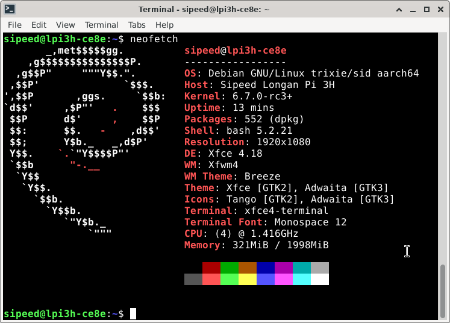

## Sipeed官方镜像

### Debian

Sipeed 官方镜像基于 Debian 系统修改适配。 

默认镜像的帐号密码配置如下：
账户：`root`，密码： `root`；
账户： `sipeed`，密码：`licheepi`；

**注意，不建议用root用户登陆桌面。**

  
  

下载地址：
百度网盘：[点我](https://pan.baidu.com/s/1VGaARAq6dbicFy4VOytRuw) 提取码: cd68
Mega 云盘：[点我](https://mega.nz/folder/gt50zDoC#LgRvHVCzWTUgGohKoMtlqA)

<!--
### Android 12

TBD
-->