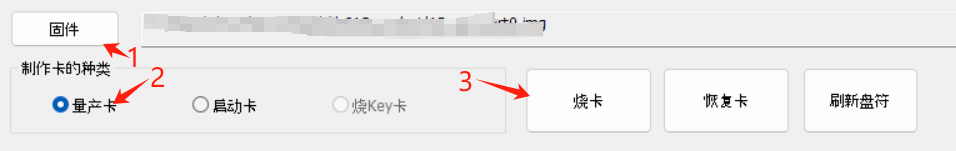

## 准备工作

### 获取镜像

参见上一章[镜像集合](https://wiki.sipeed.com/hardware/zh/longan/h618/lpi3h/3_images.html)，选取需要的镜像下载。

### 获取烧录工具

烧录镜像至 SD 卡的工具常见的有 balenaEtcher，rufus 等，这里以 balenaEtcher 为例，首先去[balenaEtcher官网](https://etcher.balena.io/#download-etcher)下载并安装该软件。
Linux 下也可以使用 dd 命令直接写入。

## 烧录镜像

### 烧录 Linux 镜像至 SD 卡

准备好要烧录的镜像后，打开 balenaEtcher，先选择要烧录的镜像文件：


然后选择要烧录的目标设备：


最后点击烧录，等待烧录完成后，就得到了包含启动镜像的 SD 卡：


Windows 系统和 Linux 的步骤类似。

### 烧录 Linux 镜像至 EMMC

**注意需要使用20240106及以上版本的镜像**

先准备一张启动 TF 卡，进入到系统，然后使用 SCP 等工具将 EMMC 镜像文件拷贝到 TF 卡的系统中，然后使用 dd 命令将镜像文件写入 EMMC：
```shell
# 假设镜像文件复制到 /opt/ 目录下
dd if=/opt/your_image_file of=/dev/mmcblk1
sync
```
等到烧录完成后，拔掉 SD 卡，即可从EMMC进入系统。

若要使用 EMMC 启动，并使用SD卡扩容，需要确保SD卡已格式化，其中不包含启动镜像，否则因为优先级的问题可能会变为SD卡启动。

### 烧录安卓镜像至 SD 卡

**注意，安卓镜像不能使用 balenaEtcher 进行烧录，需要使用 PhoenixCard 烧录后才能启动。**

首先下载网盘中的 PhoenixCard 工具，打开后选择第二项：启动卡。将安卓镜像烧录到 TF 卡中即可使用。


### 烧录安卓镜像至 EMMC

打开 PhoenixCard，选择第一项：量产卡。烧录安卓镜像到 TF 卡中，然后将TF卡插入到底板，上电，此时会自动将安卓镜像烧录到 EMMC 中，等待烧录完成后拔掉 TF 卡即可使用 EMMC 的中安卓镜像。


