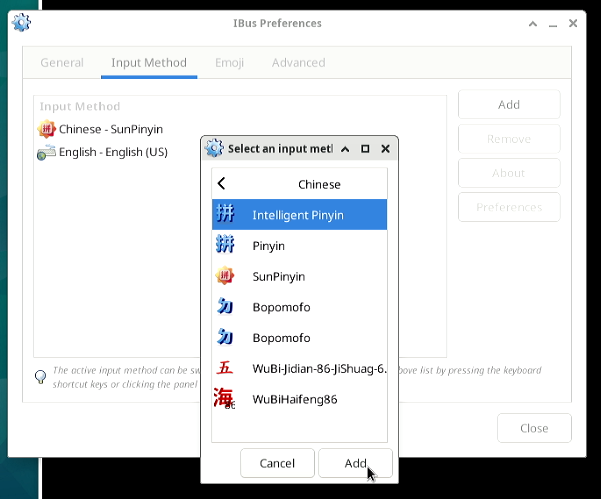
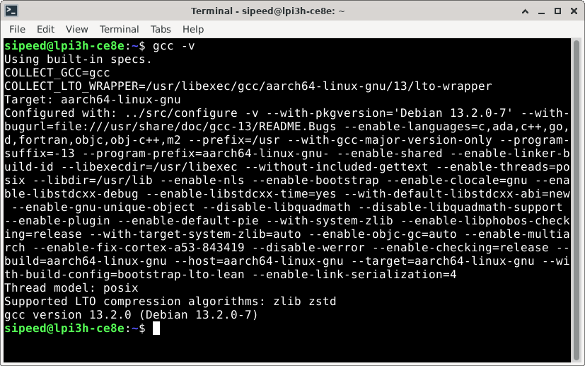

## 登录系统

本篇文档以默认的 Debian 桌面系统为例，介绍基础系统使用操作。

默认镜像的帐号密码配置如下：
账户： `sipeed`，密码：`licheepi`；
账户：`root`，密码： `root`；

镜像默认开启了自动登陆，登陆用户为 `sipeed`。
若不需要自动登陆，将 `/usr/share/lightdm/lightdm.conf.d/01_debian.conf` 文件中的 `autologin-user=sipeed` 注释掉即可。

## 打开命令行

在 LonganPi 3H 的 Debian 图形化系统中，使用快捷键 `Ctrl` + `Alt` + `T` 三个组合键可以直接打开命令行终端，来快速方便地操作系统。

## 连接网络

桌面系统默认使用 connman 来管理网络连接。

可以在左上角的应用菜单中找到 `connman settings`，点击后桌面右上角会出现一个网络图标，点击右上角的网络图标即可新建网络连接和查看网络连接信息：


### 连接有线网络

串口中可以通过 connmanctl 来启用有线网络连接和查看相关信息：
```shell
connmanctl enable ethernet
```

LonganPi 3H 有一个千兆网络接口；将已经接通网络的网线插入到 LonganPi 3H 的网络接口中，就能实现连接有线网络了，可以点击右上角的图标看到连接信息：


### 连接无线网络

LonganPi 3H 板载无线模组，支持蓝牙和 wifi 。

图形界面方式：

点击右上角的网络图标，切换到 wifi 连接的页面，选中想要连接的 wifi 再点击 connect 即可：


命令行方式：
可以使用 connmanctl 来启用 wifi 连接和查看相关信息：
```shell
connmanctl enable wifi
```

打开命令行，使用 `wpa_supplicant` 可以连接 wifi。下面的步骤需要切换到 root 用户执行：
```shell
sudo -i
nano /etc/wpa_supplicant.conf
```

创建 wpa_supplicant.conf 文件并填入 wifi 的 ssid 和 psk 信息：
```txt
network={
        ssid="your_wifi_name"          
        #psk="your_wifi_password"        
}
```

填写完成后运行下面的命令即可连接 wifi。
```shell
wpa_supplicant -D nl80211 -i 网卡名 -c /etc/wpa_supplicant.conf &
```

若连接后没有 IP 地址，用 dhcp 获取一个ip地址即可：
```shell
dhclient
```

## 连接蓝牙

串口中，可以通过 connmanctl 启用蓝牙连接和查看相关信息：
```shell
connmanctl enable bluetooth
```

桌面系统默认使用 blueman 来管理蓝牙连接。

找到桌面右上角的蓝牙图标，确认蓝牙功能已经打开，若没打开，右键单击蓝牙图标即可打开：


打开后，左键单击蓝牙图标，可以看到蓝牙设备扫描界面

点击该界面左上角的Search即可搜索蓝牙设备，将蓝牙键鼠、蓝牙耳机等设备的配对模式打开即可被扫描到。

右键选择想要连接的设备，即可连接。成功连接后还可以右键该设备，点击Trust，下次扫描到即可自动连接。


若蓝牙图形管理界面无法搜索到设备，也可以现在命令行界面下使用`bluetoothctl`来进行配对，步骤如下：

```shell
bluetoothctl
scan on
# 找到想要配对设备的mac地址
pair 目标设备的mac地址
connect 目标设备的mac地址
```

## 软件安装

在完成网络连接后，即可进行软件包的更新，安装。

### 软件源

在 Debian 系统中，可以使用 apt (Advanced Packaging Tool) 来进行软件的安装。

安装软件的时候，会从系统指定的软件网站中搜索并下载目标软件，当目标网站访问困难（比如服务器距离太远或者服务器网络不佳）时，可以手动设置编辑软件源网站，改成距离自己当前最近的源，来减少下载时间。

软件源默认使用 `/etc/apt/sources.list` 文件里面的内容，有额外需要的话可以自行更改。

### 升级软件

使用 `sudo apt update` 可以更新软件列表，一般在更换软件源之后需要使用这个命令。

使用这个命令前，先用 `date` 命令查看一下时间，若系统时间有误或连接网络后没有自动更新时间，可以手动更新一下，确保软件源内的软件包是最新版本：
```shell
sudo date -s "20230717 12:00:00"
```

然后使用 `sudo apt upgrade package_name` 可以更新名称为 `package_name` 的软件。

### 安装程序

可以借助于 apt 命令来安装软件；比如使用 `sudo apt install package_name` 命令来安装 `package_name`，将 `package_name` 替换成给你想要安装的软件包名称即可。

## SSH

如果你的镜像里没有 ssh 或 sshd 指令，可以先通过以下指令安装：

```bash
sudo apt install ssh openssh-server
```

安装之后即可使用 ssh 来远程登录到其它机器操作，或者在其它机器上使用 ssh 登录到 LicheePi 4A
还可以使用 scp 进行文件传输：

```bash
scp demo.zip sipeed@192.168.1.9:~/
```

## 输入法

如果你需要进行非 ascii 的字符输入，就需要安装输入法，这里以中文输入法为例，其它语言请自行查找相关教程。

先安装 ibus-libpinyin：

```bash
sudo apt install -y ibus-libpinyin
```

> 注意这里会消耗约200MB磁盘空间

安装完后，重启板卡，即可在 Applications 下看到 `IBus Preference` 选项，点击进入设置。  


在出现的界面里点击 `Input Method`，点击 `Add`，选择 `Chinese`，选择 `Intelligent Pinyin`，点击 `Add`，即可添加中文拼音输入法。  

 

在右上角点击输入法图标，可见以下选项，选择 `Chinese - Intelligent Pinyin` 即可。  


此时即可在系统中顺利输入中文。

## 浏览器

系统内置了 Firefox 浏览器，点击桌面下方的浏览器图标即可使用： 


效果如下：


## 播放器

可以通过命令安装 VLC 播放器：

```shell
sudo apt install vlc
```

安装完成后播放视频的效果如下：


## 编程开发 

### Python

系统已内置了 python3 环境，可以在终端直接运行 `python3` 命令：


如果需要安装Python包，则使用：`sudo apt install python3-XXX`
比如安装pyserial包：`sudo apt install python3-serial` 即可。

### C

需要安装 `build-essential` 包，占用约800MB磁盘空间

```bash
sudo apt install build-essential
```

然后即可使用 gcc 进行相关操作：



## 更多
欢迎投稿～ 投稿接受后可得￥5～150（$1~20）优惠券！