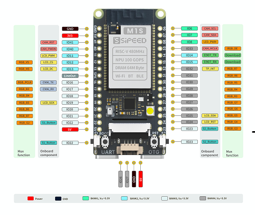

## 产品概述

Sipeed M1s Dock 是基于 [Sipeed M1s](./m1s_module.md) 模组来设计的一款核心板，引出了 MIPI CSI、SPI LCD 等 FPC 接口，免去接线难的烦恼。使用最精简的设计，用于客户对模组进行模组评估，或者爱好者直接上手游玩等用途。

购买链接：[淘宝](https://item.taobao.com/item.htm?id=691108452443)

<td></td>

## 宣传视频

M1s Dock 和 M0Sense 总览：3:15 之前的都是 M1s Dock。

<iframe src="//player.bilibili.com/player.html?aid=559937139&bvid=BV1De4y117sP&cid=887814913&page=1" scrolling="no" border="0" frameborder="no" framespacing="0" allowfullscreen="true"> </iframe>

## 板卡特点

- 主芯片 BL808 RISC-V 480Mhz + NPU BLAI-100
- 板载 USB 转 UART 调试器（可实现一键点击烧录，无需按实体按键）
- 板载显示屏座子（可选配 1.69 寸 240x280 电容触摸屏）
- 板载 MIPI 摄像头座子（可选配 200W 像素摄像头）
- 支持 2.4G WIFI / BT / BLE
- 板载 1 个模拟麦克风、1 个 LED、1 个 TF 卡座
- 引出一路 USB-OTG 到 USB Type-C 接口

### 硬件参数

<table>
    <thead>
        <tr>
            <th colspan = "2" > M1s Dock </th>   
        </tr>
    </thead>
    <tbody>
    <tr>    
        <td rowspan="9" style="white-space:nowrap">主控 BL808 处理器</td>
    </tr>
    <tr>
        <td>多核 RISC-V (Max Freq 480MHz)</td>
    </tr>
    <tr>
        <td>AI NN 通用硬件加速器 —— BLAI-100 用于视频/音频检测/识别</td>
    </tr>
    <tr>
        <td>内嵌 64MB DRAM</td>
    </tr>
    <tr>
        <td>编解码： - MJPEG and H264(Baseline/Main) - 1920x1080@30fps + 640x480@30fps
        </td>
    </tr>
    <tr>
        <td>ISP（图像信号处理）：详情请查看<a href="https://dl.sipeed.com/shareURL/MAIX/M1s/M1s/6_Chip_Manual">芯片规格书</a></td>
    </tr>
    <tr>
        <td>接口： - 摄像头接口 ：DVP 和 MIPI-CSI - 显示接口：SPI、DBI、DPI(RGB)</td>
    </tr>
    <tr>
        <td>无线： - 支持 Wi-Fi 802.11 b/g/n - 支持 Bluetooth 5.x Dual-mode(BT+BLE) - 支持 Wi-Fi / 蓝牙 共存</td>
    </tr>
    <tr>
      <td>USB 2.0 HS OTG （引出到 USB Type-C 接口）</td>
    </tr>
    <tr>    
        <td rowspan="5" style="white-space:nowrap"> 板载部件 </td>
    </tr>
    <tr>
        <td>板载 USB 转 UART 调试器（使用官方下载工具可实现一键点击烧录，无需按实体按键）</td>
    </tr>
    <tr>
        <td>板载 1 个显示屏座子（可选配 1.69 寸 240 x 280 电容触摸屏）</td>
    </tr>
    <tr>
        <td>板载 MIPI 摄像头座子（可选配 200W 像素摄像头）</td>
    </tr>
    <tr>
        <td>板载 1 个模拟麦克风、1 个 LED、1 个 TF 卡座 </td>
    </tr>
    <tr>    
        <td rowspan="5" style="white-space:nowrap"> 其他说明 </td>
    </tr>
    <tr>
      <td>
        3D 模型文件下载：<a href="https://dl.sipeed.com/shareURL/MAIX/M1s/M1s_Dock/5_3D_file">点击跳转</a>
      </td>
    </tr>
    <tr>
        <td>外部供电需求 TYPE-C 接口：5V±10% 0.5A</td>
    </tr>
    <tr>
        <td>温升: &lt;30K</td>
    </tr>
    <tr>
        <td>工作温度范围:-10℃ ~ 65℃</td>
    </tr>
    </tbody>    
</table>

### 外设框图

### 尺寸图

### 引脚图

## 产品对比

| 项目    | Maix Bit                 | ESP32 cam                     | M1s Dock                                  |
| :------ | :----------------------- | :---------------------------- | :---------------------------------------- |
| 处理器  | K210                     | ESP32                         | M1s(BL808)                                |
| 摄像头  | 0.3MP DVP GC0328         | 2MP DVP OV2640 with flash LED | 2MP MIPI OV2685(two-side) with flash LED  |
| 显示屏  | 2.4 inch 320x240         |                               | 1.68 inch 280x240 带电容触摸              |
| 音频    | I2S MEMS MIC             |                               | Analog MEMS MIC + LineOut                 |
| SD 卡槽 | SPI 模式                 | SPI 模式                      | · SDHC 模式  · JTAG 模式               |
| 按键    | Reset   Boot          | Reset                         | · Reset  · Boot  · User x 2         |
| USB     | USB to Serial x 1        |                               | · USB to Dual Serial x 1  · USB OTG HS |
| 其他    |                          |                               | 4P x 1.25mm 连接器（串口）                |
| 引脚    | 2 x 18 pins,可用于面包板 | 2 x 8 pins                    | 2 x 16 pins,可用于面包板                  |
| JTAG    |                          |                               | 可选 TF2JTAG                              |
| 外壳    |                          |                               | 可选                                      |
| 尺寸    | 25 x 53 mm               | 27 x 41 mm                    | 27 x 55 mm                                |

## 软件描述

<table>
    <thead>
        <tr>
            <th colspan = "2" > M1s Dock </th>   
        </tr>
    </thead>
    <tbody>
        <tr>
          <td>OS</td>
          <td>· 完备支持 FreeRTOS · 基础支持 Linux</td>
        </tr>
        <tr>
          <td>开发方式</td>
          <td>· 原生 C SDK · MaixHAL C 模块 · pikascript python 脚本</td>
        </tr>
        <tr>
          <td>固件下载</td>
          <td>· 串口下载 · 虚拟磁盘拖拽式更新</td>
        </tr>
        <tr>
          <td>AI 推理框架</td>
          <td>· 支持原生 SDK 的 BLAI 加速推理引擎 · 支持通用 TinyMaix 推理引擎</td>
        </tr>
        <tr>
          <td>AI 模型下载</td>
          <td>· <a herf="https://maixhub.com/">MaixHub</a> 下载。支持 人脸检测，识别，姿态检测，手势检测 等</td>
        </tr>
        <tr>
          <td>Sipeed 参考示例</td>
          <td>· https://gitee.com/sipeed/M1s_BL808_example</td>
        </tr>
    </tbody>
</table>

## 支持算子列表

<table>
<thead>
<tr>
  <th>Type</th>
  <th>Operators</th>
  <th>Applicable Subset Spec.</th>
  <th>Processor</th>
</tr>
</thead>
<tbody>
<tr>
  <td rowspan="10">Convolution</td>
  <td rowspan="4">Conv </td>
  <td>Kernel: 1x1,3x3,5x5,7x7</td>
  <td rowspan="4">:strong:<code>NPU</code></td>
</tr>
<tr>
  <td>Stride: 1x1, 2x2</td>
</tr>
<tr>
  <td>Dilation: 1x1, 2x2</td>
</tr>
<tr>
  <td>Pad: same</td>
</tr>
<tr>
  <td rowspan="4">Depthwise Conv</td>
  <td>Kernel: 1x1,3x3 (5x5, 7x7 TBD)</td>
  <td rowspan="4">:strong:<code>NPU</code></td>
</tr>
<tr>
  <td>Stride: 1x1, 2x2</td>
</tr>
<tr>
  <td>Dilation: 1x1 (2x2 TBD)</td>
</tr>
<tr>
  <td>Pad: same</td>
</tr>
<tr>
  <td rowspan="2">Transpose Conv</td>
  <td>Kernel: 3x3</td>
  <td rowspan="2">strong:<code>NPU</code></td>
</tr>
<tr>
  <td>Stride: 2x2</td>
</tr>
<tr>
  <td rowspan="4">Pooling</td>
  <td rowspan="2">MaxPool (NPU TBD)</td>
  <td>Kerenl: 2x2</td>
  <td rowspan="2">DSP</td>
</tr>
<tr>
  <td>Stride: 2x2</td>
</tr>
<tr>
  <td rowspan="2">MaxPool</td>
  <td>Kerenl: 3x3</td>
  <td rowspan="2">:strong:<code>NPU</code></td>
</tr>
<tr>
  <td>Stride: 1x1, 2x2</td>
</tr>
<tr>
  <td rowspan="2">Activation</td>
  <td>Relu</td>
  <td></td>
  <td>:strong:<code>NPU</code></td>
</tr>
<tr>
  <td>Relu 6</td>
  <td></td>
  <td>:strong:<code>NPU</code></td>
</tr>
<tr>
  <td rowspan="5">Other processing</td>
  <td>BatchNormalization</td>
  <td>fused with conv</td>
  <td>:strong:<code>NPU</code></td>
</tr>
<tr>
  <td>Add (shortcut)</td>
  <td></td>
  <td>:strong:<code>NPU</code></td>
</tr>
<tr>
  <td>Concat (route)</td>
  <td>Channel wise (AXIS 3 in BHWC)</td>
  <td>:strong:<code>NPU</code></td>
</tr>
<tr>
  <td>Fully Connected</td>
  <td></td>
  <td>:strong:<code>NPU</code></td>
</tr>
<tr>
  <td>Upsample</td>
  <td>Nearest</td>
  <td>:strong:<code>NPU</code></td>
</tr>
</tbody>
</table>

## 补充资料

- [规格书](https://dl.sipeed.com/shareURL/MAIX/M1s/M1s_Dock/1_Specification)
- [原理图](https://dl.sipeed.com/shareURL/MAIX/M1s/M1s_Dock/2_Schematic)
- [位号图](https://dl.sipeed.com/shareURL/MAIX/M1s/M1s_Dock/3_Bit_number_map)
- [尺寸图](https://dl.sipeed.com/shareURL/MAIX/M1s/M1s_Dock/4_Dimensional_drawing)
- [3D 模型文件](https://dl.sipeed.com/shareURL/MAIX/M1s_Dock/M1s/5_3D_file)
- [芯片数据手册](https://dl.sipeed.com/shareURL/MAIX/M1s/M1s_Dock/6_Chip_Manual)
- [触摸屏手册](https://dl.sipeed.com/shareURL/MAIX/M1s/M1s_Dock/6_Chip_Manual/touch_screen)
- [博流官方文档](https://dev.bouffalolab.com/home/)

---

- [SDK](https://gitee.com/sipeed/M1s_BL808_SDK) (gitee)
- [Examples](https://gitee.com/sipeed/M1s_BL808_example)（gitee）
- [Linux](https://github.com/sipeed/M1s_BL808_Linux_SDK)（Github）
- 交流 QQ 群：`592731168` 。[点我加群](https://jq.qq.com/?_wv=1027&k=0prNVkTC)
- 论坛：[bbs.sipeed.com](https://bbs.sipeed.com/)
- [在线模型平台](https://maixhub.com/)

## 注意事项

<table>
    <tr>
        <th>项目</th>
        <th>注意事项</th>
    </tr>
    <tr>
        <td>静电防护</td>
        <td>请避免静电打到 PCBA 上；接触 PCBA 之前请把手的静电释放掉</td>
    </tr>
    <tr>
        <td>容忍电压</td>
        <td> 每个 GPIO 的工作电压已经在原理图中标注出来，请不要让 GPIO 的实际工作的电压超过额定值，否则会引起 PCBA 的永久性损坏 </td>
    </tr>
    <tr>
        <td>FPC 座子</td>
        <td>在连接 FPC 软排线的时候，谲确保排线无偏侈地完整地插入到排线中</td>
    </tr>
    <tr>
        <td>插拔</td>
        <td>请完全断电后才进行插拔操作</td>
    </tr>
    <tr>
        <td>避免短路</td>
        <td>请在上电过程中，避免任何液体和金属触碰到 PCBA 上的元件的焊盘，否则会导致路，烧毁 PCBA</td>
    </tr>
</table>

## 联系

Sipeed M1s Dock 开发板可以在多种场景实现客户不同方面的需要，技术支持和商业合作请联系使用邮箱 [support@sipeed.com](support@sipeed.com)
