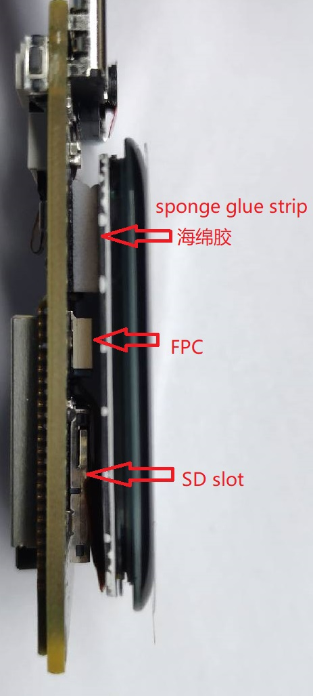

这里写一些使用相关的注意事项

## 拆卸屏幕

默认发货的板卡的摄像头和屏幕是同一方向的，有时候因为一些原因比如调整摄像头方向需要拆卸屏幕，这里写一下注意事项。

| 屏幕与摄像头同向                                              | 摄像头放在背部                                        |
| ------------------------------------------------------------- | ----------------------------------------------------- |
|  |  |

屏幕与板卡是通过泡沫胶粘在一起的，因此拆卸屏幕的时候需要撕开泡沫胶。这时需要注意应该对屏幕背板的金属层用力，而不是扣屏幕边缘。

<table>
    <tr>
        <td></td>
        <td></td>
        <td>旁边两张图可以看到 屏幕与板子是通过泡沫胶粘在一起的</td>
    </tr>
</table>
<table>
    <tr>
        <td></td>
        <td>中间为屏幕背板金属层， 旁边的黑色部分为屏幕边缘， 拆卸的时候后需要对屏幕背板金属层用力</td>
    </tr>
</table>
<table>
    <tr>
        <td></td>
        <td>打开面板后注意屏幕与板子的连接方式如左图所示， 不要连接反了</td>
    </tr>
</table>

## 更换摄像头方向

进行完前面的[拆卸屏幕](#拆卸屏幕)后期，可以将摄像头调整的前后方向了。
唯一要注意的就是在连接摄像头排线的时候别接反了。

<table>
    <tr>
        <td></td>
        <td>连接的时候注意将摄像头上的 1 与板子上的 1 对上就行</td>
    </tr>
</table>

