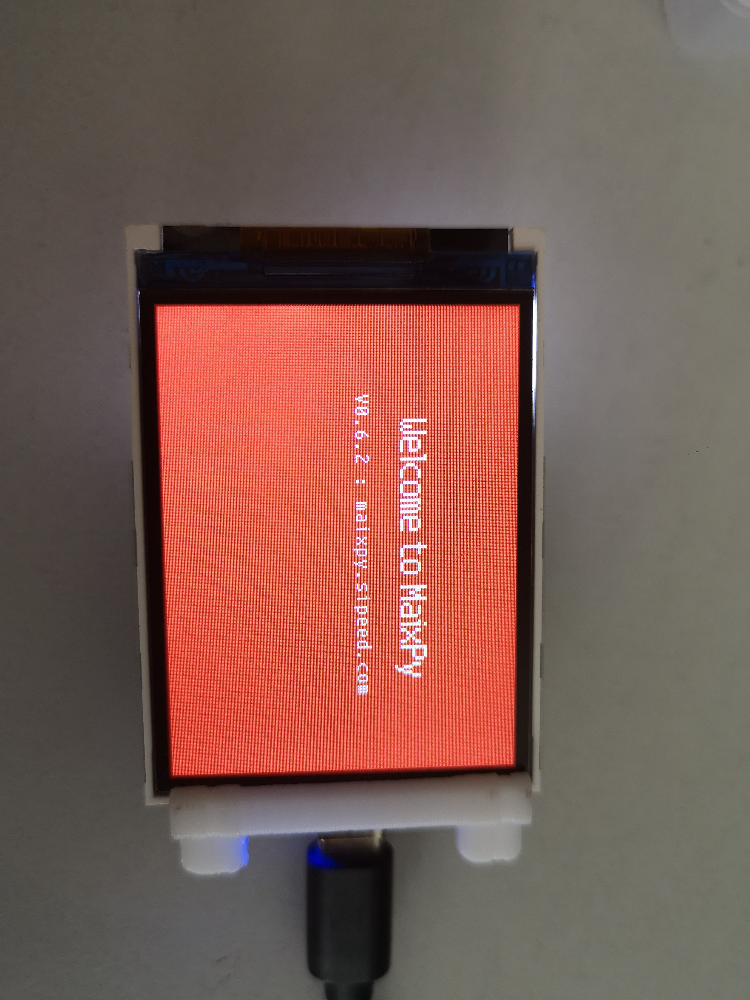

# Maix Dock
## 教程&快速上手
<a href="./../../../../soft/maixpy/zh/" target="_blank"> MaixPy </a>

## 描述
MAIX Dock开发板是SiPEED公司MAIX产品线的一员，基于嘉楠堪智科技的边缘智能计算芯片K210(RISC-V架构 64位双核)设计的一款AIOT开发板。开发板使用模块+底板方式设计，整洁小巧，板载Type-C接口和USB-UART电路，用户可以直接通过USB Type-C线连接电脑进行开发，配置128Mbit Flash、LCD、DVP、Micro SD卡等接口并把所有IO引出，方便用户扩展。
> 上电即可开机，不需要开机操作
> 

## 外观

## 参数

MaixDock 开发是以M1W AI模块作为核心单元，功能非常强大。模块内置64位双核处理器芯片，拥有8M的片上SRAM，在AI机器视觉、听觉性能方面表现突出，内置多种硬件加速单元（KPU、FPU、FFT等），总算力最高可达1TOPS，可以方便地实现各类应用场景的机器视觉/听觉算法，也可以进行语言方向扫描和语言数据输出的前置处理工作。

