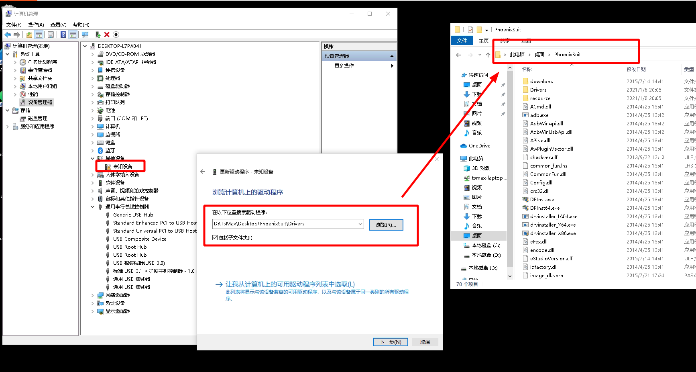

> ！！！一定要严格按照步骤操作！！！请使用大于 1G 的 TF/SD 卡进行烧录，开源版本要求使用 TF/SD 卡来启动系统。

V831 为全志的 SOC， 所以 Windwos 使用 **PhoenixSuit**, Linux 上使用 **Livesuit** 烧录镜像文件。

- 从下载站获取最新的 V831 系统镜像 [SDK_MaixII/release](http://dl.sipeed.com/shareURL/MAIX/SDK_MaixII/release) ，找不到就搜索 V831 获取最新的镜像。

- 解压 V831 镜像压缩包，得到一个 xxxx.img 文件。

- 从网上获取 PhoenixSuit(Windows) 烧录工具。
  - [baidu-PhoenixSuit](https://www.baidu.com/s?wd=PhoenixSuit)
  - [bing-PhoenixSuit](https://www.bing.com/search?q=PhoenixSuit&FORM=BESBTB&mkt=zh-CN) 
  - [github-PhoenixSuit](https://github.com/colorfulshark/PhoenixSuit)
  - [lo4d-PhoenixSuit](https://phoenixsuit.en.lo4d.com/windows)

## Windows 上使用 PhoenixSuit 烧录

解压 PhoenixSuit(Windows) 工具压缩包，不插入 SD 卡，将 V831 USB OTG 接口连接到 PC， 打开设备管理器， 安装驱动文件

打开烧录软件,  并浏览打开镜像文件

重新插拔板子（上电不插入 SD 卡），软件提示是否要清空烧录，提示是否需要升级，点击 `YES` 

插入 sd 卡，提示是否强制格式化，再次点击 `YES`开始烧录（大约 40S）

可能需要等待几秒才会更新状态，然后等待提示“固件升级成功”，即可断开 USB ，至此固件烧录完毕

