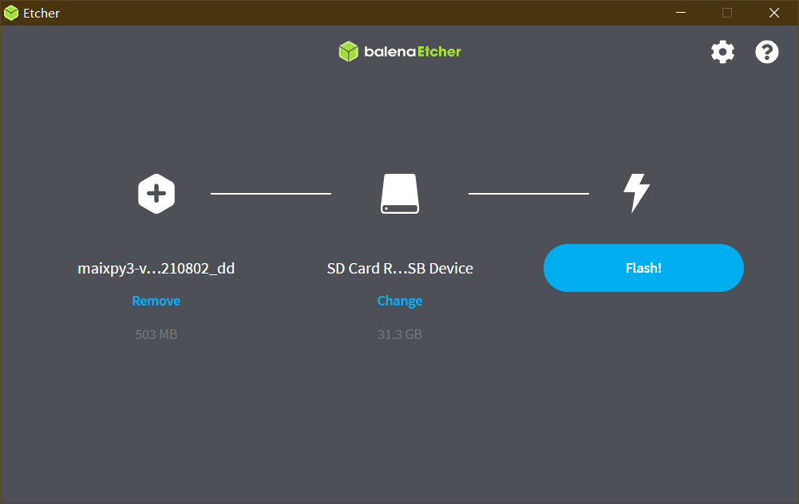

> ！！！一定要严格按照步骤操作！！！请使用大于 1G 的 TF/SD 卡进行烧录，开源版本要求使用 TF/SD 卡来启动系统。


## 获取镜像文件

从下载站获取最新的 V831 系统镜像 [SDK_MaixII/release](https://dl.sipeed.com/shareURL/MaixII/MaixII-Dock/SDK/release) ，找不到就搜索 V831 获取最新的镜像。得到一个压缩包，解压之后就得到一个 .img 文件，这个就是系统镜像文件

> dd烧录方式的镜像是可以不进行解压的，直接就可以使用。

> 如果下载站下载的很慢，建议使用百度网盘进行下载，下载站的下载带宽有限。链接：<https://pan.baidu.com/s/10qU9BUL8NE07ILexc5EZhw> 提取码：2333 

### 镜像文件命名方式

对于V831的镜像文件名字是有对应的规则，以后大家可以根据自己的需求来进行下载

就拿`maixpy3_0.3.4_V831_20211119.img.zip`这镜像文件来说

| 名称 | 含义 |
| --- | --- |
| maixpy3 | 内置 MaixPy3 |
| 0.3.4 | 内置 MaixPy3 0.3.4版本 |
| V831 | 支持 V831 芯片 |
| 20211119 | 镜像更新日期 |
| img | 不支持 dd 烧录版本|
| dd | 支持 dd 烧录版本 |


## Windows 上使用 PhoenixCard烧录镜像
PhoenixSuit和PhoenixCard是全志芯片常用的两种烧录工具，一个是USB烧录，另一个是sd卡烧录。对于需要烧录到flash中的，常用PhoenixSuit，而使用sd卡的在用PhoenixSuit需要安装USB驱动等一系列的麻烦操作，就可以使用PhoenixCard进行烧录。

> 使用的是没有带有 dd 后缀的镜像文件

### 获取烧录工具

PhoenixCard下载站连接：[下载站 - Sipeed](https://dl.sipeed.com/shareURL/MaixII/MaixII-Dock/SDK/tools)

系统镜像下载站连接：[下载站 - Sipeed](https://dl.sipeed.com/shareURL/MaixII/MaixII-Dock/SDK/release)

SD Card Formatter下载连接：[SD Card Formatter](https://www.sdcard.org/downloads/formatter/eula_windows/SDCardFormatterv5_WinEN.zip)

### 系统烧录

插入sd卡，打开SD Card Formatter


Refresh后点击Format后格式化，注意选中对应的sd卡；

打开PhoenixCard,固件处选择对应镜像包（下载镜像后需要先解压），然后刷新盘符，如果未找到可以尝试重新插拔下SD卡，勾选启动卡，点击烧卡。


大概30s后，烧录完成。


## Linux(Ubuntu) 使用 Livesuit 烧录

> 使用的是没有带有 dd 后缀的镜像文件

> [https://linux-sunxi.org/LiveSuit](https://linux-sunxi.org/LiveSuit)

> [ubuntu 安装 LiveSuit 刷机工具](https://www.codenong.com/cs105573875/)

> [https://github.com/QinYUN575/allwinner-livesuit.git](https://github.com/QinYUN575/allwinner-livesuit.git)

### 安装烧录工具 Livesuit 

> **每次更新系统 linux kernel 之后需要重新安装软件**

1. 安装依赖 dkms

```shell
sudo apt install dkms
```

1. 安装 libpng1.2（一定要使用这个版本）

```shell
wget http://archive.ubuntu.com/ubuntu/pool/main/libp/libpng/libpng_1.2.54.orig.tar.xz
tar xvf  libpng_1.2.54.orig.tar.xz
```

```shell
cd libpng-1.2.54
./autogen.sh
./configure
make -j8
sudo make install
```

更新链接库:

```shell
sudo ldconfig
```

1. 安装 **livesuit**

```shell
git clone --recursive https://github.com/QinYUN575/allwinner-livesuit.git
cd allwinner-livesuit
chmod +x livesuit_installer.run
sudo ./livesuit_installer.run
```


### 使用 Livesuit 烧录

`sudo livesuit` 打开烧录工具，并点击“固件”选择镜像文件


不插入 SD 卡，将 V831 USB OTG 接口连接到 PC, 提示是否格式化分区，这时候插入 SD 卡，之后点击 `YES`


等待烧录完成，提示“固件升级成功”，即可断开 USB ，至此固件烧录完毕


> 以上烧录方式适合在镜像文件较小的那个（非dd版本）

## Windows使用dd烧录

[下载dd镜像](https://dl.sipeed.com/shareURL/MaixII/MaixII-Dock/SDK/release)带有xx-dd文件即可

下载[Etcher](https://www.balena.io/etcher/ "Etcher")

下载[SD Card Formatter](https://www.sdcard.org/downloads/formatter/eula_windows/SDCardFormatterv5_WinEN.zip "SDCardFormatter")

首先使用SD Card Formatter[格式化](#-2)sd卡，然后打开软件，点击`Flash from file`,选中dd镜像包，然后点击Select target选中sd卡，最后点击Flash烧录。

 

烧录完毕后，即可放入M2 dock中运行。

### 分区扩容（dd）

使用dd镜像后，会有部分储存空间未被使用，这时候需要扩容分区进行使用。

linux下可以用fdisk或者GParted扩容，windows下可以尝试使用Diskgenus扩容（不推荐使用windows，可能会造成一些问题）

这里以fdisk示例，其他方法请自行摸索。

将sd卡插入电脑，执行`sudo fdisk -l`，查看sd卡分区位置，如下即为/dev/sdb；

```
/dev/sdb1   49152  49663     512  256K Microsoft basic data
/dev/sdb2   49664  61951   12288    6M Microsoft basic data
/dev/sdb3   61952 324095  262144  128M Microsoft basic data
/dev/sdb4  324096 487935  163840   80M Microsoft basic data
```

然后执行以下命令：

```
##使用fdisk更改/dev/sdb分区；
sudo fdisk /dev/sdb 

Welcome to fdisk (util-linux 2.36.1).
Changes will remain in memory only, until you decide to write them.
Be careful before using the write command.

##d删除分区，，一路回车即可；
Command (m for help): d
Partition number (1-5, default 5): 

Partition 5 has been deleted.
##创建分区，一路回车即可；
Command (m for help): n
Selected partition 5
First sector (487936-7744508, default 489472): 
Last sector, +/-sectors or +/-size{K,M,G,T,P} (489472-7744508, default 7744508): 

Created a new partition 5 of type 'Linux filesystem' and of size 3.5 GiB.

##专家模式
Command (m for help): x

##创建分区名称
Expert command (m for help): n
Partition number (1-5, default 5): 

New name: UDISK

Partition name changed from '' to 'UDISK'.

##保存分区；
Command (m for help): w
The partition table has been altered.
Calling ioctl() to re-read partition table.
Syncing disks.

```


插入M2dock，验证：

```
root@sipeed:/# fdisk -l
Found valid GPT with protective MBR; using GPT

Disk /dev/mmcblk0: 7626752 sectors, 3724M
Logical sector size: 512
Disk identifier (GUID): ab6f3888-569a-4926-9668-80941dcb40bc
Partition table holds up to 8 entries
First usable sector is 49152, last usable sector is 7626748

Number  Start (sector)    End (sector)  Size Name
     1           49152           49663  256K env
     2           49664           61951 6144K boot
     3           61952          717311  320M rootfs
     4          717312          881151 80.0M swap
     5          882688         7626748 3292M UDISK
```

 

## Linux(Ubuntu) 使用 dd镜像 烧录

[下载dd镜像](https://dl.sipeed.com/shareURL/MaixII/MaixII-Dock/SDK/release)带有xx-dd.img文件即可

使用dd命令之前，通过命令 `fdisk -l` 查看tf卡的名称


dd命令烧录

```base
dd if=sipedd-v8310-210606-dd.img of=/dev/sdd
```

出现为烧录成功

或者直接使用镜像恢复软件打开dd镜像文件

右键打开dd镜像，选择用其他应用程序打开，选择镜像恢复


点击开始恢复，即可烧录成功

## 无 sd/tf 卡烧录方式

[烧录方式](./no_sd_flash.md)


