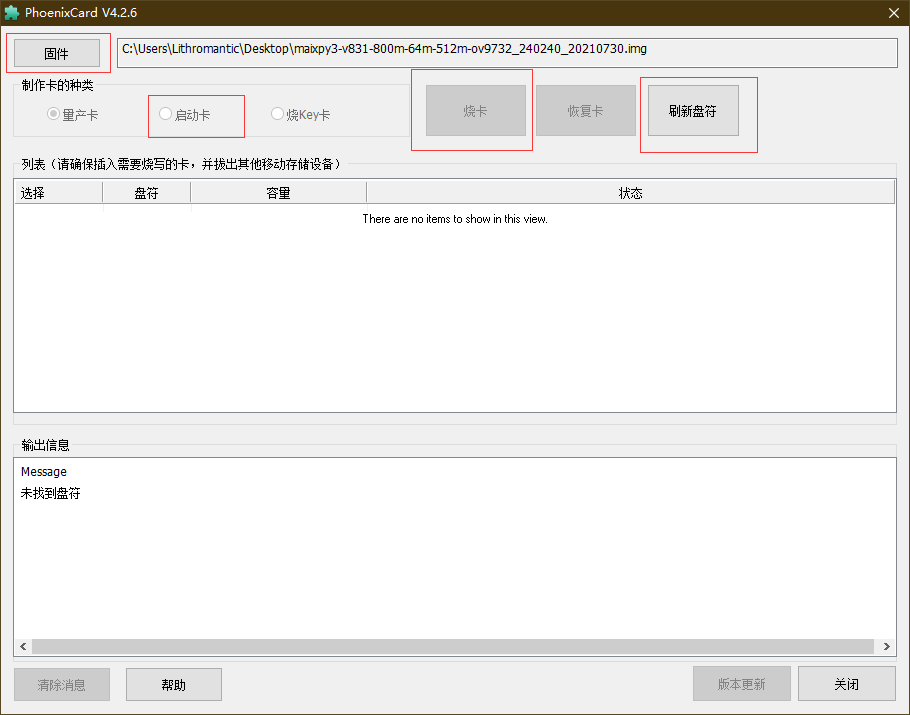
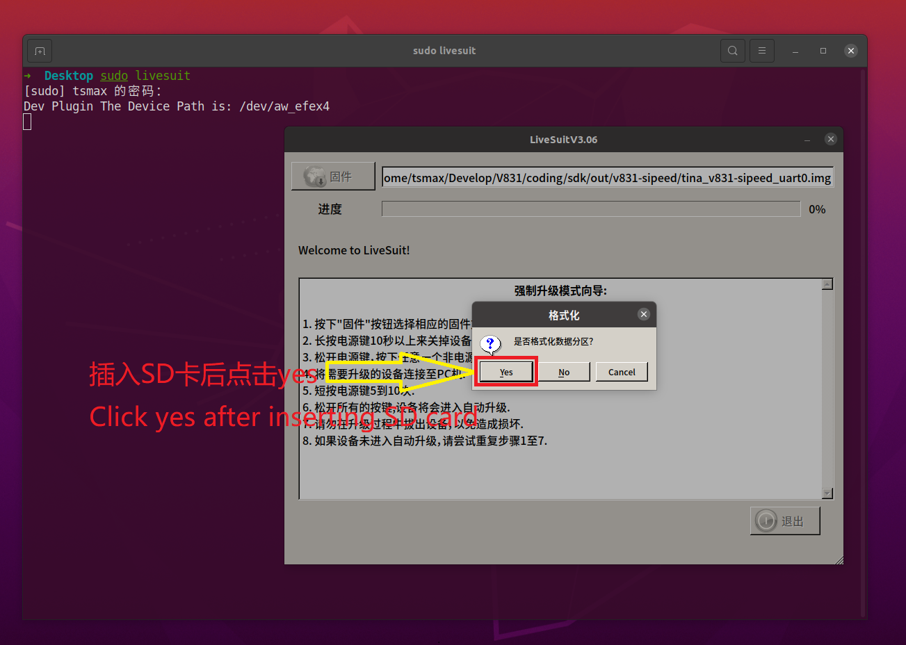
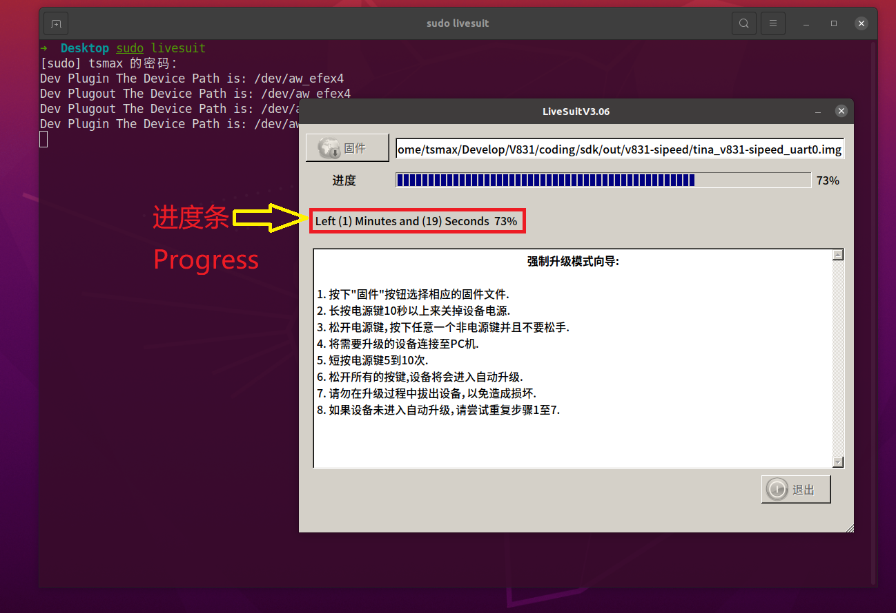
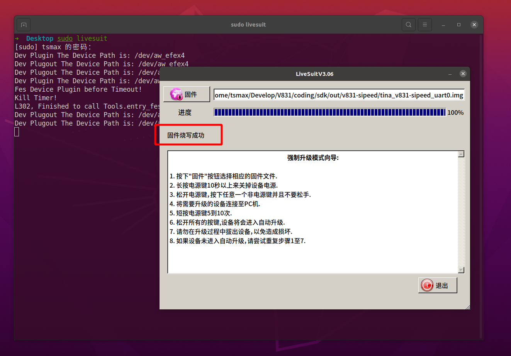

> 编辑时间2022.04.27

| 文档更新时间 |    负责人    |        更新内容        |
| :----------: | :----------: | :--------------------: |
|  2021.03.20  |    大老鼠    | 新建文档，开始编写内容 |
|  2021.12.8   | Rui & 点灯鼠 |   整理并更新烧录方式   |
|   2022.3.8   |     Rui      |   修改烧录的注意事项   |

注意事项！！！
- 1、非必要的情况下，请不要随意镜像烧录。
- 2、部分 AMD 平台的电脑存在无法烧录的情况
- 3、不能保证所有的卡都可以成功的烧录镜像，所以建议用户直接购买官方的镜像卡

## 获取镜像文件

从下载站获取最新的 V831 系统镜像 [SDK_MaixII/release](https://dl.sipeed.com/shareURL/MaixII/MaixII-Dock/SDK/release) ,得到一个压缩包，解压之后就得到一个 .img 文件，这个就是系统镜像文件

> 如果下载站下载的很慢，建议使用百度网盘进行下载，下载站的下载带宽有限。链接：[点我](https://eyun.baidu.com/s/3htTXfaG#sharelink/path=%2F%E4%B8%8B%E8%BD%BD%E7%AB%99%E6%96%87%E4%BB%B6%2FMaixII%2FMaixII-Dock%2FSDK%2Frelease&parent_path=%2F%E6%B7%B1%E5%9C%B3%E7%9F%BD%E9%80%9F%E7%A7%91%E6%8A%80%E6%9C%89%E9%99%90%E5%85%AC%E5%8F%B8)

### 镜像文件命名方式

对于 V831 的镜像文件名字是有对应的规则，以后大家可以根据自己的需求来进行下载

就拿`v831-m2dock-maixhub-0.5.1-20220701.zip`和 ` v831-m2dock-maixpy3-0.5.1-20220701.zip` 这两个镜像文件来说

| 名称          | 含义                                                                                                              |
| ------------- | ----------------------------------------------------------------------------------------------------------------- |
| maixpy3-0.5.1 | 此镜像是给 [MaixPy3](https://wiki.sipeed.com/maixpy3) 专用，并内置了`0.5.1`的版本，但其中 **无** 内置 maixhub app |
| maixhub-0.5.1 | 此镜像是给 [MaixPy3](https://wiki.sipeed.com/maixpy3) 专用，并内置了`0.5.1`的版本，但其中 内置 maixhub app        |
| m2dock        | 可使用 MaixII-Dock 开发板平台                                                                                     |
| 20220701      | 镜像更新日期                                                                                                      |

## Windows 上使用 PhoenixCard 烧录镜像

PhoenixSuit 和 PhoenixCard 是常用来烧录全志科技芯片的两种工具，前者通过 USB 烧录到 flash，后者常常用于烧录镜像到 TF 卡中。

### 准备工作

1. 烧录工具 [PhoenixCard](https://dl.sipeed.com/shareURL/MaixII/MaixII-Dock/SDK/tools)

2. 系统 [镜像](https://dl.sipeed.com/shareURL/MaixII/MaixII-Dock/SDK/release)

3. 内存卡格式化工具 [SD Card Formatter](https://www.sdcard.org/downloads/formatter/eula_windows/SDCardFormatterv5_WinEN.zip)

### 系统烧录

1. 将内存卡通过读卡器接到电脑的 USB 口，打开 SD Card Formatter 软件，对内存卡进行格式化。Refresh（刷新）后点击Format（格式化），注意应正确选择选目标SD卡。

     

2. 打开PhoenixCard
     - 选择 `启动卡` 选项
     - 选择正确的盘符
     - 点击 `烧卡`
     - 根据状态栏的颜色可以判断烧录结果：红色的话说明烧录失败了，建议使用[SD card Formatter](https://www.sdcard.org/downloads/formatter/eula_windows/SDCardFormatterv5_WinEN.zip)格式化后再重新烧录一次；绿色表示则一切正常。

   

## Linux(Ubuntu) 使用 Livesuit 烧录

### 安装烧录工具 Livesuit 

> **每次更新系统 linux kernel 之后需要重新安装软件**

1. 安装依赖 dkms

     ```shell
     sudo apt install dkms
     ```

1. 安装 libpng1.2（一定要使用这个版本）

     ```shell
     wget http://archive.ubuntu.com/ubuntu/pool/main/libp/libpng/libpng_1.2.54.orig.tar.xz
     tar xvf  libpng_1.2.54.orig.tar.xz
     ```

     ```shell
     cd libpng-1.2.54
     ./autogen.sh
     ./configure
     make -j8
     sudo make install
     ```

     更新链接库:

     ```shell
     sudo ldconfig
     ```

1. 安装 **livesuit**

     ```shell
     git clone --recursive https://github.com/QinYUN575/allwinner-livesuit.git
     cd allwinner-livesuit
     chmod +x livesuit_installer.run
     sudo ./livesuit_installer.run
     ```
### 使用 Livesuit 烧录

`sudo livesuit` 打开烧录工具，并点击“固件”选择镜像文件


不插入 SD 卡，将 V831 USB OTG 接口连接到 PC, 提示是否格式化分区，这时候插入 SD 卡，之后点击 `YES`



等待烧录完成，提示“固件升级成功”，即可断开 USB ，至此固件烧录完毕






## 附录
### 烧录系统到 flash 中

[烧录方式](./no_sd_flash.md)

### 无读卡器烧录方式

[烧录方式](./PhoenixSuit.md)

### 使用 dd 烧录

官方没有做 MaixII-Dock 的 dd 镜像相关支持，有需要的可以自行去学习如何制作 dd 镜像的[制作](https://www.cnblogs.com/USTHzhanglu/p/15431249.html)。