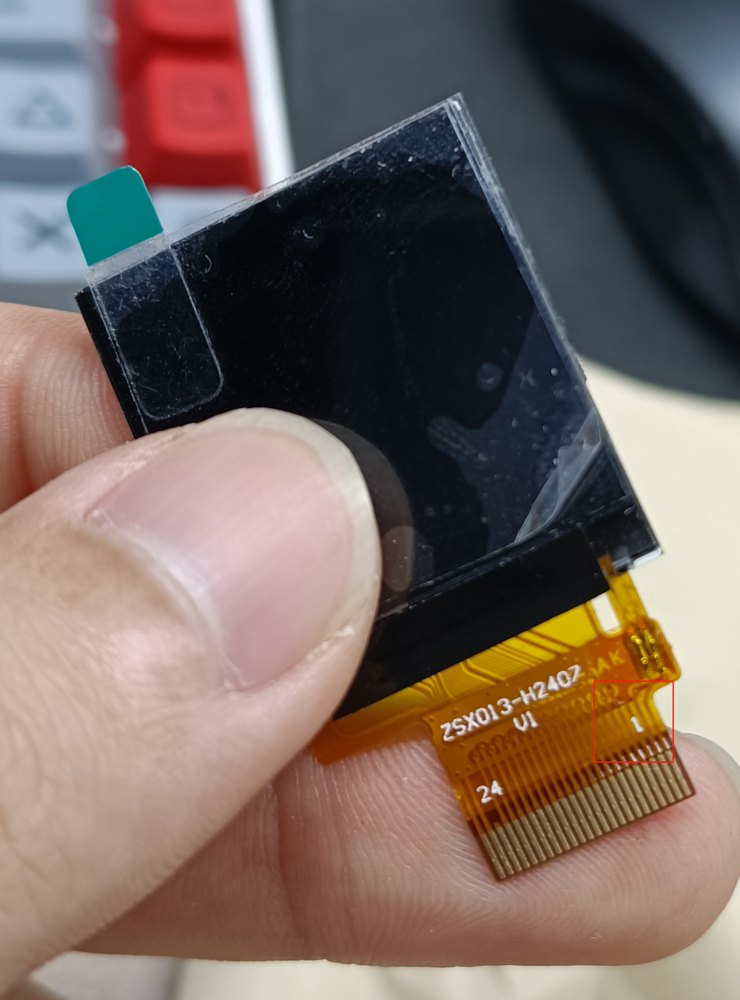
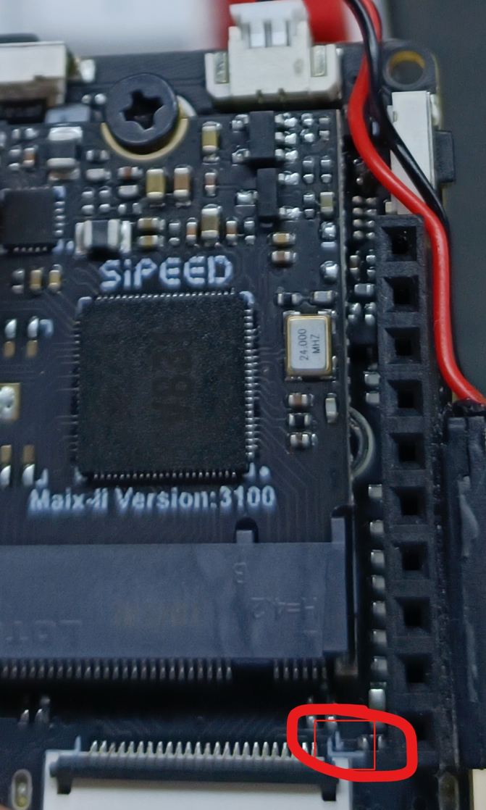
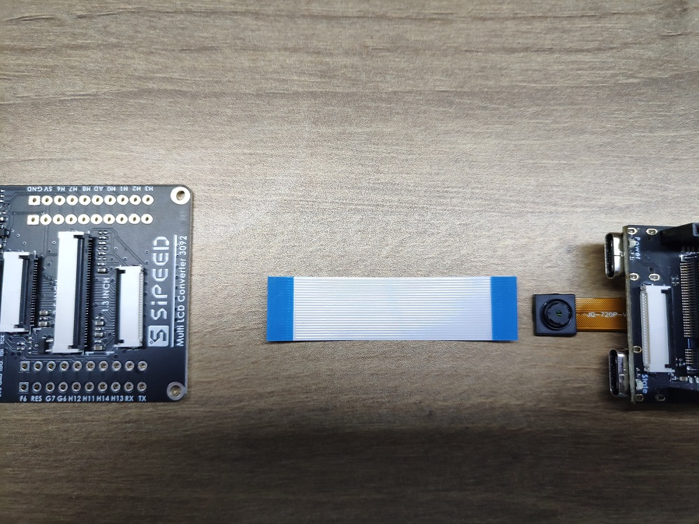
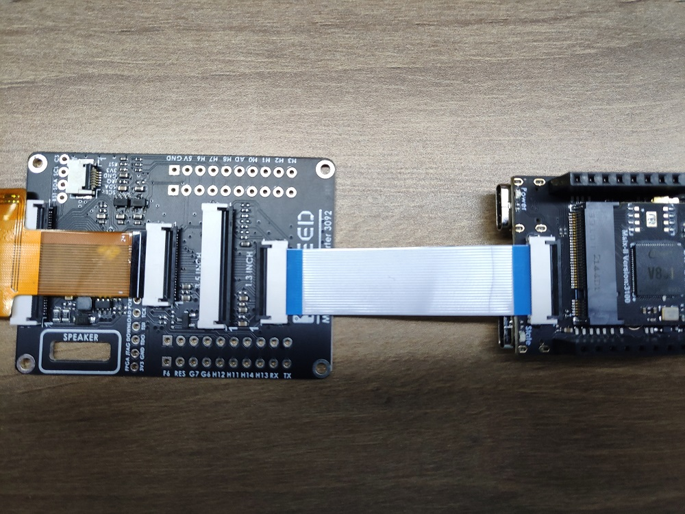

- 这个讲述 V831 开发板的一些额外使用事项和相关方法

## 切换屏幕

目前开发板支持的屏幕有 1.3寸、2.4寸、2.8寸的 spi 屏，且只是支持在[我们淘宝](https://sipeed.taobao.com/)上售卖的显示屏；对于别的屏幕有需求的，可以走商务通道进行定制。

### 准备

- 需要切换的屏幕和对应的转接板
- 开发板
- 系统镜像是 20220523 日期之后的

### 屏幕连接

开发板可以直接与1.3寸屏幕连接，但是与2.4寸或2.8寸屏幕链接的话需要使用转接板

转接板上的接口一个 1 的标识符，是来确保不被反插的。屏幕排线上的 1 要和转接板、开发板的上 1 相位置对应。

屏幕标识的 1 如下所示

<html>
<div class="imbox">
    
    
<style>
.imbox{
     display:flex;
     flex-direction: row;
     }
</style>
</div>
</html>

转接板上面的 1 如下所示


板子上的 1 如下所示



具体接线参考下面两张图

<html>
    
    
</html>

### 切换设备树

- update_dtb 程序是给 Allwinner tina linux 专门写的应用。
- 编译好的设备树文件，可以在[下载站](https://dl.sipeed.com/shareURL/MaixII/MaixII-Dock/SDK/Toolchain)中进行下载

将设备树文件存放到开发板中在电脑中显示的虚拟U盘中。接着在adb终端里面执行下面命令

```bash
sync  #刷新一下目录
update_dtb /dev/mmcblk0 /root/sipeed_240x240_vs3205.dtb
```

即可切换设备树。该设备树文件是通过内核编译出来的，不推荐个人用户自行编译。设备树文件命名规则如下：

| 文件名字 | 可用屏幕 | 可用摄像头 |
| :----: | :----: | :---: |
| sipeed_240x240_vs3205.dtb | 1.3寸 | vs3205 |
| sipeed_240x240_sp2305.dtb | 1.3寸 | sp2305 |
| sipeed_240x320_vs3205.dtb | 2.4寸和2.8寸 |vs3205 |
| sipeed_240x320_sp2305.dtb | 2.4寸和2.8寸 |sp2305 |

- 如果发现屏幕显示效果不对 说明选错了对应的设备树文件。重新弄一下即可

这里贴一张正常显示的图样


## 更换摄像头

目前 MaixII-Dock 开发板目前支持的摄像头有 sp2305 和 vs3205 （只支持官方店上再售卖的这两款摄像头，有别的摄像头需求可以进行商务定制），摄像头之间的切换同样时需要更换设备树文件，更换方式上面的更换屏幕一样的。

> **注意的是要摄像头的接法，不要把摄像头给接反了，摄像头的底板上有一个白点，开发板卡上也有一个白点，这两个白点要在同一边。如果接反了，摄像头烧毁了请自行再买一个吧**

### 准备

- 需要切换的摄像头模块
- 开发板
- 编译好的设备树文件，可以在[下载站](https://dl.sipeed.com/shareURL/MaixII/MaixII-Dock/SDK/Toolchain)中进行下载
- 系统镜像是 20220523 日期之后的

### 切换设备树

> update_dtb 程序是给 allwiner tina linux 专门写的小工具。

将设备树文件存放到开发板中在电脑中显示的虚拟U盘中。接着在adb终端里面执行下面命令

```bash
sync  #刷新一下目录
update_dtb /dev/mmcblk0 /root/sipeed_240x240_vs3205.dtb
```

即可切换设备树，该设备树文件是通过内核编译出来的，不推荐个人用户自行编译

| 文件名字 | 可用屏幕 | 可用摄像头 |
| :----: | :----: | :---: |
| sipeed_240x240_vs3205.dtb | 1.3寸 | vs3205 |
| sipeed_240x240_sp2305.dtb | 1.3寸 | sp2305 |
| sipeed_240x320_vs3205.dtb | 2.4寸和2.8寸 |vs3205 |
| sipeed_240x320_sp2305.dtb | 2.4寸和2.8寸 |sp2305 |