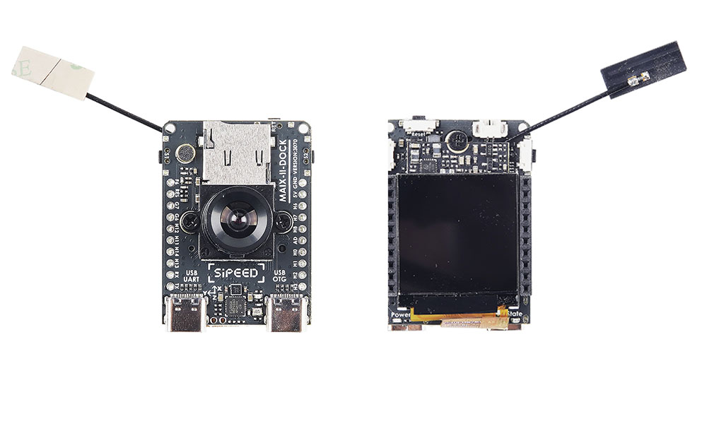

Maix-II-Dock 定位于高性价比的 AIOT 开发板， 支持常规 Linux 开发的同时， 有特有的 **AI 硬件加速** 特性，配合 Sipeed 提供的完整的软件生态，让你快速实现你的边缘 AI 应用。

* **硬件**上， 基于全志 V831 芯片， 以【核心板】+【底板】的形式组成开发板，可以直接使用开发板，也可以只使用核心板根据需求自行设计底板，方便快速完成开发。
* **软件**上， 除了可以直接使用全志提供的资料进行开发（部分可能需要找全志获取）外，Sipeed 提供了非常方便的 Python SDK（[MaixPy3](/maixpy3)）以及 C SDK （[libmaix](https://github.com/sipeed/libmaix)）；
更是提供了在线模型训练服务（[MaixHub](https://maixhub.com)），方便刚入门也能快速训练能使用的 AI 模型。
* **购买**：[sipeed.taobao.com](https://item.taobao.com/item.htm?id=635874427363)

    <iframe src="//player.bilibili.com/player.html?aid=298543445&bvid=BV1sF411u7xb&cid=586467021&page=1" scrolling="no" border="0" frameborder="no" framespacing="0" allowfullscreen="true"> </iframe>

## M2 核心板

> 核心板硬件资料下载 [Sipeed_Maix_II_3101](https://api.dl.sipeed.com/shareURL/MaixII/MaixII-Dock/HDK/Sipeed_MaixII_V831/Sipeed_Maix_II_3101)

### V831 芯片介绍

全志 V831, 单核 Cortex-A7 800MHz， 64MiB 片内 DDR2 内存， 高性价比能跑 Linux 的SOC，同时支持硬件 AI 加速（0.2Tops 算力），可以当成普通 Linux SOC 使用， 也可以用于边缘 AI 应用， 更详细的参数请看手册和下文。

芯片手册： [V833／V831 Datasheet V1.0.pdf](https://linux-sunxi.org/images/b/b9/V833%EF%BC%8FV831_Datasheet_V1.0.pdf)

内部结构图：

### M2核心板参数

与 Maix-I 对比

| 项目                         | Maix-I (K210)                        | Maix-II (V831)                                                                 |
| ---------------------------- | ------------------------------------ | ------------------------------------------------------------------------------ |
| 主控芯片  CPU             | 400~600Mhz                           | 800~1000Mhz                                                                    |
| 视频编码器  Video encoder | None                                 | H.264, up to 1080p@30fps H265, up to 1080p@30fps JPEG, up to 1080p@30fps |
| AI加速器 NPU              | 0.23TOPS support Conv+BN+ACT+POOL | 0.2TOPS support Conv,Inner_Product,Pool,Eltwise,ACT,BN,Split,Concat         |
| 内存 Memory               | 8MB SRAM                             | SIP 64MB DDR2                                                                  |
| 存储 Storage              | 16MB SPI Nor Flash                   | 可选的16M flash(默认空贴)                                                      |
| 摄像头 Camera             | DVP, 最高输入30W像素                 | 2lane MIPI, 最高支持1080P@60fps                                                |
| 显示 Display              | 8bit MCU LCD                         | 8bit MCU LCD, 配转接板可接最大10寸RGB LCD                                      |
| SDIO                         | None                                 | SMHC x2 (SDC0, SDC1)                                                           |
| SPI                          | SPIx3                                | SPI x2 (SPI0, SPI1)                                                            |
| I2C                          | I2C x3                               | I2C x4 (TWI0, TWI1, TWI2, TWI3)                                                |
| I2S                          | 8bit I2S                             | I2S x1 (I2S0)                                                                  |
| Ethernet                     | None                                 | 10/100 Mbit/s Ethernet port with RMII interface                                |
| ADC                          | None                                 | 1-ch 6bit LRADC for key                                                        |
| Audio                        | None                                 | LINEOUTP + MICIN1P/N                                                           |
| 开发软件                     | Maixpy/C                             | MaixPy3/linux                                                                  |

## 底板

一般情况下可以认为底板屏幕为正面，带摄像头为背面。

> 底板硬件资料下载 [点我跳转](https://api.dl.sipeed.com/shareURL/MaixII/MaixII-Dock/HDK/Sipeed_MaixII_Dock_V831)
> 感谢热心网友分享的 [ M2 模块底板母座 PCB 封装](https://bbs.elecfans.com/jishu_2036119_1_1.html)

### 底板硬件参数

| 标号 | Maix II 部件            | 功能                                       | 备注                                         |
| ---- | ----------------------- | ------------------------------------------ | -------------------------------------------- |
| 1    | M.2 B-KEY 母座*1        | 用于连接 V831 核心版                       | 出厂已连接                                   |
| 2    | 核心板M2 铜柱螺母*1     | 用于配合 M2 螺丝固定 V831 核心板           | 出厂已固定                                   |
| 3    | 电源指示 LED 灯*1       | 用于指示底板是否正常通电                   | ---                                          |
| 4    | 状态指示 LED灯*1        | 用户可编程LED灯，一般用于状态指示          | ---                                          |
| 5    | CPU 复位键*1            | 按下可重启 V831 芯片                       | ---                                          |
| 6    | 用户按键*2              | 可以控制两路 IO 电平，自定义功能           | ---                                          |
| 7    | Wi-Fi 模块*1            | 型号 RTL8189FTV，用于给模组提供 Wi-Fi 功能 | SDIO 接口                                    |
| 8    | BTB 摄像头接口*1        | 用于连接 BTB 摄像头模块                    | 出厂已连接                                   |
| 9    | 摄像头 M2 铜柱螺母*2    | 用于固定 BTB 摄像头                        | 出厂已固定                                   |
| 10   | FHD 摄像头*1            | 默认SP2305 Sensor BTB形式，1080P           | 默认含6mm焦距M12镜头，用户可选配其他焦距镜头 |
| 11   | USB 转 UART 芯片*1      | 提供串口通信功能                           | 出厂已烧录固件                               |
| 12   | Type-C 接口(USB OTG) *1 | 用于 V831 的 USB OTG功能                   | 可用于模组供电                               |
| 13   | Type-C 接口(UART) *1    | 用于对V831通常的串口调试                   | 可用于模组供电                               |
| 14   | 三轴加速度传感器*1      | I2C接口，可提供3轴的加速度数据             | ---                                          |
| 15   | microSD 卡槽*1          | 用于外接 microSD卡                         | 模组的系统默认从SD卡引导                     |
| 16   | LCD 接口*1              | FPC0.5mm 24Pin，MCU 接口                   | ---                                          |
| 17   | IPS 高清屏幕\*1         | 1.3寸IPS屏幕，分辨率240\*240               | 出厂已连接                                   |
| 18   | IPEX Wi-Fi天线座        | IPEX(一代) Wi-Fi天线                       | ---                                          |
| 19   | 外拓排母                | 引出 V831 的 通用IO口，可用于连接外设      | ---                                          |
| 20   | 扬声器接口*1            | MX1.25 2P接口（间距1.25mm）                | ---                                          |
| 21   | 扬声器*1                | 8Ω1W 1609复合铝膜扬声器                    | 出厂已连接                                   |
| 22   | 麦克风*1                | 模拟驻极体麦克风                           | ---                                          |

## 资源汇总

硬件: [MaixII 硬件资料库](https://api.dl.sipeed.com/shareURL/MaixII/MaixII-Dock/HDK)

软件：
* Python SDK： [MaixPy3 软件文档](/maixpy3)
* C SDK: [libmiax](https://github.com/sipeed/libmaix)
* MaixHub 模型平台（AI 模型下载、在线训练、项目分享）： [MaixHub](https://maixhub.com)
* 全志 tina-V83x SDK： [Tina-Linux/tina-V83x](https://github.com/Tina-Linux/tina-V83x)
* 工具链： [dl.sipeed.com](https://dl.sipeed.com/shareURL/MaixII/MaixII-Dock/SDK/Toolchain) 或者 [github](https://github.com/sipeed/libmaix/releases/download/v0.1.0/toolchain-sunxi-musl-pack-2021-01-09.tar.xz)

## Maix-II-Dock 上手开发路线指南

* 因为需要使用 linux 系统（tina-linx）， 所以需要先学习烧录系统镜像，就类似学会电脑重装系统一样，这样在遇到问题就可以重来，在左侧目录找到“烧录系统”文章查看
<!-- 这里不给烧录系统的链接，让用户学会查看左边目录 -->
* 学会基础的 Linux 操作，比如如何打开终端，基础的终端命令，以及如何传输文件到开发板等，比如 串口使用， adb 使用等等基础操作
* 选择开发语言：
  * 如果你熟悉 C 有一定的开发经验，可以选择使用[libmaix](https://github.com/sipeed/libmaix)
  * 如果你希望快速上手，并使用 Python 语言开发， 请使用[MaixPy3](/maixpy3)，仔细阅读其文档即可
* 如果需要使用 AI 功能，可以搭配 [MaixHub](https://maixhub.com) 在线训练平台使用，平台提供了 AI 模型或者项目分享功能，节约大家不少时间。