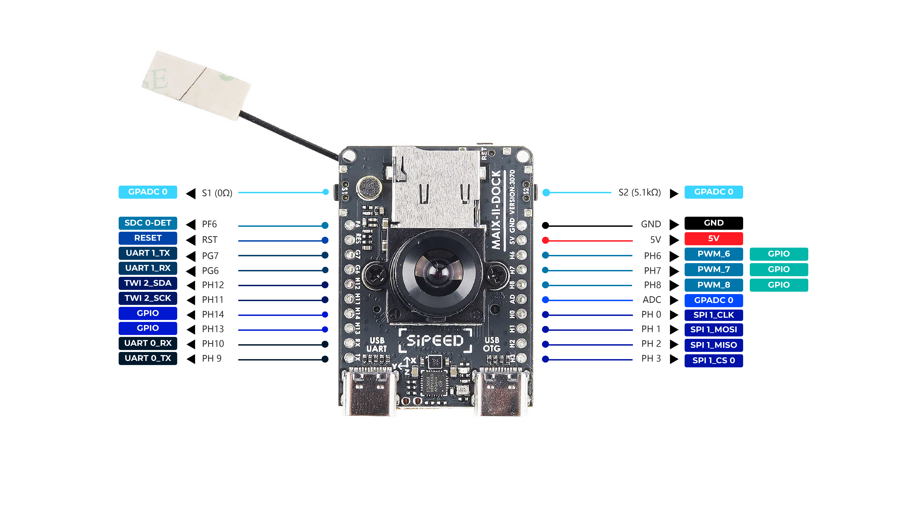

MaixII M2dock 是基于 V831 芯片设计的一款【板卡】+【底板】的开发板产品。

> 这个不是Maix Dock的升级版，这两款开发板是完全不一样的开发环境和使用方式的，不要有惯性思维

## M2板卡

细节请看[淘宝商品介绍](https://item.taobao.com/item.htm?id=635874427363)，可同步最新讯息。

> 板卡参考资料下载 [MaixII_V831_v3100](https://api.dl.sipeed.com/shareURL/MaixII/MaixII-Dock/HDK/Sipeed_MaixII_V831/MaixII_V831_v3100)

### V831 芯片介绍

从 2019 年至今的时间，可以开始看到几个相机 SoC 与一个内置的转专业或 SIMD 指令加快人脸检测、物体检测等等，从低分辨率 Kendryte K210 处理器 2.5 k Ingenic T31 MIPS 视频处理器，甚至 4k 能力 iCatch V37 相机 SoC 。 Allwinner 过去推出了几个摄像头处理器(V3， V316， S3…)，但没有一个包含 NPU (又名 AI 加速器)。现在这已经改变了，Allwinner V831 Cortex-A7 全高清摄像头 SoC 还包括一个小的 200 GOPS NPU 。

> 取自 [allwinner-v831-ai-full-hd-camera-soc-powers-sochip-v831-development-board](https://www.cnx-software.com/2020/04/28/allwinner-v831-ai-full-hd-camera-soc-powers-sochip-v831-development-board/)

[V833／V831 Datasheet V1.0.pdf](https://linux-sunxi.org/images/b/b9/V833%EF%BC%8FV831_Datasheet_V1.0.pdf)

### 资源

| 项目 | MAIX-I (K210) | MAIX-II (V831) |
| --- | --- | --- |
| 主控芯片  CPU | 400~600Mhz  | 800~1000Mhz (优势项目标红，下同)  |
| 视频编码器  Video encoder | None | H.264, up to 1080p@30fps H265, up to 1080p@30fps JPEG, up to 1080p@30fps |
| AI加速器 NPU | 0.23TOPS support Conv+BN+ACT+POOL | 0.2TOPS support Conv,Inner_Product,Pool,Eltwise,ACT,BN,Split,Concat |
| 内存 Memory | 8MB SRAM | SIP 64MB DDR2 |
| 存储 Storage | 16MB SPI Nor Flash | 可选的16M flash(默认空贴)  |
| 摄像头 Camera | DVP, 最高输入30W像素 | 2lane MIPI, 最高支持1080P@60fps |
| 显示 Display | 8bit MCU LCD | 8bit MCU LCD, 配转接板可接最大10寸RGB LCD |
| SDIO | None |SMHC x2 (SDC0, SDC1) |
| SPI | SPIx3 |SPI x2 (SPI0, SPI1) |
| I2C | I2C x3 | I2C x4 (TWI0, TWI1, TWI2, TWI3) |
| I2S | 8bit I2S| I2S x1 (I2S0) |
| Ethernet | None | 10/100 Mbit/s Ethernet port with RMII interface |
| ADC | None | 1-ch 6bit LRADC for key |
| Audio | None | LINEOUTP + MICIN1P/N |
| 开发环境 | Maixpy/C | Maixpy3/linux |

## 底板

一般情况下可以认为底板屏幕为正面，带摄像头为背面。

> 感谢热心网友分享的 [ M2 模块底板母座 PCB 封装](https://bbs.elecfans.com/jishu_2036119_1_1.html)
> 底板参考资料下载 [MaixII_V831_v3100](https://api.dl.sipeed.com/shareURL/MaixII/MaixII-Dock/HDK/Sipeed_MaixII_V831/MaixII_V831_v3100)

### 资源

| 标号 | Maix II 部件 | 功能 | 备注 |
| ---|--- | --- | --- |
| 1|M.2 B-KEY 母座*1 | 用于连接 V831 核心版 | 出厂已连接 |
| 2|核心板M2 铜柱螺母*1 | 用于配合 M2 螺丝固定 V831 核心板 | 出厂已固定 |
| 3|电源指示 LED 灯*1 | 用于指示底板是否正常通电 | --- |
| 4|状态指示 LED灯*1 | 用户可编程LED灯，一般用于状态指示 | --- |
| 5|CPU 复位键*1 | 按下可重启 V831 芯片 | --- |
| 6|用户按键*2 | 可以控制两路 IO 电平，自定义功能 | --- |
| 7|Wi-Fi 模块*1 | 型号 RTL8189FTV，用于给模组提供 Wi-Fi 功能 | SDIO 接口 |
| 8|BTB 摄像头接口*1 | 用于连接 BTB 摄像头模块 | 出厂已连接 |
| 9|摄像头 M2 铜柱螺母*2 | 用于固定 BTB 摄像头 | 出厂已固定 |
| 10|FHD 摄像头*1 | 默认SP2305 Sensor BTB形式，1080P | 默认含6mm焦距M12镜头，用户可选配其他焦距镜头 |
| 11|USB 转 UART 芯片*1 |型号 GD32F150G8 供串口调试使用 | 出厂已烧录固件 |
| 12|Type-C 接口(USB OTG) *1 | 用于 V831 的 USB OTG功能 | 可用于模组供电 |
| 13|Type-C 接口(UART) *1 | 用于对V831通常的串口调试 | 可用于模组供电 |
| 14|三轴加速度传感器*1 | I2C接口，可提供3轴的加速度数据 | --- |
| 15|microSD 卡槽*1 | 用于外接 microSD卡 | 模组的系统默认从SD卡引导 |
| 16|LCD 接口*1 | FPC0.5mm 24Pin，MCU 接口 | --- |
| 17|IPS 高清屏幕*1 | 1.3寸IPS屏幕，分辨率240*240 | 出厂已连接 |
| 18|IPEX Wi-Fi天线座| IPEX(一代) Wi-Fi天线 | --- |
| 19|外拓排母 | 引出 V831 的 通用IO口，可用于连接外设 | --- |
| 20|扬声器接口*1 | MX1.25 2P接口（间距1.25mm） | --- |
| 21|扬声器*1 | 8Ω1W 1609复合铝膜扬声器  | 出厂已连接 |
| 22|麦克风*1| 模拟驻极体麦克风 | --- |

## 屏幕转接板

已上架，请到淘宝上[购买](https://item.taobao.com/item.htm?spm=a1z10.5-c-s.w4002-21410578033.11.53793c62PXvb9N&id=635874427363)

### 资源

[MaixII_V831_v3100资料库](https://api.dl.sipeed.com/shareURL/MaixII/MaixII-Dock/HDK/Sipeed_MaixII_V831/MaixII_V831_v3100)
