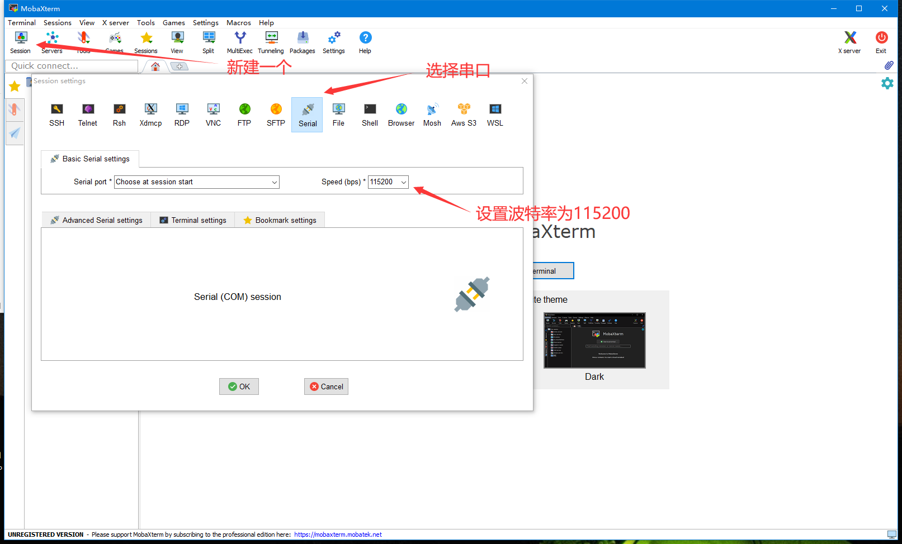
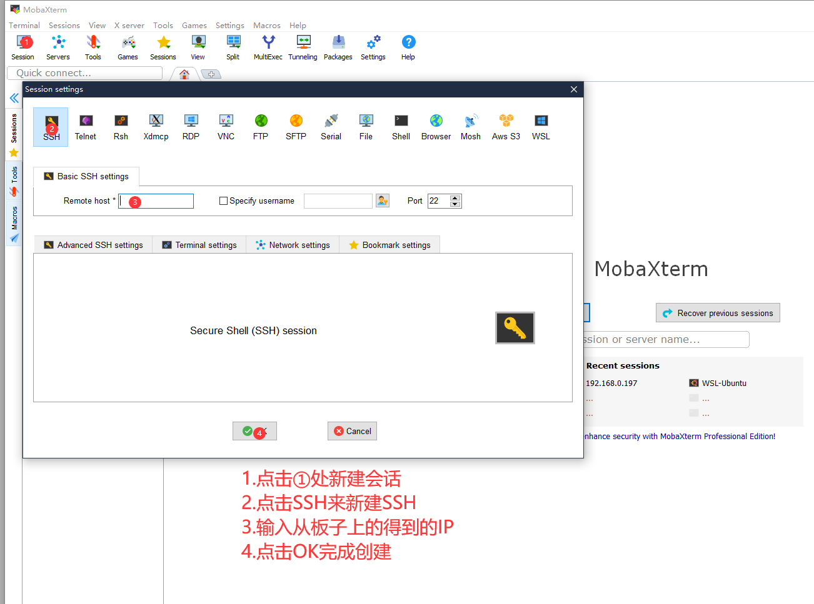

## mobaxterm 是什么？

这是在 Windows 下使用的全能终端管理软件，对开发与运维人员必备，可以在 [mobaxterm.mobatek.net/download](https://mobaxterm.mobatek.net/download.html) 获取免费版本使用，在国内网站上有中文版。


主要通过它提供的下列功能：

- serial 通过串口连接 Linux 系统的终端
- ssh 远程登录 Linux 系统的终端
- ftp 远程访问文件服务上的资源

## 连接 串口(Serial)

开源硬件产品大多都会预留串口（Serial）用作 Linux 系统的终端交互接口，下面介绍串口【session】的创建。



在「session setting」 对话框里选择【serial】，再选好串口号及波特率，点击【OK】就完成连接了。


同样【session】会保存在左侧的【session】标签页里，方便下次连接。

## 连接 SSH

除了有线串口的方式，还可以通过无线访问 SSH 登录 Linux 系统。

在板子终端输入 `hostname -I` 查看自己 ip 地址 (先连上网)，然后输入自己用户名和密码。

```bash
root@maixsense:~# hostname -I
192.168.0.197
```

然后我们就可以来新建SSH会话然后远程登录到板子了

- 新建SSH会话



- 登录到板子终端


> 输入密码的时候是看不到的（没有输入显示），在输入结束之后，按回车即可

就可以看到 Linux 的登录会话终端了。

传输文件的时候可以直接把文件拖入或者拉出下图的左红框中。


## 连接 FTP

与 SSH 同理。


进入后就可以看到文件夹了。


可以拖拽文件上传和下载。


<a href="#" onClick="javascript :history.back(-1);">返回上一页(Back)</a>