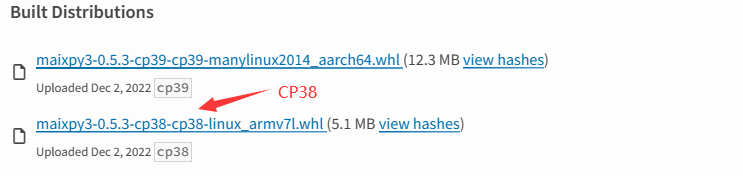

> 没有 Linux 系统使用基础的同学，不推荐以下的使用方式

阅读 [MaixII-Dock Maixpy3](https://wiki.sipeed.com/soft/maixpy3/zh/tools/0.MaixII-Dock.html) 来查看更多用法

## 认识 openwrt 系统

> 全志 V831 使用 Tina Linux 系统，移植自 [OpenWrt](https://openwrt.org) 。

OpenWrt 可以被描述为一个嵌入式的 Linux 发行版，详情可看 [官方网址](https://openwrt.org) 和 [官方开源仓库](https://github.com/openwrt/openwrt)。

OpenWRT 是一个高度模块化、高度自动化的嵌入式 Linux 系统，拥有强大的网络组件和扩展性，常常被用于工控设备、电话、小型机器人、智能家居、路由器以及 VOIP 设备中。 同时，它还提供了 100 多个已编译好的软件，而且数量还在不断增加，而 OpenWrt SDK 更简化了开发软件的工序。

V831 tina 系统支持使用 adb 来操作系统。需要将主机于板子的OTG标识的接口相连。

---
- Windows 系统需要先下载最新的 adb 然后将其解压并添加到系统路径，接着就可以在命令行中使用 adb shell 连接上 v831.
- 对于 linux 直接安装 adb 即可，然后在终端执行 adb shell 连接 V831
---

## M2Dock 联网

M2Dock 带有 2.4G 无线模组，可以用来连接 2.4G 频段的无线网络。

因为镜像更新会更改部分内容，所以下面以 V0.5.4 版本的系统镜像和 V0.5.4 之前的镜像来分别说明怎么样来使用 M2Dock 连接到无线网络。

### V0.5.4

在 0.5.4 (时间戳为 20230207 )的镜像中，移除了之前编辑配置文件然后再连接网络的方法，改为用命令行来连接无线网络。

可以看到板子中内置了许多 wifi 相关的命令


这里只使用 `wifi_connect_ap_test` 命令来连接无线网络，在使用之前可以先直接执行 `wifi_scan_results_test` 命令来扫描周围网络，确定板子可以识别到目标无线网络。

使用下面的命令来连接名称为 `Sipeed_Guest`， 且密码为 `qwert123` 的无线网络。

```bash
wifi_connect_ap_test Sipeed_Guest qwert123
```


在连接的信息中可以看到 `192.168.3.158` 这串数字，这是板子在当前网络环境中的 IP 地址。

执行 `ifconfig` 命令可以看到 wlan0 的 IP 地址为 `192.168.3.158`，与连接 WiFi 时候的信息一样。


### V0.5.4 之前的镜像

开发板上的 OTG 接口与电脑连接之后，就会在资源管理器中得到一个 U 盘 设备。通过编辑器打开里面名为 `wpa_supplicant.conf` 文件


可以看到里面有 `yourWIFIname` 和 `yourWIFIpassword` 两项，将他们更改成你想要连接的无线网络和对应的无线网络密码并保存后，使用电脑系统自带的弹出 U 盘操作方式来移除 U 盘，这样可以避免损坏 U 盘的文件系统。接着在 m2dock 命令行终端执行 `reboot` 命令来重启板卡，开机后就自动连接 WiFi 了。


### 如何更新 MaixPy3 包

可以手动下载最新的 MaixPy3 [安装包](https://pypi.org/project/maixpy3/#history)



下载带有 cp8 的安装包，cp9 是给别的平台使用的。将这个安装的名字修改成 `maixpy3-9.9.9-cp38-cp38-linux_armv7l.whl`,直接存放到开发板中，重启开发板就会自动更新和安装 MaixPy3。


更新前请关闭 IDE 或不接 OTG 口，防止有其他操作影响系统的软件更新，在放入 U 盘后，断电开机会看到如下画面，如果超过 3 分钟画面没有变化，那可能就是失败了，就请重烧系统吧。（2022 年 1 月 14 日至今还没出现过失败样本）

### 更多连接方式

使用 mobaxterm 可以进行串口连接和 ssh 连接，具体教程查看【<a href='https://wiki.sipeed.com/hardware/zh/maixII/M2/tools/mobaxterm.html' target=_blank>如何使用 mobaxterm</a>】


## 部分常用 Linux 命令

<details>
  <summary>点击查看部分常用命令</summary>
   <pre>
ls 查看目录下文件
cd 打开目录
pwd 打印当前目录
mv 移动/重命名 文件/文件夹
cp 复制 文件/文件夹
rm 删除
vi 编辑文件内容 #需要使用特定的adb版本能正常显示内容
top 查看系统内存
df 查看磁盘信息
time 查看时间
ifconfig 查看网络信息
free 查看剩余内存
ps 查看运行的进程
kill 终止进程
killall 终止所有进程
chmod 更改 文件/文件夹 权限
passwd 设置/更改 用户密码
cat 查看文件内容
ping 检测某网址是否连通
wget 下载某链接文件
grep 搜索文件内容
ln 建立文件链接
</pre>
</details>

## Opkg 包管理器

Opkg 是一个轻量快速的套件管理系统，目前已成为 Opensource 界嵌入式系统标准。常用于 路由、 交换机等 嵌入式设备中，用来管理软件包的安装升级与下载。

### 相关常用命令

- opkg update 更新可以获取的软件包列表
- opkg upgrade 对已经安装的软件包升级
- opkg list 获取软件列表
- opkg install 安装指定的软件包
- opkg remove 卸载已经安装的指定的软件包
  
例如：

```bash
root@sipeed:/# opkg list 
MaixPy3 - 0.2.5-1
alsa-lib - 1.1.4.1-1
busybox - 1.27.2-3
busybox-init-base-files - 167-1612350358
ca-certificates - 20160104
curl - 7.54.1-1
dropbear - 2015.71-2
e2fsprogs - 1.42.12-1
eyesee-mpp-external - 1.0-1
eyesee-mpp-middleware - 1.0-1
eyesee-mpp-system - 1.0-1
```

## pip 包管理器

[pip](https://pypi.org/project/pip/) 是 Python 包管理工具，该工具提供了对 Python 包的查找、下载、安装、卸载的功能。

> 以下讯息由[YanxingLiu](https://github.com/YanxingLiu)提供与测试。

### pip换源

在安装系统后可以更换镜像源，加速 pip 安装。

### 临时使用

```python
pip install -i https://pypi.tuna.tsinghua.edu.cn/simple some-package
```

some-package 请自行更换成你想要安装的包

### 设为默认

升级 pip 到最新的版本 (>=10.0.0) 后进行配置：

```python
pip install -i https://pypi.tuna.tsinghua.edu.cn/simple pip -U
```

设置清华镜像源为默认：

```python
pip config set global.index-url https://pypi.tuna.tsinghua.edu.cn/simple
```

## 测试屏幕方法

- 请测试前观察系统上电后屏幕是否会闪烁一次；这表示屏幕已经通电、驱动起来，并对其复位（RST）后产生的。

在 Linux Shell 运行 `cat /dev/urandom > /dev/fb0` 就会输入随机数据到 fb0 产生雪花屏了，这表示屏幕显示是正常的。

<center></center>

<details>
  <summary>帧缓冲相关知识</summary>
   帧缓冲（framebuffer）是 Linux 为显示设备提供的一个接口，把显存抽象后的一种设备。
   它允许上层应用程序在图形模式下直接对显示缓冲区进行 读写操作。framebuffer 是 LCD 对应的一种 HAL（硬件抽象层），提供抽象的，统一的接口操作，用户不必关心硬件层是怎么实施的。这些都是由 Framebuffer 设备驱动来完成的。帧缓冲设备对应的设备文件为 /dev/fb*，如果系统有多个显示卡，Linux下还可支持多个帧缓冲设备，最多可达 32 个，分别为 /dev/fb0 到 /dev/fb31，而 /dev/fb 则为当前缺省的帧缓冲设备，通常指向 /dev/fb0，在嵌入式系统中支持一个显示设备就够了。帧缓冲设备为标准字 符设备，主设备号为 29 ，次设备号则从 0 到 31 。分别对应 /dev/fb0-/dev/fb31 。
</details>

## 运行 Python3 解释器

在 Linux 上使用 Python 编程只需要在 adb shell 命令行交互的接口输入 python3 即可启动，可直接复制代码粘贴后按回车键运行。

```python
import platform
print(platform.uname())
```

2022年7月6日 实际操作结果：

```bash
   __   _
  / /  (_)__  __ ____ __ ------------------------
 / /__/ / _ \/ // /\ \ /  sipeed.com (Neptune)
/____/_/_//_/\_,_//_\_\  ------------------------

root@sipeed:/# python3
Python 3.8.5 (default, Jun 14 2022, 09:51:56)
[GCC 6.4.1] on linux
Type "help", "copyright", "credits" or "license" for more information.
>>> import platform
>>> print(platform.uname())
uname_result(system='Linux', node='sipeed', release='4.9.118', version='#3242 PREEMPT Tue Jun 28 04:03:38 UTC 2022', 
machine='armv7l', processor='')
```

## 测试拍照功能

这里我们使用 [MaixPy3](/maixpy3) 来测试一下摄像头，先以交互模式启动一下 Python,

```python
from maix import camera, display, image 
display.show(camera.capture())
```

<center></center>

> 如果屏幕没有显示内容。那么首先确认一下镜像镜像版本，并且确认一下外设和驱动对的上

## 工具链

[这里](https://dl.sipeed.com/shareURL/MaixII/MaixII-Dock/SDK/Toolchain)提供了在 linux 系统下的编译工具链，有能力的可以自己试一下。无相关支持

建议使用 [MaixPy3](/soft/maixpy3/zh/index.html) 来操作设备

## MaixPy3

本设备建议使用 [MaixPy3](/soft/maixpy3/zh/index.html) 来进行相应的快速开发，相关文档请仔细阅读

## 源码

V831 的源码已经放在  https://github.com/Tina-Linux/tina-V83x ，有需要的可以自行尝试一下