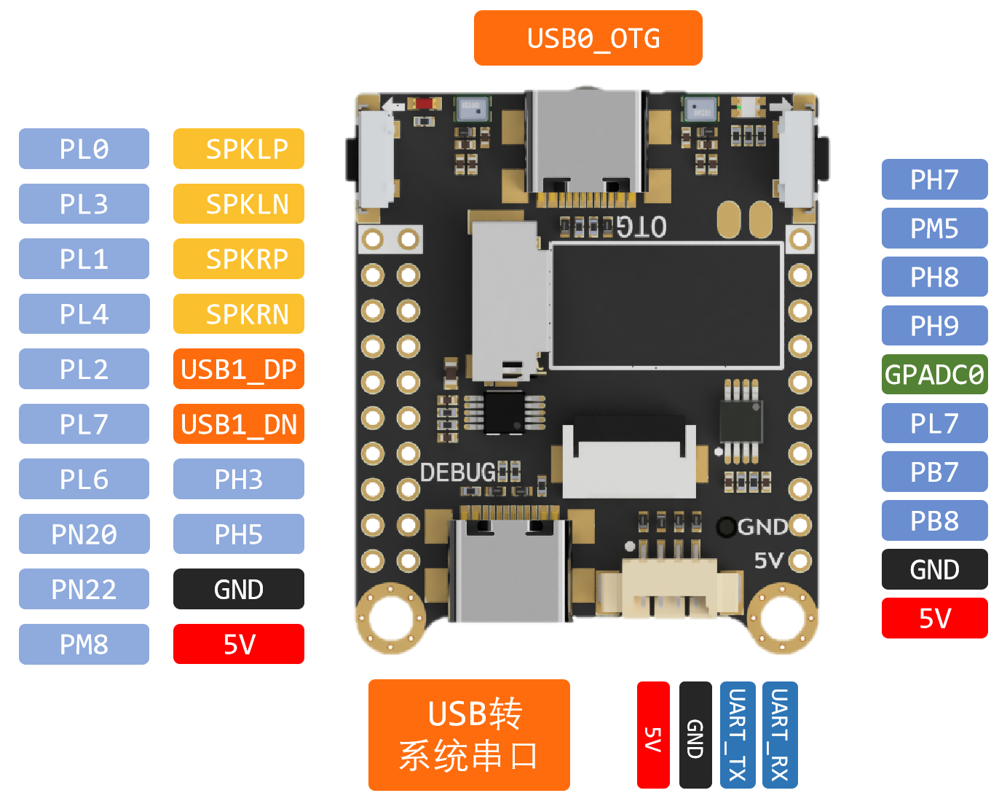

# 配置系统

Lichee MaixSense 的引脚图如下:



## 连接串口

连接串口是为了使电脑与板子能够进行通信。

相关操作： 使用 Type-C 线将电脑与上图所标注处的 `USB转系统串口` 相连即可，然后根据电脑系统执行不同的下方操作

### Linux & macOS

Linux 不需要装驱动，系统自带了，使用 `ls /dev/ttyUSB*` 命令即可看到设备号

### Windows

Lichee MaixSense 使用了 CH340 作为串口芯片。Windows 用户需要安装 CH340 的驱动。

Windows 下载 [ch340 ch341 driver](https://api.dl.sipeed.com/shareURL/MAIX/tools/ch340_ch341_driver) 安装即可，然后可以在设备管理器中看到串口设备和端口号。

## Tina 系统配置

一般建议使用 armbian 系统，对于 Tina 系统用户需要有一定的使用基础才能够使用。

Lichee MaixSense 的 Tina 系统配置和 [M2dock](./../M2/usage.md) 基本相同，这里不另作赘述。

- 可以将板子上的摄像头拆下来后再将电脑与该接口相连然后使用 [adb](https://developer.android.google.cn/studio/releases/platform-tools?hl=zh-cn) 工具来操作板子，此操作仅限 Tina 系统。因为不推荐小白使用 Tina 系统，所以此处不再细说

## armbian 系统配置

根据本文开头描述来将电脑与板子连接且安装 [CH340 驱动](https://dl.sipeed.com/fileList/MAIX/tools/ch340_ch341_driver/CH341SER.EXE) 后，可以在串口软件比如 Xshell 或者 [Mobaxterm](./../M2/tools/mobaxterm.md)中，设置波特率 (baudrate) 为115200，选择板子的串口，连接上板子。

由于所提供的下载镜像分为内置 MaixPy3 的镜像和无 MaixPy3的镜像，所以下面分为两种来说明相关操作。

### 默认含有 MaixPy3 的镜像

用户名和密码均为 `root` ，登陆进去即可。输入的时候要是输错了就是直接按回车重来吧，最好输入时无更改。

成功登录的 log 参考如下：

```bash
Armbian 21.08.0-trunk Bullseye ttyS0

maixsense login: root
Password:
 __  __       _       ____
|  \/  | __ _(_)_  __/ ___|  ___ _ __  ___  ___
| |\/| |/ _` | \ \/ /\___ \ / _ \ '_ \/ __|/ _ \
| |  | | (_| | |>  <  ___) |  __/ | | \__ \  __/
|_|  |_|\__,_|_/_/\_\|____/ \___|_| |_|___/\___|

Welcome to Armbian 21.08.0-trunk Bullseye with bleeding edge Linux 5.14.0-rc7-sun50iw11

No end-user support: built from trunk & unsupported (bullseye) userspace!

System load:   133%             Up time:       0 min
Memory usage:  53% of 231M      Zram usage:    23% of 115M      IP:            192.168.0.251
CPU temp:      50°C             Usage of /:    77% of 2.9G

[ 0 security updates available, 66 updates total: apt upgrade ]
Last check: 2022-08-31 01:45

[ General system configuration (beta): armbian-config ]

Last login: Tue Aug 30 10:34:06 UTC 2022 on ttyS0
root@maixsense:
```

### 不含 MaixPy3 的镜像

由于是全新的镜像，所以首次登录需要设置密码。密码过短或者过于简单的话会被要求重新设置。

```bash
New to Armbian? Documentation: https://docs.armbian.com Support: https://forum.armbian.com

New root password: **********
Repeat password: **********
```

设置完密码后需要自行设置默认 shell,一般选择 bash

```bash
Choose default system command shell:

1) bash
2) zsh

Shell: BASH
```

然后会要求新建一个用户，自定义用户名和登录密码即可。

```bash
Creating a new user account. Press <Ctrl-C> to abort

Please provide a username (eg. your forename): ll
Create password: *********
Repeat password: *********
```

新建用户后默认给新建的用户授予了 root 权限，以后可以直接使用新建的用户来操作板子。

可以只用 `passwd -d 你新建的用户名` 来删除所新创建用户密码，其中 `你新建的用户名` 应该改成你上面所新建的用户名称。

另外可以直接使用 `passwd 你新建的用户名` 来修改你所创建的用户的密码。

```bash
root@maixsense:~# passwd ll
New password:
Retype new password:
passwd: password updated successfully
```

下面是部分示例~


