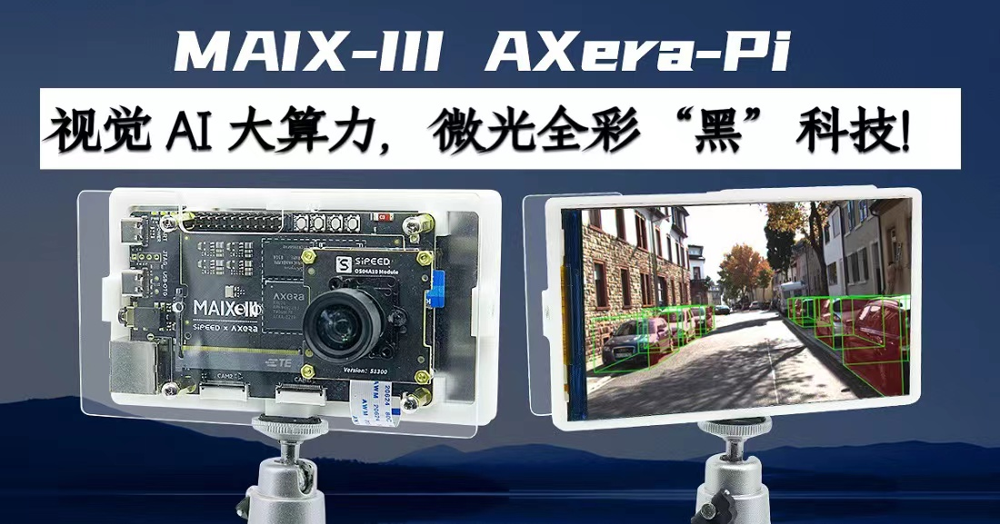
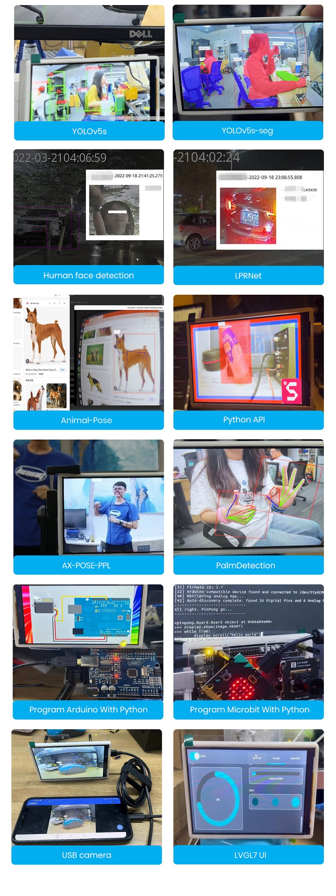

> 如果你想分享这款 AI 开发板给其他同学了解，请使用唯一的传送门「[ wiki.sipeed.com/m3axpi ](http://wiki.sipeed.com/m3axpi) 」。

> [>>> 想要购买请点此直达淘宝商品链接 <<<](https://item.taobao.com/item.htm?id=682169792430)

 2021 年的时候，国内各大芯片原厂纷纷亮出了自己的 Linux 边缘 AI 芯片。

但在 AI 开发板的市场中，前有树莓派（Raspberry Pi），后有英伟达（Jetson Nano）等国外老牌选手强力围剿国内 Linux AI 开发板，在这之前国产的同类产品无论是价格还是体验，都被打的丢盔弃甲。

如今在千元内的选手有晶晨 A311D 、地平线 X3 、瑞芯微 RV1126、堪智 K510、全志 V85X 、晶视 CR182x 等等国产芯片，看上去感觉有很多选择？

但是，它们要么资料太少（资料封闭）、能效比低、价格太贵、生态贫瘠、开发困难、视觉效果太差存在各种各样的问题。

真的很难有一款边缘 AI 板子可以满足开发者的要求！！！

但现在！这些问题可能不再是问题了！

是时候请出我们新一轮的参赛选手了！

练习时长两年半（不是），一颗 3.6TOPs@INT8 大算力低功耗超强夜景的芯片总算是来到了 MAIX-III Linux AI 系列！

没错，它就是来自「[爱芯元智](https://axera-tech.com/)」的 [AX620A](https://axera-tech.com/product/T7297367876123493768)，这是一款高算力，高能效比，低功耗的 AI SoC 芯片，芯片集成了四核 Cortex A7 @ 1Ghz CPU，带有浮点运算单元，支持 NEON，拥有 3.6TOPs@INT8 的高算力 NPU，支持 4K@30fps 的 ISP，以及支持 H.264、H.265 编码的 VPU，AX620A 还支持 32bit LPDDR4x，支持 EMMC v5.1 / SPI Flash，最多支持 6 路 MIPI 输入，同时最多支持 4 路工作，支持多路子码流，支持 1 路千兆 Ethernet，支持 1 路 USB2.0，支持 2 路 MIPI DSI/CSI 输出。拥有大算力和优异画质处理能力的 AX620A 可以实现更多的 AI 功能，带来最优的 AI 体验！（来自官方）

## 产品介绍

它其实早在九月初就参展了 2022 年世界人工智能大会了～（当时它长这样）

  

最后总算是在 20221001 的时候推出了这款搭载 AX620A 的开发板，正式名为：**MAIX-III AXera-Pi**，在以下内容中简称 **m3axpi** 喔！

  <video src="../assets/axpi_boom.mp4"
    width="100%" controls="controls" autoplay="autoplay"
    x5-playsinline=""
 		playsinline
 		webkit-playsinline="true"
 		poster="../assets/maix-iii-small.jpg"
 		preload="auto"
  >
  </video>

那么，它都带来了哪些内容呢？

- 资料太少？文档教你从开箱到开发，从嵌入式 Linux 开发到 AI 模型开发指南一应俱全！
- 能效比差？四核 A7 靠一条 USB3.0 就可以带起来！和你的外接电源、散热器说拜拜吧！！
- 开发困难？支持 debian11 系统内置 SDK 直接板上编译！白嫖在线 AI 模型训练直到部署！！！
- 没有生态？ SIPEED 拥有关于 LINUX、RISCV、AIOT、FPGA、MCU 等嵌入式领域的内容！！！！
- 摄像效果太差？芯片主打 AI ISP 夜视增强！由原厂亲手为你调试白天到夜间的超强影像！！！！！
- 价格太贵？从核心+底板+屏幕+摄像头+卡+外壳支架全套总共人民币 **579** ！（咆哮！！！！！！）

说这么多没用的，还是赶紧把东西掏出来，让大家瞧瞧都有些什么吧！

## 影像效果

### 夜景增强效果

    <iframe src="//player.bilibili.com/player.html?aid=561523949&bvid=BV1Ee4y1v7iF&cid=860676576&page=1" scrolling="no" border="0" frameborder="no" framespacing="0" allowfullscreen="true" style="max-width:640px; max-height:480px;"> </iframe>

### 展会暗室现场

    <iframe src="//player.bilibili.com/player.html?aid=430541632&bvid=BV1iG41137tx&cid=831645988&page=1&t=83.6" scrolling="no" border="0" frameborder="no" framespacing="0" allowfullscreen="true" style="max-width:640px; max-height:480px;"> </iframe>

### AI 应用实拍

    <iframe src="//player.bilibili.com/player.html?aid=773227207&bvid=BV1B14y1Y7A4&cid=837154353&page=1" scrolling="no" border="0" frameborder="no" framespacing="0" allowfullscreen="true" style="max-width:640px; max-height:480px;"> </iframe>

## AI 生态

### 大算力超多算子！

[点此 >>> 「查看 AX620A 算子支持列表」 <<< 喔！](https://pulsar-docs.readthedocs.io/zh_CN/latest/appendix/op_support_list.html)

下表统计一下目前（20221012）千元内在售的 AI 主板（仅单主板，全套太贵）的 NPU 算力性能从高到低的排行（商品价格会受市场波动影响，若发现表格数据过于离谱请指正）。

| 芯片            | 产品             | 价格    | CPU                                                 | RAM   | NPU |
| --------------- | -------------------------- | ------- | --------------------------------------------------- | ----- | ----------- |
| 晶晨 A311D      | Khadas VIM3                | ¥850.00 | 四核 ARM Cortex-A73@2.2GHz   双核 ARM Cortex-A53@1.8GHz | 2GB   | 5TOPs          |
| 地平线 X3       | 旭日派                     | ¥499.00 | 四核 ARM Cortex-A53@1.2GHz                          | 2GB   | 5TOPs          |
| 爱芯元智 AX620A | MAIX-III AXera-Pi          | ¥399.00 | 四核 ARM Cortex-A7@1.0GHz                             | 2GB   | 3.6TOPs        |
| 堪智 K510       | K510 CRB-KIT Lite          | ¥699.00 | 双核 RISCV 64 位 800Mhz                             | 512MB | 3TOPs          |
| 瑞芯微 RV1126   | EASY EAI Nano              | ¥328.00 | 四核 ARM Cortex-A7@1.5GHz                            | 1GB   | 2TOPs          |
| 全志 V85X       | 全志 V853 单主板            | ¥973.00 | 单核 ARM Cortex-A7@1.2GHz | 512MB | 1TOPs          |

### 大量现成的模型！

没有拿到板子之前，你可以到 [MaixHub 模型库](https://maixhub.com/model/zoo) 找到你需要的模型，可以在过滤选项中选择 `AX-Pi` 来查找能在 `AXera-Pi` 上运行的模型。

还可以在 [AXERA-TECH/ax-samples](https://github.com/AXERA-TECH/ax-samples) 仓库也可以找到模型，板子系统里也预置了模型资源，后续模型更新会在这里[「ax-models」](https://github.com/AXERA-TECH/ax-models)，而 [ AX-Samples 将不断更新最流行的、实用的、有趣的示例代码](https://github.com/AXERA-TECH/ax-samples/tree/main/examples#examples)，目前有如下模型支持列表：

- 物体分类
  - MobileNetv1
  - [MobileNetv2](https://github.com/AXERA-TECH/ax-samples/blob/main/examples/README.md#MobileNetv2)
  - MobileOne-s0
  - ResNet18
  - ResNet50
  - Others......
- 物体检测
  - [PP-YOLOv3](https://github.com/AXERA-TECH/ax-samples/blob/main/examples/README.md#yolov3paddle)
  - YOLOv3
  - YOLOv3-Tiny
  - YOLOv4
  - YOLOv4-Tiny
  - YOLOv4-Tiny-3l
  - [YOLOv5s](https://github.com/AXERA-TECH/ax-samples/blob/main/examples/README.md#YOLOv5s)
  - [YOLOv5-Lite](https://github.com/AXERA-TECH/ax-samples/blob/main/examples/README.md#YOLOv5-Lite)([original model](https://github.com/ppogg/YOLOv5-Lite))
  - [YOLOv7-Tiny](https://github.com/AXERA-TECH/ax-samples/blob/main/examples/README.md#YOLOv7-Tiny)
  - [YOLOv8s](https://github.com/AXERA-TECH/ax-samples/tree/main/examples#YOLOv8s)
  - [YOLOX-S](https://github.com/AXERA-TECH/ax-samples/blob/main/examples/README.md#YOLOX-S)
  - YOLO-Fastest-XL
  - NanoDet
- 人型检测
  - YOLO-Fastest-Body
- 人脸检测
  - [scrfd](https://github.com/AXERA-TECH/ax-samples/blob/main/examples/README.md#Scrfd)
  - [YOLOv5-Face](https://github.com/AXERA-TECH/ax-samples/blob/main/examples/README.md#YOLOv5-Face)([original model](https://github.com/deepcam-cn/yolov5-face))
- 人脸分割
  - Face_Parsing
- 障碍物检测 (扫地机场景)
  - Robot-Obstacle-Detect
- 无人机视角物体检测
  - [YOLOv5s_visdrone](https://github.com/AXERA-TECH/ax-samples/blob/main/examples/README.md#YOLOv5s_visdrone)
- 3D单目车辆检测
  - [Monodlex](https://github.com/AXERA-TECH/ax-samples/blob/main/examples/README.md#Monodlex)
- 人体关键点
  - [HRNet](https://github.com/AXERA-TECH/ax-samples/blob/main/examples/README.md#HRNet)
  - [AX-POSE-PPL](https://github.com/AXERA-TECH/ax-samples/blob/main/examples/README.md#AX-POSE-PPL)
  - [HandPose](https://github.com/AXERA-TECH/ax-samples/blob/main/examples/README.md#HandPose)
- 人体分割
  - [PP-HumanSeg](https://github.com/AXERA-TECH/ax-samples/blob/main/examples/README.md#PP-HumanSeg)
- 语义分割
  - [PP-Seg](https://github.com/AXERA-TECH/ax-samples/blob/main/examples/README.md#MobileSeg)
- 传统 CV 操作
  - CropResize
- Pipeline 示例
  - NV12 -> CropResize -> NN(Classification)

想要在板子上运行模型请看[「部署模型到 Maix-III AXera-Pi 开发板」](/ai/zh/deploy/ax-pi.html)

  

### 在线训练模型吧！

如今 [新版 MaixHub 正式上线啦！](https://wiki.sipeed.com/news/maixhub/new_maixhub.html)下为 maixhub 在线训练模型流程示意。

  

> m3axpi 不支持上一代 m2dock 的扫码部署，只能选择本地上传文件部署。

    <iframe src="//player.bilibili.com/player.html?aid=597374704&bvid=BV1eB4y1Q74i&cid=741940038&page=1" scrolling="no" border="0" frameborder="no" framespacing="0" allowfullscreen="true" style="max-width:640px; max-height:480px;"> </iframe>

### 分享有趣的模型！

在你部署成功后会有一份模型文件，以及能运行模型的代码或程序，你可以将这些文件分享到 [MaixHub 模型库](https://maixhub.com/model/zoo) ，大家一起交流学习成长！（请开始你的表演吧）

  

  

## 丰富的资源案例

> 截止更新时间：20221205

  
  

产品相关的专栏内容有（官方维护）：

- [MAIX-III AXera-Pi 系列文章（1）：新一代 3.6T 视觉 AI 板卡面世](https://aijishu.com/a/1060000000374898)
- [MAIX-III AXera-Pi 系列文章（2）：丰富多采的 AI 应用](https://aijishu.com/a/1060000000374900)
- [MAIX-III AXera-Pi 系列文章（3）：Debian 系统 & 开箱案例](https://aijishu.com/a/1060000000374902)
- [MAIX-III AXera-Pi 系列文章：开箱之硬件初体验](https://aijishu.com/a/1060000000378968)
- [MAIX-III AXera-Pi 系列文章：上手之丝滑玩转 AI 板卡【一】](https://aijishu.com/a/1060000000380513)
- [MAIX-III AXera-Pi 系列文章：上手之丝滑玩转 AI 板卡【二】](https://aijishu.com/a/1060000000383970)
- [YOLOv8 目标检测：训练自定义数据集并部署到爱芯派（一）](https://aijishu.com/a/1060000000395215)
- [YOLOv8 目标检测：训练自定义数据集并部署到爱芯派（二）](https://aijishu.com/a/1060000000395812)
- [MMPose：在爱芯派上玩转你的关键点检测](https://aijishu.com/a/1060000000396746)
- [MOT：如何在爱芯派上实现多目标跟踪的神奇效果！](https://aijishu.com/a/1060000000399566)

以下是由社区开发者贡献的内容，欢迎你也来贡献喔！！！（直接丢群里都可以喔！）

- [爱芯派-AI微光全彩夜视-开箱体验](https://zhuanlan.zhihu.com/p/571233089)
- [爱芯 AX620A NPU 初体验](https://neucrack.com/p/440)
- [MMYOLO 检测算法部署在 AX620A 记录](https://zhuanlan.zhihu.com/p/614698969?utm_campaign=&utm_medium=social&utm_oi=815507548294770688&utm_psn=1620047438693208065&utm_source=qq)
- [部署你的yolov8来识别杠精（bushi）](https://www.yuque.com/prophetmu/chenmumu/pd3sdkb8z4vvvgai)
- [[m3axpi] YOLOv5 训练到部署全流程（最新）](https://github.com/Abandon-ht/m3axpi_model/blob/main/yolov5/README_zh-CN.md)
- [[m3axpi] YOLOv8 训练到部署全流程（最新）](https://github.com/Abandon-ht/m3axpi_model/blob/main/yolov8/README_zh-CN.md)
- [爱芯元智AX620A部署yolov5 6.0模型实录（已过时）](https://zhuanlan.zhihu.com/p/569083585)
- [ubuntu22.04搭建AX620A官方例程开发环境](http://t.csdn.cn/p8Nno)
- [AX620A运行yolov5s自训练模型全过程记录（windows）](http://t.csdn.cn/oNeYG)
- [MAIX-III AXera-Pi爱芯派从零入门开发【1】开箱试玩](https://www.bilibili.com/video/BV1LP4y1274d/?spm_id_from=333.999.0.0)
- [MAIX-III AXera-Pi爱芯派从零入门开发【2】开发部署](https://www.bilibili.com/video/BV1Ne4y117U9/?spm_id_from=333.999.0.0)
- [MAIX-III AXera-Pi爱芯派从零入门开发【3】模型转换及部署](https://www.bilibili.com/video/BV1jg411z7C8/?spm_id_from=333.999.0.0)
- [MAIX-III AXera-Pi爱芯派从零入门开发【4】视频推理及推流](https://www.bilibili.com/video/BV14D4y147Ed/?spm_id_from=333.999.0.0)
- [小手智联老徐 —— AI 边缘计算平台 - 爱芯元智 AX620A 爱芯派开箱](https://blog.csdn.net/weixin_43978579/article/details/127966677)
- [HonestQiao —— 矽速 MAIX-III AXera-Pi 开箱](https://bbs.elecfans.com/m/jishu_2314161_1_1.html)
- [一款国产「3.6TOPS@INT8」视觉 AI 开发板](https://mp.weixin.qq.com/s/3bxFxO0Q0UmpzSM3_K794g)
- [国产AI开发板测评 | MAIX-III AXera-Pi 上手 YOLOv5s 实时目标检测](https://mp.weixin.qq.com/s/lqxL-DmhBa-K9gu3uEyebQ)
- [【AXPI】如何在 M1/M2 Mac上使用 Rndis](https://blog.csdn.net/flamebox/article/details/127103964)

产品相关的新闻内容有：

- [AI ISP 的黎明——大话成像](https://axera-tech.com/tech/T7297054127901756535)
- [2022世界人工智能大会启动:爱芯元智发布AI-ISP“爱芯智眸®”_中华网](https://tech.china.com/article/20220901/092022_1134965.html)
- [爱芯元智AX620A与百度飞桨完成 I 级兼容性测试 开源生态建设更进一步](https://mp.weixin.qq.com/s/k6G1pE-31VXlrBA3F6_Liw)
- [AI 视觉新势力×微光全彩“黑”科技](https://mp.weixin.qq.com/s/JIvVprWlQPvE7bTxozAG_Q)
- [爱芯派™AXera-Pi™亮相ICCAD 爱芯元智开源生态建设加速](https://mp.weixin.qq.com/s/_nZLfEjxOb4QLpGWgaLVWQ)
- [新一代 Kaldi - 嵌入式端实时语音识别](https://mp.weixin.qq.com/s/r4nGu04o1sjdFZt_vYbUAA)

## Linux 内容

### 超高性价比与能效比

别搞那些虚的。来点实际点的，以下是目前（20221014）市场上销量排行的典型 AI 开发产品，**商品价格会随时变动，有疑问可查询或指出并纠正**。（已除去低成本 38 板摄像头和芯片原厂超昂贵开发板）

| AI 开发板                                            | 全家桶套餐的主要内容                                         | 大致价格（20221013）      |
| ---------------------------------------------------- | ------------------------------------------------------------ | ------------------------- |
| 英伟达JETSON NANO开发板                              | 4GB 主板、铝合金外壳（带风扇）、5V4A 电源、双频无线网卡、64G U盘、IMX279 摄像头、HDMI 线 + 网线、7 寸触摸屏+支架、 | ¥2129.00                  |
| Raspberry Pi 树莓派4B                                | 4GB 主板、七寸触摸屏+支架、64G U盘、散热片、HDMI 线 + 网线、5V3A 电源、亚克力外壳（带风扇）、500w USB 摄像头、入门指导手册 | ¥1439.00                  |
| Khadas vim3物联网a311d（目前线上销量不高，但很典型） | VIM3（4GB+32G）开发板、外壳、散热器、风扇、30W 电源、HDMI 线 | ¥1399.00                  |
| 迅为RK3568开发板瑞芯微                               | 商业级2G+16G、7寸MIPI屏、OV5695摄像头、（没有配电源）    | ¥1380.00                  |
| EASY EAI Nano AI开发板 瑞芯微RV1126                  | 1GB 单主板、200w双目摄像头（gc2xxx）、5寸ips屏、天线、喇叭、铜柱、2A电源 | ¥799.00                   |
| 亚博智能 旭日X3派开发板                              | 2GB 主板、古月居课程、WIFI 天线、铝合金外壳、gc4663 摄像头、32G U盘、5V3A 开关电源、HDMI 线 | ¥769.00                   |
| Sipeed M3AXPI Linux AI 微光夜视 爱芯派              | 2GB 单主板、400w gc4653 摄像头、5寸ips屏、外壳、数据线、32G TF 卡、在线模型训练服务、活力四射的开源社区       | ¥579.00 |

想想某些产品为什么卖这么贵，销量还这么好？凭什么？

这些产品除了本身的质量要过硬，功能要够强，还要凭借自身的社区生态、软件支持、丰富资料、开源代码、用户口碑等等特色，来支撑产品高性价比的形象。

> 笔者在这里认为所谓的性价比不是一昧地追求产品的最低价，而是在同类产品市场的主流价格区间内，选出社区用户群体可以接受的价格，然后在这个定位里去尽力做出效果最好的产品。

从这些典型的产品中可以看出 m3axpi 套餐是没有配「散热片和风扇还有外接电源」的，这也是它的另一个特色「高能效比」。

是的，这个产品不需要散热器/风扇，也不需要外接 2A 电源就可以启动系统，更不需要找 hdmi 线和显示器。

来一个实际测量的温度和功耗，注意要使用 USB3.0 的口来供电喔。

  

> 从实测结果上来看，这个功耗和温度控制得挺好，用 USB3.0 5V@1A 承载了底板、核心板、WIFI、以太网、摄像头、5寸屏的工作。

### 基于 debian 系统开发

提供 debian11 Linux 系统，支持 SD 卡启动 DD 烧录系统，方便用户开箱上手，同时支持 Python API 编程开发 AI 应用。

1. 烧录方法：[WIKI AXera-Pi 烧录系统](https://wiki.sipeed.com/hardware/zh/maixIII/ax-pi/flash_system.html#%E8%8E%B7%E5%8F%96%E9%95%9C%E5%83%8F)

2. 上手指南：[WIKI AXera-Pi 上手必看](https://wiki.sipeed.com/hardware/zh/maixIII/ax-pi/flash_system.html)

2. Python 编程：[ax_pipeline_api ](https://github.com/junhuanchen/ax_pipeline_api) （由社区大佬鼠贡献）

3. 开发笔记：[[maixpy3 axpi] 关于爱芯 ax620a 移植 debian11 系统这件事](https://www.cnblogs.com/juwan/p/16751348.html)

4. 开发笔记：[[maixpy3 axpi] 编辑发布 debian 镜像与在 PC 上交叉编译程序 ](https://www.cnblogs.com/juwan/p/16769237.html)

### 开放 BSP SDK 源码

提供各类开发源码，提供 API 开发文档，SDK 开发方法等说明，细节可以从[准备 C/C++ 编程](https://wiki.sipeed.com/hardware/zh/maixIII/ax-pi/dev_prepare.html#%E8%8E%B7%E5%8F%96-SDK-%E6%BA%90%E7%A0%81) 得知。

#### [ax-sample](https://github.com/AXERA-TECH/ax-samples)

由爱芯提供典型 AI 模型的开发与评估验证，提供给有经验的 AI 开发者使用或只想蹭模型的同学，不涉及任何硬件外设有关的内容。

1. [示例项目 examples](https://github.com/AXERA-TECH/ax-samples/tree/main/examples)
2. [物体检测 PP-YOLOv3](https://github.com/AXERA-TECH/ax-samples/blob/main/examples/README.md#yolov3paddle)
3. [人体分割 PP-HumanSeg](https://github.com/AXERA-TECH/ax-samples/blob/main/examples/README.md#MobileSeg)
4. [语义分割 PP-Seg](https://github.com/AXERA-TECH/ax-samples/blob/main/examples/README.md#PP-HumanSeg)

#### [libmaix](https://github.com/sipeed/libmaix)

由 SIPEED 提供在嵌入式平台统一的嵌入式开发环境，主要有摄像头、屏幕、视觉、图像处理、部署 Pipeline 相关的实机例程，适合刚入门嵌入式 linux 开发的同学使用。

1. [测试一下屏幕显示](https://github.com/sipeed/libmaix/tree/release/examples/display)
2. [把摄像头显示到屏幕](https://github.com/sipeed/libmaix/tree/release/examples/axpi)
3. [摄像头+yolov5 模型+屏幕](https://github.com/sipeed/libmaix/tree/release/examples/axpi_yolov5_cam)

##### [axpi_bsp_sdk](https://github.com/sipeed/axpi_bsp_sdk)

芯片商用时所用的 bsp 开发包，这里主要提供的是芯片的原始开发资料，如 uboot、linux、msp 、sample、rtsp、ipcdemo 等工程代码，这个部分是逐步开源的，你可以从这里得到商业评估用的代码，例如 ipcdemo 这样的程序，但这些代码会很复杂且高耦合，适合有经验的同行出于商业落地的目的使用。

1. 开发文档 [docs](https://github.com/sipeed/axpi_bsp_sdk/tree/main/msp/sample/vo_fb)
2. 框架应用 [ipcdmeo](https://github.com/sipeed/axpi_bsp_sdk/tree/main/app/IPCDemo)
3. 外设验证 [sample](https://github.com/sipeed/axpi_bsp_sdk/tree/main/msp/sample)

#### [ax-pipeline](https://github.com/AXERA-TECH/ax-pipeline)

AX-Pipeline 由爱芯主导开发。该项目基于 AXera-Pi 展示 ISP、图像处理、NPU、编码、显示 等功能模块软件调用方法，方便社区开发者进行快速评估和二次开发自己的多媒体应用。

1. [快速编译](https://github.com/AXERA-TECH/ax-pipeline/blob/main/docs/compile.md) 基于 cmake 实现简单的跨平台编译。
2. [如何更换自己训练的 yolov5 模型](https://github.com/AXERA-TECH/ax-pipeline/blob/main/docs/how_to_deploy_custom_yolov5_model.md)
3. [如何部署自己的其他模型](https://github.com/AXERA-TECH/ax-pipeline/blob/main/docs/how_to_deploy_custom_model.md)
4. [如何调整图像方向](https://github.com/AXERA-TECH/ax-pipeline/blob/main/docs/how_to_adjust_image_orientation.md)
5. [ModelZoo](https://github.com/AXERA-TECH/ax-pipeline/blob/main/docs/modelzoo.md) 一些支持或将支持的模型和一些模型的说明。

## 选择 M3AXPI 的理由

>为什么要选择 M3AXPI 呢？由这个视频来回答你的所有疑问吧！

视频简述了 M3AXPI 比起 M2DOCK 的优势，还有超多实际使用效果案例以及彩蛋！

<iframe src="//player.bilibili.com/player.html?aid=992194128&bvid=BV1px4y1w75T&cid=1018084963&page=1&t=372" scrolling="no" border="0" frameborder="no" framespacing="0" allowfullscreen="true"> </iframe>

## 硬件参数

  
  
  

### 硬件标注图

  
  

### 核心板参数

| 项目       | 参数                                  |
| ---------- | ------------------------------------- |
| CPU        | 四核 Cortex-A7, 支持 NEON 和 FPU       |
| NPU        | 14.4Tops@int4，3.6Tops@int8           |
| ISP        | 4K@30fps                              |
| 编解码格式 | H.264, H.265                          |
| 视频编码   | 4K@30fps                              |
| 视频解码   | 1080P@60fps                           |
| Ethernet   | 支持双路RGMII / RMII 接口模式的以太网 |
| 显示输出   | MIPI DSI 4 Lane，最高支持4K@30FPS |
| DRAM       | 2GB LPDDR4X 3733Mhz                 |
| 存储       | 可选16GB EMMC（默认是 TF 卡启动）       |
| IO 引出    | DDR4 SODIMM 260P 金手指全 IO 引出       |

### 底板参数

| 项目       | 参数                                   |
| ---------- | ------------------------------------- |
| 摄像头输入 | （默认单摄）最高支持 3 摄:1个MIPI4-LANE+2个MIPI2-LANE |
| 屏幕输出 | 支持最高 4-LANE MIPI DSI 屏幕 |
| SD 插槽 | 默认从 SD 卡启动 |
| 录音输入 | 板载两个 MEMS MIC 支持双麦降噪 |
| 音频输出  | 3.5MM耳机接口 支持立体声输入和 MIC 输入 |
| 网络接口 | 支持 千兆以太网（ETH） 和 2.4GHZ WI-FI 板载天线 |
| USB 接口  | 1xUSB2.0HS 支持 OTG 或 HOST 功能，1xUSB-UART 系统串口 |
| 其他资源  | 1x用户按键，3x系统按键，1xRTC时钟，2xLED |
| 对外接口  | 引出CJTAG，可自行连接相应调试器，引出2x12排针，4个M2.5螺丝定位孔 |

[硬件资源汇总链接](https://dl.sipeed.com/shareURL/MaixIII/AXera)

- [产品规格书](https://dl.sipeed.com/shareURL/MaixIII/AXera/01_Specification)
- [原理图](https://dl.sipeed.com/shareURL/MaixIII/AXera/02_Schematic)
- [点位图](https://dl.sipeed.com/shareURL/MaixIII/AXera/03_Bit_number_map)
- [模型文件](https://dl.sipeed.com/shareURL/MaixIII/AXera/05_3D_file)
- [尺寸图](https://dl.sipeed.com/shareURL/MaixIII/AXera/04_Dimensional_drawing)
- [GC4653 摄像头参考使用手册](https://dl.sipeed.com/shareURL/MaixIII/AXera/07_Chip_manual)

### 摄像头一览

- 低配 gc4653 400w 基础体验版本。

  

- 高配 os04a10 400w 夜景增强版本。

  

> [更换摄像头常见问题](https://wiki.sipeed.com/hardware/zh/maixIII/ax-pi/faq_axpi.html)

## 常见问题（FAQ）

- AI 服务 http://maixhub.com
- 在线文档 http://wiki.sipeed.com
- 交流社区 http://bbs.sipeed.com
- 开源组织 http://github.com/sipeed

- AXERA 技术交流群：（ 139953715 ）专供 AI ISP 技术交流
- 荔枝 MaixPy3 AI 交流群：（ 756313869 ）给产品开箱小白答疑

Q & A 请到 [Maix-III 系列 AXera-Pi 常见问题（FAQ）](./faq_axpi.md) 了解喔。

