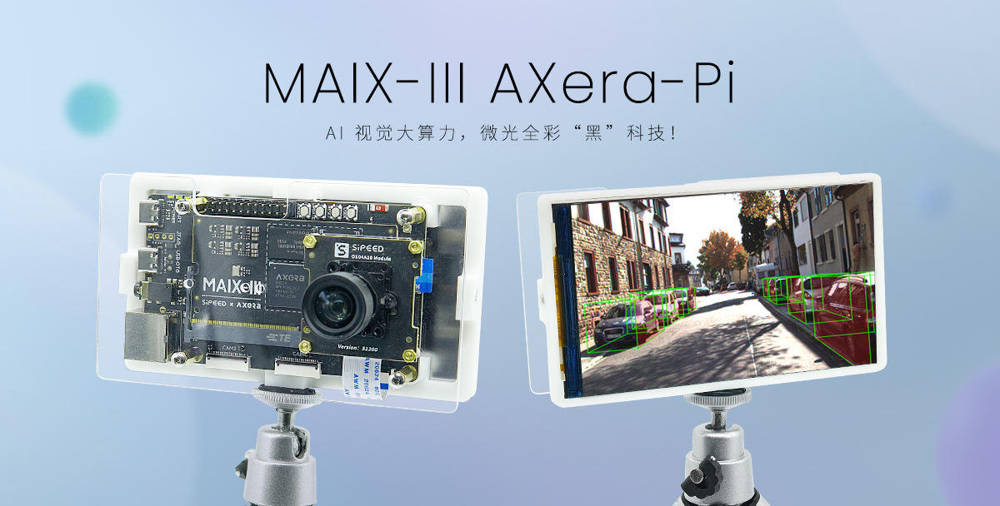

> 如果你想分享这款 AI 开发板给其他同学了解，请使用唯一的传送门「[ wiki.sipeed.com/m3axpi ](http://wiki.sipeed.com/m3axpi) 」。



> [>>> 请点此直达淘宝商品链接 <<<](https://m.tb.cn/h.U30m3xW?tk=L1vr2BQ0AQM)

 2021 年的时候，国内各大芯片原厂纷纷亮出了自己的 Linux 边缘 AI 芯片。

但在 AI 开发板的市场中，前有树莓派（Raspberry Pi），后有英伟达（Jetson Nano）等国外老牌选手强力围剿国内 Linux AI 开发板，在这之前国产的同类产品无论是价格还是体验，都被打的丢盔弃甲。

如今在千元内的选手有晶晨 A311D 、地平线 X3 、瑞芯微 RV1126、堪智 K510、全志 V85X 、晶视 CR182x 、亿智 SV826 、酷芯微 AR9341 等等国产芯片，看上去感觉有很多选择？

但是，它们要么资料太少（资料封闭）、能效比低、价格太贵、生态贫瘠、开发困难、视觉效果太差存在各种各样的问题。

真的很难有一款边缘 AI 板子可以满足开发者的要求！！！

但现在！这些问题可能不再是问题了！

是时候请出我们新一轮的参赛选手了！

练习时长两年半（不是），一颗 3.6TOPs@INT8 大算力低功耗超强夜景的芯片总算是来到了 MAIX-III Linux AI 系列！

<p align="center">

</p>

没错，它就是来自「[爱芯元智](https://axera-tech.com/)」的 [AX620A](https://axera-tech.com/product/T7297367876123493768)，这是一款高算力，高能效比，低功耗的 AI SoC 芯片，芯片集成了四核 Cortex A7 @ 1Ghz CPU，拥有 3.6TOPs@INT8 的高算力 NPU，支持 4K@30fps 的 ISP，以及支持 H.264、H.265 编码的 VPU，拥有大算力和优异画质处理能力的 AX620A 可以实现更多的 AI 功能，带来最优的 AI 体验！（来自官方）

## 产品介绍

它其实早在九月初就参展了 2022 年世界人工智能大会了～（当时它长这样）

<p align="center">
  
</p>

最后总算是在 20221001 的时候推出了这款搭载 AX620A 的开发板，正式名为：**MAIX-III AXera-Pi**，在以下内容中简称 **m3axpi** 喔！

<p align="center">
  <video src="../assets/axpi_boom.mp4"
    width="100%" controls="controls" autoplay="autoplay"
    x5-playsinline=""
 		playsinline
 		webkit-playsinline="true"
 		poster="../assets/maix-iii-small.jpg"
 		preload="auto"
  >
  </video>
</p>

那么，它都带来了哪些内容呢？

- 资料太少？文档教你从开箱到开发，从嵌入式 Linux 开发到 AI 模型开发指南一应俱全！
- 能效比差？四核 A7 靠一条 USB3.0 就可以带起来！和你的外接电源、散热器说拜拜吧！！
- 开发困难？支持 debian11 系统内置 SDK 直接板上编译！白嫖在线 AI 模型训练直到部署！！！
- 没有生态？ SIPEED 拥有关于 LINUX、RISCV、AIOT、FPGA、MCU 等嵌入式领域的内容！！！！
- 摄像效果太差？芯片主打 AI ISP 夜视增强！由原厂亲手为你调试白天到夜间的超强影像！！！！！
- 价格太贵？从核心+底板+屏幕+摄像头+卡+外壳支架全套总共人民币 **579** ！（咆哮！！！！！！）

## 产品特色

说这么多没用的，还是赶紧把东西掏出来，让大家瞧瞧都有些什么吧！

### 影像效果

#### 夜景增强效果

<p align="center">
    <iframe src="//player.bilibili.com/player.html?aid=561523949&bvid=BV1Ee4y1v7iF&cid=860676576&page=1" scrolling="no" border="0" frameborder="no" framespacing="0" allowfullscreen="true" style="max-width:640px; max-height:480px;"> </iframe>
</p>

#### 展会暗室现场

<p align="center">
    <iframe src="//player.bilibili.com/player.html?aid=430541632&bvid=BV1iG41137tx&cid=831645988&page=1&t=83.6" scrolling="no" border="0" frameborder="no" framespacing="0" allowfullscreen="true" style="max-width:640px; max-height:480px;"> </iframe>
</p>

#### AI 应用实拍

<p align="center">
    <iframe src="//player.bilibili.com/player.html?aid=773227207&bvid=BV1B14y1Y7A4&cid=837154353&page=1" scrolling="no" border="0" frameborder="no" framespacing="0" allowfullscreen="true" style="max-width:640px; max-height:480px;"> </iframe>
</p>

### AI 生态

#### 大算力超多算子！

[点此 >>> 「查看 AX620A 算子支持列表」 <<< 喔！](https://pulsar-docs.readthedocs.io/zh_CN/latest/appendix/op_support_list.html)

下表统计一下目前千元内在售的 AI 主板（仅单主板，全套太贵）的 NPU 算力性能从高到低的排行（20221012）

| 芯片            | 产品             | 价格    | CPU                                                 | RAM   | NPU |
| --------------- | -------------------------- | ------- | --------------------------------------------------- | ----- | ----------- |
| 晶晨 A311D      | Khadas VIM3                | ¥850.00 | 四核 ARM Cortex-A73@2.2GHz <br> 双核 ARM Cortex-A53@1.8GHz | 2GB   | 5TOPs          |
| 地平线 X3       | 旭日派                     | ¥499.00 | 四核 ARM Cortex-A53@1.2GHz                          | 2GB   | 5TOPs          |
| 爱芯元智 AX620A | MAIX-III AXera-Pi          | ¥399.00 | 四核 ARM Cortex-A7@1.0GHz                             | 2GB   | 3.6TOPs        |
| 瑞芯微 RV1126   | EASY EAI Nano              | ¥328.00 | 四核 ARM Cortex-A7@1.5GHz                            | 1GB   | 2TOPs          |
| 堪智 K510       | K510 CRB-KIT Lite          | ¥699.00 | 双核 RISCV 64 位 800Mhz                             | 512MB | 3TOPs          |
| 全志 V85X       | 全志 V853 开发板（仅主板） | ¥973.00 | 单核 ARM Cortex-A7@1.2GHz | 512MB | 1TOPs          |

#### 大量现成的模型！

没有拿到板子之前，你可以到 [MaixHub 模型库](https://maixhub.com/model/zoo) 找到你需要的模型，可以在过滤选项中选择 `AX-Pi` 来查找能在 `AXera-Pi` 上运行的模型。


还可以在 [AXERA-TECH/ax-samples](https://github.com/AXERA-TECH/ax-samples) 仓库也可以找到模型，板子系统里也预置了模型资源，后续模型更新会在这里[「ax-models」](https://github.com/AXERA-TECH/ax-models)，而 [ AX-Samples 将不断更新最流行的、实用的、有趣的示例代码](https://github.com/AXERA-TECH/ax-samples/tree/main/examples#examples)，目前有如下模型支持列表：

- 物体分类
  - MobileNetv1
  - MobileNetv2
  - MobileOne-s0
  - ResNet18
  - ResNet50
  - Others......
- 物体检测
  - [PP-YOLOv3](https://github.com/AXERA-TECH/ax-samples/blob/main/examples/README.md#yolov3paddle)
  - YOLOv3
  - YOLOv3-Tiny
  - YOLOv4
  - YOLOv4-Tiny
  - YOLOv4-Tiny-3l
  - YOLOv5s
  - YOLOv7-Tiny
  - YOLOX-S
  - YOLO-Fastest-XL
  - NanoDet
- 人型检测
  - YOLO-Fastest-Body
- 人脸检测
  - scrfd
- 障碍物检测 (扫地机场景)
  - Robot-Obstacle-Detect
- 3D单目车辆检测
  - Monodlex
- 人体关键点
  - HRNet
- 人体分割
  - [PP-HumanSeg](https://github.com/AXERA-TECH/ax-samples/blob/main/examples/README.md#MobileSeg)
- 语义分割
  - [PP-Seg](https://github.com/AXERA-TECH/ax-samples/blob/main/examples/README.md#PP-HumanSeg)

想要在板子上运行模型请看[「部署模型到 Maix-III AXera-Pi 开发板」](/ai/zh/deploy/ax-pi.html)

<p align="center">
  
</p>

#### 在线训练模型吧！

如今 [新版 MaixHub 正式上线啦！](https://wiki.sipeed.com/news/maixhub/new_maixhub.html)下为 maixhub 在线训练模型流程示意。

<p align="center">
  
</p>

<p align="center">
    <iframe src="//player.bilibili.com/player.html?aid=597374704&bvid=BV1eB4y1Q74i&cid=741940038&page=1" scrolling="no" border="0" frameborder="no" framespacing="0" allowfullscreen="true" style="max-width:640px; max-height:480px;"> </iframe>
</p>

#### 分享有趣的模型！

在你部署成功后会有一份模型文件，以及能运行模型的代码或程序，你可以将这些文件分享到 [MaixHub 模型库](https://maixhub.com/model/zoo) ，大家一起交流学习成长！（请开始你的表演吧）

<p align="center">
  
</p>

<p align="center">
  
</p>

如 [YOLOv5s-face 人脸检测](https://maixhub.com/model/zoo/110) 、 [蓝绿车牌识别](https://maixhub.com/model/zoo/79) 这些分享出来的现成可部署的模型。

### Linux 开发

#### 超高性价比与能效比

别搞那些虚的。来点实际点的，以下是目前（20221014）市场上销量排行的典型 AI 开发产品。（已除去低成本 38 板摄像头和芯片原厂超昂贵开发板）

| AI 开发板                                            | 全家桶套餐的主要内容                                         | 大致价格（20221013）      |
| ---------------------------------------------------- | ------------------------------------------------------------ | ------------------------- |
| 英伟达JETSON NANO开发板                              | 4GB 主板、铝合金外壳（带风扇）、5V4A 电源、双频无线网卡、64G U盘、IMX279 摄像头、HDMI 线 + 网线、7 寸触摸屏+支架、 | ¥2129.00<br />（未来可能降价）                  |
| Raspberry Pi 树莓派4B                                | 4GB 主板、七寸触摸屏+支架、64G U盘、散热片、HDMI 线 + 网线、5V3A 电源、亚克力外壳（带风扇）、500w USB 摄像头、入门指导手册 | ¥1439.00                  |
| Khadas vim3物联网a311d（目前线上销量不高，但很典型） | VIM3（4GB+32G）开发板、外壳、散热器、风扇、30W 电源、HDMI 线 | ¥1399.00                  |
| 迅为RK3568开发板瑞芯微                               | 商业级2G+16G、7寸MIPI屏、OV5695摄像头、（没有配电源）    | ¥1380.00                  |
| EASY EAI Nano AI开发板 瑞芯微RV1126                  | 1GB 单主板、200w双目摄像头（gc2xxx）、5寸ips屏、天线、喇叭、铜柱、2A电源 | ¥799.00                   |
| 亚博智能 旭日X3派开发板                              | 2GB 主板、古月居课程、WIFI 天线、铝合金外壳、gc4663 摄像头、32G U盘、5V3A 开关电源、HDMI 线 | ¥769.00                   |
| Sipeed M3AXPI Linux AI 微光夜视 爱芯派              | 2GB 单主板、400w gc4653 摄像头、5寸ips屏、外壳、数据线、32G TF 卡、在线模型训练服务、活力四射的开源社区       | ¥579.00<br />（未来可能涨价） |

想想某些产品为什么卖这么贵，销量还这么好？凭什么？

这些产品除了本身的质量要过硬，功能要够强，还要凭借自身的社区生态、软件支持、丰富资料、开源代码、用户口碑等等特色，来支撑产品高性价比的形象。

> 笔者在这里认为所谓的性价比不是一昧地追求产品的最低价，而是在同类产品市场的主流价格区间内，选出社区用户群体可以接受的价格，然后在这个定位里去尽力做出效果最好的产品。

从这些典型的产品中可以看出 m3axpi 套餐是没有配「散热片和风扇还有外接电源」的，这也是它的另一个特色「高能效比」。

是的，这个产品不需要散热器/风扇，也不需要外接 2A 电源就可以启动系统，更不需要找 hdmi 线和显示器，并且产品测试时是类似如下接线图示意进行产品发货前测试的（这些实拍图虽然有点简陋但都是真情流露呀）。

<p align="center">
  
</p>

来一个实际测量的温度和功耗，注意要使用 USB3.0 的口来供电喔。

<p align="center">
  
</p>

> 从实测结果上来看，这个功耗和温度控制得挺好，用 USB3.0 5V@1A 承载了底板、核心板、WIFI、以太网、摄像头、5寸屏的工作。

#### 基于 debian 系统开发

提供 debian11 Linux 系统，支持 SD 卡启动 DD 烧录系统，方便用户开箱上手。

1. 烧录方法：[WIKI AXera-Pi 烧录系统](https://wiki.sipeed.com/hardware/zh/maixIII/ax-pi/flash_system.html)

2. 开发笔记：[[maixpy3 axpi] 关于爱芯 ax620a 移植 debian11 系统这件事](https://www.cnblogs.com/juwan/p/16751348.html)

3. 开发笔记：[[maixpy3 axpi] 编辑发布 debian 镜像与在 PC 上交叉编译程序 ](https://www.cnblogs.com/juwan/p/16769237.html)

#### BSP SDK 源码开放

提供各类开发源码，提供 API 开发文档，SDK 开发方法等说明，细节可以从[SDK 开发指南](https://wiki.sipeed.com/hardware/zh/maixIII/ax-pi/sdk_usage.html) 得知。

##### [ax-sample](https://github.com/AXERA-TECH/ax-samples)

由爱芯提供典型 AI 模型的开发与评估验证，提供给有经验的 AI 开发者使用或只想蹭模型的同学，不涉及任何硬件外设有关的内容。

1. [示例项目 examples](https://github.com/AXERA-TECH/ax-samples/tree/main/examples)
2. [物体检测 PP-YOLOv3](https://github.com/AXERA-TECH/ax-samples/blob/main/examples/README.md#yolov3paddle)
3. [人体分割 PP-HumanSeg](https://github.com/AXERA-TECH/ax-samples/blob/main/examples/README.md#MobileSeg)
4. [语义分割 PP-Seg](https://github.com/AXERA-TECH/ax-samples/blob/main/examples/README.md#PP-HumanSeg)

##### [libmaix](https://github.com/sipeed/libmaix)

由 SIPEED 提供在嵌入式平台统一的嵌入式开发环境，主要有摄像头、屏幕、视觉、图像处理、部署 Pipeline 相关的实机例程，适合刚入门嵌入式 linux 开发的同学使用。

1. [测试一下屏幕显示](https://github.com/sipeed/libmaix/tree/release/examples/display)
2. [把摄像头显示到屏幕](https://github.com/sipeed/libmaix/tree/release/examples/axpi)
3. [摄像头+yolov5 模型+屏幕](https://github.com/sipeed/libmaix/tree/release/examples/axpi_yolov5_cam)

##### [axpi_bsp_sdk](https://github.com/sipeed/axpi_bsp_sdk)

芯片商用时所用的 bsp 开发包，这里主要提供的是芯片的原始开发资料，如 uboot、linux、msp 、sample、rtsp、ipcdemo 等工程代码，这个部分是逐步开源的，你可以从这里得到商业评估用的代码，例如 ipcdemo 这样的程序，但这些代码会很复杂且高耦合，适合有经验的同行出于商业落地的目的使用。

1. 开发文档 [docs](https://github.com/sipeed/axpi_bsp_sdk/tree/main/msp/sample/vo_fb)
2. 框架应用 [ipcdmeo](https://github.com/sipeed/axpi_bsp_sdk/tree/main/app/IPCDemo)
3. 外设验证 [sample](https://github.com/sipeed/axpi_bsp_sdk/tree/main/msp/sample)

##### [ax-pipeline](https://github.com/AXERA-TECH/ax-pipeline)

AX-Pipeline 由爱芯主导开发。该项目基于 AXera-Pi 展示 ISP、图像处理、NPU、编码、显示 等功能模块软件调用方法，方便社区开发者进行快速评估和二次开发自己的多媒体应用。

1. [快速编译](https://github.com/AXERA-TECH/ax-pipeline/blob/main/docs/compile.md) 基于 cmake 实现简单的跨平台编译。
2. [如何更换自己训练的 yolov5 模型](https://github.com/AXERA-TECH/ax-pipeline/blob/main/docs/how_to_deploy_custom_yolov5_model.md)
3. [如何部署自己的其他模型](https://github.com/AXERA-TECH/ax-pipeline/blob/main/docs/how_to_deploy_custom_model.md)
4. [如何调整图像方向](https://github.com/AXERA-TECH/ax-pipeline/blob/main/docs/how_to_adjust_image_orientation.md)
5. [ModelZoo](https://github.com/AXERA-TECH/ax-pipeline/blob/main/docs/modelzoo.md) 一些支持或将支持的模型和一些模型的说明.

## 社区资源

以下是由社区开发者贡献的内容，欢迎你也来贡献喔！！！（直接丢群里都可以喔！）

- [爱芯派-AI微光全彩夜视-开箱体验](https://zhuanlan.zhihu.com/p/571233089)
- [爱芯 AX620A NPU 初体验](https://neucrack.com/p/440)
- [爱芯元智AX620A部署yolov5 6.0模型实录](https://zhuanlan.zhihu.com/p/569083585)
- [ubuntu22.04搭建AX620A官方例程开发环境](http://t.csdn.cn/p8Nno)
- [AX620A运行yolov5s自训练模型全过程记录（windows）](http://t.csdn.cn/oNeYG)
- [MAIX-III AXera-Pi爱芯派从零入门开发【1】开箱试玩](https://www.bilibili.com/video/BV1LP4y1274d/?spm_id_from=333.999.0.0)
- [MAIX-III AXera-Pi爱芯派从零入门开发【2】开发部署](https://www.bilibili.com/video/BV1Ne4y117U9/?spm_id_from=333.999.0.0)
- [MAIX-III AXera-Pi爱芯派从零入门开发【3】模型转换及部署](https://www.bilibili.com/video/BV1jg411z7C8/?spm_id_from=333.999.0.0)
- [MAIX-III AXera-Pi爱芯派从零入门开发【4】视频推理及推流](https://www.bilibili.com/video/BV14D4y147Ed/?spm_id_from=333.999.0.0)

产品相关的新闻内容有：

- [AI ISP 的黎明——大话成像](https://axera-tech.com/tech/T7297054127901756535)
- [2022世界人工智能大会启动:爱芯元智发布AI-ISP“爱芯智眸®”_中华网](https://tech.china.com/article/20220901/092022_1134965.html)

正在联动的 AI 社区有：

- [sipeed maixhub.com](https://maixhub.com)
- [秘密策划中]()

### 产品开箱测评公示（进行中）

- **活动内容**：为给社区小伙伴们提供良好的开箱回赠，本活动面向已购买**全功能套餐**的同学征集产品测评，将测评在此公示的同学可找**大佬鼠**领取 [MaixII M2DOCK](./../../maixII/M2/resources.md) 、 [TANG NANO 9K](./../../tang/Tang-Nano-9K/Nano-9K.md) 、 [MAIXSENSE A010](./../../maixsense/maixsense-a010/maixsense-a010.md) 等产品三选一作为奖品发放。

- **测评要求**

1. 测评的场景、题材、内容不限，但提交的内容不应与上述社区或他人内容冲突。
2. 测评内容至少满足在`**丰富图文内容**`或`**分享开发成果**`中的一项。
3. 可参考以往的产品测评：
   ① [【Sipeed M2 Dock开发板试用体验】开箱帖（含高颜值个人单身照）](https://bbs.elecfans.com/jishu_2286184_1_1.html)
   ② [【Sipeed M2 Dock开发板试用体验】图传功能使用与魔方色块寻找](https://bbs.elecfans.com/jishu_2290503_1_1.html)

- **截止时间**：2022年12月31号

- **测评公示**：

> 测评结果会公开在此，并附上你的署名。需要提交测评的同学请直接联系群里的 **大佬鼠** 或发送评测内容到 `support@sipeed.com` 并署名：【m3axpi 产品测评】。

- [某某同学：如何优雅的打开某某产品？]()

### 模型训练测评公示（进行中）

> 使用 maixhub.com 需要先注册账号登陆，才能正常使用查看分享的模型和在线训练模型。

- **活动内容**：为了雨露均沾照顾所有的社区小伙伴们，我们还启动了面向于对产品十分感兴趣但未购买的同学的活动，通过分享 AI 模型参与模型测评，抄底价赢取产品。（五折起步）

- **测评要求**

1. 模型评分点（100）
   ① 模型下载量+收藏数（20）
   ② 模型结构新颖（30）
   ③ 模型有创新点（30）
   ④ 模型有应用场景（30）
   ⑤ 有实际案例最好（40）
   评分至少大于 60 分的才被算入可发放奖品的对象。

2. 必须是官方发布以外的模型（[可点此查看已提供的模型](https://maixhub.com/model/zoo)），分享模型不要求数据集公开，但需要通过模型转换得到验证过的 joint 模型，并上传模型给审核的同学看到。

负责模型评分和审核的同学有 圈圈虫 (axera-tech) 以及 neucrack (sipeed) 两位同学进行审核喔！

社区的其他同学也可以一同参与喔，快快给你喜欢的模型点赞加收藏加分吧！

模型提交步骤： ① 注册登陆 MaixHub ② 点击进入模型库 ③ 选择上传模型分享，提交格式可参考其他模型，如 [YOLOV7-Tiny 80 种物体检测](https://maixhub.com/model/zoo/96) 、 [检测小鸭子玩具](https://maixhub.com/model/zoo/108) 。

- **截止时间**：2022年12月31号

- **测评公示**：

访问 [https://maixhub.com/model/zoo](https://maixhub.com/model/zoo) 查看大佬们分享的模型。

## 上手流程

为了让你轻松、快速、平稳地把产品用起来，下面为您准备了新手初学者上手流程：

### 烧录系统启动

> 已买烧录卡的同学可以跳过这一步，直接把 TF 卡插上即可启动 Linux Debian 系统。

板子默认是没有 emmc 介质可以启动的，需要从 TF 卡启动 Linux 系统，请从以下「烧录系统镜像」了解。

- [烧录系统镜像](https://wiki.sipeed.com/hardware/zh/maixIII/ax-pi/flash_system.html)

通过跨平台烧卡烧录工具 [Etcher](https://etcherpc.com/) 烧录镜像成功后，要把卡插入板子里，接上 USB-UART 和 USB-OTG 口，此时给板子上电就行。

> 20221013 后开机后会从耳机播放音乐和点亮出厂的 5 寸屏幕，并在串口输出如下的 debian11 系统启动日志（截取部分日志如下），[有些同学会遇到 Ubuntu22.04 CH340系列串口驱动（没有ttyUSB）问题，点此查看解决方案](https://blog.csdn.net/qq_27865227/article/details/125538516)。

.. details:: 点击查看 debian11 系统启动日志  

    ```bash
    Vddr init success!
    The system boot form EMMC
    enter boot normal mode

    U-Boot 2020.04 (Jun 16 2022 - 00:16:34 +0800)

    Model: AXERA AX620_demo Board
    DRAM:  1 GiB
    NAND:  unknown raw ID 77ee0178
    uclass_get_device: Invalid bus 0 (err=-524)
    0 MiB
    initr_pinmux: delay pinmux_init for env board id
    MMC:   enter sdhci_cdns_get_cd call mmc_getcd
    enter sdhci_cdns_get_cd call mmc_getcd
    mmc@10000000: 0, mmc@4950000: 1
    Loading Environment from MMC... OK
    In:    serial
    Out:   serial
    Err:   serial
    MMC: no card present
    sd card is not present
    enter normal boot mode
    Net:
    reset EMAC0: ethernet@0x4970000 ...
    Warning: ethernet@0x4970000 (eth0) using random MAC address - 6a:e4:fd:58:97:ea
    eth0: ethernet@0x4970000
    Hit any key to stop autoboot:  0
    reading DTB and BOOT image ...
    reading bootimg header...
    MAGIC:       AXERA!
    img size:    4841536
    kernel_size: 4841472
    kernel_addr: 64
    id:bc 19 bb a7 2d 27 74 de 7c 91 4b 70 ea c9 ab 96 50 61 bd e0 2b 02 8b e5 c8 ee 22 ce df b1 cf ea
    load kernel image addr = 0x40008000,load dtb image addr = 0x48008000
    boot cmd is :bootm 0x40008000 - 0x48008000
    ## Booting kernel from Legacy Image at 40008000 ...
      Image Name:   Linux-4.19.125
      Image Type:   ARM Linux Kernel Image (uncompressed)
      Data Size:    4839952 Bytes = 4.6 MiB
      Load Address: 40008000
      Entry Point:  40008000
      Verifying Checksum ... OK
    ## Flattened Device Tree blob at 48008000
      Booting using the fdt blob at 0x48008000
      Loading Kernel Image
      Using Device Tree in place at 48008000, end 480103d6

    Starting kernel ...


    Welcome to Debian GNU/Linux 11 (bullseye)!

    [  OK  ] Created slice system-getty.slice.
    [  OK  ] Created slice system-modprobe.slice.
    [  OK  ] Created slice system-serial\x2dgetty.slice.
    [  OK  ] Created slice User and Session Slice.
    [  OK  ] Started Dispatch Password …ts to Console Directory Watch.
    [  OK  ] Started Forward Password R…uests to Wall Directory Watch.
    [  OK  ] Reached target Local Encrypted Volumes.
    [  OK  ] Reached target Network is Online.
    ......
    ```

### 登录到板子里

如果已经确定开机成功了，这时候把板子当做一台 Linux 服务器来对待，还需要通过「系统使用手册」来了解如何登录到板子里的 Linux 系统，同时它还会告诉你，板上所有验证过的系统调频、外设、驱动、应用等资源的用法，像一些 Linux 操作基础、如何控制 I2C / UART / SPI 这些硬件设备的操作，或是直接运行板子内置的 AI 应用等等内容。

- [系统使用手册](https://wiki.sipeed.com/hardware/zh/maixIII/ax-pi/basic_usage.html)

.. details::这里以 USB-OTG 口的 usb0 网卡（192.168.233.1）作为 ssh 登录的 ip 进入板子为例。

    ```bash
    juwan@juwan-n85-dls:~/sipeed_wiki$ sshpass -p root ssh root@192.168.233.1
    Linux AXERA 4.19.125 #53 SMP PREEMPT Tue Sep 13 13:16:27 HKT 2022 armv7l

    The programs included with the Debian GNU/Linux system are free software;
    the exact distribution terms for each program are described in the
    individual files in /usr/share/doc/*/copyright.

    Debian GNU/Linux comes with ABSOLUTELY NO WARRANTY, to the extent
    permitted by applicable law.
    Last login: Wed Oct 12 16:43:43 2022 from 192.168.233.10
    root@AXERA:~# screenfetch
            _,met$$$$$gg.           root@AXERA
          ,g$$$$$$$$$$$$$$$P.        OS: Debian
        ,g$$P""       """Y$$.".      Kernel: armv7l Linux 4.19.125
      ,$$P'              `$$$.      Uptime: 2d 3h 5m
      ',$$P       ,ggs.     `$$b:    Packages: 785
      `d$$'     ,$P"'   .    $$$     Shell: bash 5.1.4
      $$P      d$'     ,    $$P     Disk: 2.6G / 3.6G (77%)
      $$:      $$.   -    ,d$$'     CPU: ARMv7 rev 5 (v7l) @ 4x 1.248GHz
      $$\;      Y$b._   _,d$P'      RAM: 88MiB / 744MiB
      Y$$.    `.`"Y$$$$P"'
      `$$b      "-.__
        `Y$$
        `Y$$.
          `$$b.
            `Y$$b.
                `"Y$b._
                    `""""

    root@AXERA:~# ax_clk
    AX620A:
    DDR:            3733 MHz
    CPU:            800 MHz
    BUS of VPU:     624 MHz
    BUS of NPU:     624 MHz
    BUS of ISP:     624 MHz
    BUS of CPU:     624 MHz
    NPU OTHER:      800 MHz
    NPU GLB:        24 MHz
    NPU FAB:        800 MHz
    NPU CORE1:      800 MHz
    NPU CORE0:      800 MHz
    ISP:            533 MHz
    MM:             594 MHz
    VPU:            624 MHz
    root@AXERA:~#
    ```

可以看到板子的基础信息，目前默认是用 800Mhz 来跑，并且内存分配比较保守，留给用户空间的内存只有不到 1GB，不用担心，板子贴得内存最小都得是 2G 的，所以之后会通过更新内核开放更多内存给用户空间。

### 编译代码运行

能走到这里就说明板子已经用起来了，那就来开发吧！在这之前需要「准备开发环境」了解如何拷贝文件到板子里，如何搭建本地编译或交叉编译，然后通过「SDK 开发指南」学习到如何基于现有的代码进行开发。

- [准备开发环境](https://wiki.sipeed.com/hardware/zh/maixIII/ax-pi/dev_prepare.html)

了解现在提供了哪些开源代码仓库的用法，这些开源仓库会持续更新和开放的。

- [SDK 开发指南](https://wiki.sipeed.com/hardware/zh/maixIII/ax-pi/sdk_usage.html)


### 训练模型部署

初学者训练模型可以从 [AI 开发指南](https://wiki.sipeed.com/ai/zh/deploy/ax-pi.html) 学习如何训练一个最简单的模型到量化转换部署测试。

更专业更深入的调优需要了解 [Pulsar](https://pulsar-docs.readthedocs.io/) ，这是由 爱芯元智 自主研发 的 all-in-one 神经网络编译器，充分发挥片上异构计算单元(CPU+NPU)算力， Pulsar 工具链核心功能是将 .onnx 模型编译成芯片能解析并运行的 （.joint） 模型。

目前有几种部署方式（Pipeline）推荐：

- libmaix：并不在意程序的性能和效率，用最快的方式把摄像头图像输入 AI 模型后输出识别结果绘制到显示到屏幕上验证一下识别效果。

- ax-pipeline：没有多余的封装，直接操作芯片核心资源 vin \ ivps \ npu \ vo 等硬解设备进行部署开发，可以使模型部署达到一个非常好的效果。

- IPCDemo：以效果最好、性能最好、占用最少、稳定可靠、功能最多、确保最终能部署到用户的现场不出问题的框架代码来开发 AI 程序。

#### libmaix 部署

在板子上编译这个示例代码 [axpi_classification_cam](https://github.com/sipeed/libmaix/tree/release/examples/axpi_classification_cam)，然后放入模型运行即可看到效果，截止 20221013 前代码还没有优化所以性能不高，只够看个结果，想要效果和性能可以看 ax-pipeline 部署。

<p align="center">
  
</p>

即可验证效果，[详细可从 maixhub 上获取](https://maixhub.com/model/zoo/89)。

#### ax-pipeline 部署

以上部署方式都出于快速验证或应用落地的角度进行的，还有一套基于 bsp sdk 的 [ax-pipeline](https://github.com/AXERA-TECH/ax-pipeline) 部署方式，它面向既了解 AI 又知道芯片底层 Linux 开发方法的同学，目前内置应用中提供了板子的 rtsp 和屏幕 双推流 yolov5 实时识别的程序就是来自于此。


#### IPCDemo 部署

这是一个典型的 IPC 演示程序，源码在这里 [axpi_bsp_sdk IPCDemo](https://github.com/sipeed/axpi_bsp_sdk/tree/main/app/IPCDemo) ，其中 IPCDemo 的功能模块有：

- ISP：负责从 Sensor 获取图像 RAW 数据并转为 YUV，最终分 3 路通道输出以上信息。
- IVPS：图像视频处理模块。实现对视频图形进行一分多、Resize、Crop、旋转等功能。
- VENC / JENC：视频/JPEG 编码输出。
- Detect：支持人脸或结构化检测。
- Web 显示：实现 H264 流的 Web 传输和提供 Web 方式查看实时视频。
- RTSP 推流：实现 H264 流的 RTSP 封装以及传输。
- 录像 TF 卡存储：封装 H264 流为 MP4 格式文件并保存至 TF 卡或者 FLASH 空间。

以下视频中的 IPCDemo 软件使用方法请看[内置开箱应用](https://wiki.sipeed.com/hardware/zh/maixIII/ax-pi/basic_usage.html#%E5%86%85%E7%BD%AE%E5%BC%80%E7%AE%B1%E5%BA%94%E7%94%A8)。

<p align="center">
    <iframe src="//player.bilibili.com/player.html?aid=260625114&bvid=BV1me411T7g8&cid=837160730&page=1" scrolling="no" border="0" frameborder="no" framespacing="0" allowfullscreen="true" style="max-width:640px; max-height:480px;"> </iframe>
</p>

## 产品参数

<p align="center">
  
  
  
</p>

### 硬件标注图

<p align="center">
  
</p>

### 核心板参数

| 项目       | 参数                                  |
| ---------- | ------------------------------------- |
| CPU        | Quad-A7 @ 1.0 Ghz（四核A7）            |
| NPU        | 14.4Tops@int4，3.6Tops@int8           |
| ISP        | 4K@30fps                              |
| 编解码格式 | H.264, H.265                          |
| 视频编码   | 4K@30fps                              |
| 视频解码   | 1080P@60fps                           |
| Ethernet   | 支持双路RGMII / RMII 接口模式的以太网 |
| 显示输出   | MIPI DSI 4 Lane，最高支持4K@30FPS |
| DRAM       | 2GB LPDDR4X 3733Mhz                 |
| 存储       | 可选16GB EMMC（默认是 TF 卡启动）       |
| IO 引出    | DDR4 SODIMM 260P 金手指全 IO 引出       |

### 底板参数

| 项目       | 参数                                   |
| ---------- | ------------------------------------- |
| 摄像头输入 | （默认单摄）最高支持 3 摄:1个MIPI4-LANE+2个MIPI2-LANE |
| 屏幕输出 | 支持最高 4-LANE MIPI DSI 屏幕 |
| SD 插槽 | 默认从 SD 卡启动 |
| 录音输入 | 板载两个 MEMS MIC 支持双麦降噪 |
| 音频输出  | 3.5MM耳机接口 支持立体声输入和 MIC 输入 |
| 网络接口 | 支持 千兆以太网（ETH） 和 2.4GHZ WI-FI 板载天线 |
| USB 接口  | 1xUSB2.0HS 支持 OTG 或 HOST 功能，1xUSB-UART 系统串口 |
| 其他资源  | 1x用户按键，3x系统按键，1xRTC时钟，2xLED |
| 对外接口  | 引出CJTAG，可自行连接相应调试器，引出2x12排针，4个M2.5螺丝定位孔 |

[硬件资源汇总](https://dl.sipeed.com/shareURL/MaixIII/AXera)

- [原理图](https://dl.sipeed.com/shareURL/MaixIII/AXera/02_Schematic)
- [点位图](https://dl.sipeed.com/shareURL/MaixIII/AXera/03_Bit_number_map)
- [模型文件](https://dl.sipeed.com/shareURL/MaixIII/AXera/05_3D_file)
- [尺寸图](https://dl.sipeed.com/shareURL/MaixIII/AXera/04_Dimensional_drawing)

### 摄像头一览

- 低配 gc4653 400w 基础体验版本。

<p align="center">
  
</p>

- 高配 os04a10 400w 夜景增强版本。

<p align="center">
  
</p>

> [更换摄像头可以看这个](https://wiki.sipeed.com/hardware/zh/maixIII/ax-pi/faq_axpi.html)

## 其他资源

### 产品相关

- AI 服务 http://maixhub.com
- 文档资料 http://wiki.sipeed.com
- 交流社区 http://bbs.sipeed.com
- 开源组织 http://github.com/sipeed

### 售后支持

- AXERA 技术交流群：（ 139953715 ）专供 AI ISP 技术交流
- 荔枝 MaixPy3 AI 交流群：（ 756313869 ）给产品开箱小白答疑

> 一些常见问题（FAQ） Q & A 请到 [Maix-III 系列 AXera-Pi 常见问题（FAQ）](./ax-pi/faq_axpi.md) 了解喔。
