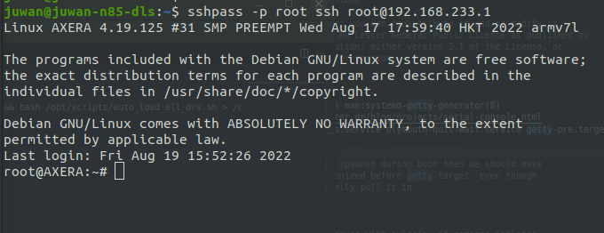

基于上文的烧录系统后，本文介绍使用 Maix-III AXera-Pi 开发板的 Linux debian11 系统基础使用方法。

## 准备工作

开始进行系统的调试使用之前，请先准备好所需的硬件设备，然后参考下方的接线示例正确接好后上电。

1. Maix-III AXera-Pi 开发板
2. 能出 1A 的 USB3.0 口（或是带供电的 usb hub 拓展） 
3. 一张大于 8G 烧录 debian11 的镜像系统卡
4. GC4653 Sensor（自行按需求购入）
5. 5 寸 MIPI屏（自行按需求购入）

图待补充

**供电要求**：由于板子的功耗要求低，可以不用外接 2A 电源使用 usb3.0 1A 即可启动 linux 系统。

### 接线示例

注意：摄像头接线一定要十分注意！！！接反可能会烧坏板子或者是摄像头！！

**接线**：将屏幕（排线反面朝上）接入底板背面接口，组装好后翻正板子在右侧卡槽处插入镜像卡，再接入（排线反面朝上）摄像头并揭开保护盖，可参考示意图进行接线。

<html>
  
  
</html>

### 安装驱动

一般情况下 rndis usb 网卡驱动在 Linux 下可不用安装，在 Windows 下需要按下图手动安装系统自带驱动，而 macos 需要编译安装驱动（horndis），Windows 还需要配置一下网络优先级，如下配置图（勾选微软 rndis 驱动后设置网络跃点数调整优先级）。

驱动安装：[这篇 Ghost 系列 USB 网卡（RNDIS) 使用教程](https://www.foream.com/wiki/docs/mindoc/mindoc-1b2er0dm4pos9)

>[有些同学会遇到 Ubuntu22.04 CH340系列串口驱动（没有ttyUSB）问题，点此查看解决方案.](https://blog.csdn.net/qq_27865227/article/details/125538516)

.. details::点我查看 Win10 下的安装过程

    打开设备管理器找到其他设备，选中 rndis 选择更新驱动程序，在如何搜索设备软件窗口中，选择**浏览计算机查找驱动程序软件（R）**。

    
    再选择**从计算机的设备驱动程序列表中选择（L）**在硬件设备列表中往下拉，找到**网络适配器**，选中**下一步**。

    
    在厂商列表中选择 **Microsoft Corporation**，右侧列表中选择 **USB RNDIS Adapter**。

    

### 工具

.. details::点我查看 MobaXterm 介绍

    MobaXterm 是在 Windows 下使用的全能终端管理软件，而 Linux 系统可以使用 ssh 远程被操作，使用 MobaXterm 进行 ssh 登陆板子直接编辑板内的代码或执行命令，也能方便的拖拽文件上传或下载到电脑里，类似的工具还有 vscode remote 远程登录 linux 服务器。

    

下载链接：[点击跳转](mobaxterm.mobatek.net/download) 获取免费版本即可使用。
使用教程：[如何使用 MobaXterm](https://wiki.sipeed.com/hardware/zh/maixII/M2/tools/mobaxterm.html?highlight=ssh)

.. details::点我查看 vscode remote 介绍
    
    vscode remote 是 vscode 的一个插件，可以直接连接到远程的 linux 服务器，然后在本地编辑代码，同步到远程服务器上编译运行，这里以一台 ubuntu20.04 的桌面计算机系统为例，只要能安装 vscode 编辑器软件计算机都行，这里只是为了示意如何连接到板子里。

下载连接：[点击跳转](https://code.visualstudio.com/)
连接教程：[如何使用 vscode remote 连接板子](https://wiki.sipeed.com/hardware/zh/maixIII/ax-pi/dev_prepare.html?highlight=ssh#vscode-remote)

## 系统登录

### 登录方式

Maix-III AXera-Pi 开发板的 Linux debian11 系统默认使用 root 用户登录。
用户名为 `root`，密码为 `root`，目前板子接入电脑端上电启动后支持以下登录 Linux 系统方式。

- **有线 串口 serial 登陆**

.. details::点我查看 uab uart 接口示意图

    

使用 usb 3.0 连接板子上的 usb uart 接入电脑端，使用前请安装上文的驱动，再使用 MobaXterm 即可连接，默认串口配置为 115200、8N1（波特率115200，8位数据，无奇偶校验，1位停止位）。

**serial 登陆教程**：[点击查看](https://wiki.sipeed.com/hardware/zh/maixII/M2/tools/mobaxterm.html?highlight=ssh#%E8%BF%9E%E6%8E%A5-%E4%B8%B2%E5%8F%A3%28Serial%29)
成功连接后会打印大量调试信息，会弹出登陆账号信息，输入用户名及密码即可登陆。


> 串口通常只提供给专业的驱动开发工程师调试用，会打印大量的调试信息，如感到不适请使用 ssh 登陆。

- **基于 ip + ssh 登录**
.. details::点我查看 uab otg 接口示意图

    

系统默认开启了 usb rndis 虚拟以太网，可以透过有线 usb otg 口连接 usb0 网卡的 ip 192.168.233.1 后使用 ssh 登陆到 linux 系统。
想要无线连接 ssh 需要先登陆板子通过 `ifconfig` 得到板子 Ip 后即可连接，下图的 IP 地址都能登陆板子。


**ssh 连接教程**：[点击跳转](https://wiki.sipeed.com/hardware/zh/maixII/M2/tools/mobaxterm.html?highlight=ssh#%E8%BF%9E%E6%8E%A5-SSH)
按教程示例新建 ssh 会话，双击会话后会有提醒输入账号及密码，输入后按回车即可连接。


### 登录后

登录后，可以使用 `ls` 命令查看当前目录下的文件，使用 `cd` 命令切换目录，使用 `pwd` 命令查看当前目录。

## 系统配置

### 网络配置

Maix-III AXera-Pi 开发板的 Linux 系统默认使用 DHCP 协议获取 IP 地址，可以使用命令行 `ifconfig` 查看当前网络配置，板子根据下述会配置四种网卡类型。

```bash
root@AXERA:~# cat /etc/network/interfaces
# interfaces(5) file used by ifup(8) and ifdown(8)
# Include files from /etc/network/interfaces.d:
source /etc/network/interfaces.d/*

auto lo
iface lo inet loopback

# auto eth0
allow-hotplug eth0
iface eth0 inet dhcp

# auto usb0
allow-hotplug usb0
iface usb0 inet static
address 192.168.233.1
netmask 255.255.255.0

# allow-hotplug wlan0
# wpa-ssid "dalaoshu"
# wpa-psk "junhuanchen"
auto wlan0
iface wlan0 inet manual
wpa-conf /etc/wpa_supplicant/wpa_supplicant.conf
iface wlan0 inet dhcp
```

可以使用命令行 `ifconfig` 查看所有网卡信息。

```bash
root@AXERA:~# ifconfig
eth0: flags=4163<UP,BROADCAST,RUNNING,MULTICAST>  mtu 1500
        inet 192.168.0.77  netmask 255.255.255.0  broadcast 192.168.0.255
        ether 1e:09:dc:e9:1c:29  txqueuelen 1000  (Ethernet)
        RX packets 301  bytes 41433 (40.4 KiB)
        RX errors 0  dropped 0  overruns 0  frame 0
        TX packets 31  bytes 2970 (2.9 KiB)
        TX errors 0  dropped 0 overruns 0  carrier 0  collisions 0
        device interrupt 56

lo: flags=73<UP,LOOPBACK,RUNNING>  mtu 65536
        inet 127.0.0.1  netmask 255.0.0.0
        loop  txqueuelen 1000  (Local Loopback)
        RX packets 16  bytes 1064 (1.0 KiB)
        RX errors 0  dropped 0  overruns 0  frame 0
        TX packets 16  bytes 1064 (1.0 KiB)
        TX errors 0  dropped 0 overruns 0  carrier 0  collisions 0

usb0: flags=4163<UP,BROADCAST,RUNNING,MULTICAST>  mtu 1500
        inet 192.168.233.1  netmask 255.255.255.0  broadcast 192.168.233.255
        ether 02:da:9b:e4:a8:7f  txqueuelen 1000  (Ethernet)
        RX packets 121  bytes 15220 (14.8 KiB)
        RX errors 0  dropped 15  overruns 0  frame 0
        TX packets 35  bytes 7258 (7.0 KiB)
        TX errors 0  dropped 0 overruns 0  carrier 0  collisions 0

wlan0: flags=4163<UP,BROADCAST,RUNNING,MULTICAST>  mtu 1500
        inet 192.168.0.112  netmask 255.255.255.0  broadcast 192.168.0.255
        ether 0c:cf:89:32:c5:c0  txqueuelen 1000  (Ethernet)
        RX packets 950  bytes 154305 (150.6 KiB)
        RX errors 0  dropped 950  overruns 0  frame 0
        TX packets 5  bytes 1398 (1.3 KiB)
        TX errors 0  dropped 0 overruns 0  carrier 0  collisions 0
```

- **lo**：local 的简写，一般指本地环回接口。
- **eth0**：即有线网卡，可使用 `dhclient eth0 &` 手动启动 DHCP 客户端获取 IP 地址，得到 ip 后可以使用 `ifconfig eth0` 命令查看当前网络配置。

默认支持千兆网络，只需要开机前将网线插上去，在启动过程中就会自动配置并联网，可以通过 `apt update` 测试软件源更新。

.. details::点我查看 eth0 接口示意图

    

> dhclient 也支持其他网卡，如 dhclient wlan0

- **wlan0**：无线网卡，使用 DHCP 协议获取 IP 地址，可使用命令 `ifconfig wlan0` 查看当前网络配置。

默认 WIFI 账号密码配置存放在 `/boot/wpa_supplicant.conf` 里，测试过并支持 Android 手机开放的 WPA-PSK2 热点，配置修改后会在重启后生效。

```bash
root@AXERA:~# cat /etc/wpa_supplicant/wpa_supplicant.conf
ctrl_interface=DIR=/var/run/wpa_supplicant GROUP=netdev
update_config=1

network={
    ssid="Sipeed_Guest"
    key_mgmt=WPA-PSK
    psk="qwert123"
}
```

想要更好的命令行网络管理工具请使用 `apt-get install network-manager` 在 20221008 后的镜像已预置。

启用需要 `systemctl enable ModemManager.service` 并在 `nano /etc/NetworkManager/NetworkManager.conf` 里修改成 `：managed=true` 和注释掉 `/etc/network/interfaces` 里的 wlan0 相关配置后重启即可使用 `nmtui-connect` 进行联网，但原来的 `wpa_supplicant.conf` 里的配置会失效，禁用需要 `systemctl disable ModemManager.service` 。

> [配置 NetworkManager 参考](https://support.huaweicloud.com/bestpractice-ims/ims_bp_0026.html#section1) & [linux系统中使用nmtui命令配置网络参数（图形用户界面）](https://www.cnblogs.com/liujiaxin2018/p/13910144.html)

手工操作则需要了解 iwconfig 和 iwlist 命令去管理 WIFI 网卡，例如 WIFI 扫描方法 `iwlist wlan0 scanning`，由于 iwconfig 只支持无密码和 WEP 认证的热点，所以现已不使用这个命令，仅供简单的查询热点或测试 WIFI 的好与坏。

```
root@AXERA:~# iwlist wlan0 scanning
wlan0     Scan completed :
          Cell 01 - Address: 58:41:20:05:07:96
                    ESSID:"Sipeed_Guest"
                    Protocol:IEEE 802.11bgn
                    Mode:Master
                    Frequency:2.412 GHz (Channel 1)
                    Encryption key:on
                    Bit Rates:300 Mb/s
                    Extra:wpa_ie =dd160050f20101000050f20401000050f20401000050f202
                    IE: WPA Version 1
                        Group Cipher : CCMP
                        Pairwise Ciphers (1) : CCMP
                        Authentication Suites (1) : PSK
                    Extra:rsn_ie =30140100000fac040100000fac040100000fac020000
                    IE: IEEE 802.11i/WPA2 Version 1
                        Group Cipher : CCMP
                        Pairwise Ciphers (1) : CCMP
                        Authentication Suites (1) : PSK
                    Quality=100/100  Signal level=100/100
                    Extra:fm =0003
          Cell 02 - Address: 0C:3A:FA:0E:81:7F
                    ESSID:""
                    Protocol:IEEE 802.11bgn
                    Mode:Master
                    Frequency:2.412 GHz (Channel 1)
                    Encryption key:off
                    Bit Rates:144 Mb/s
                    Quality=100/100  Signal level=88/100
                    Extra:fm =0001
          Cell 03 - Address: 64:64:4A:88:7F:06
                    ESSID:"Reachintelligent"
                    Protocol:IEEE 802.11bgn
                    Mode:Master
                    Frequency:2.412 GHz (Channel 1)
                    Encryption key:on
                    Bit Rates:144 Mb/s
                    Extra:rsn_ie =30140100000fac040100000fac040100000fac020c00
                    IE: IEEE 802.11i/WPA2 Version 1
                        Group Cipher : CCMP
                        Pairwise Ciphers (1) : CCMP
                        Authentication Suites (1) : PSK
                    IE: Unknown: DD7B0050F204104A0001101044000102103B00010310470010876543219ABCDEF0123464644A887F04102100067869616F6D69102300045241373210240004303030321042000531323334351054000800060050F20400011011000C5869616F4D69526F75746572100800020000103C0001031049000600372A000120
                    Quality=100/100  Signal level=100/100
                    Extra:fm =0003

```

- **usb0**：USB 虚拟网卡，使用静态 IP 地址（192.168.233.1）这里已经为其配置好 dhcp 服务了，从而避免用户需要手动设置 IP 地址的操作。

**使用 usb0 前需要安装 rndis 驱动**：[跳回安装驱动教程。](https://wiki.sipeed.com/hardware/zh/maixIII/ax-pi/basic_usage.html#%E5%AE%89%E8%A3%85%E9%A9%B1%E5%8A%A8)

USB 网卡会自动 DHCP 配置，直接连接 192.168.233.1 即可，连接方式可参考示意图。

在 Windows 系统下如果遇到多个网卡时，发现 USB 网卡优于局域网导致内网网站访问很慢甚至失败，此时就需要通过 Win10 设置跃点数来调整网络优先级的连接顺序，去修改优先级改善访问慢的状态，数值越大优先级越低（比如设置 1000），从而把 USB 网卡优先级调至最低。



目前所有的网络配置都会在重启后自动生效，如果想要自己手工控制网卡的开关，请了解一下 ifup 或 ifdown 命令的用法，类似 `ifup eth0` 启动 eth0 网卡，`ifdown eth0 --force` 强制关闭 eth0 网卡等。

## 系统更新

### 系统时间

Maix-III AXera-Pi 开发板的 Linux 系统默认使用 NTP 协议获取系统时间，可以使用 `date` 命令查看当前系统时间。

> 如果联网了会自动使用 `ntp-debian` 同步时间，没有同步则说明没有网络，没有同步 `apt update` 更新软件也会失败。

### 安装软件

Maix-III AXera-Pi 开发板的 Linux 系统可以通过 `apt` 更新软件。
比如安装 gcc gdb ffmpeg 等常用 Linux 软件，只需要使用下述命令即可，其他软件安装也同理。

```bash
sudo apt update
sudo apt install gcc gdb ffmpeg
```

.. details::点我查看示例图

    

> 由于 Linux 系统直接断电可能会导致文件系统损坏，如果可以的话建议按下述命令去进行开关机，可以避免一些由于直接断电系统损坏导致的奇怪问题出现。

### 重启系统

Maix-III AXera-Pi 开发板的 Linux 系统可以通过 `reboot` 命令重启，重启命令如下：

```bash
reboot
```

### 关闭系统

Maix-III AXera-Pi 开发板的 Linux 系统可以通过 `poweroff` 命令关闭，关闭命令如下：

```bash
poweroff
```

### 开机启动脚本

系统已经配置好 `/etc/rc.local & /boot/rc.local` 开机脚本。
在这里可以添加开机启动的命令，还可以修改 `#!/bin/sh` 到 `exit 0` 之间的命令。

```bash
root@AXERA:~# cat /etc/rc.local
#!/bin/sh

chmod 755 /opt/scripts/auto_load_all_drv.sh && bash /opt/scripts/auto_load_all_drv.sh > /dev/null 2>&1

# python3 /home/examples/alltest.py > /dev/null 2>&1 &

# export LD_LIBRARY_PATH=/opt/lib:LD_LIBRARY_PATH && /opt/bin/sample_vin_vo -c 2 -e 1 -s 0 -v dsi0@480x854@60

systemctl stop usb-gadget@g0

mkdir -p /mnt/udisk && mount /dev/sda1 /mnt/udisk

python3 /mnt/udisk/alltest.py

export LD_LIBRARY_PATH=/opt/lib:LD_LIBRARY_PATH && /opt/bin/sample_vo -v dsi0@480x854@60 -m 0 &

exit 0

```

**注意**：开机时的执行对象由于没有环境变量，所以不同于登录后运行的 `sample_vo -v dsi0@480x854@60 -m 0 &` 需要修改成 `export LD_LIBRARY_PATH=/opt/lib:LD_LIBRARY_PATH && /opt/bin/sample_vo -v dsi0@480x854@60 -m 0 & ` 才能开机启动，注意要在命令后使用 & 将程序挂在后台执行喔！

.. details::点我查看示例图
    使用上方命令行后，屏幕会显示打彩条图像，可以通过此来验证屏幕是否能用！

    
### 更新内核与驱动

在 SD 卡的第一分区会挂载到系统根目录下的 /boot 系统启动相关的文件，这里直接替换它即可完成更新。

- boot.bin 芯片 spl 初始化程序

- uboot.bin uboot 启动引导程序

- kernel.img linux 内核

- dtb.img linux 设备树

20221001 版本的内核与驱动已经发布，可以挂载镜像从第一分区获取相关文件后替换到 SD 卡的 /boot 目录下，目前 linux 底层还未开源，未来会逐步开源。

## 内置开箱应用

IPCDEMO（商业 ipc 应用）

介绍

提供人脸识别、车牌识别开箱即用的

`/opt/bin/IPCDemo/run.sh /opt/bin/IPCDemo/config/gc4653_config.json`

附图：

效果视频

- https://www.bilibili.com/video/BV1me411T7g8
- https://www.bilibili.com/video/BV1p24y1d7Te

SKEDEMO（暂未开放）

介绍

在展会上运行的效果视频。

附图：

效果视频 https://www.bilibili.com/video/BV1B14y1Y7A4

## 系统外设验证

### 系统预置的资源

Maix-III AXera-Pi 开发板的 Linux 系统预置了一些资源，可以通过 `ls /opt` 命令来查看。

```bash
root@AXERA:~# ls /opt
bin  include  lib  scripts  share
```

还有一些在 home 目录下：

```bash
root@AXERA:~# tree -L 1 /home

├── ax-samples # npu ai sdk

├── examples # 一些示例程序

├── fbv-1.0b # 图片查看器

├── images # 一些测试图片

├── libmaix # pipeline sdk

├── models # 一些 AI 模型

├── res # 一些资源

└── systemd-usb-gadget

8 directories, 0 files
```

板子已经预置了 gcc g++ gdb libopencv ffmpeg 等工具，可直接在板上编译运行程序。

> **注意**：如果使用 xxxx menuconfig 时遇到 `locale.Error: unsupported locale setting` 则可以使用 `sudo localedef -i en_US -f UTF-8 en_US.UTF-8` 恢复一下配置即可。

在 20221001 推出的镜像里内置了 libmaix 和 ax-sample 仓库，可以直接在 home 目录下找到它。
可参考下方使用方法：

```bash
cd /home/libmaix/examples/axpi/
python3 project.py build
fbon
./dist/start_app.sh
```

.. details::点击查看示例效果
    使用命令行后会打印大量数据信息并启动摄像头及屏幕。

    

而 axsample 已经预编译好了，相关 joint 模型内置在 /home/models/ 下。

```bash
/home/ax-samples/build/install/bin/ax_yolov5s -m /home/models/yolov5s.joint -i /home/images/cat.jpg -r 10
fbon
fbv yolov5s_out.jpg
```

.. details::点击查看效果
    输入上方命令后屏幕会显示 yolovs_out.jpg 图像

    

可以在联网后直接 `git pull` 更新仓库的提交记录，如果不能访问 github 就设置一下 `git remote` 从 gitee 拉取代码吧。

### CPU & RAM

默认 800MHz 可以调到 1ghz.

```bash
root@AXERA:~# ax_lookat 0x01900000 -s 33
0x1900000:00000033
root@AXERA:~# ax_clk
AX620A:
DDR:                 3733 MHz
CPU:                 800 MHz
BUS of VPU:         624 MHz
BUS of NPU:         624 MHz
BUS of ISP:         624 MHz
BUS of CPU:         624 MHz
NPU OTHER:         800 MHz
NPU GLB:         24 MHz
NPU FAB:         800 MHz
NPU CORE1:         800 MHz
NPU CORE0:         800 MHz
ISP:                 533 MHz
MM:                 594 MHz
VPU:                 624 MHz
root@AXERA:~# ax_lookat 0x01900000 -s 35
0x1900000:00000035
root@AXERA:~# ax_clk
AX620A:
DDR:                 3733 MHz
CPU:                 1000 MHz
BUS of VPU:         624 MHz
BUS of NPU:         624 MHz
BUS of ISP:         624 MHz
BUS of CPU:         624 MHz
NPU OTHER:         800 MHz
NPU GLB:         24 MHz
NPU FAB:         800 MHz
NPU CORE1:         800 MHz
NPU CORE0:         800 MHz
ISP:                 533 MHz
MM:                 594 MHz
VPU:                 624 MHz
root@AXERA:~#
```

目前硬件内存虽然是 2g 但在系统上只能看到 745M ，不用担心，这是目前的分配内存过于保守导致的，后续更新内核调整一下 NPU 和 CMM 的内存分配的。

### VIDEO

目前系统的摄b像头驱动不经过 v4l2 驱动框架，所以必须通过代码配置的方式进行启用，相关摄像头驱动都是在应用层上完成的。

- gc4653 （基础版）
- os04a10（夜视版）

目前默认使用的是 gc4653 ，使用 os04a10 需要改一下 -c 2 为 -c 0，如下示意。

```bash
sample_vin_vo -c 2 -e 1 -s 0 -v dsi0@480x854@60
```

.. details::运行上方命令后可看到画面（示例效果）
    图片待上传


> **注意**
> 1. 使用时遇到摄像头连接不上，可通过 i2c 扫一下是否存在设备来排查问题。
> 2. 切换 os04a10 摄像头时报错，修改下 libmaix_cam.cpp 把 `SYS_CASE_SINGLE_Gc4653` 改成 `SYS_CASE_SINGLE_OS04A10` 即可。

### DISPLAY

目前系统默认使用的是最简单的 framebuffer 显示驱动（/dev/fb0），在系统里内置了 fbon / fboff / fbv xxx.jpg 三个命令负责管理 fb 设备的启用和现实。

```bash
fbon

fbv /home/res/logo.png

fboff
```


想要使用 libdrm 需要搭配代码使用，请参考 sdk 源码实现，目前系统还未移植好 gpu 驱动，无法使用 modetest 进行测试。

> 测试屏幕好坏可以用：`sample_vo -v dsi0@480x854@60 -m 0` 运行后屏幕会打彩条，但使用前务必调用 fboff 关闭 fb 设备。

### NPU

测试 NPU 的示例程序在 /home/ax-samples/build/install 目录下，已经预编译好了，直接就可以调用并显示运行结果。

```fbon
/home/ax-samples/build/install/bin/ax_yolov5s -m /home/models/yolov5s.joint -i /home/images/cat.jpg -r 10
fbv yolov5s_out.jpg
```

### AUDIO

和桌面系统保持一致，直接可用 alsa-utils 进行测试。

- **测试脚本**：`speaker-test -t sine -f 440 -c1`
- **播放音频**：`aplay test.wav`
- **录制音频**；`arecord test.wav -c 2 -d 2`

录音回放的 `python3` 代码如下：

```python
import pyaudio
try:
    chunk = 1024      # Each chunk will consist of 1024 samples
    sample_format = pyaudio.paInt16      # 16 bits per sample
    channels = 2      # Number of audio channels
    fs = 44100        # Record at 44100 samples per second
    time_in_seconds = 30
    p = pyaudio.PyAudio()
    stream = p.open(format=sample_format,
                    channels = channels,
                    rate = fs,
                    frames_per_buffer = chunk,
                    input = True, output = True)
    # Store data in chunks for 3 seconds
    for i in range(0, int(fs / chunk * time_in_seconds)):
        data = stream.read(chunk)
        stream.write(data)
finally:
    # Stop and close the Stream and PyAudio
    stream.stop_stream()
    stream.close()
    p.terminate()
```

可以在 alsamixer 配置你的设备，如果不了解的话建议不要修改。


### USB

我们在 debian 系统上配置了 usb-gadget@g1 和 usb-gadget@g0 两个服务。

- **配置虚拟网卡 RNDIS usb0 有线 ssh 登录**

默认就会启动配置 `systemctl enable usb-gadget@g0`，停止开机启动用 `systemctl disable usb-gadget@g0`，停止服务用`systemctl stop usb-gadget@g0`。

此时使用命令 `sshpass -p root ssh root@192.168.233.1` 即可连接，账号及密码都是 root 。


- **配置虚拟串口 /dev/ttyGS0 并转发登录接口**

停止 usb-gadget@g0 后使用 `systemctl start usb-gadget@g1` 即可看到，然后使用 `systemctl start getty@ttyGS0` 即可转发串口终端到 usb 的虚拟串口上。


- **如何使用 USB HOST 读取一个 256M 的 SD 卡**
先关了 otg 的 rndis 后再 lsusb 就可以看到了。

> 系统同一个时刻只有一种 usb 设备方向，要么上 otg 模式变成串口、网卡接电脑，要么是 host 模式接鼠标键盘U盘，不能同时使用。

```bash
root@AXERA:~# systemctl stop usb-gadget@g0
root@AXERA:~# lsusb
Bus 002 Device 001: ID 1d6b:0003 Linux Foundation 3.0 root hub
Bus 001 Device 002: ID 067b:2731 Prolific Technology, Inc. USB SD Card Reader
Bus 001 Device 001: ID 1d6b:0002 Linux Foundation 2.0 root hub
root@AXERA:~# fdisk -l
Disk /dev/mmcblk2: 58.94 GiB, 63281561600 bytes, 123596800 sectors
Units: sectors of 1 * 512 = 512 bytes
Sector size (logical/physical): 512 bytes / 512 bytes
I/O size (minimum/optimal): 512 bytes / 512 bytes
Disklabel type: dos
Disk identifier: 0x32eb5429

Device         Boot  Start       End   Sectors  Size Id Type
/dev/mmcblk2p1 *      2048    264191    262144  128M  c W95 FAT32 (LBA)
/dev/mmcblk2p2      264192 123596799 123332608 58.8G 83 Linux


Disk /dev/sda: 240 MiB, 251658240 bytes, 491520 sectors
Disk model: SD Card Reader
Units: sectors of 1 * 512 = 512 bytes
Sector size (logical/physical): 512 bytes / 512 bytes
I/O size (minimum/optimal): 512 bytes / 512 bytes
Disklabel type: dos
Disk identifier: 0x0607cfd2

Device     Boot Start    End Sectors   Size Id Type
/dev/sda1  *      240 490239  490000 239.3M  e W95 FAT16 (LBA)
root@AXERA:~# mkdir /mnt/sdcard && mount /dev/sda1 /mnt/sdcard
```

一步到位挂载 U 盘第一分区的命令 `systemctl stop usb-gadget@g0 && lsusb && mkdir -p /mnt/udisk && mount /dev/sda1 /mnt/udisk`

### GPIO

#### 读取 KEY 按键输入：GPIO2 21

```bash
echo 85  > /sys/class/gpio/export
echo in > /sys/class/gpio/gpio85/direction
cat /sys/class/gpio/gpio85/value
```

#### 点亮 LED 灯 GPIO2 A4-A5 68-69

```bash
echo 68  > /sys/class/gpio/export
echo out > /sys/class/gpio/gpio68/direction
echo 1 > /sys/class/gpio/gpio68/value
sleep 1
echo 0 > /sys/class/gpio/gpio68/value
sleep 1
echo 1 > /sys/class/gpio/gpio68/value
```

> 计算规则 GPIO2 A4 == 32 *  2 + 4 = 68
对于爱芯的芯片，GPIO0 和 GPIO2 对应 A 和 C ，此处 A4 并不代表 GPIO2 只是序号。
也就是 GPIO2 A4 在标准设备中的定义为 GPIO C(2) 4(A4) 同理 GPIOA0 对应 GPIO0A4。

以后主流会统一到 PA0 或 PC4 这类定义，方便不同芯片共同定义。

### UART

系统输出默认是 **ttyS0** ，排针上的是 **ttyS1** ，而虚拟串口是 **ttyGS0**。


可用 `python3 pyserial` 库来测试功能的好与坏，但是需要注意排针丝印可能不准确。
如果出现串口的 tx 和 rx 没有数据的话可以反接一下，以及确保是共地的。

```python
import serial
ser = serial.Serial('/dev/ttyS1', 115200, timeout=1)
ser.write(b'hello world\n')
ser.close()
```

### PWM

> pwm0 被锁在屏幕背光了，目前在系统上还没有开 debugfs 或 sysfs 接口去控制。

以 pwm1 示意

```bash
echo 1 > /sys/class/pwm/pwmchip0/export
echo 4167 > /sys/class/pwm/pwmchip0/pwm1/period
echo 2084 > /sys/class/pwm/pwmchip0/pwm1/duty_cycle
echo 1 > /sys/class/pwm/pwmchip0/pwm1/enable
```

### I2C

使用 i2c-tools 工具包，可使用 i2cdetect -y 0 来查看 i2c 总线上的设备。

```bash
root@AXERA:~# i2cdetect -y -r 0
     0  1  2  3  4  5  6  7  8  9  a  b  c  d  e  f
00:                         -- -- -- -- -- -- -- --
10: -- -- -- -- -- -- -- -- -- -- -- -- -- -- -- --
20: -- 21 -- -- -- -- -- -- -- -- -- -- -- -- -- --
30: -- -- -- -- -- -- 36 -- -- -- -- -- -- -- -- --
40: -- -- -- -- -- -- -- -- -- -- -- -- -- -- -- --
50: -- -- -- -- -- -- -- -- -- -- -- -- -- -- -- --
60: -- -- -- -- -- -- -- -- -- -- -- -- -- -- -- --
70: -- -- -- -- -- -- -- --
root@AXERA:~#
```

这里 **0x21** 和 **0x36** 就代表的板子在 cam0 这个排线上的 /dev/i2c-0 设备存在某个摄像头的 i2c 设备，而读写可用 i2cget 和 i2cset 命令，与其他芯片皆为同理。

### SPI

可参考右边同理事例：[为 AW V831 配置 spidev 模块，使用 py-spidev 进行用户层的 SPI 通信。](https://www.cnblogs.com/juwan/p/14341406.html)

```
root@AXERA:~# ./spidev_test -D /dev/spidev1.0 -v
spi mode: 0x0
bits per word: 8
max speed: 500000 Hz (500 KHz)
TX | FF FF FF FF FF FF 40 00 00 00 00 95 FF FF FF FF FF FF FF FF FF FF FF FF FF FF FF FF FF FF F0 0D  | ......@....�..................�.
RX | FF FF FF FF FF FF 40 00 00 00 00 95 FF FF FF FF FF FF FF FF FF FF FF FF FF FF FF FF FF FF F0 0D  | ......@....�..................�.
root@AXERA:~# ./spidev_test -D /dev/spidev1.0 -v
spi mode: 0x0
bits per word: 8
max speed: 500000 Hz (500 KHz)
TX | FF FF FF FF FF FF 40 00 00 00 00 95 FF FF FF FF FF FF FF FF FF FF FF FF FF FF FF FF FF FF F0 0D  | ......@....�..................�.
RX | FF FF FF FF FF FF FF FF FF FF FF FF FF FF FF FF FF FF FF FF FF FF FF FF FF FF FF FF FF FF FF FF  | ................................
root@AXERA:~# ./spidev_test -D /dev/spidev1.0 -v
spi mode: 0x0
bits per word: 8
max speed: 500000 Hz (500 KHz)
TX | FF FF FF FF FF FF 40 00 00 00 00 95 FF FF FF FF FF FF FF FF FF FF FF FF FF FF FF FF FF FF F0 0D  | ......@....�..................�.
RX | FF FF FF FF FF FF FF FF FF FF FF FF FF FF FF FF FF FF FF FF FF FF FF FF FF FF FF FF FF FF FF FF  | ................................
```

### ADC（暂未支持）

硬件上支持，但软件上目前还没写调试工具配合。
可参考外围开发手册，这需要专用的代码控制，目前还没有全部补充完。

1. 设置 THM 寄存器
2. 中间需要 delay 一段时间，否则读取出来的值，可能不对.
3. 0x2000028 寄存器读取出来的值 DATA
4. DAT 和 voltage 的对应关系，voltage = DATA / 1024 * VREF(1.8V)
5. 如果读取 chan1/2/3/4，需要读取 0x200002c，0x2000030，0x2000034，0x2000038

使能 ADC 通道
devmem 0x2000020 32 0x1000 //chan0
devmem 0x2000020 32 0x800 //chan1
devmem 0x2000020 32 0x400 //chan2
devmem 0x2000020 32 0x200 //chan3
devmem 0x2000020 32 0x100 //chan4

devmem 0x200002c
devmem 0x2000030
devmem 0x2000034
devmem 0x2000038

## 出厂测试脚本

```python
test_flag = False

try:
    from gpiod import chip, line, line_request
    config = None # rpi is default value A 0
    def gpio(gpio_line=0, gpio_bank="a", gpio_chip=0, line_mode = line_request.DIRECTION_OUTPUT):
        global config
        if config != None and gpio_line in config:
            gpio_bank, gpio_chip = config[gpio_line]
        l, c = [32 * (ord(gpio_bank.lower()[0]) - ord('a')) + gpio_line, chip("gpiochip%d" % gpio_chip)]
        tmp = c.get_line(l)
        cfg = line_request() # led.active_state == line.ACTIVE_LOW
        cfg.request_type = line_mode # line.DIRECTION_INPUT
        tmp.request(cfg)
        tmp.source = "GPIO chip %s bank %s line %d" % (gpio_chip, gpio_bank, gpio_line)
        return tmp
    def load(cfg=None):
        global config
        config = cfg
except ModuleNotFoundError as e:
    pass

key = gpio(21, gpio_chip=2, line_mode = line_request.DIRECTION_INPUT)
led0 = gpio(4, gpio_chip=2, line_mode = line_request.DIRECTION_OUTPUT)
led1 = gpio(5, gpio_chip=2, line_mode = line_request.DIRECTION_OUTPUT)

import time
import ifcfg
import os

def check_ifconfig():
    result = []
    for name, interface in ifcfg.interfaces().items():
        if name in ['eth0', 'wlan0'] and interface['inet']:
            result.append(name)
    return result

try:
    if (0 == key.get_value()):
        os.system("export LD_LIBRARY_PATH=/opt/lib:LD_LIBRARY_PATH && /opt/bin/sample_vin_vo -c 2 -e 1 -s 0 -v dsi0@480x854@60 &")
        led1.set_value(1)
        while True:
            led0.set_value(1)
            time.sleep(0.2)
            led0.set_value(0)
            time.sleep(0.2)
            tmp = check_ifconfig()
            if len(tmp) > 1:
                led0.set_value(0)
                led1.set_value(0)
                test_flag = True
                break
        while (0 == key.get_value()):
            time.sleep(0.2)
        os.system("aplay /home/res/boot.wav")
        led0.set_value(1)
        led1.set_value(1)
        import pyaudio
        chunk = 1024      # Each chunk will consist of 1024 samples
        sample_format = pyaudio.paInt16      # 16 bits per sample
        channels = 2      # Number of audio channels
        fs = 44100        # Record at 44100 samples per second
        p = pyaudio.PyAudio()
        stream = p.open(format=sample_format,
                        channels = channels,
                        rate = fs,
                        frames_per_buffer = chunk,
                        input = True, output = True)
        while (1 == key.get_value()):
            data = stream.read(chunk, exception_on_overflow = False)
            stream.write(data)
        while (0 == key.get_value()):
            time.sleep(0.2)
        os.system('killall sample_vin_vo')
        os.system('killall sample_vin_vo')
        # Stop and close the Stream and PyAudio
        stream.stop_stream()
        stream.close()
        p.terminate()
except Exception as e:
    print(e)
finally:
    if test_flag:
        led0.set_value(0)
        led1.set_value(0)

'''

import pyaudio
try:
    chunk = 1024      # Each chunk will consist of 1024 samples
    sample_format = pyaudio.paInt16      # 16 bits per sample
    channels = 2      # Number of audio channels
    fs = 44100        # Record at 44100 samples per second
    time_in_seconds = 300
    p = pyaudio.PyAudio()
    stream = p.open(format=sample_format,
                    channels = channels,
                    rate = fs,
                    frames_per_buffer = chunk,
                    input = True, output = True)
    for i in range(0, int(fs / chunk * time_in_seconds)):
        data = stream.read(chunk)
        stream.write(data)
finally:
    # Stop and close the Stream and PyAudio
    stream.stop_stream()
    stream.close()
    p.terminate()

'''
```
