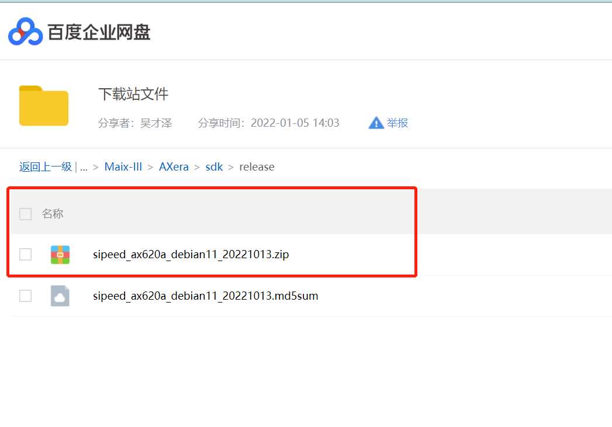
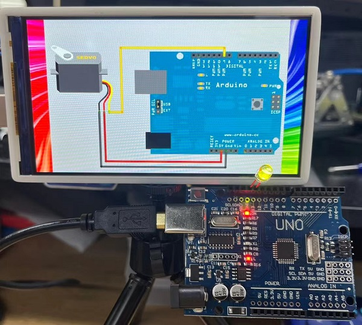
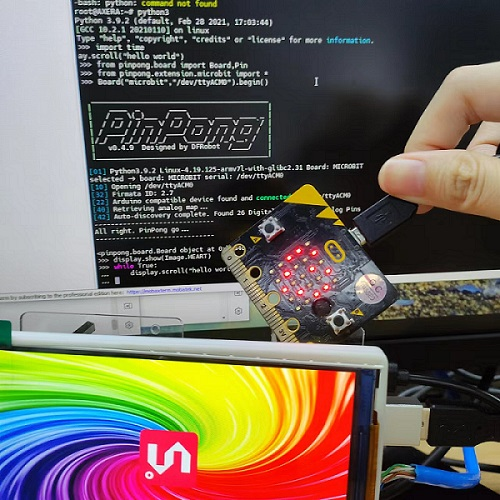

---

## 上手指南

为了让小伙伴们轻松、快速、平稳地把产品用起来，我们准备了新手初学者上手指南：

### Linux 系统简介

**AXera-Pi 默认板卡没有存储介质，因此需要准备一张系统卡来启动设备。**

目前 AXera-Pi 提供的是 Debian11 Bullseye 镜像，[Ubuntu 源自 Debian，这意味着 Ubuntu 使用与 Debian 相同的 apt 打包系统，并共享来自 Debian 存储库的大量软件包和库，利用 Debian 基础设施作为基础。 大多数“派生” Linux 发行版，它们使用相同的包管理系统并与基于的发行版共享软件包。](https://zhuanlan.zhihu.com/p/426219868)

>  
> [选择 Debian 的理由](https://www.debian.org/intro/why_debian)

[官方淘宝店](https://sipeed.taobao.com/)可以购买预烧录系统镜像的 SD 卡，否则就需要自己进行以下的操作来准备 SD 镜像卡。

### 选择 SD 卡

> 已在官方购买镜像卡的同学跳过这一步骤，直接在设备插入 TF 卡[ 点击查看 ](#%E5%90%AF%E5%8A%A8-Linux-%E7%B3%BB%E7%BB%9F)启动 Linux 系统。

为了方便用户有更多的选择，我们对部分 SD 卡在 AXera-Pi 板子上进行了读写测速。


> 因为部分 SD 卡是后面陆续才进行测试，没有一一单独拍照但可以根据型号辨认。

| 序号 | 型号                                     | <p style="white-space:nowrap">写入速度（写入量 160MB）</p> | <p style="white-space:nowrap">读取速度（读取量 160MB） </p> |
| ---- | ---------------------------------------- | ---------------------------------------------------------- | ----------------------------------------------------------- |
| 1.   | Netac 朗科 A2 P500-超高速-64GB 存储卡    | 2.04697 s, 80.0 MB/s                                       | 1.8759 s, 87.3 MB/s                                         |
| 2.   | 三星 microSDXC UHS-I 128G 存储卡（蓝卡） | 2.53387 s, 64.7 MB/s                                       | 1.99882 s, 82.0 MB/s                                        |
| 3.   | EAGET TF 卡（T1 系列）64G 存储卡         | 6.56955 s, 24.9 MB/s                                       | 7.13792 s, 23.0 MB/s                                        |
| 4.   | 京东 高性能 microSDXC UHS-I 128G 存储卡  | 2.28133 s, 71.8 MB/s                                       | 1.92001 s, 85.3 MB/s                                        |
| 5.   | KIOXIA microSDXC UHS-I 32G 存储卡        | 6.71284 s, 24.4 MB/s                                       | 2.36794 s, 69.2 MB/s                                        |
| 6.   | Netac 朗科 A1 32GB 存储卡                | 4.31411 s, 38.0 MB/s                                       | 2.00759 s, 81.6 MB/s                                        |
| 7.   | BanQ JOY card 白金 64G 存储卡            | 9.08105 s, 18.0 MB/s                                       | 9.02843 s, 18.1 MB/s                                        |
| 8.   | 海康威视 HS -TF- P2 64G 存储卡           | 2.28079 s, 71.8 MB/s                                       | 1.87698 s, 87.3 MB/s                                        |

下面为没有拍照但是测速过的卡：

| 序号 | 型号                                                  | <p style="white-space:nowrap">写入速度（写入量 160MB）</p> | <p style="white-space:nowrap">读取速度（读取量 160MB） </p> |
| ---- | ----------------------------------------------------- | ---------------------------------------------------------- | ----------------------------------------------------------- |
| 1.   | 雷克沙（Lexar）64GB TF（MicroSD）存储卡 C10 U3 V30 A2 | 2.59644 s, 63.1 MB/s                                       | 1.9106 s, 85.8 MB/s                                         |
| 2.   | 雷克沙（Lexar）128GB TF（MicroSD）存储卡 C10 U3 V30   | 6.73793 s, 24.3 MB/s                                       | 6.94079 s, 23.6 MB/s                                        |

### 烧录 Linux 系统


因为开发板上的 EMMC 仅默认预留焊盘，所以需要从 TF 卡启动 Linux Debian 系统。

#### 如何获取镜像？

因为镜像文件比较大，因此仅提供百度云下载链接。

前往百度云[点击进入下载页面](https://pan.baidu.com/s/1-UtDoAVP6spwqjHP2wneJA)，输入提取码 `sdls` 即可下载文件，镜像包与校验文件都已经放在里面了。



其中拓展名为 `img.xz` 的是压缩文件，我们就是需要烧录这个文件，拓展名是 `img.xz.md5sum` 的是校验文件，可以用来校压缩文件的完整性。

镜像压缩文件命名的组成为：`镜像提供方` _ `适用芯片` _ `Linux 发行版` _ `镜像时间` + `img.xz`

校验文件需要在 Linux 环境中使用，windows10 及以上的用户可以使用 wsl 来提供 Linux 环境

使用命令为在镜像文件和校验文件共同存在的目录使用 `md5sum -c *.md5sum*`，就可以来查看完整性了。

| 校验成功                                                       | 校验失败                                                     |
| -------------------------------------------------------------- | ------------------------------------------------------------ |
|  |  |

可以看到校验失败的话会消失 FAILED。当然通常不需要进行校验，这里只是给有需要的人提前预留一下。

#### 如何烧录镜像？

**烧录前我们需要进行以下准备：**

- 一张容量大于 8G 的 SD 卡；建议购买官方镜像卡，不然可能会因为 SD 卡质量差而带来糟糕的体验
- 一个读卡器：建议使用支持 USB3.0 的读卡器，不然会因为读卡器的速度过低会使烧录时间过长
- [Etcher](https://www.balena.io/etcher/)软件：根据自身电脑下载对应版本的软件即可

**镜像系统烧录方法：**

首先运行 [Etcher](https://www.balena.io/etcher/ "Etcher") 软件，点击 `Flash from file` 选中已经下载好的 `img.xz` 文件镜像，然后点击 `Select target` 选中 SD 卡，最后点击 `Flash` 进行烧录等待完成即可。

**烧录镜像文件到 SD 卡：**


| 烧录中                                                                          | 烧录完成                                                    |
| ------------------------------------------------------------------------------- | ----------------------------------------------------------- |
|  |  |

需要注意的是在烧录完成后显示的应该是 `Flash Complete!`，并且显示的是 `Successful` 。

进行完上述操作后，电脑可能会提示需要格式化 U 盘，这个时候我们直接忽略这个提示（因为在 Etcher 软件里面已经烧录完成且 `Successful` 了），将内存卡取下，准备安装到板子上准备使用。

#### 烧录问题

##### 1. 使用 Etcher 选择镜像的后出现错误

可以重新运行 Etcher 来解决该软件由于缓存等问题而造成的加载错误

##### 2. 结束烧录后提示的是 Failed

重新一次烧录内存卡镜像

<!-- > **注意**：如果出现烧录失败的情况，请手动格式化一下 SD 卡，Windows 和 MacOS 可以使用 [SD Card Formatter](https://www.sdcard.org/downloads/formatter/eula_windows/SDCardFormatterv5_WinEN.zip)来格式化 SD 卡，Linux 系统可以使用系统的 disk 工具或 [Gparted](https://gparted.org/)来格式化。 -->

### 启动 Linux 系统

完成上面的烧录镜像卡后，接着接可以组装板子了。


#### 如何连接外设和配件？

> 购买全功能套餐的同学们跳过装配步骤[点击前往](#如何启动-AXera-Pi-？)上电启动 AXera-Pi 设备登录 Linux 系统即可。

**接线前我们需要进行准备工作：**

- 一块 AXera-Pi 开发板
- 至少一个 USB3.0 的电脑接口来连接板子（USB2.0 的供电不足可能导致板子启动失败）
- 一张已经烧录适用于 m3axpi 的系统镜像的 SD 卡
- GC4653 Sensor 普通版摄像头 或者 OS04a10 Sensor 夜视版摄像头
- 配套的 5 寸 MIPI 屏


**可参考以下示例避免误接：**

将屏幕**（排线反面朝上）**接入底板背面 LCD 接口，组装好后翻正板子在最右侧的卡槽处插入已烧录好的镜像卡，再接入**（认准蓝色线序在上）**摄像头并揭开保护盖。

<html>
  
  
</html>

#### 如何启动 AXera-Pi ？

把设备的 `USB-UART` 及 `USB-OTG` 接口用 USB type-c 线全部接入 PC 端通电后设备会自启。


> 在 **20221013** 后设备通电开机会从耳机播放音乐和点亮出厂的 5 寸屏幕，并在串口输出如下的 debian11 系统启动日志（截取部分日志如下）.[有些同学会遇到 Ubuntu22.04 CH340 系列串口驱动（没有 ttyUSB）问题，点此查看解决方案](https://blog.csdn.net/qq_27865227/article/details/125538516)。

.. details:: 点击查看 debian11 系统启动日志

    ```bash
    Vddr init success!
    The system boot form EMMC
    enter boot normal mode

    U-Boot 2020.04 (Jun 16 2022 - 00:16:34 +0800)

    Model: AXERA AX620_demo Board
    DRAM:  1 GiB
    NAND:  unknown raw ID 77ee0178
    uclass_get_device: Invalid bus 0 (err=-524)
    0 MiB
    initr_pinmux: delay pinmux_init for env board id
    MMC:   enter sdhci_cdns_get_cd call mmc_getcd
    enter sdhci_cdns_get_cd call mmc_getcd
    mmc@10000000: 0, mmc@4950000: 1
    Loading Environment from MMC... OK
    In:    serial
    Out:   serial
    Err:   serial
    MMC: no card present
    sd card is not present
    enter normal boot mode
    Net:
    reset EMAC0: ethernet@0x4970000 ...
    Warning: ethernet@0x4970000 (eth0) using random MAC address - 6a:e4:fd:58:97:ea
    eth0: ethernet@0x4970000
    Hit any key to stop autoboot:  0
    reading DTB and BOOT image ...
    reading bootimg header...
    MAGIC:       AXERA!
    img size:    4841536
    kernel_size: 4841472
    kernel_addr: 64
    id:bc 19 bb a7 2d 27 74 de 7c 91 4b 70 ea c9 ab 96 50 61 bd e0 2b 02 8b e5 c8 ee 22 ce df b1 cf ea
    load kernel image addr = 0x40008000,load dtb image addr = 0x48008000
    boot cmd is :bootm 0x40008000 - 0x48008000
    ## Booting kernel from Legacy Image at 40008000 ...
      Image Name:   Linux-4.19.125
      Image Type:   ARM Linux Kernel Image (uncompressed)
      Data Size:    4839952 Bytes = 4.6 MiB
      Load Address: 40008000
      Entry Point:  40008000
      Verifying Checksum ... OK
    ## Flattened Device Tree blob at 48008000
      Booting using the fdt blob at 0x48008000
      Loading Kernel Image
      Using Device Tree in place at 48008000, end 480103d6

    Starting kernel ...


    Welcome to Debian GNU/Linux 11 (bullseye)!

    [  OK  ] Created slice system-getty.slice.
    [  OK  ] Created slice system-modprobe.slice.
    [  OK  ] Created slice system-serial\x2dgetty.slice.
    [  OK  ] Created slice User and Session Slice.
    [  OK  ] Started Dispatch Password …ts to Console Directory Watch.
    [  OK  ] Started Forward Password R…uests to Wall Directory Watch.
    [  OK  ] Reached target Local Encrypted Volumes.
    [  OK  ] Reached target Network is Online.
    ......
    ```

### 登录到板子里

> 当 **AXera-Pi** 出现上述 logo 画面后代表开机成功，这时我们把板子当做一台 Linux 服务器来对待。


通过**「系统登录方式」**快速帮助用户了解如何登录到设备里的 Linux 系统，用户可以选择 `USB-UART 串口` 或 `USB-OTG SSH` 登录，可点击[**「系统使用手册-登录方式」**](https://wiki.sipeed.com/hardware/zh/maixIII/ax-pi/basic_usage.html#%E7%B3%BB%E7%BB%9F%E7%99%BB%E5%BD%95)前往查看，以下文 USB-OTG 口的 usb0 网卡（192.168.233.1）作为 ssh 登录的 ip 进入板子为例。

```bash
juwan@juwan-n85-dls:~/sipeed_wiki$ sshpass -p root ssh root@192.168.233.1
Linux AXERA 4.19.125 #53 SMP PREEMPT Tue Sep 13 13:16:27 HKT 2022 armv7l

The programs included with the Debian GNU/Linux system are free software;
the exact distribution terms for each program are described in the
individual files in /usr/share/doc/*/copyright.

Debian GNU/Linux comes with ABSOLUTELY NO WARRANTY, to the extent
permitted by applicable law.
Last login: Wed Oct 12 16:43:43 2022 from 192.168.233.10
root@AXERA:~# screenfetch
        _,met$$$$$gg.           root@AXERA
      ,g$$$$$$$$$$$$$$$P.        OS: Debian
    ,g$$P""       """Y$$.".      Kernel: armv7l Linux 4.19.125
  ,$$P'              `$$$.      Uptime: 2d 3h 5m
  ',$$P       ,ggs.     `$$b:    Packages: 785
  `d$$'     ,$P"'   .    $$$     Shell: bash 5.1.4
  $$P      d$'     ,    $$P     Disk: 2.6G / 3.6G (77%)
  $$:      $$.   -    ,d$$'     CPU: ARMv7 rev 5 (v7l) @ 4x 1.248GHz
  $$\;      Y$b._   _,d$P'      RAM: 88MiB / 744MiB
  Y$$.    `.`"Y$$$$P"'
  `$$b      "-.__
    `Y$$
    `Y$$.
      `$$b.
        `Y$$b.
            `"Y$b._
                `""""

root@AXERA:~# ax_clk
AX620A:
DDR:            3733 MHz
CPU:            800 MHz
BUS of VPU:     624 MHz
BUS of NPU:     624 MHz
BUS of ISP:     624 MHz
BUS of CPU:     624 MHz
NPU OTHER:      800 MHz
NPU GLB:        24 MHz
NPU FAB:        800 MHz
NPU CORE1:      800 MHz
NPU CORE0:      800 MHz
ISP:            533 MHz
MM:             594 MHz
VPU:            624 MHz
root@AXERA:~#
```

<!-- 由上文我们可以知道板子的基础信息，在 **20221202** 后更新的镜像包里已经开放了 1.22G 的用户空间。 -->
<!-- 我们可以跟着指南往下看学会把板子用起来！ -->
<!-- 我们可以知道板子的基础信息，目前默认是用 800Mhz 来跑，而且内存分配较保守能留给用户的空间内存不到 1GB，但不用担心，板子贴得内存最小都得是 2G 的，所以之后会通过更新内核开放更多内存给用户空间。 -->

### 学会使用板子


由于默认没有配置桌面环境（只显示 logo），所以我们需要将 **AXera-Pi** 连接一台电脑，通过终端管理软件（shell）与它进行命令行交互，这些可以在[「系统使用手册-验证外设」](https://wiki.sipeed.com/hardware/zh/maixIII/ax-pi/basic_usage.html#%E9%AA%8C%E8%AF%81%E7%B3%BB%E7%BB%9F%E5%A4%96%E8%AE%BE)学会板上所有验证过的系统调频、外设、驱动、应用等资源的用法，像一些 Linux 操作基础、如何控制 I2C / UART / SPI 这些硬件设备的操作，还可以在[「系统使用手册-内置 AI 应用」](https://wiki.sipeed.com/hardware/zh/maixIII/ax-pi/basic_usage.html#%E9%AA%8C%E8%AF%81%E7%B3%BB%E7%BB%9F%E5%A4%96%E8%AE%BE)里调用内置的开箱 AI 应用及例程，快去用起来吧！


### 试试 Python 编程（适用初学者）

基于这篇上手指引的一路走下来的学习，相信小伙伴们也基本对 **AXera-Pi** 基础使用以及验证外设有一定的掌握了，那我们就踏入编程的世界，一起来试试 Python 编程吧！

- [试试 Python 编程](https://wiki.sipeed.com/hardware/zh/maixIII/ax-pi/python_api.html)

我们内置了以 `jupyter notebook/ax-pipline-api/pinpong` 等 Python 包，你可以在**「试试 Python 编程」**里获得如何在 **AXera-Pi** 上进入 Python 模式启动 `jupyter notebook` 并使用运行 AI 模型。


以及如何连接 **Arduino UNO** 以及 **Microbit** 进行 Python 编程的效果如下图。

<html>
  
  
</html>

### 准备 C/C++ 编程（适用开发者）

能走到这里就说明板子已经用起来了，那就来开发吧！在这之前需要**「准备开发环境」**了解如何拷贝文件到板子里，如何搭建本地编译或交叉编译，然后通过**「SDK 开发指南」**学习到如何基于现有的代码进行开发。

- [准备开发环境](https://wiki.sipeed.com/hardware/zh/maixIII/ax-pi/dev_prepare.html)

快速了解现在提供哪些开源代码仓库以及用法，这些开源仓库会持续更新和开放的。

- [SDK 开发指南](https://wiki.sipeed.com/hardware/zh/maixIII/ax-pi/sdk_usage.html)


### 训练模型部署

初学者训练模型可以从 [AI 开发指南](https://wiki.sipeed.com/ai/zh/deploy/ax-pi.html) 学习如何训练一个最简单的模型到量化转换部署测试。

更专业更深入的调优需要了解 [Pulsar](https://pulsar-docs.readthedocs.io/) ，这是由**「爱芯元智」**自主研发的 all-in-one 神经网络编译器，充分发挥片上异构计算单元(CPU+NPU)算力， Pulsar 工具链核心功能是将 .onnx 模型编译成芯片能解析并运行的 （.joint） 模型。

目前有以下几种部署方式（Pipeline）推荐：

- **libmaix**：并不在意程序的性能和效率，用最快的方式把摄像头图像输入 AI 模型后输出识别结果绘制到显示到屏幕上验证一下识别效果。

- **ax-pipeline**：没有多余的封装，直接操作芯片核心资源 vin \ ivps \ npu \ vo 等硬解设备进行部署开发，可以使模型部署达到一个非常好的效果。

- **IPCDemo**：以效果最好、性能最好、占用最少、稳定可靠、功能最多、确保最终能部署到用户的现场不出问题的框架代码来开发 AI 程序。

#### libmaix 部署

在板子上编译这个示例代码 [axpi_classification_cam](https://github.com/sipeed/libmaix/tree/release/examples/axpi_classification_cam)，然后放入模型运行后即可看到效果，截止 **20221013** 前代码还没有优化所以性能不高只够看个结果，想要效果和性能可以看 **ax-pipeline** 部署。

<p align="center">
  
</p>

即可验证效果：[详细可从 maixhub 上获取](https://maixhub.com/model/zoo/89)。

#### ax-pipeline 部署

以上的部署方式都出于快速验证或应用落地的角度进行的，还有一套基于 **bsp sdk** 的 [ax-pipeline](https://github.com/AXERA-TECH/ax-pipeline) 部署方式，它面向既了解 AI 又知道芯片底层 Linux 开发方法的同学，目前内置应用中提供了板子的 **rtsp** 和屏幕双推流 **yolov5** 实时识别以及新增 **yolov5s-seg** 实例分割的程序就是来自于它。


#### IPCDemo 部署

这是一个典型的 IPC 演示程序，源码在这里 [axpi_bsp_sdk IPCDemo](https://github.com/sipeed/axpi_bsp_sdk/tree/main/app/IPCDemo) ，其中 IPCDemo 的功能模块有：

- ISP：负责从 Sensor 获取图像 RAW 数据并转为 YUV，最终分 3 路通道输出以上信息。
- IVPS：图像视频处理模块。实现对视频图形进行一分多、Resize、Crop、旋转等功能。
- VENC / JENC：视频/JPEG 编码输出。
- Detect：支持人脸或结构化检测。
- Web 显示：实现 H264 流的 Web 传输和提供 Web 方式查看实时视频。
- RTSP 推流：实现 H264 流的 RTSP 封装以及传输。
- 录像 TF 卡存储：封装 H264 流为 MP4 格式文件并保存至 TF 卡或者 FLASH 空间。

以下视频中的 IPCDemo 程序使用方法请点击<a href="https://wiki.sipeed.com/hardware/zh/maixIII/ax-pi/basic_usage.html#%E5%86%85%E7%BD%AE%E5%BC%80%E7%AE%B1%E5%BA%94%E7%94%A8" target="blank">内置开箱应用</a>查看。

<p align="center">
    <iframe src="//player.bilibili.com/player.html?aid=260625114&bvid=BV1me411T7g8&cid=837160730&page=1" scrolling="no" border="0" frameborder="no" framespacing="0" allowfullscreen="true" style="max-width:640px; max-height:480px;"> </iframe>
</p>
