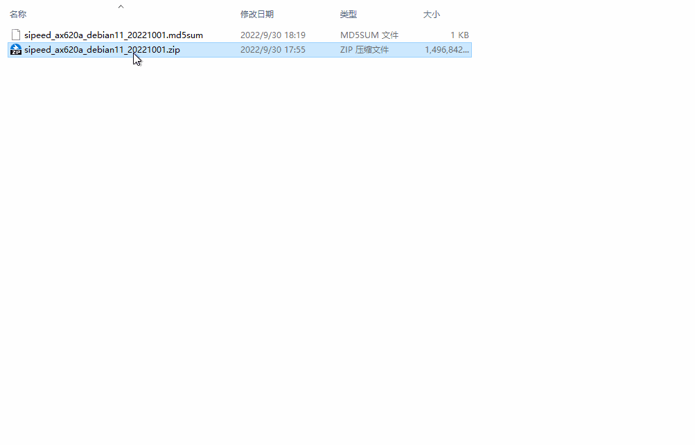

---

## 系统简介

AXera-Pi 默认板卡没有存储介质，因此需要准备一张系统卡来启动设备。

目前 AXera-Pi 提供的是 Debian11 Bullseye 镜像，[Ubuntu 源自 Debian。 这意味着 Ubuntu 使用与 Debian 相同的 apt 打包系统，并共享来自 Debian 存储库的大量软件包和库，利用 Debian 基础设施作为基础。 大多数“派生” Linux 发行版，它们使用相同的包管理系统并与基于的发行版共享软件包。 ](https://zhuanlan.zhihu.com/p/426219868)。

> [选择 Debian 的理由](https://www.debian.org/intro/why_debian)

官方店铺可以购买到预烧录了系统镜像的 SD 卡，不然的话就需要进行下面的操作来自己准备 SD 镜像卡了。

## 获取镜像

因为镜像文件比较大，因此这里仅提供百度云下载链接。

前往百度云 [点我](https://eyun.baidu.com/s/3htTXfaG#sharelink/path=%2F%E4%B8%8B%E8%BD%BD%E7%AB%99%E6%96%87%E4%BB%B6%2FMaix-III%2FAXera%2Fsdk%2Frelease&parent_path=%2F%E6%B7%B1%E5%9C%B3%E7%9F%BD%E9%80%9F%E7%A7%91%E6%8A%80%E6%9C%89%E9%99%90%E5%85%AC%E5%8F%B8) 下载文件，镜像包与校验文件都已经放在里面了。

用两个文件名来举例，其中文件命名规则如下（拖动滚动条来查看全部）：

| 文件名                                 | 提供方 | 文件类型         | 适用芯片 | 镜像发行版 | 发布日期 |
| -------------------------------------- | ------ | --------------- | -------- | ---------- | -------- |
| sipeed_ax620a_debian11_20221009.zip    | sipeed | 镜像压缩包      | ax620a   | debian11   | 20221009 |
| sipeed_ax620a_debian11_20221009.md5sum |        | <p style="white-space:nowrap">md5sum 校验文件</p>    |          |            |          |

如果里面有多个镜像文件，那么建议下载最新的镜像文件。

校验文件需要在 Linux 环境中使用，windows10 及以上的用户可以使用 wsl 当作 Linux 环境。

使用方法为 `md5sum -c md5sum校验文件`。

.. details::点我查看校验 log

    ```bash    
    root@desktop:$ md5sum -c sipeed_ax620a_debian11_20221009.md5sum
    sipeed_ax620a_debian11_20221009.zip: OK
    ```

## 烧录镜像

### 准备工作

硬件：
- 一张容量大于 4G 的 SD 卡；建议购买官方提供的卡，不然可能因为其他的 SD 卡质量差而带来糟糕的体验
- 一个读卡器；建议使用 USB3.0 接口得读卡器，不然读卡器得 USB 速度过低会导致烧录时间过长

软件：
- <a href="https://www.balena.io/etcher/" alt="Etcher" target="_blank"> Etcher </a>；根据自身电脑下载对应版本的软件即可

### 镜像系统烧录方法

首先解压所下载的镜像压缩包，得到 `.img` 镜像文件，打开 [Etcher](https://www.balena.io/etcher/ "Etcher") 软件，点击 `Flash from file` ,选中解压出来的 `.img ` 文件镜像，然后点击 `Select target` 选中sd卡，最后点击 `Flash` 进行烧录，等待完成即可。 

解压出镜像文件：


烧录镜像文件到 SD 卡：


下面这种是烧录中的一张截图：


最终下载结束后的效果会和下图一样，显示 `Flash Complete!`：


如果烧录失败了，请手动格式化一下 sd 卡。Windows 和 MacOS 可以使用 [SD Card Formatter](https://www.sdcard.org/downloads/formatter/eula_windows/SDCardFormatterv5_WinEN.zip)来格式化 sd 卡，Linux 系统可以使用 [Gparted](https://gparted.org/)来格式化。


<!-- 烧录方法如下图示意

点击“flash!”开始烧录，可看到进度条的跳动。

最终下载结束后的效果会和下图一样，显示 `Flash Complete!`：

如果烧录失败的话 方法： -->