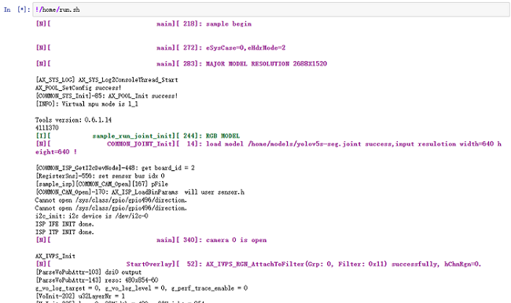

## 什么是 Python?

**Python** 是一种广泛使用的解释型、高级和通用的编程语言。它支持多种编程范型，包括函数式、指令式、反射式、结构化和面向对象编程，还拥有动态类型系统和垃圾回收功能，能够自动管理内存使用，并且其本身拥有一个巨大而广泛的标准库。它的语言结构以及面向对象的方法，旨在帮助程序员为小型的和大型的项目编写逻辑清晰的代码。

**而 Python 与 C++ 相比有什么区别？** 

从上文我们知道 **Python** 是一种解释型语言，我们不需要编译以扩展名为 `.py` 的 **Python** 代码可直接传递给解释器生成输出。而 **C++** 是一种编译型语言，编译器需要把源代码生成目标代码再执行生成输出。对于新手来说，**Python** 更易于学习并且语法简单、可读性更强，而 **C++** 在系统编程及性能上更优胜，但语法较为复杂编辑起来对于新手来说较为困难。


<!-- >**20221202** 后的系统镜像包内置了 `jupyter notebook`、`ax-pipline-api`、`pinpong` 的 **Python** 包。

为了帮助更多的初学者以及新手能快速的把 AXera-Pi 用起来，我们准备了一篇以 **jupyter notebook** 为例的 **Python** 文档。但在这之前需要准备好硬件设备，并根据前文的产品上手指南以及系统使用手册，如何在 AXera-Pi 上烧录及登陆系统、验证外设等一些 **Linux** 基础操作有一定的掌握了解，让我们后续开启 **Python** 编程的学习更如鱼得水！ -->

## 什么是 Jupyter Notebook ？ 

**Jupyter Notebook** 是基于网页的用于交互计算的应用程序。其可被应用于全过程计算：开发、文档编写、运行代码和展示结果。简而言之，它是以网页的形式打开，可以在网页页面中直接编写代码和运行代码，代码的运行结果也会直接在代码块下显示的程序。如在编程过程中需要编写说明文档，可在同一个页面中直接编写，便于作及时的说明和解释。


## 如何使用 Jupyter Notebook ？

>基于上文我们对语言以及应用有了一定的了解，那就接着往下学习怎么进行 Python 编程吧！

### 如何启动并访问？

>如果你已经跟随系统学习到达了这里，相信你也借助了产品上手以及系统使用手册，掌握一定的如何在 AXera-Pi 上烧录及登录系统、验证外设等一些基础的 Linux 操作，让我们在后续的学习 Python 更如鱼得水！

- [产品上手指南](https://wiki.sipeed.com/hardware/zh/maixIII/ax-pi/flash_system.html)
- [系统使用手册](https://wiki.sipeed.com/hardware/zh/maixIII/ax-pi/basic_usage.html)

**启动前的准备工作：**

我们需要准备一台 **AXera-Pi** 设备，通电并接入 PC 端登陆上板子。使用 `ifcomfig -a` 查询 IP 地址作后续访问 `jupyter Notebook` 备用。

**启动并访问 Jupyter Notebook：**

>在使用 Jupyter Notebook 时终端需保持不断开状态，否则与本地服务器的链接会断开无法操作。

当得知设备的 IP 地址后在终端输入 `jupyter notebook` 命令启动它，终端会返回一系列服务器的信息。


这时我们可以打开任意浏览器，输入刚刚查询到的 `eth0` 或 `wlan0` IP 地址后缀加上 `:8888`**（例：192.168.2.49:8888）**后即可直接访问网页。网页会提醒你需要输入密码 **`Password:root`** 访问。

.. details:: 点击查看操作示意图
    

输入登陆的密码 `root` 密码后会接入到 `Files` 的页面。点击右侧的 `New` 可选择你需要的环境。

.. details:: 点击查看操作示意图

    

```bash
Python3：默认的python3 kernel
Text File：新建一个文本文件
Folder：新建一个文件夹
Terminal：在浏览器中新建一个用户终端，类似于 shell/adb 终端.
```
.. details:: 点击查看基础用法

    每个方框被称为单元格，单元格左侧会有 **蓝色** 或者 **绿色** 两种颜色。绿色表示编辑模式而蓝色表示命令模式。

    通用用法：
    - **Shift+ Enter：**运行单元格，且以命令模式切换到下一个单元格
    - **Ctrl + Enter：**运行单元格，且进入命令模式
      
    编辑模式中：
    - **Esc**：进入命令模式
      
    命令模式中：
    - **h：**打开帮助
    - **Enter：**进入编辑模式
    - **x：**剪切单元格
    - **c：**复制单元格
    - **v：**粘贴单元格
    - **dd：**删除整个单元格
    - **ii：**终止运行
    - **A：**向光标所在单元格上方添加单元格
    - **B：**向下添加
    - **M：**使得单元格变成 markdown 状态

### 如何运行代码？

我们选择需要的 `Python3` 即可接入编辑页面，根据上文简单熟悉基础用法，试着在 Notebook 运行代码吧！在网页上运行 Python 代码有两种方式，以下面为例：

- **直接在编辑框内编辑代码并点击运行，这里以 `api_pipeline_api` 应用代码为例。**
  
 

- **或在编辑框使用 `! + 命令行` 运行内置的脚本文件或命令，这里以 `home/run.sh` 为例。**
  



### 如何启动终端？

>上面演示了如何实现 Python 编程，而 **Jupyter Notebook** 还能开启终端并与 **Python3** 同时运行。

回到刚开始进入的 `Files` 页面，点击网页右侧的 `New` 后选择 `Terminal` 新建终端进行命令行操作。你可以在 `Files` 页面直接查看内置目录的文件夹，或者是使用终端用 `ls` 查看目录。用 `cd` 进入目录。 


<!-- ## 如何使用 Python Pillow 进行图像处理并显示？


## 如何使用 Python 调用 Ai 模型获取结果？ -->

## 如何使用 Python 调用 opencv ？

**调用 opencv 前需进行准备工作：**

- 一个 USB 摄像头及 Type-c USB 转接头
- 一台 AXera-Pi 设备以及 Type-c 数据线

在进入 `python3` 环境下在编辑框运行代码即可调用 Opencv 使用 USB 摄像头拍照。

```python
import os
import cv2
video = cv2.VideoCapture(0)
for i in range(30):
    ret, frame = video.read()
    if ret:
        cv2.imwrite("/tmp/capture.jpg", frame)
        os.system("fbon && fbv /tmp/capture.jpg")
```


>运行出现报错请移步[Maix-III 系列 AXera-Pi 常见问题(FAQ)](https://wiki.sipeed.com/hardware/zh/maixIII/ax-pi/faq_axpi.html)进行查询。
## 如何使用控制 Microbit ？

**控制 Microbit 前需进行准备工作：**

- 一个 Type-c USB 转接头
- 一台 Microbit 以及 micro usb 数据线
- 一台 AXera-Pi 设备以及 Type-c 数据线 

可直接在 `Python3` 环境运行下方代码即可连接 microbit 掌控版并会看到 `hello world` 亮灯效果。

```bash
import time
from pinpong.board import Board,Pin
from pinpong.extension.microbit import *
Board("microbit","/dev/ttyACM0").begin()
display.show(Image.HEART)
while True:
    display.scroll("hello world")
```


## 如何使用控制 Arduino UNO ？

**控制 Arduino UNO 前需进行准备工作：**

- 一个 Type-c USB 转接头
- 一台 Microbit 以及相应的 USB 数据线
- 一台 AXera-Pi 设备以及 Type-c 数据线 

我们使用以下代码控制 Arduino UNO 板点亮外接的 **LED** 灯（板载也会亮起）。

```bash
import time
from pinpong.board import Board,Pin
Board("uno","/dev/ttyUSB0").begin()               
led = Pin(Pin.D13, Pin.OUT) #引脚初始化为电平输出

while True:
  led.value(1) #输出高电平
  print("1") #终端打印信息
  time.sleep(1) #等待1秒 保持状态

  led.value(0) #输出低电平 
  print("0") #终端打印信息
  time.sleep(1) #等待1秒 保持状态
```


## 如何使用 Python 发起 Http 请求或 MQTT 通信？

- [如何发起 Http 请求或 MQTT 通信：](https://wiki.sipeed.com/soft/maixpy3/zh/usage/net.html)

## 如何使用 Python 播放音视频 

- [如何使用 Python 播放音适配：](https://wiki.sipeed.com/soft/maixpy3/zh/usage/Audio/play_mp4.html)

