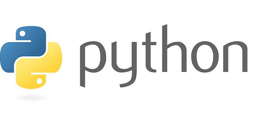
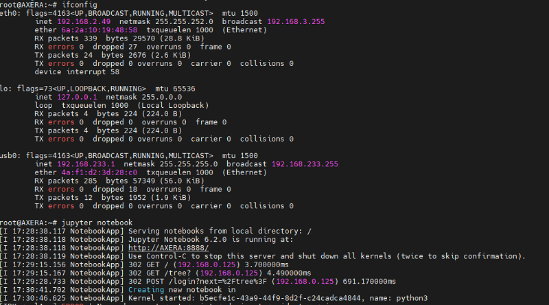
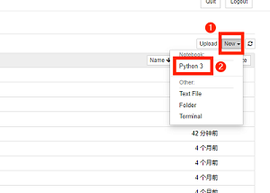
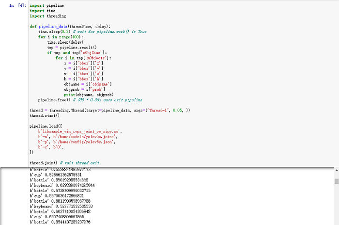
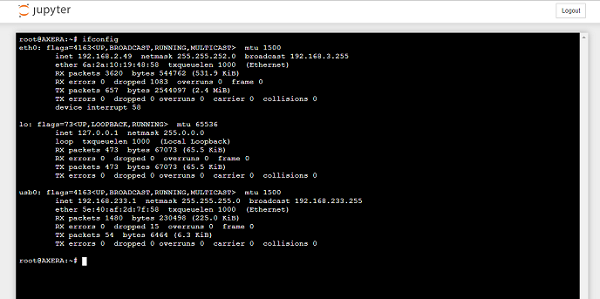
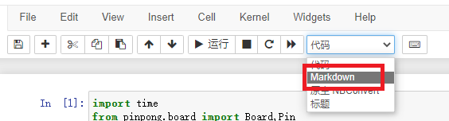
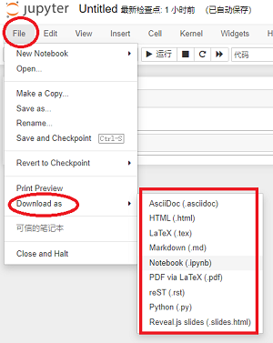
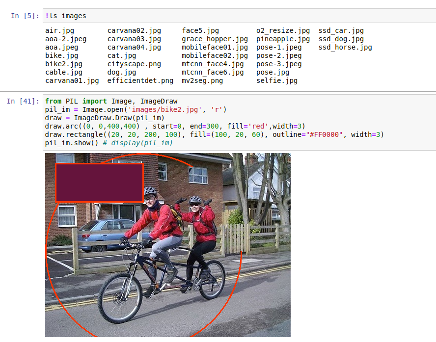
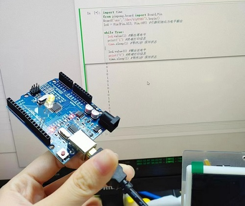

## 什么是 Python?

**Python** 是一种广泛使用的解释型、高级和通用的编程语言。它支持多种编程范型包括函数式、指令式、反射式、结构化和面向对象编程，还拥有动态类型系统和垃圾回收功能，能够自动管理内存使用，并且其本身拥有一个巨大而广泛的标准库。

- **而 Python 与 C++ 相比有什么区别？** 

从上文得知 **Python** 是一种解释型语言，用户不需要编译以扩展名为 `.py` 的代码可传递给解释器生成输出。而 **C++** 是编译型语言，编译器需要把源代码生成目标代码再执行生成输出。对于初学者来说 **Python** 更易于学习并且语法简单、可读性更强。而 **C++** 在系统编程及性能上更优胜，但语法复杂编写起来对初学者有一定的挑战难度。



## 什么是 Jupyter Notebook？ 

它是基于网页的用于交互计算的应用程序。其可被应用于全过程计算：开发、文档编写、运行代码和展示结果，它以网页的形式打开并可以直接编写和运行代码，运行结果也会直接显示在代码框下层。如在编程过程中需要编写说明文档，可在同一个页面中直接编写便于及时的解释和说明。


## 如何使用 Jupyter Notebook ？

>如果你已经跟随章节学习到达了这里，相信你已经根据前面的章节掌握一定的在 AXera-Pi 上烧录及登录系统、验证外设等基础的 Linux 操作。并基于上文对语言以及应用有了解，那就接着往下学习怎么进行 Python 编程吧！
>- [产品上手指南](https://wiki.sipeed.com/hardware/zh/maixIII/ax-pi/flash_system.html)
>- [系统使用手册](https://wiki.sipeed.com/hardware/zh/maixIII/ax-pi/basic_usage.html)


### 如何启动并访问？

**启动前的准备工作：**

我们需要准备一台 **AXera-Pi** 设备，给设备接入 PC 端通电并使用终端工具登陆上板子。
进入后使用 `ifconfig -a` 查询 IP 地址以便后续访问 `Jupyter Notebook` 备用。

**启动并访问 Jupyter Notebook：**

>**注意**：使用 Jupyter Notebook 时终端需保持连接状态，否则会与本地服务器的连接断开而无法操作。

当得知设备的 IP 地址后在终端输入 `jupyter notebook` 命令启动它，终端会返回一系列服务器的信息。



这时我们可以打开任意浏览器，输入刚刚查询到的 IP 地址后缀加上 `:8888`**（例：192.168.2.49:8888）除 usb0 不可用**后即可直接访问网页。网页会提醒你需要输入密码 **`Password:root`** 访问。

.. details:: 点击查看操作示意图
    

输入登陆的密码 `root` 密码后会接入到 `Files` 的页面。点击右侧的 `New` 可选择你需要的环境。

.. details:: 点击查看操作示意图
    

```bash
Python3：默认的python3 kernel
Text File：新建一个文本文件
Folder：新建一个文件夹
Terminal：在浏览器中新建一个用户终端，类似于 shell/adb 终端.
```

.. details:: 点击查看 Jupyter Notebook 基础用法

    每个方框被称为单元格，单元格左侧会有 **蓝色** 或者 **绿色** 两种颜色。绿色表示编辑模式而蓝色表示命令模式。

    通用用法：
    - **Shift+ Enter：**运行单元格，且以命令模式切换到下一个单元格
    - **Ctrl + Enter：**运行单元格，且进入命令模式
          
    编辑模式中：
    - **Esc**：进入命令模式
          
    命令模式中：
    - **h：**打开帮助
    - **Enter：**进入编辑模式
    - **x：**剪切单元格
    - **c：**复制单元格
    - **v：**粘贴单元格
    - **dd：**删除整个单元格
    - **ii：**终止运行
    - **A：**向光标所在单元格上方添加单元格
    - **B：**向下添加
    - **M：**使得单元格变成 markdown 状态

### 如何运行代码？

我们选择需要的 `Python3` 即可接入编辑页面，根据上文简单熟悉基础用法，试着在 Notebook 运行代码吧！在网页上运行 Python 代码有三种方式，以下面为例：

- **直接在编辑框内编辑代码并点击运行，这里以 `api_pipeline_api` 应用代码为例。**
  
 

- **或在编辑框使用 `! + cmd` 运行内置的脚本文件或命令，这里以运行 `NPU` 为例。**
  


- **也可以使用 `%run` 跑模块文件或 `.py`文件，这里以运行 `hello.py` 为例**


### 如何启动终端？

>上面演示了如何实现 Python 编程，而 **Jupyter Notebook** 还能开启终端并与 `Python3` 同时运行。

回到刚开始进入的 `Files` 页面，点击网页右侧的 `New` 后选择 `Terminal` 新建终端进行命令行操作。你可以在 `Files` 页面直接查看内置目录的文件夹，或者是使用终端用 `ls` 查看目录。用 `cd` 进入目录。 



### 如何编写文档

>我们可以在 **Jupyter Notebook** 里使用 `Markdowm` 语法编写文档去提示代码的易读性以及条理性。

在网页端中选择一个 `cell` 后把代码模式更换成 `Markdown` 模式，或使用快捷键 `M` 变成 `Markdown` 状态。



### 如何传输文件？

>除了运行代码以及编写文档等还可以进行文件的传输，让日常使用更加便捷。

如何导入我们存放在 PC 端的文件，以下面两种方式为例：

- **通过网页 `New` 新建 `Text File：文本文件`或`Folder：文件夹或文件`，直接把内容复制进去导入文件。**

    

- **或者是直接从网页端导入文件，点击右侧的 `Upload` 直接在任意目录下导入需要的文件即可。**

    

如何导出我们在网页端编写的文件，以下面为例：

- **在网页端编写的的内容都可以以文档的形似输出，默认保存的是以后缀名为 `.ipynb` 的 `json` 格式，保存不同格式请点击 `File`->`Download as`->`选择你需要的格式即可`，网页会自动下载到本地。**

    

## Python 多种用法？

使用 Python 编程调用使用各种有趣玩法，让 AXera-Pi 用起来更加简单！

### 使用 Python 调用 Ai 模型获取结果

>更多资料以及相关的 Python 编程仓库请点击：[ax-pipeline-api](https://github.com/junhuanchen/ax-pipeline-api) 查看。

**使用以下例子调用 `yolov5s_face` 为例来说明如何调用 AI 模型：**


**修改相对应的模型参数调用不同的模型如下：**

```bash
pipeline.load([
    b'libsample_vin_ivps_joint_vo_sipy.so',
    b'-m', b'/home/models/yolov5s_face_nv12_11.joint',
    b'-p', b'/home/config/yolov5s_face.json',
    b'-c', b'0',
])
```

### 使用 Python Pillow 进行图像处理并显示

>**Pillow（PIL）**是 Python 常用的图像处理库，而 Pillow 是 PIL 的分支，提供了广泛的文件格式支持，强大的图像处理能力，主要包括图像储存、图像显示、格式转换以及基本的图像处理操作等。

**使用以下的例子来说明如何使用 Python Pillow:**

```bash
from PIL import Image, ImageDraw
pil_im = Image.open('images/bike2.jpg', 'r')
draw = ImageDraw.Draw(pil_im)
draw.arc((0, 0,400,400) , start=0, end=300, fill='red',width=3)
draw.rectangle((20, 20, 200, 100), fill=(100, 20, 60), outline="#FF0000", width=3)
pil_im.show() # display(pil_im)
```



**关于 Pillow 更多的使用资料请[点击](https://www.itcodar.com/python/how-to-show-pil-image-in-ipython-notebook.html)查看。**

### 使用 Python 调用 Opencv 

**调用 opencv 前需进行准备工作：**

- 一个 USB 摄像头及 Type-c USB 转接头
- 一台 AXera-Pi 设备以及 Type-c 数据线

**在进入 `python3` 环境下在编辑框运行代码即可调用 Opencv 使用 USB 摄像头拍照。**

```python
import os
import cv2
video = cv2.VideoCapture(0)
for i in range(30):
    ret, frame = video.read()
    if ret:
        cv2.imwrite("/tmp/capture.jpg", frame)
        os.system("fbon && fbv /tmp/capture.jpg")
```


>运行出现报错请移步[Maix-III 系列 AXera-Pi 常见问题(FAQ)](https://wiki.sipeed.com/hardware/zh/maixIII/ax-pi/faq_axpi.html)进行查询。

### 使用 Python 调用 Numpy

>NumPy (Numerical Python) 是 Python 语言的一个扩展程序库，支持大量的维度数组与矩阵运算，此外也是针对数组运算提供大量的数学函数库。

**使用以下的例子来说明如何调用 Numpy：**

```bash
import numpy as np
# int8, int16, int32, int64 四种数据类型可以使用字符串 'i1', 'i2','i4','i8' 代替
dt = np.dtype('i4')
print(dt)
```


**关于 Numpy 的更多资料例程请[点击](https://www.runoob.com/numpy/numpy-tutorial.html)查看。**

### 使用 Python 播放音视频 

- [如何使用 Python 播放音适配：](https://wiki.sipeed.com/soft/maixpy3/zh/usage/Audio/play_mp4.html)

### 使用 Python 发起 Http 请求或 MQTT 通信

- [如何发起 Http 请求或 MQTT 通信：](https://wiki.sipeed.com/soft/maixpy3/zh/usage/net.html)

## 如何使用控制 Microbit ？

**控制 Microbit 前需进行准备工作：**

- 一个 Type-c USB 转接头
- 一台 Microbit 以及 micro usb 数据线
- 一台 AXera-Pi 设备以及 Type-c 数据线 

可直接在 `Python3` 环境运行下方代码即可连接 microbit 掌控版并会看到 `hello world` 亮灯效果。

```bash
import time
from pinpong.board import Board,Pin
from pinpong.extension.microbit import *
Board("microbit","/dev/ttyACM0").begin()
display.show(Image.HEART)
while True:
    display.scroll("hello world")
```


**关于 Microbit 更多例程请[点击](https://pinpong.readthedocs.io/zh_CN/latest/2.pinpong%E7%A4%BA%E4%BE%8B/index1.html)查看。**

## 如何使用控制 Arduino UNO ？

**控制 Arduino UNO 前需进行准备工作：**

- 一个 Type-c USB 转接头
- 一台 Microbit 以及相应的 USB 数据线
- 一台 AXera-Pi 设备以及 Type-c 数据线 

我们使用以下代码控制 Arduino UNO 板点亮外接的 **LED** 灯（板载也会亮起）。

```bash
import time
from pinpong.board import Board,Pin
Board("uno","/dev/ttyUSB0").begin()               
led = Pin(Pin.D13, Pin.OUT) #引脚初始化为电平输出

while True:
  led.value(1) #输出高电平
  print("1") #终端打印信息
  time.sleep(1) #等待1秒 保持状态

  led.value(0) #输出低电平 
  print("0") #终端打印信息
  time.sleep(1) #等待1秒 保持状态
```



**关于 Arduino 更多例程请[点击](https://pinpong.readthedocs.io/zh_CN/latest/2.pinpong%E7%A4%BA%E4%BE%8B/index1.html)查看。**