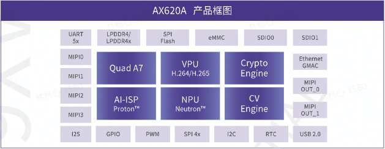

> 以下内容还在施工中，本周会随时变动。

## MAIX-III AXera-Pi 是什么？

MAIX-III 是一款以 AX620A 为主控的核心计算板，采用兼容 DDR4 SODIMM 260P 金手指全 IO 引出，可以兼容 AxPi 底板或方便的进行二次开发，并提供了以下开发资料。

* 提供 debian11 Linux 系统，支持 SD 卡启动 DD 烧录系统，方便用户开箱上手。

* 提供 ax-sample / libmaix / bsp sdk 等源码仓库

* 提供原厂芯片 API 使用文档、源码开发方法等说明。

* 提供 C SDK 开发方法，以及 MaixPy3 开发环境。

* 内置开箱即用的常见 AI 模型，以及模型量化转换工具和指导手册。

* 支持 MaixHub 模型分享与在线训练，以及 AI 交流社区。

## 使用现成的模型

到 [MaixHub 模型库](https://maixhub.com/model/zoo) 找到你需要的模型，可以在过滤选项中选择`AXera-Pi 平台`来查找能在`AXera-Pi`上运行的模型。
以及可以在 [AXERA-TECH/ax-samples](https://github.com/AXERA-TECH/ax-samples) 仓库也可以找到模型。
然后下载并拷贝到开发板使用，模型详情页面会介绍如何使用模型，在使用模型前，最好先仔细看看左边目录中的`Axera-Pi`的基本操作和开发准备。

## 将你的模型转换为在 AXera-Pi 上可以使用的模型

使用模型训练框架(比如 Pytorch）训练好模型后，要在 `AXera-Pi` 上运行，还需要将模型量化为`INT8`模型，以及转换成`AXera-Pi`支持的模型格式。
同时，也要注意`AXera-Pi`的算子支持情况，在设计模型结构时就需要考虑到；
另外，有些模型可能需要将后处理从模型中分离出来，在`AXera-Pi`上单独使用代码实现后处理。
详细的模型部署方法见**[部署模型到 Maix-III(M3) 系列 AXera-Pi 开发板](/ai/zh/deploy/ax-pi.html)**

## 分享有趣的模型

部署成功后会有一份模型文件，以及一份能运行模型的代码，可以将这些文件分享到 [MaixHub 模型库](https://maixhub.com/model/zoo) ，大家一起交流学习！

### 产品外观

待补充

### AX620A 芯片

AX620A 是一款高算力、高能效比、低功耗的 AI SoC 芯片。芯片集成了四核 Cortex A7 CPU，拥有 3.6TOPs@INT8 的高算力 NPU，支持 4K@30fps 的 ISP，以及支持 H.264、H.265 编码的 VPU，拥有大算力和优异画质处理能力的 AX620A 可以实现更多的 AI 功能，带来最优的 AI 体验.

### 核心板硬件参数

> 需要整理

| 项目   | 参数            |
|--------|----------------|
| CPU    | Quad-A7（四核A7）      |
| NPU    | 14.4Tops@int4，3.6Tops@int8 |
| ISP    | 4K@30fps |
| 编解码格式 | H.264, H.265 |
| 视频编码 | 4K@30fps |
| 视频解码 | 1080P@60fps |
| Ethernet | 支持双路RGMII / RMII 接口模式的以太网 |
| 视频输出 | 支持MIPI DSI 4-LANE  |
| DRAM | 2GB LPDDR4X |
| 存储 | 可选16GB EMMC |
| IO 引出 | DDR4 SODIMM 260P 金手指全IO引出 |

### 底板板硬件参数

> 需要整理

### 摄像头相关参数

> 需要整理

### 产品外壳装配相关

> 需要整理
