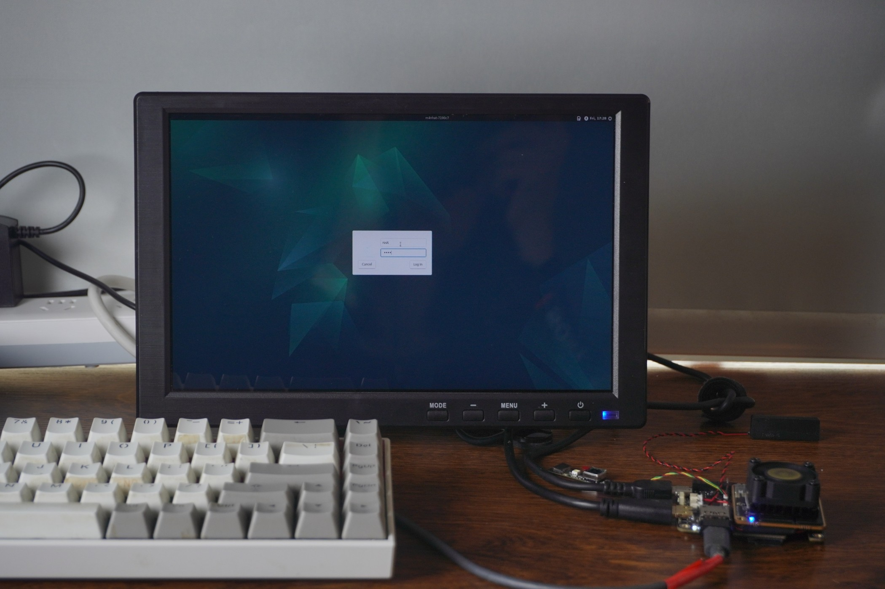
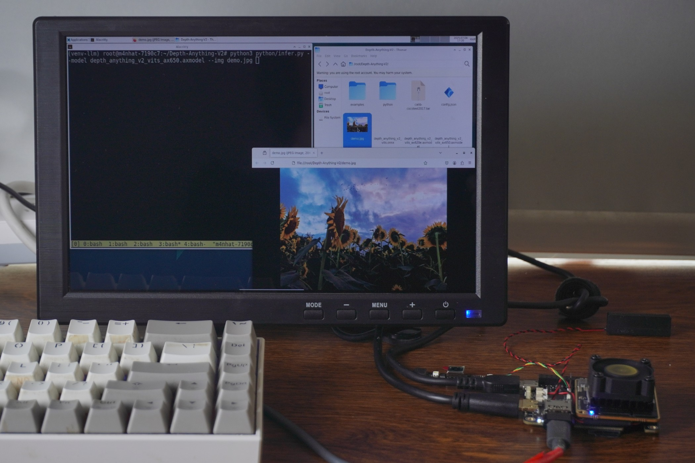
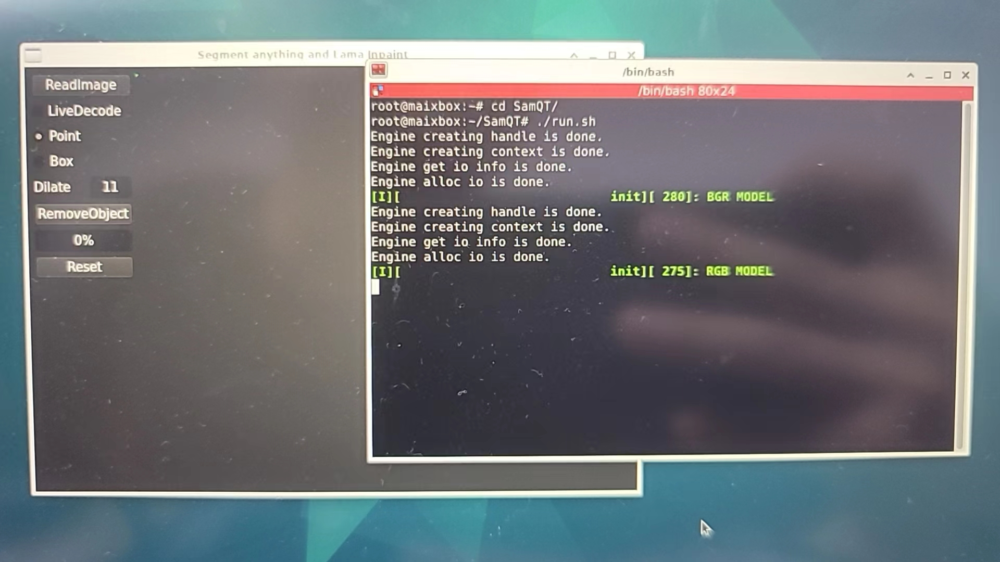

## 系统烧录
详情见 [系统烧录指南](../m4c/system-update.html)，请优先考虑 TFCard&eMMC 镜像（Debian 12 系统）。

以下基于该镜像展开介绍，若使用自行编译的镜像，请多加注意细节对比。

## 系统启动

### 开机前准备
1. 5V USB 供电电源
2. mini HDMI 线缆和显示器
3. USB 串口工具如 [SLogic Combo8](../../logic_analyzer/combo8/index.html)（可选项，用于串口调试和登录）

### 正常开机

1. 登录界面
通过 mini HDMI 连接显示器并接入供电，此时核心板应亮起蓝灯，Hat 底板亮起白灯，表明供电正常。如果 eMMC 为默认供树莓派启动的从机镜像，请注意烧录独立新镜像到 TF 卡并插入 M4C-Hat。再保持 `BOOT0` 键按下时点按 `RST`，等待片刻约 20 多秒后显示器屏幕将会如下显示 LightDM 登录界面，表示系统启动成功。

2. 系统桌面
板载 USB-A 口连接鼠标、键盘，方便后续系统操作和输入。登录界面等待输入用户名和密码，默认都为 root，确认登录即可进入 XFCE4 桌面系统。

<div style="display: flex; flex-wrap: wrap; gap: 10px; width: 100%;">
  
  
</div>

### 串口和SSH登录（进阶）
板载 USB Type-C 接口为默认调试串口，波特率相关配置为 **115200 8n1**。

用户可通过串口工具打开该串口，以查看内核调试信息，也可在此处通过用户名和密码直接登录系统终端进行命令操作。

若需通过 SSH 登录，可通过 USB有线/无线网卡 扩展网络链接。

注意：本系统仅内置 root 超级用户，且考虑到安全性并未开启超级用户 SSH 密码登录。

若临时有该需求请参阅[这里](../m4c/FAQ.md)。


## LLM

### DeepSeek-R1 & QWen3

左侧：[DeepSeek-R1 1.5B](https://huggingface.co/AXERA-TECH/DeepSeek-R1-Distill-Qwen-1.5B)
右侧：[QWen3 0.6B](https://huggingface.co/AXERA-TECH/Qwen3-0.6B)

部署参考[此处](../m4c/axmodel-deploy.html#部署大语言、多模态模型)


## VLM

### internVL3


操作过程如下视频：
<video controls autoplay src="../assets/m4chat/m4nhat-run-llm-internVL-2025-07-07.mp4" type="video/mp4"> Your browser does not support video playback. </video>

## DepthAnything v2
下载[axcl npu python 库](https://github.com/AXERA-TECH/pyaxengine/releases)后，`pip install axengine-x.y.z-py3-none-any.whl` 进行安装。

```bash
source ../venv-llm/bin/activate
python python/infer.py --img examples/demo02.jpg --model depth_anything_v2_vits_ax650.axmodel
```



## 交互式图像分割和修复（Segment and Inpaint Anything）

交互式图像分割和修复，基于QT的GUI交互界面，实现了交互式点选、框选的实时分割和进一步可选修复，具体效果预览和操作流程如下。



原始代码由爱芯官方开源于 GITHUB：[SAM-ONNX-AX650-CPP](https://github.com/AXERA-TECH/SAM-ONNX-AX650-CPP) 可下载官方预编译版本或按仓库内文档自行编译进行体验，下图是移除照片某球员的效果展示。

<div><table><tr>
<td></td>
<td></td>
</tr></table></div>

以下是实机操作画面。

<div><table><tr>
<td></td>
<td></td>
<td></td>
</tr><tr>
<td>RAW</td>
<td>SAM</td>
<td>Inpaint</td>
</tr></table></div>


## 交互式以文搜图（CLIP）
交互式以文搜图示例，基于QT的GUI交互解码，采用 OpenAI 在 2021 年开源的 Zero-Shot 视觉分类模型 CLIP(Contrastive Language–Image Pre-training) 通过文本输入快速检索出相关图片并显示，支持中文、英文两种文本语言输入。

原始代码由爱芯官方开源于 GITHUB：[CLIP-ONNX-AX650-CPP](https://github.com/AXERA-TECH/CLIP-ONNX-AX650-CPP)

[DEMO VIDEO](https://github.com/sipeed/sipeed_wiki/assets/13964381/df4cec7f-29af-465f-bfad-e54312274437)

准备 QT 运行环境
```
apt update
apt install cmake qt6-base-dev
```

下载预编译好的可执行文件、模型文件、测试图片、测试文本
- [Baidu Pan](https://pan.baidu.com/s/17M5ugUyuf9mbi1cHLGJHXg)

将下载获得的 *CLIP.zip* 在 `/root/Desktop/` 路径下解压得到以下内容
```
root@m4nhat-7190c7:~/Desktop/CLIP# tree -L 1
.
├── CLIPQT
├── cn_vocab.txt
├── coco_1000
├── libonnxruntime.so
├── libonnxruntime.so.1.16.0
├── onnx_models
├── run_en.sh
├── run_zh.sh
└── vocab.txt
```
使用 HDMI 基于 HDMI1 接口链接显示器并登录进入桌面, 打开控制终端运行 `run_zh.sh`


CLIP DEMO 正常运行


