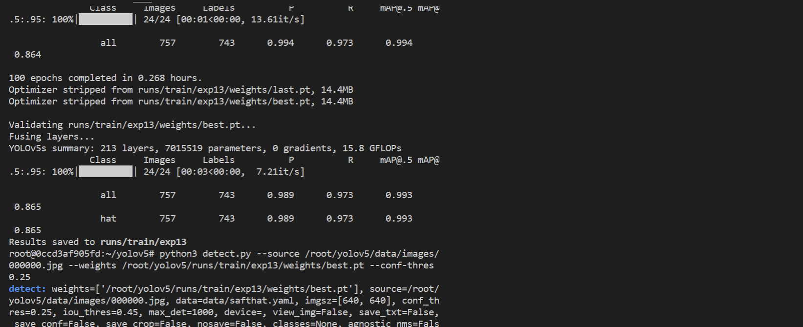

# M4N-DOCK有关模型的部署

---
title: 外设使用
keywords: Linux, Lichee, TH1520, SBC, RISCV, Peripheral
update:
  - date: 2023-11-24
    version: v1.0
    author: dragonforward
    content:
      - 加入了YOLOv8和YOLOv5部署
---

## 爱芯元智 AX650N 部署大语言、多模态模型

从下列网站获取模型和运行时。

部署方法可见每个仓库的 README.md。

爱芯官方：https://huggingface.co/AXERA-TECH

国内镜像站：https://hf-mirror.com/AXERA-TECH

| 模型 | 链接 | 链接（国内镜像站） |
|  --  |  --  |  --  |
| Qwen3:0.6b | [Qwen3-0.6B-Int8](https://huggingface.co/AXERA-TECH/Qwen3-0.6B)  | [Qwen3-0.6B-Int8](https://hf-mirror.com/AXERA-TECH/Qwen3-0.6B) |
| DeepSeek-R1:1.5b | [DeepSeek-R1-Distill-Qwen-1.5B](https://huggingface.co/AXERA-TECH/DeepSeek-R1-Distill-Qwen-1.5B)  | [DeepSeek-R1-Distill-Qwen-1.5B](https://hf-mirror.com/AXERA-TECH/DeepSeek-R1-Distill-Qwen-1.5B) |
| Qwen2.5:1.5b | [Qwen2.5-1.5B-Instruct-GPTQ-Int8](https://huggingface.co/AXERA-TECH/Qwen2.5-1.5B-Instruct-GPTQ-Int8)  | [Qwen2.5-1.5B-Instruct-GPTQ-Int8](https://hf-mirror.com/AXERA-TECH/Qwen2.5-1.5B-Instruct-GPTQ-Int8) |
| SD1.5 | [lcm-lora-sdv1-5](https://huggingface.co/AXERA-TECH/lcm-lora-sdv1-5)  | [lcm-lora-sdv1-5](https://hf-mirror.com/AXERA-TECH/lcm-lora-sdv1-5) |
| InternVL2.5:1b | [InternVL2_5-1B-Int8](https://huggingface.co/AXERA-TECH/InternVL2_5-1B)  | [InternVL2_5-1B-Int8](https://hf-mirror.com/AXERA-TECH/InternVL2_5-1B) |

**请注意：以上模型都需要基于 `SDK 1.45.0` 版本编译打包出来的镜像才可运行大模型。请及时更新系统，我们提供的 TFCard&eMMC 镜像是符合条件的，且预留了 6GB 内存供模型加载运行使用，可以运行 7b 参数的 int4 大模型。**

*快速体验 qwen3-0.6b：*
```bash
git clone https://hf-mirror.com/AXERA-TECH/Qwen3-0.6B

pip install transformers jinja2 -i https://mirrors.tuna.tsinghua.edu.cn/pypi/web/simple

cd Qwen3-0.6B
chmod +x main_ax650

python3 qwen3_tokenizer_uid.py

sh run_qwen3_0.6b_int8_ctx_ax650.sh
```

## 爱芯元智AX650N部署yolov5s 自定义模型

> 本博客将向你展示零基础一步步的部署好自己的yolov5s模型（博主展示的是安全帽模型），利用yolov5 官方的代码工具导出onnx模型，并通过onnxsim自带的工具精简网络结构，导出子图，为了Pulsar2 工具进行处理模型做准备。

### 获得自定义训练得到的yolov5s onnx模型

#### 准备自定义数据集（博主用的是VOC数据集）

- `数据集目录结构`如下：
```
└─VOC2028:		自定义数据集
    ├─Annotations	存放的是数据集标签文件，xml格式
    ├─ImageSets		数据集的划分文件
    │  └─Main
    ├─JPEGImages	存放的是数据集图片
```


- `分割数据集`

在split_train_val.py文件路径下执行`python3 split_train_val.py`会得到一下目录结构：
```
└─VOC2028:		自定义数据集
    ├─Annotations	存放的是数据集标签文件，xml格式
    ├─ImageSets		数据集的划分文件
    │  └─Main test.txt
          └─test.txt
          └─train.txt
          └─val.txt
    ├─JPEGImages	存放的是数据集图片
    ├─split_train_val.py	分割数据集的py文件

```

`split_train_val.py文件代码如下`：

```
# -*- coding: utf-8 -*-
"""
Author:dragonforward
简介：分训练集、验证集和测试集，按照 8：1：1 的比例来分，训练集8，验证集1，测试集1
"""
import os
import random
import argparse

parser = argparse.ArgumentParser()
# xml文件的地址，根据自己的数据进行修改 xml一般存放在Annotations下
parser.add_argument('--xml_path', default='Annotations/', type=str, help='input xml label path')
# 数据集的划分，地址选择自己数据下的ImageSets/Main
parser.add_argument('--txt_path', default='ImageSets/Main/', type=str, help='output txt label path')
opt = parser.parse_args()

train_percent = 0.8  # 训练集所占比例
val_percent = 0.1    # 验证集所占比例
test_persent = 0.1   # 测试集所占比例

xmlfilepath = opt.xml_path
txtsavepath = opt.txt_path
total_xml = os.listdir(xmlfilepath)

if not os.path.exists(txtsavepath):
    os.makedirs(txtsavepath)

num = len(total_xml)  
list = list(range(num))

t_train = int(num * train_percent)  
t_val = int(num * val_percent)

train = random.sample(list, t_train)
num1 = len(train)
for i in range(num1):
    list.remove(train[i])


val_test = [i for i in list if not i in train]
val = random.sample(val_test, t_val)
num2 = len(val)
for i in range(num2):
    list.remove(val[i])


file_train = open(txtsavepath + '/train.txt', 'w')
file_val = open(txtsavepath + '/val.txt', 'w')
file_test = open(txtsavepath + '/test.txt', 'w')

for i in train:
    name = total_xml[i][:-4] + '\n'
    file_train.write(name)

for i in val:
    name = total_xml[i][:-4] + '\n'
    file_val.write(name)    

for i in list:
    name = total_xml[i][:-4] + '\n'
    file_test.write(name)
    
    
file_train.close()
file_val.close()
file_test.close()
```


- `voc转label得到label文件`

目录结构如下：
```
└─VOC2028:		自定义数据集
    ├─Annotations	存放的是数据集标签文件，xml格式
    ├─ImageSets		数据集的划分文件
    │  └─Main
    ├─JPEGImages	存放的是数据集图片
    └─labels		yolov5将此文件夹当作训练的标注文件夹
└─voc_label.py
```

`voc_label.py文件代码如下`：

```
# -*- coding: utf-8 -*-
import xml.etree.ElementTree as ET
import os

sets = ['train', 'val', 'test']  # 如果你的Main文件夹没有test.txt，就删掉'test'
classes = ["hat", "people"]   # 改成自己的类别，VOC数据集有以下20类别
# classes = ["brickwork", "coil","rebar"]   # 改成自己的类别，VOC数据集有以下20类别
# classes = ["aeroplane", 'bicycle', 'bird', 'boat', 'bottle', 'bus', 'car', 'cat', 'chair', 'cow', 'diningtable', 'dog',
#            'horse', 'motorbike', 'person', 'pottedplant', 'sheep', 'sofa', 'train', 'tvmonitor']  # class names
# abs_path = os.getcwd() /root/yolov5/data/voc_label.py 
abs_path = '/root/yolov5/data/'

def convert(size, box):
    dw = 1. / (size[0])
    dh = 1. / (size[1])
    x = (box[0] + box[1]) / 2.0 - 1
    y = (box[2] + box[3]) / 2.0 - 1
    w = box[1] - box[0]
    h = box[3] - box[2]
    x = x * dw
    w = w * dw
    y = y * dh
    h = h * dh
    return x, y, w, h


def convert_annotation(image_id):
    in_file = open(abs_path + '/VOC2028/Annotations/%s.xml' % (image_id), encoding='UTF-8')
    out_file = open(abs_path + '/VOC2028/labels/%s.txt' % (image_id), 'w')
    tree = ET.parse(in_file)
    root = tree.getroot()
    size = root.find('size')
    w = int(size.find('width').text)
    h = int(size.find('height').text)
    for obj in root.iter('object'):
        difficult = obj.find('difficult').text
        # difficult = obj.find('Difficult').text
        cls = obj.find('name').text
        if cls not in classes or int(difficult) == 1:
            continue
        cls_id = classes.index(cls)
        xmlbox = obj.find('bndbox')
        b = (float(xmlbox.find('xmin').text), float(xmlbox.find('xmax').text), float(xmlbox.find('ymin').text),
             float(xmlbox.find('ymax').text))
        b1, b2, b3, b4 = b
        # 标注越界修正
        if b2 > w:
            b2 = w
        if b4 > h:
            b4 = h
        b = (b1, b2, b3, b4)
        bb = convert((w, h), b)
        out_file.write(str(cls_id) + " " + " ".join([str(a) for a in bb]) + '\n')


for image_set in sets:
    if not os.path.exists(abs_path + '/VOC2028/labels/'):
        os.makedirs(abs_path + '/VOC2028/labels/')

    image_ids = open(abs_path + '/VOC2028/ImageSets/Main/%s.txt' % (image_set)).read().strip().split()
    list_file = open(abs_path + '/VOC2028/%s.txt' % (image_set), 'w')
    for image_id in image_ids:
        list_file.write(abs_path + '/VOC2028/JPEGImages/%s.jpg\n' % (image_id))  # 要么自己补全路径，只写一半可能会报错
        convert_annotation(image_id)
    list_file.close()


```
 

#### 训练模型


- 配置环境
```
git clone https://github.com/ultralytics/yolov5
cd yolov5
pip install -r requirements.txt
pip install onnx
```


- 下载预训练权重（博主尝试了v7.0的和v6.0的pt都可以）
```
https://github.com/ultralytics/yolov5/releases/download/v7.0/yolov5s.pt
```

 

- 训练（博主使用的是学校的集群进行训练）


```
python3 train.py --weights weights/yolov5s.pt --cfg models/yolov5s.yaml --data data/safthat.yaml --epochs 150 --batch-size 16 --multi-scale --device 0 
``` 

 

```
python3 detect.py --source /root/yolov5/data/images/000000.jpg --weights /root/yolov5/runs/train/exp13/weights/best.pt --conf-thres 0.25
```


 

- 导出onnx模型，并通过onnxsim自带的工具精简网络结构，导出子图

```
python3 export.py --weights  yolov5s_hat.pt --include onnx
pip install onnx-simplifier
python3 -m onnxsim yolov5s_hat.onnx yolov5s_hat_sub.onnx
```

 


模型查看通过网址输入netron.app查看三个输出：

 

查看官方给的yolov5s.json文件：

```
{
  "model_type": "ONNX",
  "npu_mode": "NPU1",
  "quant": {
    "input_configs": [
      {
        "tensor_name": "images",
        "calibration_dataset": "./dataset/calibration_dataset.tar.gz",
        "calibration_size": 4,
        "calibration_mean": [0, 0, 0],
        "calibration_std": [255.0, 255.0, 255.0]
      }
    ],
    "calibration_method": "MinMax",
    "precision_analysis": false
  },
  "input_processors": [
    {
      "tensor_name": "images",
      "tensor_format": "BGR",
      "src_format": "BGR",
      "src_dtype": "U8",
      "src_layout": "NHWC"
    }
  ],
  "output_processors": [
    {
      "tensor_name": "326",
      "dst_perm": [0, 2, 3, 1]
    },
    {
      "tensor_name": "370",
      "dst_perm": [0, 2, 3, 1]
    },
    {
      "tensor_name": "414",
      "dst_perm": [0, 2, 3, 1]
    }
  ],
  "compiler": {
    "check": 0
  }
}

```

output_processors给的326，370，414

根据[秋水大佬博客](https://zhuanlan.zhihu.com/p/569083585)的导出子图文件修改得到适应pulsar2工具的onnx文件：

```
import onnx

input_path = "yolov5s_hat-sim.onnx"
output_path = "yolov5s_hat_sub.onnx"
input_names = ["images"]
output_names = ["326","370","414"]
onnx.utils.extract_model(input_path, output_path, input_names, output_names)
```


问题记录：
（1）导出子图很关键
&ensp; &ensp;由于之前对深度学习知识了解很少，才知道子图，如果执行使用yolov5s_hat_sub.onnx，在Pulsar2工具中进行量化的话，会生成axmodel但是是无法执行了，通过`o0圏圏蟲0o`大佬给的模型对比网络结构和秋水大佬的ax620a部署yolov5博客才明白自己问题出现在哪里

如果你没处理导出子图得到的图会是这样：

 

正确量化后的yolov5s图：

官方的yolov5s模型：

 

博主的正确的axmodel：

 

其中数字不同255和21的原因（秋水大佬博客有讲）：
该数字为（模型训练的类别+5）*3，博主类别为2类，所以就是21

### 模型转化（关键）

#### 安装docker环境（已安装过的可以跳过）
```
安装docker依赖的基础软件
sudo apt-get update
sudo apt-get install apt-transport-https ca-certificates curl gnupg-agent software-properties-common
添加官方来源
curl -fsSL https://download.docker.com/linux/ubuntu/gpg | sudo apt-key add -
sudo add-apt-repository "deb [arch=amd64] https://download.docker.com/linux/ubuntu $(lsb_release -cs) stable"
安装 docker
sudo apt-get update
sudo apt-get install docker-ce docker-ce-cli containerd.io
```

#### pulsar2工具模型转化以及仿真运行

- 下载pulsar2工具（博主使用的是1.9）

[谷歌网盘链接：](https://drive.google.com/file/d/1-NW7ExBXj5-nTha40iwYshjNJb74Zfer/view?usp=drive_link)

[quick_start_example 文件夹](https://github.com/AXERA-TECH/pulsar2-docs/releases/download/v1.9/quick_start_example.zip)
其中文件如下：
```
config  dataset  model  output  pulsar2-run-helper
```

./dataset/calibration_data.tar：添加了数据集的四张照片
config文件：
```
{
  "model_type": "ONNX",
  "npu_mode": "NPU1",
  "quant": {
    "input_configs": [
      {
        "tensor_name": "images",
        "calibration_dataset": "./dataset/calibration_data.tar",
        "calibration_size": 4,
        "calibration_mean": [0, 0, 0],
        "calibration_std": [255.0, 255.0, 255.0]
      }
    ],
    "calibration_method": "MinMax",
    "precision_analysis": false
  },
  "input_processors": [
    {
      "tensor_name": "images",
      "tensor_format": "BGR",
      "src_format": "BGR",
      "src_dtype": "U8",
      "src_layout": "NHWC"
    }
  ],
  "output_processors": [
    {
      "tensor_name": "326",
      "dst_perm": [0, 2, 3, 1]
    },
    {
      "tensor_name": "370",
      "dst_perm": [0, 2, 3, 1]
    },
    {
      "tensor_name": "414",
      "dst_perm": [0, 2, 3, 1]
    }
  ],
  "compiler": {
    "check": 0
  }
}
```

```
（博主是直接就是root用户，如果不是root用户记得加sudo）
root@LAPTOP-U638FQQS:~# docker load -i ax_pulsar2_1.9_enc.tar.gz
root@LAPTOP-U638FQQS:~# docker images -a
REPOSITORY                    TAG       IMAGE ID       CREATED         SIZE
hhb4tools/rv_debian_build     1.3       08f478d17c34   7 weeks ago     2.16GB
pulsar2                       1.9_enc   641ba18a8da3   2 months ago    3.46GB
hhb4tools/hhb                 2.4.5     58df969ae05a   3 months ago    8.16GB
hhb4tools/rv_ub20_build       1.4       a65456ded4f0   6 months ago    5.11GB
hhb4tools/march-user-static   1.0       d9efab34da5e   7 months ago    301MB
riscv64/ubuntu                22.04     8b55084b9c02   11 months ago   61.6MB
riscv64/ubuntu                21.04     d0b60ed75c22   21 months ago   60.3MB

root@LAPTOP-U638FQQS:~#docker run -it --net host --rm -v $PWD:/data pulsar2:1.9_enc

root@1657ec5355e2:/data# pulsar2 version
version: 1.9
commit: c62d0b64
root@1657ec5355e2:/data#
```
1. 编译执行
以 yolov5s_hat_sub.onnx 为例, 执行如下 pulsar2 build 命令编译生成 compiled.axmodel:
```
pulsar2 build --input model/yolov5s_hat_sub.onnx --output_dir output --config config/yolov5s_config.json
```
博主输出信息：
```
root@1657ec5355e2:/data# pulsar2 build --input model/yolov5s_hat_sub.onnx --output_dir output --config config/yolov5s_config.json
2023-11-16 17:49:21.238 | WARNING  | yamain.command.build:fill_default:320 - ignore images csc config because of src_format is AutoColorSpace or src_format and tensor_format are the same
Building onnx ━━━━━━━━━━━━━━━━━━━━━━━━━━━━━━━━━━━━━━━━ 100% 0:00:00
2023-11-16 17:49:22.486 | INFO     | yamain.command.build:build:444 - save optimized onnx to [output/frontend/optimized.onnx]
2023-11-16 17:49:22.489 | INFO     | yamain.common.util:extract_archive:21 - extract [dataset/calibration_data.tar] to [output/quant/dataset/images]...
                                                   Quant Config Table                                                    
┏━━━━━━━━┳━━━━━━━━━━━━━━━━━━┳━━━━━━━━━━━━━━━━━━━┳━━━━━━━━━━━━━┳━━━━━━━━━━━━━━━┳━━━━━━━━━━━━━━━━━┳━━━━━━━━━━━━━━━━━━━━━━━┓
┃ Input  ┃ Shape            ┃ Dataset Directory ┃ Data Format ┃ Tensor Format ┃ Mean            ┃ Std                   ┃
┡━━━━━━━━╇━━━━━━━━━━━━━━━━━━╇━━━━━━━━━━━━━━━━━━━╇━━━━━━━━━━━━━╇━━━━━━━━━━━━━━━╇━━━━━━━━━━━━━━━━━╇━━━━━━━━━━━━━━━━━━━━━━━┩
│ images │ [1, 3, 640, 640] │ images            │ Image       │ BGR           │ [0.0, 0.0, 0.0] │ [255.0, 255.0, 255.0] │
└────────┴──────────────────┴───────────────────┴─────────────┴───────────────┴─────────────────┴───────────────────────┘
Transformer optimize level: 0
4 File(s) Loaded.
[17:49:24] AX LSTM Operation Format Pass Running ...      Finished.
[17:49:24] AX Set MixPrecision Pass Running ...           Finished.
[17:49:24] AX Refine Operation Config Pass Running ...    Finished.
[17:49:24] AX Reset Mul Config Pass Running ...           Finished.
[17:49:24] AX Tanh Operation Format Pass Running ...      Finished.
[17:49:24] AX Confused Op Refine Pass Running ...         Finished.
[17:49:24] AX Quantization Fusion Pass Running ...        Finished.
[17:49:24] AX Quantization Simplify Pass Running ...      Finished.
[17:49:24] AX Parameter Quantization Pass Running ...     Finished.
Calibration Progress(Phase 1): 100%|███████████████████████████████████████████████████████████████████████████████| 4/4 [00:01<00:00,  2.16it/s]
Finished.
[17:49:26] AX Passive Parameter Quantization Running ...  Finished.
[17:49:26] AX Parameter Baking Pass Running ...           Finished.
[17:49:26] AX Refine Int Parameter Pass Running ...       Finished.
[17:49:26] AX Refine Weight Parameter Pass Running ...    Finished.
--------- Network Snapshot ---------
Num of Op:                    [142]
Num of Quantized Op:          [142]
Num of Variable:              [267]
Num of Quantized Var:         [267]
------- Quantization Snapshot ------
Num of Quant Config:          [430]
BAKED:                        [60]
OVERLAPPED:                   [168]
ACTIVATED:                    [138]
SOI:                          [4]
PASSIVE_BAKED:                [60]
Network Quantization Finished.
quant.axmodel export success: output/quant/quant_axmodel.onnx
===>export input/output data to folder: output/quant/debug/test_data_set_0
Building native ━━━━━━━━━━━━━━━━━━━━━━━━━━━━━━━━━━━━━━━━ 100% 0:00:00
2023-11-16 17:49:28.704 | WARNING  | yamain.command.load_model:pre_process:454 - preprocess tensor [images]
2023-11-16 17:49:28.704 | INFO     | yamain.command.load_model:pre_process:456 - tensor: images, (1, 640, 640, 3), U8
2023-11-16 17:49:28.705 | INFO     | yamain.command.load_model:pre_process:456 - op: op:pre_dequant_1, AxDequantizeLinear, {'const_inputs': {'x_zeropoint': array(0, dtype=int32), 'x_scale': array(1., dtype=float32)}, 'output_dtype': <class 'numpy.float32'>, 'quant_method': 0}
2023-11-16 17:49:28.705 | INFO     | yamain.command.load_model:pre_process:456 - tensor: tensor:pre_norm_1, (1, 640, 640, 3), FP32
2023-11-16 17:49:28.705 | INFO     | yamain.command.load_model:pre_process:456 - op: op:pre_norm_1, AxNormalize, {'dim': 3, 'mean': [0.0, 0.0, 0.0], 'std': [255.0, 255.0, 255.0]}
2023-11-16 17:49:28.705 | INFO     | yamain.command.load_model:pre_process:456 - tensor: tensor:pre_transpose_1, (1, 640, 640, 3), FP32
2023-11-16 17:49:28.705 | INFO     | yamain.command.load_model:pre_process:456 - op: op:pre_transpose_1, AxTranspose, {'perm': [0, 3, 1, 2]}
2023-11-16 17:49:28.705 | WARNING  | yamain.command.load_model:post_process:475 - postprocess tensor [326]
2023-11-16 17:49:28.705 | INFO     | yamain.command.load_model:handle_postprocess:473 - op: op:post_transpose_1, AxTranspose
2023-11-16 17:49:28.705 | WARNING  | yamain.command.load_model:post_process:475 - postprocess tensor [370]
2023-11-16 17:49:28.706 | INFO     | yamain.command.load_model:handle_postprocess:473 - op: op:post_transpose_2, AxTranspose
2023-11-16 17:49:28.706 | WARNING  | yamain.command.load_model:post_process:475 - postprocess tensor [414]
2023-11-16 17:49:28.706 | INFO     | yamain.command.load_model:handle_postprocess:473 - op: op:post_transpose_3, AxTranspose
tiling op...   ━━━━━━━━━━━━━━━━━━━━━━━━━━━━━━━━━━━━━━━━━━━━━━━━━━━━━━━━━━━━━━━━━━━━━━━━━━━━━━━━━━━━━━━━━━━━━━━━━━━━━━━━━━━━━━━━━━ 241/241 0:00:00
new_ddr_tensor = []
<frozen backend.ax650npu.oprimpl.normalize>:186: RuntimeWarning: divide by zero encountered in divide
<frozen backend.ax650npu.oprimpl.normalize>:187: RuntimeWarning: invalid value encountered in divide
build op...   ━━━━━━━━━━━━━━━━━━━━━━━━━━━━━━━━━━━━━━━━━━━━━━━━━━━━━━━━━━━━━━━━━━━━━━━━━━━━━━━━━━━━━━━━━━━━━━━━━━━━━━━━━━━━━━━━━ 1177/1177 0:00:04
add ddr swap...   ━━━━━━━━━━━━━━━━━━━━━━━━━━━━━━━━━━━━━━━━━━━━━━━━━━━━━━━━━━━━━━━━━━━━━━━━━━━━━━━━━━━━━━━━━━━━━━━━━━━━━━━━━━━━━ 1141/1141 0:00:00
calc input dependencies...   ━━━━━━━━━━━━━━━━━━━━━━━━━━━━━━━━━━━━━━━━━━━━━━━━━━━━━━━━━━━━━━━━━━━━━━━━━━━━━━━━━━━━━━━━━━━━━━━━━━ 1437/1437 0:00:00
calc output dependencies...   ━━━━━━━━━━━━━━━━━━━━━━━━━━━━━━━━━━━━━━━━━━━━━━━━━━━━━━━━━━━━━━━━━━━━━━━━━━━━━━━━━━━━━━━━━━━━━━━━━ 1437/1437 0:00:00
assign eu heuristic   ━━━━━━━━━━━━━━━━━━━━━━━━━━━━━━━━━━━━━━━━━━━━━━━━━━━━━━━━━━━━━━━━━━━━━━━━━━━━━━━━━━━━━━━━━━━━━━━━━━━━━━━━━ 1437/1437 0:00:00
assign eu onepass   ━━━━━━━━━━━━━━━━━━━━━━━━━━━━━━━━━━━━━━━━━━━━━━━━━━━━━━━━━━━━━━━━━━━━━━━━━━━━━━━━━━━━━━━━━━━━━━━━━━━━━━━━━━━ 1437/1437 0:00:00
assign eu greedy   ━━━━━━━━━━━━━━━━━━━━━━━━━━━━━━━━━━━━━━━━━━━━━━━━━━━━━━━━━━━━━━━━━━━━━━━━━━━━━━━━━━━━━━━━━━━━━━━━━━━━━━━━━━━━ 1437/1437 0:00:00
2023-11-16 17:49:34.720 | INFO     | yasched.test_onepass:results2model:2004 - max_cycle = 4,846,471
2023-11-16 17:49:35.349 | INFO     | yamain.command.build:compile_npu_subgraph:1076 - QuantAxModel macs: 7,881,318,400
2023-11-16 17:49:35.352 | INFO     | yamain.command.build:compile_npu_subgraph:1084 - use random data as gt input: images, uint8, (1, 640, 640, 3)
2023-11-16 17:49:38.687 | INFO     | yamain.command.build:compile_ptq_model:1003 - fuse 1 subgraph(s)
root@1657ec5355e2:/data# 
```

2. 模型仿真运行


```
cp output/compiled.axmodel pulsar2-run-helper/models/yolov5s_hat.axmodel
输入数据准备
python3 cli_detection.py --pre_processing --image_path sim_images/000032.jpg --axmodel_path models/yolov5s_hat.axmodel --intermediate_path sim_inputs/0
输出信息：
root@1657ec5355e2:/data/pulsar2-run-helper# python3 cli_detection.py --pre_processing --image_path sim_images/000032.jpg --axmodel_path models/yolov5s_hat.axmodel --intermediate_path sim_inputs/0
[I] Write [images] to 'sim_inputs/0/images.bin' successfully.
仿真模型推理
pulsar2 run --model models/yolov5s_hat.axmodel --input_dir sim_inputs --output_dir sim_outputs --list list.txt
输出信息：
root@1657ec5355e2:/data/pulsar2-run-helper# pulsar2 run --model models/yolov5s_hat.axmodel --input_dir sim_inputs --output_dir sim_outputs --list list.txt
Building native ━━━━━━━━━━━━━━━━━━━━━━━━━━━━━━━━━━━━━━━━ 100% 0:00:00
>>> [0] start
write [326] to [sim_outputs/0/326.bin] successfully
write [370] to [sim_outputs/0/370.bin] successfully
write [414] to [sim_outputs/0/414.bin] successfully
>>> [0] finish
输出数据处理（记得指定图片路径）
python3 cli_detection.py --post_processing --image_path sim_images/000032.jpg --axmodel_path models/yolov5s_hat.axmodel --intermediate_path sim_outputs/0
输出信息：
root@1657ec5355e2:/data/pulsar2-run-helper# python3 cli_detection.py --post_processing --image_path sim_images/000032.jpg --axmodel_path models/yolov5s_hat.axmodel --intermediate_path sim_outputs/0
[I] Number of detected objects: 7
[I]  0: 94.59%, [972, 224, 1089, 345]
[I]  0: 94.56%, [886, 222, 970, 327]
[I]  0: 94.12%, [1141, 145, 1262, 281]
[I]  0: 93.96%, [487, 249, 571, 370]
[I]  0: 93.94%, [331, 201, 430, 341]
[I]  0: 93.27%, [186, 192, 302, 351]
[I]  0: 62.17%, [607, 233, 692, 338]
root@1657ec5355e2:/data/pulsar2-run-helper#
```
具体工具文档如下：
[pulsar2工具文档](https://pulsar2-docs.readthedocs.io/zh-cn/latest/user_guides_quick)

### 开发板运行

开发板镜像为1.27版本，采用本地编译


下载源码：
```
git clone https://github.com/AXERA-TECH/ax-samples.git
```
修改ax_yolov5s_steps.cc文件中：


```
修改classname标签
const char* CLASS_NAMES[] = {
    "person", "hat"};
generate_proposals_yolov5函数指定classnum数量为2  
for (uint32_t i = 0; i < io_info->nOutputSize; ++i)
    {
        auto& output = io_data->pOutputs[i];
        auto& info = io_info->pOutputs[i];
        auto ptr = (float*)output.pVirAddr;
        int32_t stride = (1 << i) * 8;
        detection::generate_proposals_yolov5(stride, ptr, PROB_THRESHOLD, proposals, input_w, input_h, ANCHORS, prob_threshold_u_sigmoid,2);
    }
```
修改的原因是它默认为80，不然会报错下面信息：
```
root@maixbox:/home/ax-samples/build/install/ax650# ./ax_yolov5s -m yolov5s_hat.axmodel -i 000032.jpg
--------------------------------------
model file : yolov5s_hat.axmodel
image file : 000032.jpg
img_h, img_w : 640 640
--------------------------------------
WARN,Func(__is_valid_file),NOT find file = '/etc/ax_syslog.conf'
ERROR,Func(__syslog_parma_cfg_get), NOT find = '/etc/ax_syslog.conf'
Engine creating handle is done.
Engine creating context is done.
Engine get io info is done.
Engine alloc io is done.
Engine push input is done.
--------------------------------------
Segmentation fault

```

 
```

cd ax-samples 
mkdir build && cd build
cmake -DBSP_MSP_DIR=/soc/ -DAXERA_TARGET_CHIP=ax650 ..
make -j6
make install
```
编译完成后，生成的可执行示例存放在 `ax-samples/build/install/ax650/` 路径下：

```bash
ax-samples/build$ tree install
install
└── ax650
    ├── ax_classification
    ├── ax_detr
    ├── ax_dinov2
    ├── ax_glpdepth
    ├── ax_hrnet
    ├── ax_imgproc
    ├── ax_pfld
    ├── ax_pp_humanseg
    ├── ax_pp_liteseg_stdc2_cityscapes
    ├── ax_pp_ocr_rec
    ├── ax_pp_person_attribute
    ├── ax_pp_vehicle_attribute
    ├── ax_ppyoloe
    ├── ax_ppyoloe_obj365
    ├── ax_realesrgan
    ├── ax_rtmdet
    ├── ax_scrfd
    ├── ax_segformer
    ├── ax_simcc_pose
    ├── ax_yolo_nas
    ├── ax_yolov5_face
    ├── ax_yolov5s
    ├── ax_yolov5s_seg
    ├── ax_yolov6
    ├── ax_yolov7
    ├── ax_yolov7_tiny_face
    ├── ax_yolov8
    ├── ax_yolov8_pose
    └── ax_yolox
```
讲axmodel模型放在可执行文件下和测试图片：
```
root@maixbox:/home/ax-samples/build/install/ax650# ./ax_yolov5s -m yolov5s_hat.axmodel -i 000032.jpg
--------------------------------------
model file : yolov5s_hat.axmodel
image file : 000032.jpg
img_h, img_w : 640 640
--------------------------------------
WARN,Func(__is_valid_file),NOT find file = '/etc/ax_syslog.conf'
ERROR,Func(__syslog_parma_cfg_get), NOT find = '/etc/ax_syslog.conf'
Engine creating handle is done.
Engine creating context is done.
Engine get io info is done.
Engine alloc io is done.
Engine push input is done.
--------------------------------------
post process cost time:0.42 ms
--------------------------------------
Repeat 1 times, avg time 6.15 ms, max_time 6.15 ms, min_time 6.15 ms
--------------------------------------
detection num: 7
 0:  95%, [ 981,  221, 1080,  342], person
 0:  95%, [ 332,  201,  431,  341], person
 0:  95%, [ 886,  222,  970,  327], person
 0:  94%, [1141,  140, 1262,  290], person
 0:  94%, [ 187,  197,  300,  347], person
 0:  94%, [ 487,  252,  571,  373], person
 0:  91%, [ 605,  232,  689,  337], person
--------------------------------------
```

 

### 感谢
感谢`o0圏圏蟲0o`,`无事闲来`，`梦醒时分`，`N/A`，`秋水`等大佬的帮助

----------


## 爱芯元智AX650N部署yolov8s 自定义模型


> 本博客将向你展示零基础一步步的部署好自己的yolov8s模型（博主展示的是自己训练的手写数字识别模型），本博客教你从训练模型到转化成利于Pulsar2 工具量化部署到开发板上


### 训练自己的YOLOv8s模型

#### 准备自定义数据集
数据集结构可以不像下面一样，这个只是记录当前测试适合的数据集目录结构，常见结构也有VOC结构，所以看个人喜好
- `数据集目录结构`如下：
```
└─yolov8s_datasets:		自定义数据集
    ├─test	
    │  └─images 图片文件
    │  └─label  标签文件
    ├─train		
    │  └─images 图片文件
    │  └─label  标签文件
    ├─valid	
    │  └─images 图片文件
    │  └─label  标签文件
    ├─data.yaml  路径和类别
```
本博客的data.yaml内容如下：


```
train: ../train/images
val: ../valid/images
test: ../test/images
nc: 10
names: ['0', '1', '2', '3', '4', '5', '6', '7', '8', '9']
```

 


#### YOLOv8训练环境搭建


- 配置环境
[YOLOv8官方配置环境](https://docs.ultralytics.com/quickstart/#install-ultralytics)
```
# Clone the ultralytics repository
git clone https://github.com/ultralytics/ultralytics

# Navigate to the cloned directory
cd ultralytics

# Install the package in editable mode for development
pip install -e .

```


- 下载预训练权重
```
https://github.com/ultralytics/assets/releases/download/v0.0.0/yolov8s.pt
```

 

- 测试环境

model路径可以指定绝对路径，source也可以指定图片的绝对路径
```
yolo predict model=yolov8n.pt source='https://ultralytics.com/images/bus.jpg'
```
 

#### 训练自己的YOLOv8s模型

- 训练模型（官方有两种方式一种是使用CLI命令，另一种是使用PYTHON命令）

我比较喜欢训练用PYTHON命令，测试用CLI命令吗，看个人喜好
 
[YOLOv8官方PYTHON的用法](https://docs.ultralytics.com/usage/python/)
[YOLOv8官方CLI的用法](https://docs.ultralytics.com/usage/cli/)


```
cd ultralytics
touch my_train.py
将下面内容填写到py文件
from ultralytics import YOLO
model = YOLO('/root/ultralytics/yolov8s.pt')
results = model.train(data='/root/data1/wxw/yolov8s_datasets/data.yaml',epochs=80,amp=False,batch=16,val=True,device=0)

在此路径下执行python3 my_train.py
```


 


- 测试模型
```
yolo predict model=/root/ultralytics/runs/detect/train17/weights/best.pt source='/root/ultralytics/ultralytics/assets/www.png' imgsz=640
```

 


### 模型部署和实机测试

#### 前期准备

- 导出适宜pular2的onnx模型

（1）导出onnx模型（记得加上opset=11）
```
yolo task=detect mode=export model=/root/ultralytics/runs/detect/train17/weights/best.pt format=onnx opset=11
```
（2）onnx模型onnxsim化

```
python3 -m onnxsim best.onnx yolov8s_number_sim.onnx
```
终端输出信息：
```
Simplifying...
Finish! Here is the difference:
┏━━━━━━━━━━━━┳━━━━━━━━━━━━━━━━┳━━━━━━━━━━━━━━━━━━┓
┃            ┃ Original Model ┃ Simplified Model ┃
┡━━━━━━━━━━━━╇━━━━━━━━━━━━━━━━╇━━━━━━━━━━━━━━━━━━┩
│ Add        │ 9              │ 8                │
│ Concat     │ 24             │ 19               │
│ Constant   │ 153            │ 139              │
│ Conv       │ 64             │ 64               │
│ Div        │ 2              │ 1                │
│ Gather     │ 4              │ 0                │
│ MaxPool    │ 3              │ 3                │
│ Mul        │ 60             │ 58               │
│ Reshape    │ 5              │ 5                │
│ Resize     │ 2              │ 2                │
│ Shape      │ 4              │ 0                │
│ Sigmoid    │ 58             │ 58               │
│ Slice      │ 2              │ 2                │
│ Softmax    │ 1              │ 1                │
│ Split      │ 9              │ 9                │
│ Sub        │ 2              │ 2                │
│ Transpose  │ 2              │ 2                │
│ Unsqueeze  │ 7              │ 0                │
│ Model Size │ 42.6MiB        │ 42.6MiB          │
└────────────┴────────────────┴──────────────────┘
```

（3）获得onnxsim化模型的sub
```
touch zhuanhuan.py
把下面内容加入进去，记得路径替换为自己模型
import onnx

input_path = "/root/ultralytics/runs/detect/train17/weights/yolov8s_number_sim.onnx"
output_path = "yolov8s_number_sim_sub.onnx"
input_names = ["images"]
output_names = ["400","433"]

onnx.utils.extract_model(input_path, output_path, input_names, output_names)
```

得到模型如下图：
 

- 为模型量化部署的data
[quick_start_example 文件夹](https://github.com/AXERA-TECH/pulsar2-docs/releases/download/v1.9/quick_start_example.zip)
```
└─data:		
    ├─config	
    │  └─yolov8s_config_b1.json
    ├─dataset		
    │  └─calibration_data.tar 四张数据集照片
    ├─model	
    │  └─yolov8s_number_sim_sub.onnx
    ├─pulsar2-run-helper  
```

其中yolov8s_config_b1.json文件配置如下：

```
{
  "model_type": "ONNX",
  "npu_mode": "NPU1",
  "quant": {
    "input_configs": [
      {
        "tensor_name": "images",
        "calibration_dataset": "./dataset/calibration_data.tar",
        "calibration_size": 4,
        "calibration_mean": [0, 0, 0],
        "calibration_std": [255.0, 255.0, 255.0]
      }
    ],
    "calibration_method": "MinMax",
    "precision_analysis": true,
    "precision_analysis_method":"EndToEnd"
  },
  "input_processors": [
    {
      "tensor_name": "images",
      "tensor_format": "BGR",
      "src_format": "BGR",
      "src_dtype": "U8",
      "src_layout": "NHWC"
    }
  ],
  "output_processors": [
    {
      "tensor_name": "400",
      "dst_perm": [0, 1, 3, 2]
    },
    {
      "tensor_name": "433",
      "dst_perm": [0, 2, 1]
    }
  ],
  "compiler": {
    "check": 0
  }
}

```

#### axmodel模型获取

进入docker环境（怎么搭建可以查看yolov5的自定义模型），将data文件拷贝到其中

执行下面命令：

```
cd data/
pulsar2 build --input model/yolov8s_number_sim_sub.onnx --output_dir output --config config/yolov8s_config_b1.json
```
终端输出信息：

```
root@1657ec5355e2:/data# pulsar2 build --input model/yolov8s_number_sim_sub.onnx --output_dir output --config config/yolov8s_config_b1.json
2023-11-24 17:00:31.661 | WARNING  | yamain.command.build:fill_default:320 - ignore images csc config because of src_format is AutoColorSpace or src_format and tensor_format are the same
Building onnx ━━━━━━━━━━━━━━━━━━━━━━━━━━━━━━━━━━━━━━━━ 100% 0:00:00
2023-11-24 17:00:33.226 | INFO     | yamain.command.build:build:444 - save optimized onnx to [output/frontend/optimized.onnx]
2023-11-24 17:00:33.229 | INFO     | yamain.common.util:extract_archive:21 - extract [dataset/calibration_data.tar] to [output/quant/dataset/images]...
                                                   Quant Config Table                                                    
┏━━━━━━━━┳━━━━━━━━━━━━━━━━━━┳━━━━━━━━━━━━━━━━━━━┳━━━━━━━━━━━━━┳━━━━━━━━━━━━━━━┳━━━━━━━━━━━━━━━━━┳━━━━━━━━━━━━━━━━━━━━━━━┓
┃ Input  ┃ Shape            ┃ Dataset Directory ┃ Data Format ┃ Tensor Format ┃ Mean            ┃ Std                   ┃
┡━━━━━━━━╇━━━━━━━━━━━━━━━━━━╇━━━━━━━━━━━━━━━━━━━╇━━━━━━━━━━━━━╇━━━━━━━━━━━━━━━╇━━━━━━━━━━━━━━━━━╇━━━━━━━━━━━━━━━━━━━━━━━┩
│ images │ [1, 3, 640, 640] │ images            │ Image       │ BGR           │ [0.0, 0.0, 0.0] │ [255.0, 255.0, 255.0] │
└────────┴──────────────────┴───────────────────┴─────────────┴───────────────┴─────────────────┴───────────────────────┘
Transformer optimize level: 0
4 File(s) Loaded.
[17:00:35] AX LSTM Operation Format Pass Running ...      Finished.
[17:00:35] AX Set MixPrecision Pass Running ...           Finished.
[17:00:35] AX Refine Operation Config Pass Running ...    Finished.
[17:00:35] AX Reset Mul Config Pass Running ...           Finished.
[17:00:35] AX Tanh Operation Format Pass Running ...      Finished.
[17:00:35] AX Confused Op Refine Pass Running ...         Finished.
[17:00:35] AX Quantization Fusion Pass Running ...        Finished.
[17:00:35] AX Quantization Simplify Pass Running ...      Finished.
[17:00:35] AX Parameter Quantization Pass Running ...     Finished.
Calibration Progress(Phase 1): 100%|██████████████████████████████████████████████████████████████████████| 4/4 [00:02<00:00,  1.54it/s]
Finished.
[17:00:38] AX Passive Parameter Quantization Running ...  Finished.
[17:00:38] AX Parameter Baking Pass Running ...           Finished.
[17:00:38] AX Refine Int Parameter Pass Running ...       Finished.
[17:00:39] AX Refine Weight Parameter Pass Running ...    Finished.
--------- Network Snapshot ---------
Num of Op:                    [166]
Num of Quantized Op:          [166]
Num of Variable:              [320]
Num of Quantized Var:         [320]
------- Quantization Snapshot ------
Num of Quant Config:          [521]
BAKED:                        [64]
OVERLAPPED:                   [230]
ACTIVATED:                    [147]
SOI:                          [17]
PASSIVE_BAKED:                [63]
Network Quantization Finished.
quant.axmodel export success: output/quant/quant_axmodel.onnx
===>export per layer debug_data(float data) to folder: output/quant/debug/float
Writing npy... ━━━━━━━━━━━━━━━━━━━━━━━━━━━━━━━━━━━━━━━━ 100% 0:00:00
===>export input/output data to folder: output/quant/debug/test_data_set_0
Building native ━━━━━━━━━━━━━━━━━━━━━━━━━━━━━━━━━━━━━━━━ 100% 0:00:00
                                 Quant Precision Table【EndToEnd Reference】                                 
┏━━━━━━━━━━━━━━━━━┳━━━━━━━━━━━━━━━━━━━━┳━━━━━━━━━━━━━━━┳━━━━━━━━━━━┳━━━━━━━━━━━━━━━━━━━┳━━━━━━━━━━━━━━━━━━━━┓
┃ Operator        ┃ Type               ┃ Output Tensor ┃ Data Type ┃ Shape             ┃ Cosin Distance     ┃
┡━━━━━━━━━━━━━━━━━╇━━━━━━━━━━━━━━━━━━━━╇━━━━━━━━━━━━━━━╇━━━━━━━━━━━╇━━━━━━━━━━━━━━━━━━━╇━━━━━━━━━━━━━━━━━━━━┩
│ Conv_0          │ AxQuantizedConv    │ 128           │ FP32      │ (1, 32, 320, 320) │ 0.997423529624939  │
├─────────────────┼────────────────────┼───────────────┼───────────┼───────────────────┼────────────────────┤
│ op_29:onnx.Silu │ AxQuantizedSilu    │ 130           │ FP32      │ (1, 32, 320, 320) │ 0.9927281141281128 │
├─────────────────┼────────────────────┼───────────────┼───────────┼───────────────────┼────────────────────┤
│ Conv_3          │ AxQuantizedConv    │ 131           │ FP32      │ (1, 64, 160, 160) │ 0.9920939207077026 │
├─────────────────┼────────────────────┼───────────────┼───────────┼───────────────────┼────────────────────┤
│ op_43:onnx.Silu │ AxQuantizedSilu    │ 133           │ FP32      │ (1, 64, 160, 160) │ 0.9900780916213989 │
├─────────────────┼────────────────────┼───────────────┼───────────┼───────────────────┼────────────────────┤
│ Conv_6          │ AxQuantizedConv    │ 134           │ FP32      │ (1, 64, 160, 160) │ 0.9906365275382996 │
├─────────────────┼────────────────────┼───────────────┼───────────┼───────────────────┼────────────────────┤
│ op_52:onnx.Silu │ AxQuantizedSilu    │ 136           │ FP32      │ (1, 64, 160, 160) │ 0.9852141737937927 │
├─────────────────┼────────────────────┼───────────────┼───────────┼───────────────────┼────────────────────┤
│ Split_9         │ AxSplit            │ 137           │ FP32      │ (1, 32, 160, 160) │ 0.9803164601325989 │
├─────────────────┼────────────────────┼───────────────┼───────────┼───────────────────┼────────────────────┤
│ Split_9         │ AxSplit            │ 138           │ FP32      │ (1, 32, 160, 160) │ 0.9905278086662292 │
├─────────────────┼────────────────────┼───────────────┼───────────┼───────────────────┼────────────────────┤
│ Conv_10         │ AxQuantizedConv    │ 139           │ FP32      │ (1, 32, 160, 160) │ 0.9823276996612549 │
├─────────────────┼────────────────────┼───────────────┼───────────┼───────────────────┼────────────────────┤
│ op_5:onnx.Silu  │ AxQuantizedSilu    │ 141           │ FP32      │ (1, 32, 160, 160) │ 0.9837850332260132 │
├─────────────────┼────────────────────┼───────────────┼───────────┼───────────────────┼────────────────────┤
│ Conv_13         │ AxQuantizedConv    │ 142           │ FP32      │ (1, 32, 160, 160) │ 0.9893827438354492 │
├─────────────────┼────────────────────┼───────────────┼───────────┼───────────────────┼────────────────────┤
│ op_14:onnx.Silu │ AxQuantizedSilu    │ 144           │ FP32      │ (1, 32, 160, 160) │ 0.9909690022468567 │
├─────────────────┼────────────────────┼───────────────┼───────────┼───────────────────┼────────────────────┤
│ Add_16          │ AxQuantizedAdd     │ 145           │ FP32      │ (1, 32, 160, 160) │ 0.9938862919807434 │
├─────────────────┼────────────────────┼───────────────┼───────────┼───────────────────┼────────────────────┤
│ Concat_17       │ AxQuantizedConcat  │ 146           │ FP32      │ (1, 96, 160, 160) │ 0.9908509254455566 │
├─────────────────┼────────────────────┼───────────────┼───────────┼───────────────────┼────────────────────┤
│ Conv_18         │ AxQuantizedConv    │ 147           │ FP32      │ (1, 64, 160, 160) │ 0.9462912082672119 │
├─────────────────┼────────────────────┼───────────────┼───────────┼───────────────────┼────────────────────┤
│ op_30:onnx.Silu │ AxQuantizedSilu    │ 149           │ FP32      │ (1, 64, 160, 160) │ 0.950251042842865  │
├─────────────────┼────────────────────┼───────────────┼───────────┼───────────────────┼────────────────────┤
│ Conv_21         │ AxQuantizedConv    │ 150           │ FP32      │ (1, 128, 80, 80)  │ 0.9519447684288025 │
├─────────────────┼────────────────────┼───────────────┼───────────┼───────────────────┼────────────────────┤
│ op_35:onnx.Silu │ AxQuantizedSilu    │ 152           │ FP32      │ (1, 128, 80, 80)  │ 0.9611063003540039 │
├─────────────────┼────────────────────┼───────────────┼───────────┼───────────────────┼────────────────────┤
│ Conv_24         │ AxQuantizedConv    │ 153           │ FP32      │ (1, 128, 80, 80)  │ 0.95732182264328   │
├─────────────────┼────────────────────┼───────────────┼───────────┼───────────────────┼────────────────────┤
│ op_36:onnx.Silu │ AxQuantizedSilu    │ 155           │ FP32      │ (1, 128, 80, 80)  │ 0.9646297097206116 │
├─────────────────┼────────────────────┼───────────────┼───────────┼───────────────────┼────────────────────┤
│ Split_27        │ AxSplit            │ 156           │ FP32      │ (1, 64, 80, 80)   │ 0.9520685076713562 │
├─────────────────┼────────────────────┼───────────────┼───────────┼───────────────────┼────────────────────┤
│ Split_27        │ AxSplit            │ 157           │ FP32      │ (1, 64, 80, 80)   │ 0.9791563153266907 │
├─────────────────┼────────────────────┼───────────────┼───────────┼───────────────────┼────────────────────┤
│ Conv_28         │ AxQuantizedConv    │ 158           │ FP32      │ (1, 64, 80, 80)   │ 0.9838675260543823 │
├─────────────────┼────────────────────┼───────────────┼───────────┼───────────────────┼────────────────────┤
│ op_37:onnx.Silu │ AxQuantizedSilu    │ 160           │ FP32      │ (1, 64, 80, 80)   │ 0.9839531183242798 │
├─────────────────┼────────────────────┼───────────────┼───────────┼───────────────────┼────────────────────┤
│ Conv_31         │ AxQuantizedConv    │ 161           │ FP32      │ (1, 64, 80, 80)   │ 0.9883632063865662 │
├─────────────────┼────────────────────┼───────────────┼───────────┼───────────────────┼────────────────────┤
│ op_38:onnx.Silu │ AxQuantizedSilu    │ 163           │ FP32      │ (1, 64, 80, 80)   │ 0.9865988492965698 │
├─────────────────┼────────────────────┼───────────────┼───────────┼───────────────────┼────────────────────┤
│ Add_34          │ AxQuantizedAdd     │ 164           │ FP32      │ (1, 64, 80, 80)   │ 0.985512375831604  │
├─────────────────┼────────────────────┼───────────────┼───────────┼───────────────────┼────────────────────┤
│ Conv_35         │ AxQuantizedConv    │ 165           │ FP32      │ (1, 64, 80, 80)   │ 0.9902355074882507 │
├─────────────────┼────────────────────┼───────────────┼───────────┼───────────────────┼────────────────────┤
│ op_39:onnx.Silu │ AxQuantizedSilu    │ 167           │ FP32      │ (1, 64, 80, 80)   │ 0.9860387444496155 │
├─────────────────┼────────────────────┼───────────────┼───────────┼───────────────────┼────────────────────┤
│ Conv_38         │ AxQuantizedConv    │ 168           │ FP32      │ (1, 64, 80, 80)   │ 0.9821805953979492 │
├─────────────────┼────────────────────┼───────────────┼───────────┼───────────────────┼────────────────────┤
│ op_40:onnx.Silu │ AxQuantizedSilu    │ 170           │ FP32      │ (1, 64, 80, 80)   │ 0.9860064387321472 │
├─────────────────┼────────────────────┼───────────────┼───────────┼───────────────────┼────────────────────┤
│ Add_41          │ AxQuantizedAdd     │ 171           │ FP32      │ (1, 64, 80, 80)   │ 0.9900265336036682 │
├─────────────────┼────────────────────┼───────────────┼───────────┼───────────────────┼────────────────────┤
│ Concat_42       │ AxQuantizedConcat  │ 172           │ FP32      │ (1, 256, 80, 80)  │ 0.982897937297821  │
├─────────────────┼────────────────────┼───────────────┼───────────┼───────────────────┼────────────────────┤
│ Conv_43         │ AxQuantizedConv    │ 173           │ FP32      │ (1, 128, 80, 80)  │ 0.9762859344482422 │
├─────────────────┼────────────────────┼───────────────┼───────────┼───────────────────┼────────────────────┤
│ op_41:onnx.Silu │ AxQuantizedSilu    │ 175           │ FP32      │ (1, 128, 80, 80)  │ 0.973669707775116  │
├─────────────────┼────────────────────┼───────────────┼───────────┼───────────────────┼────────────────────┤
│ Conv_46         │ AxQuantizedConv    │ 176           │ FP32      │ (1, 256, 40, 40)  │ 0.9805741906166077 │
├─────────────────┼────────────────────┼───────────────┼───────────┼───────────────────┼────────────────────┤
│ op_42:onnx.Silu │ AxQuantizedSilu    │ 178           │ FP32      │ (1, 256, 40, 40)  │ 0.9669018983840942 │
├─────────────────┼────────────────────┼───────────────┼───────────┼───────────────────┼────────────────────┤
│ Conv_49         │ AxQuantizedConv    │ 179           │ FP32      │ (1, 256, 40, 40)  │ 0.974116325378418  │
├─────────────────┼────────────────────┼───────────────┼───────────┼───────────────────┼────────────────────┤
│ op_44:onnx.Silu │ AxQuantizedSilu    │ 181           │ FP32      │ (1, 256, 40, 40)  │ 0.9633337259292603 │
├─────────────────┼────────────────────┼───────────────┼───────────┼───────────────────┼────────────────────┤
│ Split_52        │ AxSplit            │ 182           │ FP32      │ (1, 128, 40, 40)  │ 0.9472137689590454 │
├─────────────────┼────────────────────┼───────────────┼───────────┼───────────────────┼────────────────────┤
│ Split_52        │ AxSplit            │ 183           │ FP32      │ (1, 128, 40, 40)  │ 0.985866904258728  │
├─────────────────┼────────────────────┼───────────────┼───────────┼───────────────────┼────────────────────┤
│ Conv_53         │ AxQuantizedConv    │ 184           │ FP32      │ (1, 128, 40, 40)  │ 0.9925387501716614 │
├─────────────────┼────────────────────┼───────────────┼───────────┼───────────────────┼────────────────────┤
│ op_45:onnx.Silu │ AxQuantizedSilu    │ 186           │ FP32      │ (1, 128, 40, 40)  │ 0.9885753989219666 │
├─────────────────┼────────────────────┼───────────────┼───────────┼───────────────────┼────────────────────┤
│ Conv_56         │ AxQuantizedConv    │ 187           │ FP32      │ (1, 128, 40, 40)  │ 0.9947008490562439 │
├─────────────────┼────────────────────┼───────────────┼───────────┼───────────────────┼────────────────────┤
│ op_46:onnx.Silu │ AxQuantizedSilu    │ 189           │ FP32      │ (1, 128, 40, 40)  │ 0.9901566505432129 │
├─────────────────┼────────────────────┼───────────────┼───────────┼───────────────────┼────────────────────┤
│ Add_59          │ AxQuantizedAdd     │ 190           │ FP32      │ (1, 128, 40, 40)  │ 0.988625705242157  │
├─────────────────┼────────────────────┼───────────────┼───────────┼───────────────────┼────────────────────┤
│ Conv_60         │ AxQuantizedConv    │ 191           │ FP32      │ (1, 128, 40, 40)  │ 0.9962781667709351 │
├─────────────────┼────────────────────┼───────────────┼───────────┼───────────────────┼────────────────────┤
│ op_47:onnx.Silu │ AxQuantizedSilu    │ 193           │ FP32      │ (1, 128, 40, 40)  │ 0.9916768670082092 │
├─────────────────┼────────────────────┼───────────────┼───────────┼───────────────────┼────────────────────┤
│ Conv_63         │ AxQuantizedConv    │ 194           │ FP32      │ (1, 128, 40, 40)  │ 0.9938035607337952 │
├─────────────────┼────────────────────┼───────────────┼───────────┼───────────────────┼────────────────────┤
│ op_48:onnx.Silu │ AxQuantizedSilu    │ 196           │ FP32      │ (1, 128, 40, 40)  │ 0.9931269288063049 │
├─────────────────┼────────────────────┼───────────────┼───────────┼───────────────────┼────────────────────┤
│ Add_66          │ AxQuantizedAdd     │ 197           │ FP32      │ (1, 128, 40, 40)  │ 0.9921359419822693 │
├─────────────────┼────────────────────┼───────────────┼───────────┼───────────────────┼────────────────────┤
│ Concat_67       │ AxQuantizedConcat  │ 198           │ FP32      │ (1, 512, 40, 40)  │ 0.9850411415100098 │
├─────────────────┼────────────────────┼───────────────┼───────────┼───────────────────┼────────────────────┤
│ Conv_68         │ AxQuantizedConv    │ 199           │ FP32      │ (1, 256, 40, 40)  │ 0.993002712726593  │
├─────────────────┼────────────────────┼───────────────┼───────────┼───────────────────┼────────────────────┤
│ op_49:onnx.Silu │ AxQuantizedSilu    │ 201           │ FP32      │ (1, 256, 40, 40)  │ 0.9870186448097229 │
├─────────────────┼────────────────────┼───────────────┼───────────┼───────────────────┼────────────────────┤
│ Conv_71         │ AxQuantizedConv    │ 202           │ FP32      │ (1, 512, 20, 20)  │ 0.9940688610076904 │
├─────────────────┼────────────────────┼───────────────┼───────────┼───────────────────┼────────────────────┤
│ op_50:onnx.Silu │ AxQuantizedSilu    │ 204           │ FP32      │ (1, 512, 20, 20)  │ 0.9908106923103333 │
├─────────────────┼────────────────────┼───────────────┼───────────┼───────────────────┼────────────────────┤
│ Conv_74         │ AxQuantizedConv    │ 205           │ FP32      │ (1, 512, 20, 20)  │ 0.9955147504806519 │
├─────────────────┼────────────────────┼───────────────┼───────────┼───────────────────┼────────────────────┤
│ op_51:onnx.Silu │ AxQuantizedSilu    │ 207           │ FP32      │ (1, 512, 20, 20)  │ 0.993266224861145  │
├─────────────────┼────────────────────┼───────────────┼───────────┼───────────────────┼────────────────────┤
│ Split_77        │ AxSplit            │ 208           │ FP32      │ (1, 256, 20, 20)  │ 0.9926754832267761 │
├─────────────────┼────────────────────┼───────────────┼───────────┼───────────────────┼────────────────────┤
│ Split_77        │ AxSplit            │ 209           │ FP32      │ (1, 256, 20, 20)  │ 0.9949012398719788 │
├─────────────────┼────────────────────┼───────────────┼───────────┼───────────────────┼────────────────────┤
│ Conv_78         │ AxQuantizedConv    │ 210           │ FP32      │ (1, 256, 20, 20)  │ 0.9967618584632874 │
├─────────────────┼────────────────────┼───────────────┼───────────┼───────────────────┼────────────────────┤
│ op_53:onnx.Silu │ AxQuantizedSilu    │ 212           │ FP32      │ (1, 256, 20, 20)  │ 0.9936745166778564 │
├─────────────────┼────────────────────┼───────────────┼───────────┼───────────────────┼────────────────────┤
│ Conv_81         │ AxQuantizedConv    │ 213           │ FP32      │ (1, 256, 20, 20)  │ 0.9948074221611023 │
├─────────────────┼────────────────────┼───────────────┼───────────┼───────────────────┼────────────────────┤
│ op_54:onnx.Silu │ AxQuantizedSilu    │ 215           │ FP32      │ (1, 256, 20, 20)  │ 0.9930222630500793 │
├─────────────────┼────────────────────┼───────────────┼───────────┼───────────────────┼────────────────────┤
│ Add_84          │ AxQuantizedAdd     │ 216           │ FP32      │ (1, 256, 20, 20)  │ 0.9927186965942383 │
├─────────────────┼────────────────────┼───────────────┼───────────┼───────────────────┼────────────────────┤
│ Concat_85       │ AxQuantizedConcat  │ 217           │ FP32      │ (1, 768, 20, 20)  │ 0.9923632144927979 │
├─────────────────┼────────────────────┼───────────────┼───────────┼───────────────────┼────────────────────┤
│ Conv_86         │ AxQuantizedConv    │ 218           │ FP32      │ (1, 512, 20, 20)  │ 0.9958001971244812 │
├─────────────────┼────────────────────┼───────────────┼───────────┼───────────────────┼────────────────────┤
│ op_55:onnx.Silu │ AxQuantizedSilu    │ 220           │ FP32      │ (1, 512, 20, 20)  │ 0.9927506446838379 │
├─────────────────┼────────────────────┼───────────────┼───────────┼───────────────────┼────────────────────┤
│ Conv_89         │ AxQuantizedConv    │ 221           │ FP32      │ (1, 256, 20, 20)  │ 0.9961010217666626 │
├─────────────────┼────────────────────┼───────────────┼───────────┼───────────────────┼────────────────────┤
│ op_56:onnx.Silu │ AxQuantizedSilu    │ 223           │ FP32      │ (1, 256, 20, 20)  │ 0.9958807229995728 │
├─────────────────┼────────────────────┼───────────────┼───────────┼───────────────────┼────────────────────┤
│ MaxPool_92      │ AxMaxPool          │ 224           │ FP32      │ (1, 256, 20, 20)  │ 0.9983914494514465 │
├─────────────────┼────────────────────┼───────────────┼───────────┼───────────────────┼────────────────────┤
│ MaxPool_93      │ AxMaxPool          │ 225           │ FP32      │ (1, 256, 20, 20)  │ 0.9990320801734924 │
├─────────────────┼────────────────────┼───────────────┼───────────┼───────────────────┼────────────────────┤
│ MaxPool_94      │ AxMaxPool          │ 226           │ FP32      │ (1, 256, 20, 20)  │ 0.9992600679397583 │
├─────────────────┼────────────────────┼───────────────┼───────────┼───────────────────┼────────────────────┤
│ Concat_95       │ AxConcat           │ 227           │ FP32      │ (1, 1024, 20, 20) │ 0.9989012479782104 │
├─────────────────┼────────────────────┼───────────────┼───────────┼───────────────────┼────────────────────┤
│ Conv_96         │ AxQuantizedConv    │ 228           │ FP32      │ (1, 512, 20, 20)  │ 0.9985116720199585 │
├─────────────────┼────────────────────┼───────────────┼───────────┼───────────────────┼────────────────────┤
│ op_57:onnx.Silu │ AxQuantizedSilu    │ 230           │ FP32      │ (1, 512, 20, 20)  │ 0.9942172169685364 │
├─────────────────┼────────────────────┼───────────────┼───────────┼───────────────────┼────────────────────┤
│ Resize_100      │ AxResize           │ 235           │ FP32      │ (1, 512, 40, 40)  │ 0.9942169189453125 │
├─────────────────┼────────────────────┼───────────────┼───────────┼───────────────────┼────────────────────┤
│ Concat_101      │ AxQuantizedConcat  │ 236           │ FP32      │ (1, 768, 40, 40)  │ 0.990614652633667  │
├─────────────────┼────────────────────┼───────────────┼───────────┼───────────────────┼────────────────────┤
│ Conv_102        │ AxQuantizedConv    │ 237           │ FP32      │ (1, 256, 40, 40)  │ 0.9945578575134277 │
├─────────────────┼────────────────────┼───────────────┼───────────┼───────────────────┼────────────────────┤
│ op_1:onnx.Silu  │ AxQuantizedSilu    │ 239           │ FP32      │ (1, 256, 40, 40)  │ 0.9886558055877686 │
├─────────────────┼────────────────────┼───────────────┼───────────┼───────────────────┼────────────────────┤
│ Split_105       │ AxSplit            │ 240           │ FP32      │ (1, 128, 40, 40)  │ 0.9857398867607117 │
├─────────────────┼────────────────────┼───────────────┼───────────┼───────────────────┼────────────────────┤
│ Split_105       │ AxSplit            │ 241           │ FP32      │ (1, 128, 40, 40)  │ 0.9915053248405457 │
├─────────────────┼────────────────────┼───────────────┼───────────┼───────────────────┼────────────────────┤
│ Conv_106        │ AxQuantizedConv    │ 242           │ FP32      │ (1, 128, 40, 40)  │ 0.994576096534729  │
├─────────────────┼────────────────────┼───────────────┼───────────┼───────────────────┼────────────────────┤
│ op_2:onnx.Silu  │ AxQuantizedSilu    │ 244           │ FP32      │ (1, 128, 40, 40)  │ 0.9875540137290955 │
├─────────────────┼────────────────────┼───────────────┼───────────┼───────────────────┼────────────────────┤
│ Conv_109        │ AxQuantizedConv    │ 245           │ FP32      │ (1, 128, 40, 40)  │ 0.9929768443107605 │
├─────────────────┼────────────────────┼───────────────┼───────────┼───────────────────┼────────────────────┤
│ op_3:onnx.Silu  │ AxQuantizedSilu    │ 247           │ FP32      │ (1, 128, 40, 40)  │ 0.9889622330665588 │
├─────────────────┼────────────────────┼───────────────┼───────────┼───────────────────┼────────────────────┤
│ Concat_112      │ AxQuantizedConcat  │ 248           │ FP32      │ (1, 384, 40, 40)  │ 0.9886360764503479 │
├─────────────────┼────────────────────┼───────────────┼───────────┼───────────────────┼────────────────────┤
│ Conv_113        │ AxQuantizedConv    │ 249           │ FP32      │ (1, 256, 40, 40)  │ 0.9926217198371887 │
├─────────────────┼────────────────────┼───────────────┼───────────┼───────────────────┼────────────────────┤
│ op_4:onnx.Silu  │ AxQuantizedSilu    │ 251           │ FP32      │ (1, 256, 40, 40)  │ 0.9852688312530518 │
├─────────────────┼────────────────────┼───────────────┼───────────┼───────────────────┼────────────────────┤
│ Resize_117      │ AxResize           │ 256           │ FP32      │ (1, 256, 80, 80)  │ 0.9852687120437622 │
├─────────────────┼────────────────────┼───────────────┼───────────┼───────────────────┼────────────────────┤
│ Concat_118      │ AxQuantizedConcat  │ 257           │ FP32      │ (1, 384, 80, 80)  │ 0.9802942872047424 │
├─────────────────┼────────────────────┼───────────────┼───────────┼───────────────────┼────────────────────┤
│ Conv_119        │ AxQuantizedConv    │ 258           │ FP32      │ (1, 128, 80, 80)  │ 0.9910836815834045 │
├─────────────────┼────────────────────┼───────────────┼───────────┼───────────────────┼────────────────────┤
│ op_6:onnx.Silu  │ AxQuantizedSilu    │ 260           │ FP32      │ (1, 128, 80, 80)  │ 0.9910115599632263 │
├─────────────────┼────────────────────┼───────────────┼───────────┼───────────────────┼────────────────────┤
│ Split_122       │ AxSplit            │ 261           │ FP32      │ (1, 64, 80, 80)   │ 0.9845921397209167 │
├─────────────────┼────────────────────┼───────────────┼───────────┼───────────────────┼────────────────────┤
│ Split_122       │ AxSplit            │ 262           │ FP32      │ (1, 64, 80, 80)   │ 0.9941115975379944 │
├─────────────────┼────────────────────┼───────────────┼───────────┼───────────────────┼────────────────────┤
│ Conv_123        │ AxQuantizedConv    │ 263           │ FP32      │ (1, 64, 80, 80)   │ 0.991513192653656  │
├─────────────────┼────────────────────┼───────────────┼───────────┼───────────────────┼────────────────────┤
│ op_7:onnx.Silu  │ AxQuantizedSilu    │ 265           │ FP32      │ (1, 64, 80, 80)   │ 0.9923253059387207 │
├─────────────────┼────────────────────┼───────────────┼───────────┼───────────────────┼────────────────────┤
│ Conv_126        │ AxQuantizedConv    │ 266           │ FP32      │ (1, 64, 80, 80)   │ 0.9854940176010132 │
├─────────────────┼────────────────────┼───────────────┼───────────┼───────────────────┼────────────────────┤
│ op_8:onnx.Silu  │ AxQuantizedSilu    │ 268           │ FP32      │ (1, 64, 80, 80)   │ 0.9859618544578552 │
├─────────────────┼────────────────────┼───────────────┼───────────┼───────────────────┼────────────────────┤
│ Concat_129      │ AxQuantizedConcat  │ 269           │ FP32      │ (1, 192, 80, 80)  │ 0.9889001250267029 │
├─────────────────┼────────────────────┼───────────────┼───────────┼───────────────────┼────────────────────┤
│ Conv_130        │ AxQuantizedConv    │ 270           │ FP32      │ (1, 128, 80, 80)  │ 0.9906606078147888 │
├─────────────────┼────────────────────┼───────────────┼───────────┼───────────────────┼────────────────────┤
│ op_9:onnx.Silu  │ AxQuantizedSilu    │ 272           │ FP32      │ (1, 128, 80, 80)  │ 0.9892817139625549 │
├─────────────────┼────────────────────┼───────────────┼───────────┼───────────────────┼────────────────────┤
│ Conv_133        │ AxQuantizedConv    │ 273           │ FP32      │ (1, 128, 40, 40)  │ 0.9838826656341553 │
├─────────────────┼────────────────────┼───────────────┼───────────┼───────────────────┼────────────────────┤
│ Conv_172        │ AxQuantizedConv    │ 314           │ FP32      │ (1, 64, 80, 80)   │ 0.9849876165390015 │
├─────────────────┼────────────────────┼───────────────┼───────────┼───────────────────┼────────────────────┤
│ Conv_179        │ AxQuantizedConv    │ 321           │ FP32      │ (1, 128, 80, 80)  │ 0.9861446022987366 │
├─────────────────┼────────────────────┼───────────────┼───────────┼───────────────────┼────────────────────┤
│ op_10:onnx.Silu │ AxQuantizedSilu    │ 275           │ FP32      │ (1, 128, 40, 40)  │ 0.977114737033844  │
├─────────────────┼────────────────────┼───────────────┼───────────┼───────────────────┼────────────────────┤
│ op_21:onnx.Silu │ AxQuantizedSilu    │ 316           │ FP32      │ (1, 64, 80, 80)   │ 0.9862261414527893 │
├─────────────────┼────────────────────┼───────────────┼───────────┼───────────────────┼────────────────────┤
│ op_23:onnx.Silu │ AxQuantizedSilu    │ 323           │ FP32      │ (1, 128, 80, 80)  │ 0.9812053442001343 │
├─────────────────┼────────────────────┼───────────────┼───────────┼───────────────────┼────────────────────┤
│ Concat_136      │ AxQuantizedConcat  │ 276           │ FP32      │ (1, 384, 40, 40)  │ 0.9808831214904785 │
├─────────────────┼────────────────────┼───────────────┼───────────┼───────────────────┼────────────────────┤
│ Conv_175        │ AxQuantizedConv    │ 317           │ FP32      │ (1, 64, 80, 80)   │ 0.9858677387237549 │
├─────────────────┼────────────────────┼───────────────┼───────────┼───────────────────┼────────────────────┤
│ Conv_182        │ AxQuantizedConv    │ 324           │ FP32      │ (1, 128, 80, 80)  │ 0.9869458079338074 │
├─────────────────┼────────────────────┼───────────────┼───────────┼───────────────────┼────────────────────┤
│ Conv_137        │ AxQuantizedConv    │ 277           │ FP32      │ (1, 256, 40, 40)  │ 0.9876588582992554 │
├─────────────────┼────────────────────┼───────────────┼───────────┼───────────────────┼────────────────────┤
│ op_22:onnx.Silu │ AxQuantizedSilu    │ 319           │ FP32      │ (1, 64, 80, 80)   │ 0.9876548647880554 │
├─────────────────┼────────────────────┼───────────────┼───────────┼───────────────────┼────────────────────┤
│ op_24:onnx.Silu │ AxQuantizedSilu    │ 326           │ FP32      │ (1, 128, 80, 80)  │ 0.9867691397666931 │
├─────────────────┼────────────────────┼───────────────┼───────────┼───────────────────┼────────────────────┤
│ op_11:onnx.Silu │ AxQuantizedSilu    │ 279           │ FP32      │ (1, 256, 40, 40)  │ 0.9794371724128723 │
├─────────────────┼────────────────────┼───────────────┼───────────┼───────────────────┼────────────────────┤
│ Conv_178        │ AxQuantizedConv    │ 320           │ FP32      │ (1, 64, 80, 80)   │ 0.9962972402572632 │
├─────────────────┼────────────────────┼───────────────┼───────────┼───────────────────┼────────────────────┤
│ Conv_185        │ AxQuantizedConv    │ 327           │ FP32      │ (1, 10, 80, 80)   │ 0.999699056148529  │
├─────────────────┼────────────────────┼───────────────┼───────────┼───────────────────┼────────────────────┤
│ Split_140       │ AxSplit            │ 280           │ FP32      │ (1, 128, 40, 40)  │ 0.9779428839683533 │
├─────────────────┼────────────────────┼───────────────┼───────────┼───────────────────┼────────────────────┤
│ Split_140       │ AxSplit            │ 281           │ FP32      │ (1, 128, 40, 40)  │ 0.9810059666633606 │
├─────────────────┼────────────────────┼───────────────┼───────────┼───────────────────┼────────────────────┤
│ Concat_186      │ AxQuantizedConcat  │ 328           │ FP32      │ (1, 74, 80, 80)   │ 0.9990708827972412 │
├─────────────────┼────────────────────┼───────────────┼───────────┼───────────────────┼────────────────────┤
│ Conv_141        │ AxQuantizedConv    │ 282           │ FP32      │ (1, 128, 40, 40)  │ 0.9924895763397217 │
├─────────────────┼────────────────────┼───────────────┼───────────┼───────────────────┼────────────────────┤
│ op_12:onnx.Silu │ AxQuantizedSilu    │ 284           │ FP32      │ (1, 128, 40, 40)  │ 0.9863465428352356 │
├─────────────────┼────────────────────┼───────────────┼───────────┼───────────────────┼────────────────────┤
│ Conv_144        │ AxQuantizedConv    │ 285           │ FP32      │ (1, 128, 40, 40)  │ 0.9836944341659546 │
├─────────────────┼────────────────────┼───────────────┼───────────┼───────────────────┼────────────────────┤
│ op_13:onnx.Silu │ AxQuantizedSilu    │ 287           │ FP32      │ (1, 128, 40, 40)  │ 0.979435384273529  │
├─────────────────┼────────────────────┼───────────────┼───────────┼───────────────────┼────────────────────┤
│ Concat_147      │ AxQuantizedConcat  │ 288           │ FP32      │ (1, 384, 40, 40)  │ 0.9788963198661804 │
├─────────────────┼────────────────────┼───────────────┼───────────┼───────────────────┼────────────────────┤
│ Reshape_219     │ AxReshape          │ 365           │ FP32      │ (1, 74, 6400)     │ 0.9990708827972412 │
├─────────────────┼────────────────────┼───────────────┼───────────┼───────────────────┼────────────────────┤
│ Conv_148        │ AxQuantizedConv    │ 289           │ FP32      │ (1, 256, 40, 40)  │ 0.988214910030365  │
├─────────────────┼────────────────────┼───────────────┼───────────┼───────────────────┼────────────────────┤
│ op_15:onnx.Silu │ AxQuantizedSilu    │ 291           │ FP32      │ (1, 256, 40, 40)  │ 0.9796479940414429 │
├─────────────────┼────────────────────┼───────────────┼───────────┼───────────────────┼────────────────────┤
│ Conv_187        │ AxQuantizedConv    │ 329           │ FP32      │ (1, 64, 40, 40)   │ 0.9869023561477661 │
├─────────────────┼────────────────────┼───────────────┼───────────┼───────────────────┼────────────────────┤
│ op_25:onnx.Silu │ AxQuantizedSilu    │ 331           │ FP32      │ (1, 64, 40, 40)   │ 0.9856531620025635 │
├─────────────────┼────────────────────┼───────────────┼───────────┼───────────────────┼────────────────────┤
│ Conv_190        │ AxQuantizedConv    │ 332           │ FP32      │ (1, 64, 40, 40)   │ 0.9895309209823608 │
├─────────────────┼────────────────────┼───────────────┼───────────┼───────────────────┼────────────────────┤
│ op_26:onnx.Silu │ AxQuantizedSilu    │ 334           │ FP32      │ (1, 64, 40, 40)   │ 0.9907711148262024 │
├─────────────────┼────────────────────┼───────────────┼───────────┼───────────────────┼────────────────────┤
│ Conv_193        │ AxQuantizedConv    │ 335           │ FP32      │ (1, 64, 40, 40)   │ 0.9972687363624573 │
├─────────────────┼────────────────────┼───────────────┼───────────┼───────────────────┼────────────────────┤
│ Conv_194        │ AxQuantizedConv    │ 336           │ FP32      │ (1, 128, 40, 40)  │ 0.9887939691543579 │
├─────────────────┼────────────────────┼───────────────┼───────────┼───────────────────┼────────────────────┤
│ op_27:onnx.Silu │ AxQuantizedSilu    │ 338           │ FP32      │ (1, 128, 40, 40)  │ 0.9862679839134216 │
├─────────────────┼────────────────────┼───────────────┼───────────┼───────────────────┼────────────────────┤
│ Conv_197        │ AxQuantizedConv    │ 339           │ FP32      │ (1, 128, 40, 40)  │ 0.9903503060340881 │
├─────────────────┼────────────────────┼───────────────┼───────────┼───────────────────┼────────────────────┤
│ op_28:onnx.Silu │ AxQuantizedSilu    │ 341           │ FP32      │ (1, 128, 40, 40)  │ 0.9908957481384277 │
├─────────────────┼────────────────────┼───────────────┼───────────┼───────────────────┼────────────────────┤
│ Conv_200        │ AxQuantizedConv    │ 342           │ FP32      │ (1, 10, 40, 40)   │ 0.9996321201324463 │
├─────────────────┼────────────────────┼───────────────┼───────────┼───────────────────┼────────────────────┤
│ Concat_201      │ AxQuantizedConcat  │ 343           │ FP32      │ (1, 74, 40, 40)   │ 0.9989909529685974 │
├─────────────────┼────────────────────┼───────────────┼───────────┼───────────────────┼────────────────────┤
│ Reshape_222     │ AxReshape          │ 372           │ FP32      │ (1, 74, 1600)     │ 0.9989909529685974 │
├─────────────────┼────────────────────┼───────────────┼───────────┼───────────────────┼────────────────────┤
│ Conv_151        │ AxQuantizedConv    │ 292           │ FP32      │ (1, 256, 20, 20)  │ 0.9880331158638    │
├─────────────────┼────────────────────┼───────────────┼───────────┼───────────────────┼────────────────────┤
│ op_16:onnx.Silu │ AxQuantizedSilu    │ 294           │ FP32      │ (1, 256, 20, 20)  │ 0.9844340682029724 │
├─────────────────┼────────────────────┼───────────────┼───────────┼───────────────────┼────────────────────┤
│ Concat_154      │ AxQuantizedConcat  │ 295           │ FP32      │ (1, 768, 20, 20)  │ 0.988816499710083  │
├─────────────────┼────────────────────┼───────────────┼───────────┼───────────────────┼────────────────────┤
│ Conv_155        │ AxQuantizedConv    │ 296           │ FP32      │ (1, 512, 20, 20)  │ 0.9941884875297546 │
├─────────────────┼────────────────────┼───────────────┼───────────┼───────────────────┼────────────────────┤
│ op_17:onnx.Silu │ AxQuantizedSilu    │ 298           │ FP32      │ (1, 512, 20, 20)  │ 0.9871212244033813 │
├─────────────────┼────────────────────┼───────────────┼───────────┼───────────────────┼────────────────────┤
│ Split_158       │ AxSplit            │ 299           │ FP32      │ (1, 256, 20, 20)  │ 0.9856522679328918 │
├─────────────────┼────────────────────┼───────────────┼───────────┼───────────────────┼────────────────────┤
│ Split_158       │ AxSplit            │ 300           │ FP32      │ (1, 256, 20, 20)  │ 0.9890781044960022 │
├─────────────────┼────────────────────┼───────────────┼───────────┼───────────────────┼────────────────────┤
│ Conv_159        │ AxQuantizedConv    │ 301           │ FP32      │ (1, 256, 20, 20)  │ 0.9955114722251892 │
├─────────────────┼────────────────────┼───────────────┼───────────┼───────────────────┼────────────────────┤
│ op_18:onnx.Silu │ AxQuantizedSilu    │ 303           │ FP32      │ (1, 256, 20, 20)  │ 0.9916191101074219 │
├─────────────────┼────────────────────┼───────────────┼───────────┼───────────────────┼────────────────────┤
│ Conv_162        │ AxQuantizedConv    │ 304           │ FP32      │ (1, 256, 20, 20)  │ 0.9965550899505615 │
├─────────────────┼────────────────────┼───────────────┼───────────┼───────────────────┼────────────────────┤
│ op_19:onnx.Silu │ AxQuantizedSilu    │ 306           │ FP32      │ (1, 256, 20, 20)  │ 0.9942261576652527 │
├─────────────────┼────────────────────┼───────────────┼───────────┼───────────────────┼────────────────────┤
│ Concat_165      │ AxQuantizedConcat  │ 307           │ FP32      │ (1, 768, 20, 20)  │ 0.9901660084724426 │
├─────────────────┼────────────────────┼───────────────┼───────────┼───────────────────┼────────────────────┤
│ Conv_166        │ AxQuantizedConv    │ 308           │ FP32      │ (1, 512, 20, 20)  │ 0.9945989847183228 │
├─────────────────┼────────────────────┼───────────────┼───────────┼───────────────────┼────────────────────┤
│ op_20:onnx.Silu │ AxQuantizedSilu    │ 310           │ FP32      │ (1, 512, 20, 20)  │ 0.9887732863426208 │
├─────────────────┼────────────────────┼───────────────┼───────────┼───────────────────┼────────────────────┤
│ Conv_202        │ AxQuantizedConv    │ 344           │ FP32      │ (1, 64, 20, 20)   │ 0.996159553527832  │
├─────────────────┼────────────────────┼───────────────┼───────────┼───────────────────┼────────────────────┤
│ op_31:onnx.Silu │ AxQuantizedSilu    │ 346           │ FP32      │ (1, 64, 20, 20)   │ 0.9934245944023132 │
├─────────────────┼────────────────────┼───────────────┼───────────┼───────────────────┼────────────────────┤
│ Conv_205        │ AxQuantizedConv    │ 347           │ FP32      │ (1, 64, 20, 20)   │ 0.9966049194335938 │
├─────────────────┼────────────────────┼───────────────┼───────────┼───────────────────┼────────────────────┤
│ op_32:onnx.Silu │ AxQuantizedSilu    │ 349           │ FP32      │ (1, 64, 20, 20)   │ 0.9963405132293701 │
├─────────────────┼────────────────────┼───────────────┼───────────┼───────────────────┼────────────────────┤
│ Conv_208        │ AxQuantizedConv    │ 350           │ FP32      │ (1, 64, 20, 20)   │ 0.9985672235488892 │
├─────────────────┼────────────────────┼───────────────┼───────────┼───────────────────┼────────────────────┤
│ Conv_209        │ AxQuantizedConv    │ 351           │ FP32      │ (1, 128, 20, 20)  │ 0.9967932105064392 │
├─────────────────┼────────────────────┼───────────────┼───────────┼───────────────────┼────────────────────┤
│ op_33:onnx.Silu │ AxQuantizedSilu    │ 353           │ FP32      │ (1, 128, 20, 20)  │ 0.9959353804588318 │
├─────────────────┼────────────────────┼───────────────┼───────────┼───────────────────┼────────────────────┤
│ Conv_212        │ AxQuantizedConv    │ 354           │ FP32      │ (1, 128, 20, 20)  │ 0.9973016381263733 │
├─────────────────┼────────────────────┼───────────────┼───────────┼───────────────────┼────────────────────┤
│ op_34:onnx.Silu │ AxQuantizedSilu    │ 356           │ FP32      │ (1, 128, 20, 20)  │ 0.9974710941314697 │
├─────────────────┼────────────────────┼───────────────┼───────────┼───────────────────┼────────────────────┤
│ Conv_215        │ AxQuantizedConv    │ 357           │ FP32      │ (1, 10, 20, 20)   │ 0.9998636245727539 │
├─────────────────┼────────────────────┼───────────────┼───────────┼───────────────────┼────────────────────┤
│ Concat_216      │ AxQuantizedConcat  │ 358           │ FP32      │ (1, 74, 20, 20)   │ 0.9993820786476135 │
├─────────────────┼────────────────────┼───────────────┼───────────┼───────────────────┼────────────────────┤
│ Reshape_225     │ AxReshape          │ 379           │ FP32      │ (1, 74, 400)      │ 0.9993820786476135 │
├─────────────────┼────────────────────┼───────────────┼───────────┼───────────────────┼────────────────────┤
│ Concat_226      │ AxQuantizedConcat  │ 380           │ FP32      │ (1, 74, 8400)     │ 0.9990093111991882 │
├─────────────────┼────────────────────┼───────────────┼───────────┼───────────────────┼────────────────────┤
│ Split_227       │ AxSplit            │ 381           │ FP32      │ (1, 64, 8400)     │ 0.9962611198425293 │
├─────────────────┼────────────────────┼───────────────┼───────────┼───────────────────┼────────────────────┤
│ Split_227       │ AxSplit            │ 382           │ FP32      │ (1, 10, 8400)     │ 0.9996734857559204 │
├─────────────────┼────────────────────┼───────────────┼───────────┼───────────────────┼────────────────────┤
│ Reshape_237     │ AxReshape          │ 396           │ FP32      │ (1, 4, 16, 8400)  │ 0.9962611198425293 │
├─────────────────┼────────────────────┼───────────────┼───────────┼───────────────────┼────────────────────┤
│ Sigmoid_270     │ AxQuantizedSigmoid │ 433           │ FP32      │ (1, 10, 8400)     │ 0.9993797540664673 │
├─────────────────┼────────────────────┼───────────────┼───────────┼───────────────────┼────────────────────┤
│ Transpose_238   │ AxTranspose        │ 397           │ FP32      │ (1, 8400, 4, 16)  │ 0.9962610602378845 │
├─────────────────┼────────────────────┼───────────────┼───────────┼───────────────────┼────────────────────┤
│ Softmax_239     │ AxQuantizedSoftmax │ 398           │ FP32      │ (1, 8400, 4, 16)  │ 0.9862769246101379 │
├─────────────────┼────────────────────┼───────────────┼───────────┼───────────────────┼────────────────────┤
│ Transpose_240   │ AxTranspose        │ 399           │ FP32      │ (1, 16, 4, 8400)  │ 0.9862770438194275 │
├─────────────────┼────────────────────┼───────────────┼───────────┼───────────────────┼────────────────────┤
│ Conv_241        │ AxQuantizedConv    │ 400           │ FP32      │ (1, 1, 4, 8400)   │ 0.9961861371994019 │
└─────────────────┴────────────────────┴───────────────┴───────────┴───────────────────┴────────────────────┘
Building native ━━━━━━━━━━━━━━━━━━━━━━━━━━━━━━━━━━━━━━━━ 100% 0:00:00
2023-11-24 17:00:43.829 | WARNING  | yamain.command.load_model:pre_process:454 - preprocess tensor [images]
2023-11-24 17:00:43.830 | INFO     | yamain.command.load_model:pre_process:456 - tensor: images, (1, 640, 640, 3), U8
2023-11-24 17:00:43.830 | INFO     | yamain.command.load_model:pre_process:456 - op: op:pre_dequant_1, AxDequantizeLinear, {'const_inputs': {'x_zeropoint': array(0, dtype=int32), 'x_scale': array(1., dtype=float32)}, 'output_dtype': <class 'numpy.float32'>, 'quant_method': 0}
2023-11-24 17:00:43.830 | INFO     | yamain.command.load_model:pre_process:456 - tensor: tensor:pre_norm_1, (1, 640, 640, 3), FP32
2023-11-24 17:00:43.830 | INFO     | yamain.command.load_model:pre_process:456 - op: op:pre_norm_1, AxNormalize, {'dim': 3, 'mean': [0.0, 0.0, 0.0], 'std': [255.0, 255.0, 255.0]}
2023-11-24 17:00:43.830 | INFO     | yamain.command.load_model:pre_process:456 - tensor: tensor:pre_transpose_1, (1, 640, 640, 3), FP32
2023-11-24 17:00:43.830 | INFO     | yamain.command.load_model:pre_process:456 - op: op:pre_transpose_1, AxTranspose, {'perm': [0, 3, 1, 2]}
2023-11-24 17:00:43.831 | WARNING  | yamain.command.load_model:post_process:475 - postprocess tensor [400]
2023-11-24 17:00:43.831 | INFO     | yamain.command.load_model:handle_postprocess:473 - op: op:post_transpose_1, AxTranspose
2023-11-24 17:00:43.831 | WARNING  | yamain.command.load_model:post_process:475 - postprocess tensor [433]
2023-11-24 17:00:43.831 | INFO     | yamain.command.load_model:handle_postprocess:473 - op: op:post_transpose_2, AxTranspose
tiling op...   ━━━━━━━━━━━━━━━━━━━━━━━━━━━━━━━━━━━━━━━━━━━━━━━━━━━━━━━━━━━━━━━━━━━━━━━━━━━━━━━━━━━━━━━━━━━━━━━━━━━━━━━━━ 303/303 0:00:00
new_ddr_tensor = []
<frozen backend.ax650npu.oprimpl.normalize>:186: RuntimeWarning: divide by zero encountered in divide
<frozen backend.ax650npu.oprimpl.normalize>:187: RuntimeWarning: invalid value encountered in divide
build op...   ━━━━━━━━━━━━━━━━━━━━━━━━━━━━━━━━━━━━━━━━━━━━━━━━━━━━━━━━━━━━━━━━━━━━━━━━━━━━━━━━━━━━━━━━━━━━━━━━━━━━━━━━ 1254/1254 0:00:06
add ddr swap...   ━━━━━━━━━━━━━━━━━━━━━━━━━━━━━━━━━━━━━━━━━━━━━━━━━━━━━━━━━━━━━━━━━━━━━━━━━━━━━━━━━━━━━━━━━━━━━━━━━━━━ 2269/2269 0:00:00
calc input dependencies...   ━━━━━━━━━━━━━━━━━━━━━━━━━━━━━━━━━━━━━━━━━━━━━━━━━━━━━━━━━━━━━━━━━━━━━━━━━━━━━━━━━━━━━━━━━ 2659/2659 0:00:00
calc output dependencies...   ━━━━━━━━━━━━━━━━━━━━━━━━━━━━━━━━━━━━━━━━━━━━━━━━━━━━━━━━━━━━━━━━━━━━━━━━━━━━━━━━━━━━━━━━ 2659/2659 0:00:00
assign eu heuristic   ━━━━━━━━━━━━━━━━━━━━━━━━━━━━━━━━━━━━━━━━━━━━━━━━━━━━━━━━━━━━━━━━━━━━━━━━━━━━━━━━━━━━━━━━━━━━━━━━ 2659/2659 0:00:00
assign eu onepass   ━━━━━━━━━━━━━━━━━━━━━━━━━━━━━━━━━━━━━━━━━━━━━━━━━━━━━━━━━━━━━━━━━━━━━━━━━━━━━━━━━━━━━━━━━━━━━━━━━━ 2659/2659 0:00:00
assign eu greedy   ━━━━━━━━━━━━━━━━━━━━━━━━━━━━━━━━━━━━━━━━━━━━━━━━━━━━━━━━━━━━━━━━━━━━━━━━━━━━━━━━━━━━━━━━━━━━━━━━━━━ 2659/2659 0:00:00
2023-11-24 17:00:52.838 | INFO     | yasched.test_onepass:results2model:2004 - max_cycle = 8,507,216
2023-11-24 17:00:53.860 | INFO     | yamain.command.build:compile_npu_subgraph:1076 - QuantAxModel macs: 14,226,048,000
2023-11-24 17:00:53.862 | INFO     | yamain.command.build:compile_npu_subgraph:1084 - use random data as gt input: images, uint8, (1, 640, 640, 3)
2023-11-24 17:00:58.726 | INFO     | yamain.command.build:compile_ptq_model:1003 - fuse 1 subgraph(s)
root@1657ec5355e2:/data# ls
config  dataset  model  output  pulsar2-run-helper
root@1657ec5355e2:/data# cp -r output /mnt/
```

axmodel转化成功后可以在后缀加上.onnx，如下：

  

#### 部署到开发板


开发板镜像为1.27版本，采用本地编译


下载源码：
```
git clone https://github.com/AXERA-TECH/ax-samples.git
```
修改ax_yolov8s_steps.cc文件中：


```
修改classname标签和类别数量
const char* CLASS_NAMES[] = {
    "0", "1", "2", "3", "4", "5", "6", "7", "8", "9"};

int NUM_CLASS = 10;
```


```
cd ax-samples 
mkdir build && cd build
cmake -DBSP_MSP_DIR=/soc/ -DAXERA_TARGET_CHIP=ax650 ..
make -j6
make install
```
编译完成后，生成的可执行示例存放在 `ax-samples/build/install/ax650/` 路径下：

```bash
ax-samples/build$ tree install
install
└── ax650
    ├── ax_classification
    ├── ax_detr
    ├── ax_dinov2
    ├── ax_glpdepth
    ├── ax_hrnet
    ├── ax_imgproc
    ├── ax_pfld
    ├── ax_pp_humanseg
    ├── ax_pp_liteseg_stdc2_cityscapes
    ├── ax_pp_ocr_rec
    ├── ax_pp_person_attribute
    ├── ax_pp_vehicle_attribute
    ├── ax_ppyoloe
    ├── ax_ppyoloe_obj365
    ├── ax_realesrgan
    ├── ax_rtmdet
    ├── ax_scrfd
    ├── ax_segformer
    ├── ax_simcc_pose
    ├── ax_yolo_nas
    ├── ax_yolov5_face
    ├── ax_yolov5s
    ├── ax_yolov5s_seg
    ├── ax_yolov6
    ├── ax_yolov7
    ├── ax_yolov7_tiny_face
    ├── ax_yolov8
    ├── ax_yolov8_pose
    └── ax_yolox
```
将axmodel模型放在可执行文件下和测试图片：
```
root@maixbox:/home/ax-samples/build/install/ax650# ./ax_yolov8 -m yolov8snumber.axmodel -i 1.jpg
--------------------------------------
model file : yolov8snumber.axmodel
image file : 1.jpg
img_h, img_w : 640 640
--------------------------------------
WARN,Func(__is_valid_file),NOT find file = '/etc/ax_syslog.conf'
ERROR,Func(__syslog_parma_cfg_get), NOT find = '/etc/ax_syslog.conf'
Engine creating handle is done.
Engine creating context is done.
Engine get io info is done.
Engine alloc io is done.
Engine push input is done.
--------------------------------------
post process cost time:0.49 ms
--------------------------------------
Repeat 1 times, avg time 10.92 ms, max_time 10.92 ms, min_time 10.92 ms
--------------------------------------
detection num: 4
 2:  94%, [ 275,   38,  362,  168], 2
 3:  94%, [  58,   47,  145,  175], 3
 1:  92%, [  75,  250,  140,  378], 1
 1:  90%, [ 288,  249,  336,  378], 1
--------------------------------------
```

 


