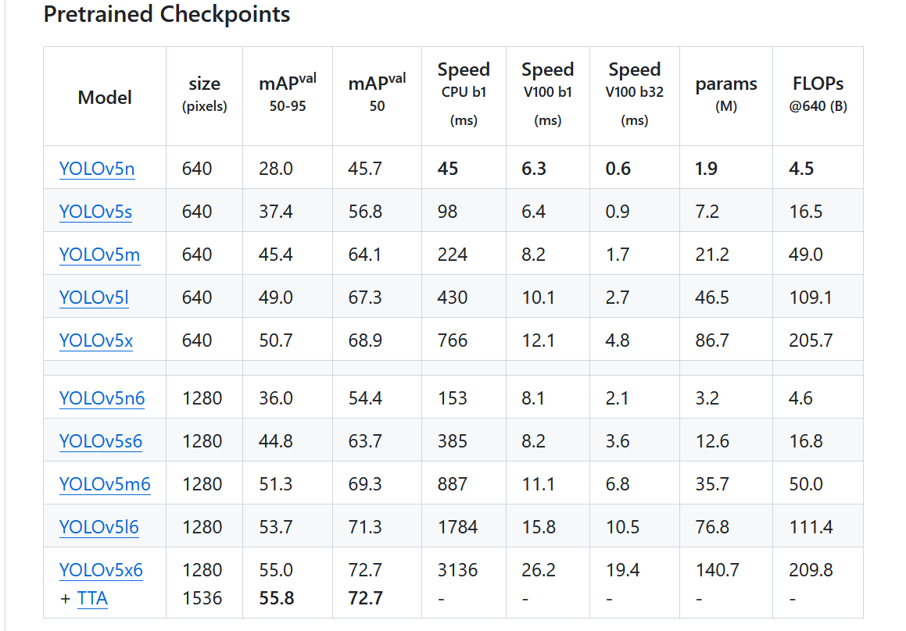
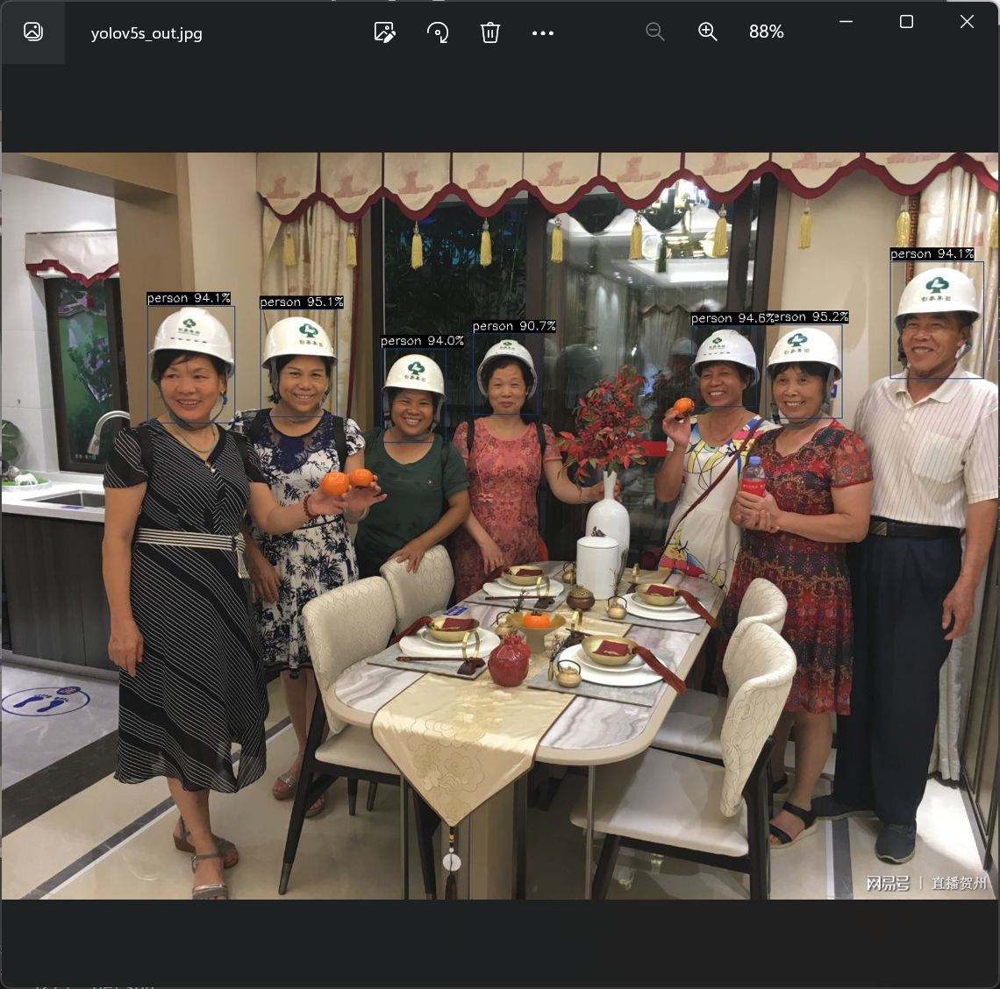

# 爱芯元智AX650N部署yolov5s 自定义模型

> 本博客将向你展示零基础一步步的部署好自己的yolov5s模型（博主展示的是安全帽模型），利用yolov5 官方的代码工具导出onnx模型，并通过onnxsim自带的工具精简网络结构，导出子图，为了Pulsar2 工具进行处理模型做准备。

## 获得自定义训练得到的yolov5s onnx模型

### 准备自定义数据集（博主用的是VOC数据集）

- `数据集目录结构`如下：
```
└─VOC2028:		自定义数据集
    ├─Annotations	存放的是数据集标签文件，xml格式
    ├─ImageSets		数据集的划分文件
    │  └─Main
    ├─JPEGImages	存放的是数据集图片
```


- `分割数据集`

在split_train_val.py文件路径下执行`python3 split_train_val.py`会得到一下目录结构：
```
└─VOC2028:		自定义数据集
    ├─Annotations	存放的是数据集标签文件，xml格式
    ├─ImageSets		数据集的划分文件
    │  └─Main test.txt
          └─test.txt
          └─train.txt
          └─val.txt
    ├─JPEGImages	存放的是数据集图片
    ├─split_train_val.py	分割数据集的py文件

```

`split_train_val.py文件代码如下`：

```
# -*- coding: utf-8 -*-
"""
Author:dragonforward
简介：分训练集、验证集和测试集，按照 8：1：1 的比例来分，训练集8，验证集1，测试集1
"""
import os
import random
import argparse

parser = argparse.ArgumentParser()
# xml文件的地址，根据自己的数据进行修改 xml一般存放在Annotations下
parser.add_argument('--xml_path', default='Annotations/', type=str, help='input xml label path')
# 数据集的划分，地址选择自己数据下的ImageSets/Main
parser.add_argument('--txt_path', default='ImageSets/Main/', type=str, help='output txt label path')
opt = parser.parse_args()

train_percent = 0.8  # 训练集所占比例
val_percent = 0.1    # 验证集所占比例
test_persent = 0.1   # 测试集所占比例

xmlfilepath = opt.xml_path
txtsavepath = opt.txt_path
total_xml = os.listdir(xmlfilepath)

if not os.path.exists(txtsavepath):
    os.makedirs(txtsavepath)

num = len(total_xml)  
list = list(range(num))

t_train = int(num * train_percent)  
t_val = int(num * val_percent)

train = random.sample(list, t_train)
num1 = len(train)
for i in range(num1):
    list.remove(train[i])


val_test = [i for i in list if not i in train]
val = random.sample(val_test, t_val)
num2 = len(val)
for i in range(num2):
    list.remove(val[i])


file_train = open(txtsavepath + '/train.txt', 'w')
file_val = open(txtsavepath + '/val.txt', 'w')
file_test = open(txtsavepath + '/test.txt', 'w')

for i in train:
    name = total_xml[i][:-4] + '\n'
    file_train.write(name)

for i in val:
    name = total_xml[i][:-4] + '\n'
    file_val.write(name)    

for i in list:
    name = total_xml[i][:-4] + '\n'
    file_test.write(name)
    
    
file_train.close()
file_val.close()
file_test.close()
```


- `voc转label得到label文件`

目录结构如下：
```
└─VOC2028:		自定义数据集
    ├─Annotations	存放的是数据集标签文件，xml格式
    ├─ImageSets		数据集的划分文件
    │  └─Main
    ├─JPEGImages	存放的是数据集图片
    └─labels		yolov5将此文件夹当作训练的标注文件夹
└─voc_label.py
```

`voc_label.py文件代码如下`：

```
# -*- coding: utf-8 -*-
import xml.etree.ElementTree as ET
import os

sets = ['train', 'val', 'test']  # 如果你的Main文件夹没有test.txt，就删掉'test'
classes = ["hat", "people"]   # 改成自己的类别，VOC数据集有以下20类别
# classes = ["brickwork", "coil","rebar"]   # 改成自己的类别，VOC数据集有以下20类别
# classes = ["aeroplane", 'bicycle', 'bird', 'boat', 'bottle', 'bus', 'car', 'cat', 'chair', 'cow', 'diningtable', 'dog',
#            'horse', 'motorbike', 'person', 'pottedplant', 'sheep', 'sofa', 'train', 'tvmonitor']  # class names
# abs_path = os.getcwd() /root/yolov5/data/voc_label.py 
abs_path = '/root/yolov5/data/'

def convert(size, box):
    dw = 1. / (size[0])
    dh = 1. / (size[1])
    x = (box[0] + box[1]) / 2.0 - 1
    y = (box[2] + box[3]) / 2.0 - 1
    w = box[1] - box[0]
    h = box[3] - box[2]
    x = x * dw
    w = w * dw
    y = y * dh
    h = h * dh
    return x, y, w, h


def convert_annotation(image_id):
    in_file = open(abs_path + '/VOC2028/Annotations/%s.xml' % (image_id), encoding='UTF-8')
    out_file = open(abs_path + '/VOC2028/labels/%s.txt' % (image_id), 'w')
    tree = ET.parse(in_file)
    root = tree.getroot()
    size = root.find('size')
    w = int(size.find('width').text)
    h = int(size.find('height').text)
    for obj in root.iter('object'):
        difficult = obj.find('difficult').text
        # difficult = obj.find('Difficult').text
        cls = obj.find('name').text
        if cls not in classes or int(difficult) == 1:
            continue
        cls_id = classes.index(cls)
        xmlbox = obj.find('bndbox')
        b = (float(xmlbox.find('xmin').text), float(xmlbox.find('xmax').text), float(xmlbox.find('ymin').text),
             float(xmlbox.find('ymax').text))
        b1, b2, b3, b4 = b
        # 标注越界修正
        if b2 > w:
            b2 = w
        if b4 > h:
            b4 = h
        b = (b1, b2, b3, b4)
        bb = convert((w, h), b)
        out_file.write(str(cls_id) + " " + " ".join([str(a) for a in bb]) + '\n')


for image_set in sets:
    if not os.path.exists(abs_path + '/VOC2028/labels/'):
        os.makedirs(abs_path + '/VOC2028/labels/')

    image_ids = open(abs_path + '/VOC2028/ImageSets/Main/%s.txt' % (image_set)).read().strip().split()
    list_file = open(abs_path + '/VOC2028/%s.txt' % (image_set), 'w')
    for image_id in image_ids:
        list_file.write(abs_path + '/VOC2028/JPEGImages/%s.jpg\n' % (image_id))  # 要么自己补全路径，只写一半可能会报错
        convert_annotation(image_id)
    list_file.close()


```
 

### 训练模型


- 配置环境
```
git clone https://github.com/ultralytics/yolov5
cd yolov5
pip install -r requirements.txt
pip install onnx
```


- 下载预训练权重（博主尝试了v7.0的和v6.0的pt都可以）
```
https://github.com/ultralytics/yolov5/releases/download/v7.0/yolov5s.pt
```

 

- 训练（博主使用的是学校的集群进行训练）


```
python3 train.py --weights weights/yolov5s.pt --cfg models/yolov5s.yaml --data data/safthat.yaml --epochs 150 --batch-size 16 --multi-scale --device 0 
``` 

 

```
python3 detect.py --source /root/yolov5/data/images/000000.jpg --weights /root/yolov5/runs/train/exp13/weights/best.pt --conf-thres 0.25
```


 

- 导出onnx模型，并通过onnxsim自带的工具精简网络结构，导出子图

```
python3 export.py --weights  yolov5s_hat.pt --include onnx
pip install onnx-simplifier
python3 -m onnxsim yolov5s_hat.onnx yolov5s_hat_sub.onnx
```

 


模型查看通过网址输入netron.app查看三个输出：

 

查看官方给的yolov5s.json文件：

```
{
  "model_type": "ONNX",
  "npu_mode": "NPU1",
  "quant": {
    "input_configs": [
      {
        "tensor_name": "images",
        "calibration_dataset": "./dataset/calibration_dataset.tar.gz",
        "calibration_size": 4,
        "calibration_mean": [0, 0, 0],
        "calibration_std": [255.0, 255.0, 255.0]
      }
    ],
    "calibration_method": "MinMax",
    "precision_analysis": false
  },
  "input_processors": [
    {
      "tensor_name": "images",
      "tensor_format": "BGR",
      "src_format": "BGR",
      "src_dtype": "U8",
      "src_layout": "NHWC"
    }
  ],
  "output_processors": [
    {
      "tensor_name": "326",
      "dst_perm": [0, 2, 3, 1]
    },
    {
      "tensor_name": "370",
      "dst_perm": [0, 2, 3, 1]
    },
    {
      "tensor_name": "414",
      "dst_perm": [0, 2, 3, 1]
    }
  ],
  "compiler": {
    "check": 0
  }
}

```

output_processors给的326，370，414

根据[秋水大佬博客](https://zhuanlan.zhihu.com/p/569083585)的导出子图文件修改得到适应pulsar2工具的onnx文件：

```
import onnx

input_path = "yolov5s_hat-sim.onnx"
output_path = "yolov5s_hat_sub.onnx"
input_names = ["images"]
output_names = ["326","370","414"]
onnx.utils.extract_model(input_path, output_path, input_names, output_names)
```


问题记录：
（1）导出子图很关键
&ensp; &ensp;由于之前对深度学习知识了解很少，才知道子图，如果执行使用yolov5s_hat_sub.onnx，在Pulsar2工具中进行量化的话，会生成axmodel但是是无法执行了，通过`o0圏圏蟲0o`大佬给的模型对比网络结构和秋水大佬的ax620a部署yolov5博客才明白自己问题出现在哪里

如果你没处理导出子图得到的图会是这样：

 

正确量化后的yolov5s图：

官方的yolov5s模型：

 

博主的正确的axmodel：

 

其中数字不同255和21的原因（秋水大佬博客有讲）：
该数字为（模型训练的类别+5）*3，博主类别为2类，所以就是21

## 模型转化（关键）

### 安装docker环境（已安装过的可以跳过）
```
安装docker依赖的基础软件
sudo apt-get update
sudo apt-get install apt-transport-https ca-certificates curl gnupg-agent software-properties-common
添加官方来源
curl -fsSL https://download.docker.com/linux/ubuntu/gpg | sudo apt-key add -
sudo add-apt-repository "deb [arch=amd64] https://download.docker.com/linux/ubuntu $(lsb_release -cs) stable"
安装 docker
sudo apt-get update
sudo apt-get install docker-ce docker-ce-cli containerd.io
```

### pulsar2工具模型转化以及仿真运行

- 下载pulsar2工具（博主使用的是1.9）

[谷歌网盘链接：](https://drive.google.com/file/d/1-NW7ExBXj5-nTha40iwYshjNJb74Zfer/view?usp=drive_link)

[quick_start_example 文件夹](https://github.com/AXERA-TECH/pulsar2-docs/releases/download/v1.9/quick_start_example.zip)
其中文件如下：
```
config  dataset  model  output  pulsar2-run-helper
```

./dataset/calibration_data.tar：添加了数据集的四张照片
config文件：
```
{
  "model_type": "ONNX",
  "npu_mode": "NPU1",
  "quant": {
    "input_configs": [
      {
        "tensor_name": "images",
        "calibration_dataset": "./dataset/calibration_data.tar",
        "calibration_size": 4,
        "calibration_mean": [0, 0, 0],
        "calibration_std": [255.0, 255.0, 255.0]
      }
    ],
    "calibration_method": "MinMax",
    "precision_analysis": false
  },
  "input_processors": [
    {
      "tensor_name": "images",
      "tensor_format": "BGR",
      "src_format": "BGR",
      "src_dtype": "U8",
      "src_layout": "NHWC"
    }
  ],
  "output_processors": [
    {
      "tensor_name": "326",
      "dst_perm": [0, 2, 3, 1]
    },
    {
      "tensor_name": "370",
      "dst_perm": [0, 2, 3, 1]
    },
    {
      "tensor_name": "414",
      "dst_perm": [0, 2, 3, 1]
    }
  ],
  "compiler": {
    "check": 0
  }
}
```

```
（博主是直接就是root用户，如果不是root用户记得加sudo）
root@LAPTOP-U638FQQS:~# docker load -i ax_pulsar2_1.9_enc.tar.gz
root@LAPTOP-U638FQQS:~# docker images -a
REPOSITORY                    TAG       IMAGE ID       CREATED         SIZE
hhb4tools/rv_debian_build     1.3       08f478d17c34   7 weeks ago     2.16GB
pulsar2                       1.9_enc   641ba18a8da3   2 months ago    3.46GB
hhb4tools/hhb                 2.4.5     58df969ae05a   3 months ago    8.16GB
hhb4tools/rv_ub20_build       1.4       a65456ded4f0   6 months ago    5.11GB
hhb4tools/march-user-static   1.0       d9efab34da5e   7 months ago    301MB
riscv64/ubuntu                22.04     8b55084b9c02   11 months ago   61.6MB
riscv64/ubuntu                21.04     d0b60ed75c22   21 months ago   60.3MB

root@LAPTOP-U638FQQS:~#docker run -it --net host --rm -v $PWD:/data pulsar2:1.9_enc

root@1657ec5355e2:/data# pulsar2 version
version: 1.9
commit: c62d0b64
root@1657ec5355e2:/data#
```
1. 编译执行
以 yolov5s_hat_sub.onnx 为例, 执行如下 pulsar2 build 命令编译生成 compiled.axmodel:
```
pulsar2 build --input model/yolov5s_hat_sub.onnx --output_dir output --config config/yolov5s_config.json
```
博主输出信息：
```
root@1657ec5355e2:/data# pulsar2 build --input model/yolov5s_hat_sub.onnx --output_dir output --config config/yolov5s_config.json
2023-11-16 17:49:21.238 | WARNING  | yamain.command.build:fill_default:320 - ignore images csc config because of src_format is AutoColorSpace or src_format and tensor_format are the same
Building onnx ━━━━━━━━━━━━━━━━━━━━━━━━━━━━━━━━━━━━━━━━ 100% 0:00:00
2023-11-16 17:49:22.486 | INFO     | yamain.command.build:build:444 - save optimized onnx to [output/frontend/optimized.onnx]
2023-11-16 17:49:22.489 | INFO     | yamain.common.util:extract_archive:21 - extract [dataset/calibration_data.tar] to [output/quant/dataset/images]...
                                                   Quant Config Table                                                    
┏━━━━━━━━┳━━━━━━━━━━━━━━━━━━┳━━━━━━━━━━━━━━━━━━━┳━━━━━━━━━━━━━┳━━━━━━━━━━━━━━━┳━━━━━━━━━━━━━━━━━┳━━━━━━━━━━━━━━━━━━━━━━━┓
┃ Input  ┃ Shape            ┃ Dataset Directory ┃ Data Format ┃ Tensor Format ┃ Mean            ┃ Std                   ┃
┡━━━━━━━━╇━━━━━━━━━━━━━━━━━━╇━━━━━━━━━━━━━━━━━━━╇━━━━━━━━━━━━━╇━━━━━━━━━━━━━━━╇━━━━━━━━━━━━━━━━━╇━━━━━━━━━━━━━━━━━━━━━━━┩
│ images │ [1, 3, 640, 640] │ images            │ Image       │ BGR           │ [0.0, 0.0, 0.0] │ [255.0, 255.0, 255.0] │
└────────┴──────────────────┴───────────────────┴─────────────┴───────────────┴─────────────────┴───────────────────────┘
Transformer optimize level: 0
4 File(s) Loaded.
[17:49:24] AX LSTM Operation Format Pass Running ...      Finished.
[17:49:24] AX Set MixPrecision Pass Running ...           Finished.
[17:49:24] AX Refine Operation Config Pass Running ...    Finished.
[17:49:24] AX Reset Mul Config Pass Running ...           Finished.
[17:49:24] AX Tanh Operation Format Pass Running ...      Finished.
[17:49:24] AX Confused Op Refine Pass Running ...         Finished.
[17:49:24] AX Quantization Fusion Pass Running ...        Finished.
[17:49:24] AX Quantization Simplify Pass Running ...      Finished.
[17:49:24] AX Parameter Quantization Pass Running ...     Finished.
Calibration Progress(Phase 1): 100%|███████████████████████████████████████████████████████████████████████████████| 4/4 [00:01<00:00,  2.16it/s]
Finished.
[17:49:26] AX Passive Parameter Quantization Running ...  Finished.
[17:49:26] AX Parameter Baking Pass Running ...           Finished.
[17:49:26] AX Refine Int Parameter Pass Running ...       Finished.
[17:49:26] AX Refine Weight Parameter Pass Running ...    Finished.
--------- Network Snapshot ---------
Num of Op:                    [142]
Num of Quantized Op:          [142]
Num of Variable:              [267]
Num of Quantized Var:         [267]
------- Quantization Snapshot ------
Num of Quant Config:          [430]
BAKED:                        [60]
OVERLAPPED:                   [168]
ACTIVATED:                    [138]
SOI:                          [4]
PASSIVE_BAKED:                [60]
Network Quantization Finished.
quant.axmodel export success: output/quant/quant_axmodel.onnx
===>export input/output data to folder: output/quant/debug/test_data_set_0
Building native ━━━━━━━━━━━━━━━━━━━━━━━━━━━━━━━━━━━━━━━━ 100% 0:00:00
2023-11-16 17:49:28.704 | WARNING  | yamain.command.load_model:pre_process:454 - preprocess tensor [images]
2023-11-16 17:49:28.704 | INFO     | yamain.command.load_model:pre_process:456 - tensor: images, (1, 640, 640, 3), U8
2023-11-16 17:49:28.705 | INFO     | yamain.command.load_model:pre_process:456 - op: op:pre_dequant_1, AxDequantizeLinear, {'const_inputs': {'x_zeropoint': array(0, dtype=int32), 'x_scale': array(1., dtype=float32)}, 'output_dtype': <class 'numpy.float32'>, 'quant_method': 0}
2023-11-16 17:49:28.705 | INFO     | yamain.command.load_model:pre_process:456 - tensor: tensor:pre_norm_1, (1, 640, 640, 3), FP32
2023-11-16 17:49:28.705 | INFO     | yamain.command.load_model:pre_process:456 - op: op:pre_norm_1, AxNormalize, {'dim': 3, 'mean': [0.0, 0.0, 0.0], 'std': [255.0, 255.0, 255.0]}
2023-11-16 17:49:28.705 | INFO     | yamain.command.load_model:pre_process:456 - tensor: tensor:pre_transpose_1, (1, 640, 640, 3), FP32
2023-11-16 17:49:28.705 | INFO     | yamain.command.load_model:pre_process:456 - op: op:pre_transpose_1, AxTranspose, {'perm': [0, 3, 1, 2]}
2023-11-16 17:49:28.705 | WARNING  | yamain.command.load_model:post_process:475 - postprocess tensor [326]
2023-11-16 17:49:28.705 | INFO     | yamain.command.load_model:handle_postprocess:473 - op: op:post_transpose_1, AxTranspose
2023-11-16 17:49:28.705 | WARNING  | yamain.command.load_model:post_process:475 - postprocess tensor [370]
2023-11-16 17:49:28.706 | INFO     | yamain.command.load_model:handle_postprocess:473 - op: op:post_transpose_2, AxTranspose
2023-11-16 17:49:28.706 | WARNING  | yamain.command.load_model:post_process:475 - postprocess tensor [414]
2023-11-16 17:49:28.706 | INFO     | yamain.command.load_model:handle_postprocess:473 - op: op:post_transpose_3, AxTranspose
tiling op...   ━━━━━━━━━━━━━━━━━━━━━━━━━━━━━━━━━━━━━━━━━━━━━━━━━━━━━━━━━━━━━━━━━━━━━━━━━━━━━━━━━━━━━━━━━━━━━━━━━━━━━━━━━━━━━━━━━━ 241/241 0:00:00
new_ddr_tensor = []
<frozen backend.ax650npu.oprimpl.normalize>:186: RuntimeWarning: divide by zero encountered in divide
<frozen backend.ax650npu.oprimpl.normalize>:187: RuntimeWarning: invalid value encountered in divide
build op...   ━━━━━━━━━━━━━━━━━━━━━━━━━━━━━━━━━━━━━━━━━━━━━━━━━━━━━━━━━━━━━━━━━━━━━━━━━━━━━━━━━━━━━━━━━━━━━━━━━━━━━━━━━━━━━━━━━ 1177/1177 0:00:04
add ddr swap...   ━━━━━━━━━━━━━━━━━━━━━━━━━━━━━━━━━━━━━━━━━━━━━━━━━━━━━━━━━━━━━━━━━━━━━━━━━━━━━━━━━━━━━━━━━━━━━━━━━━━━━━━━━━━━━ 1141/1141 0:00:00
calc input dependencies...   ━━━━━━━━━━━━━━━━━━━━━━━━━━━━━━━━━━━━━━━━━━━━━━━━━━━━━━━━━━━━━━━━━━━━━━━━━━━━━━━━━━━━━━━━━━━━━━━━━━ 1437/1437 0:00:00
calc output dependencies...   ━━━━━━━━━━━━━━━━━━━━━━━━━━━━━━━━━━━━━━━━━━━━━━━━━━━━━━━━━━━━━━━━━━━━━━━━━━━━━━━━━━━━━━━━━━━━━━━━━ 1437/1437 0:00:00
assign eu heuristic   ━━━━━━━━━━━━━━━━━━━━━━━━━━━━━━━━━━━━━━━━━━━━━━━━━━━━━━━━━━━━━━━━━━━━━━━━━━━━━━━━━━━━━━━━━━━━━━━━━━━━━━━━━ 1437/1437 0:00:00
assign eu onepass   ━━━━━━━━━━━━━━━━━━━━━━━━━━━━━━━━━━━━━━━━━━━━━━━━━━━━━━━━━━━━━━━━━━━━━━━━━━━━━━━━━━━━━━━━━━━━━━━━━━━━━━━━━━━ 1437/1437 0:00:00
assign eu greedy   ━━━━━━━━━━━━━━━━━━━━━━━━━━━━━━━━━━━━━━━━━━━━━━━━━━━━━━━━━━━━━━━━━━━━━━━━━━━━━━━━━━━━━━━━━━━━━━━━━━━━━━━━━━━━ 1437/1437 0:00:00
2023-11-16 17:49:34.720 | INFO     | yasched.test_onepass:results2model:2004 - max_cycle = 4,846,471
2023-11-16 17:49:35.349 | INFO     | yamain.command.build:compile_npu_subgraph:1076 - QuantAxModel macs: 7,881,318,400
2023-11-16 17:49:35.352 | INFO     | yamain.command.build:compile_npu_subgraph:1084 - use random data as gt input: images, uint8, (1, 640, 640, 3)
2023-11-16 17:49:38.687 | INFO     | yamain.command.build:compile_ptq_model:1003 - fuse 1 subgraph(s)
root@1657ec5355e2:/data# 
```

2. 模型仿真运行


```
cp output/compiled.axmodel pulsar2-run-helper/models/yolov5s_hat.axmodel
输入数据准备
python3 cli_detection.py --pre_processing --image_path sim_images/000032.jpg --axmodel_path models/yolov5s_hat.axmodel --intermediate_path sim_inputs/0
输出信息：
root@1657ec5355e2:/data/pulsar2-run-helper# python3 cli_detection.py --pre_processing --image_path sim_images/000032.jpg --axmodel_path models/yolov5s_hat.axmodel --intermediate_path sim_inputs/0
[I] Write [images] to 'sim_inputs/0/images.bin' successfully.
仿真模型推理
pulsar2 run --model models/yolov5s_hat.axmodel --input_dir sim_inputs --output_dir sim_outputs --list list.txt
输出信息：
root@1657ec5355e2:/data/pulsar2-run-helper# pulsar2 run --model models/yolov5s_hat.axmodel --input_dir sim_inputs --output_dir sim_outputs --list list.txt
Building native ━━━━━━━━━━━━━━━━━━━━━━━━━━━━━━━━━━━━━━━━ 100% 0:00:00
>>> [0] start
write [326] to [sim_outputs/0/326.bin] successfully
write [370] to [sim_outputs/0/370.bin] successfully
write [414] to [sim_outputs/0/414.bin] successfully
>>> [0] finish
输出数据处理（记得指定图片路径）
python3 cli_detection.py --post_processing --image_path sim_images/000032.jpg --axmodel_path models/yolov5s_hat.axmodel --intermediate_path sim_outputs/0
输出信息：
root@1657ec5355e2:/data/pulsar2-run-helper# python3 cli_detection.py --post_processing --image_path sim_images/000032.jpg --axmodel_path models/yolov5s_hat.axmodel --intermediate_path sim_outputs/0
[I] Number of detected objects: 7
[I]  0: 94.59%, [972, 224, 1089, 345]
[I]  0: 94.56%, [886, 222, 970, 327]
[I]  0: 94.12%, [1141, 145, 1262, 281]
[I]  0: 93.96%, [487, 249, 571, 370]
[I]  0: 93.94%, [331, 201, 430, 341]
[I]  0: 93.27%, [186, 192, 302, 351]
[I]  0: 62.17%, [607, 233, 692, 338]
root@1657ec5355e2:/data/pulsar2-run-helper#
```
具体工具文档如下：
[pulsar2工具文档](https://pulsar2-docs.readthedocs.io/zh-cn/latest/user_guides_quick)

## 开发板运行

开发板镜像为1.27版本，采用本地编译


下载源码：
```
git clone https://github.com/AXERA-TECH/ax-samples.git
```
修改ax_yolov5s_steps.cc文件中：


```
修改classname标签
const char* CLASS_NAMES[] = {
    "person", "hat"};
generate_proposals_yolov5函数指定classnum数量为2  
for (uint32_t i = 0; i < io_info->nOutputSize; ++i)
    {
        auto& output = io_data->pOutputs[i];
        auto& info = io_info->pOutputs[i];
        auto ptr = (float*)output.pVirAddr;
        int32_t stride = (1 << i) * 8;
        detection::generate_proposals_yolov5(stride, ptr, PROB_THRESHOLD, proposals, input_w, input_h, ANCHORS, prob_threshold_u_sigmoid,2);
    }
```
修改的原因是它默认为80，不然会报错下面信息：
```
root@maixbox:/home/ax-samples/build/install/ax650# ./ax_yolov5s -m yolov5s_hat.axmodel -i 000032.jpg
--------------------------------------
model file : yolov5s_hat.axmodel
image file : 000032.jpg
img_h, img_w : 640 640
--------------------------------------
WARN,Func(__is_valid_file),NOT find file = '/etc/ax_syslog.conf'
ERROR,Func(__syslog_parma_cfg_get), NOT find = '/etc/ax_syslog.conf'
Engine creating handle is done.
Engine creating context is done.
Engine get io info is done.
Engine alloc io is done.
Engine push input is done.
--------------------------------------
Segmentation fault

```

 
```

cd ax-samples 
mkdir build && cd build
cmake -DBSP_MSP_DIR=/soc/ -DAXERA_TARGET_CHIP=ax650 ..
make -j6
make install
```
编译完成后，生成的可执行示例存放在 `ax-samples/build/install/ax650/` 路径下：

```bash
ax-samples/build$ tree install
install
└── ax650
    ├── ax_classification
    ├── ax_detr
    ├── ax_dinov2
    ├── ax_glpdepth
    ├── ax_hrnet
    ├── ax_imgproc
    ├── ax_pfld
    ├── ax_pp_humanseg
    ├── ax_pp_liteseg_stdc2_cityscapes
    ├── ax_pp_ocr_rec
    ├── ax_pp_person_attribute
    ├── ax_pp_vehicle_attribute
    ├── ax_ppyoloe
    ├── ax_ppyoloe_obj365
    ├── ax_realesrgan
    ├── ax_rtmdet
    ├── ax_scrfd
    ├── ax_segformer
    ├── ax_simcc_pose
    ├── ax_yolo_nas
    ├── ax_yolov5_face
    ├── ax_yolov5s
    ├── ax_yolov5s_seg
    ├── ax_yolov6
    ├── ax_yolov7
    ├── ax_yolov7_tiny_face
    ├── ax_yolov8
    ├── ax_yolov8_pose
    └── ax_yolox
```
讲axmodel模型放在可执行文件下和测试图片：
```
root@maixbox:/home/ax-samples/build/install/ax650# ./ax_yolov5s -m yolov5s_hat.axmodel -i 000032.jpg
--------------------------------------
model file : yolov5s_hat.axmodel
image file : 000032.jpg
img_h, img_w : 640 640
--------------------------------------
WARN,Func(__is_valid_file),NOT find file = '/etc/ax_syslog.conf'
ERROR,Func(__syslog_parma_cfg_get), NOT find = '/etc/ax_syslog.conf'
Engine creating handle is done.
Engine creating context is done.
Engine get io info is done.
Engine alloc io is done.
Engine push input is done.
--------------------------------------
post process cost time:0.42 ms
--------------------------------------
Repeat 1 times, avg time 6.15 ms, max_time 6.15 ms, min_time 6.15 ms
--------------------------------------
detection num: 7
 0:  95%, [ 981,  221, 1080,  342], person
 0:  95%, [ 332,  201,  431,  341], person
 0:  95%, [ 886,  222,  970,  327], person
 0:  94%, [1141,  140, 1262,  290], person
 0:  94%, [ 187,  197,  300,  347], person
 0:  94%, [ 487,  252,  571,  373], person
 0:  91%, [ 605,  232,  689,  337], person
--------------------------------------
```
  

 

## 感谢
感谢`o0圏圏蟲0o`,`无事闲来`，`梦醒时分`，`N/A`，`秋水`等大佬的帮助