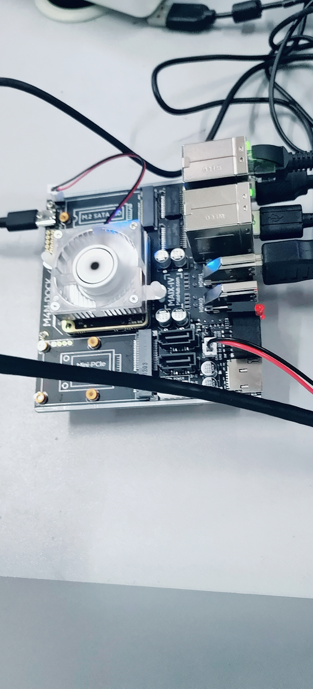
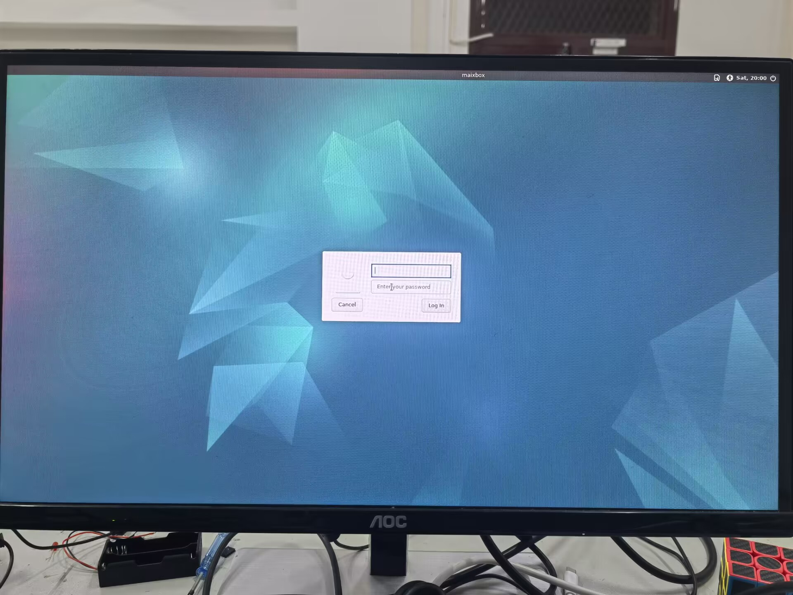
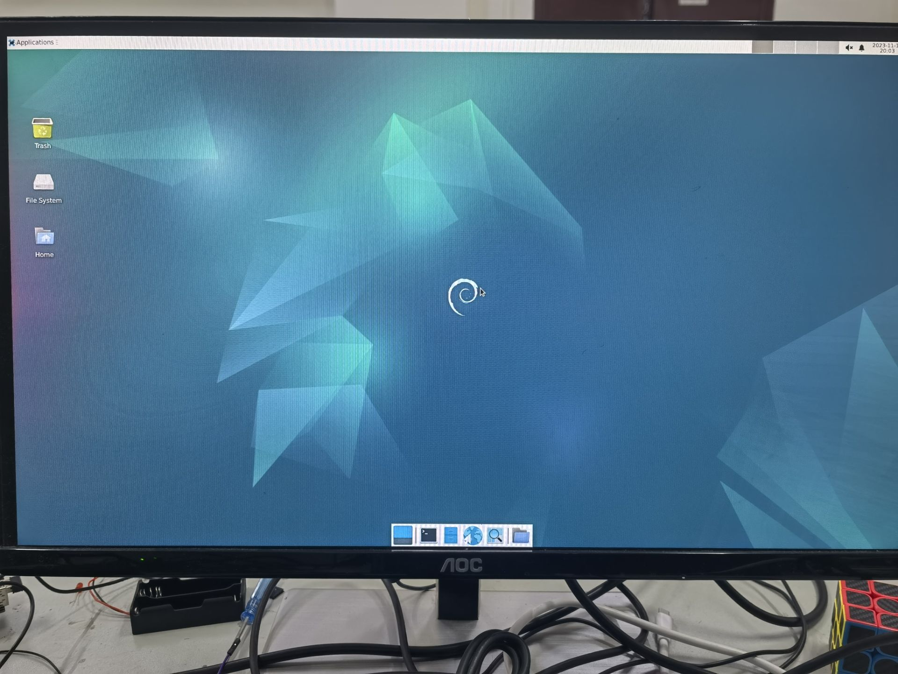
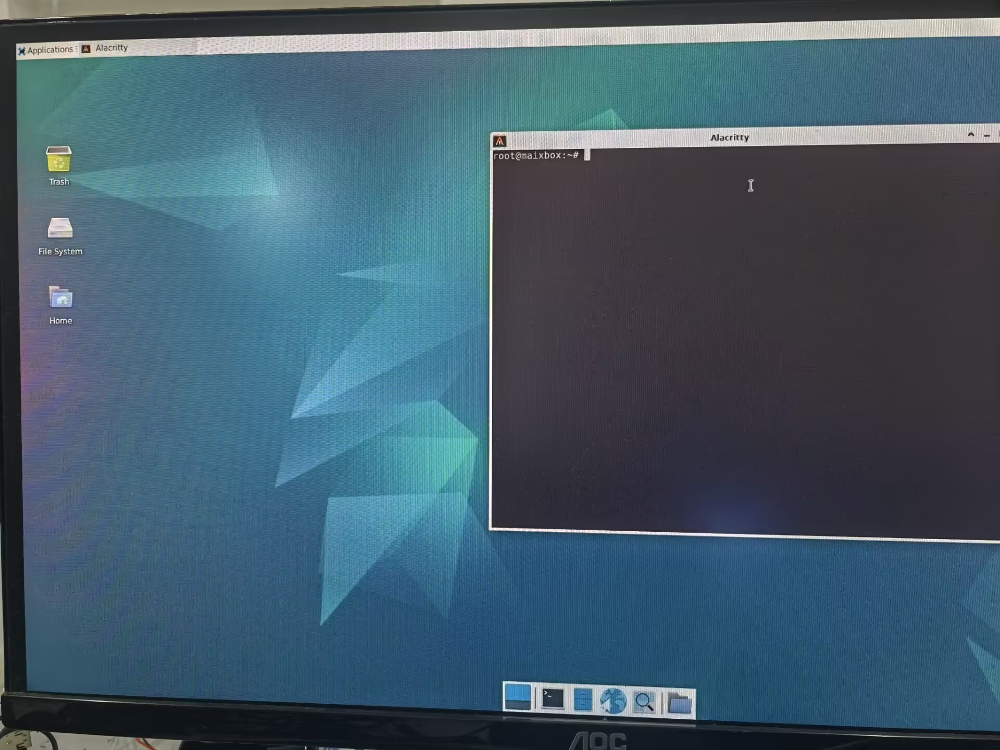
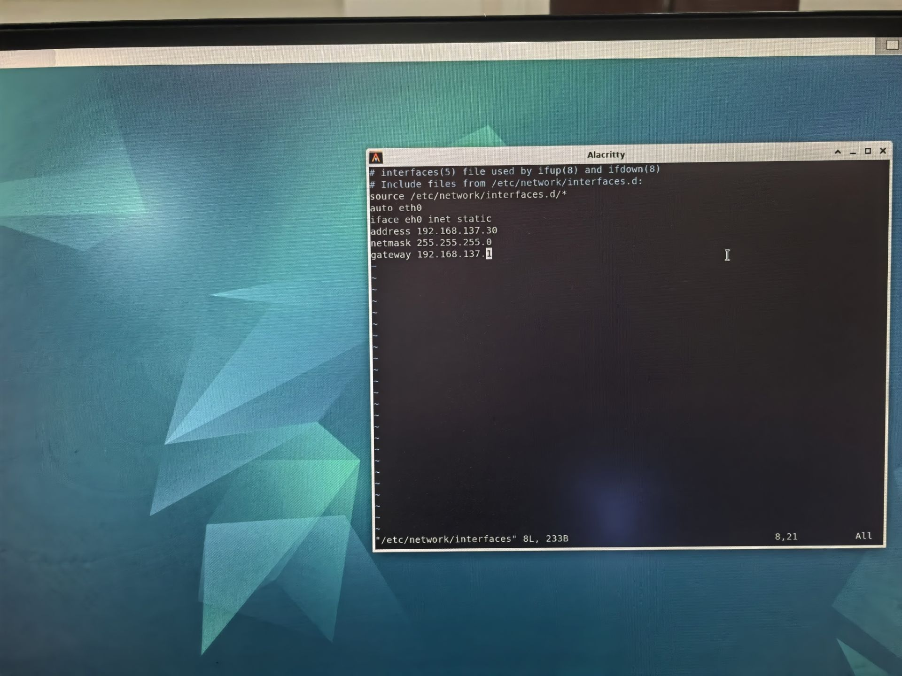
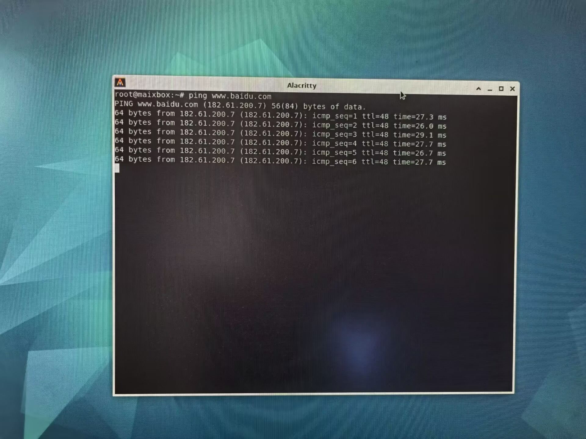
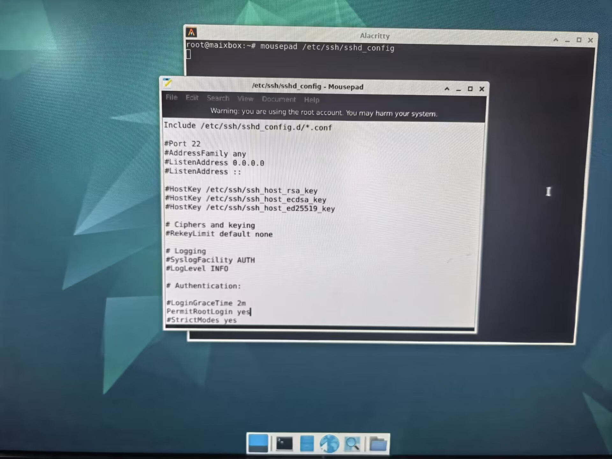
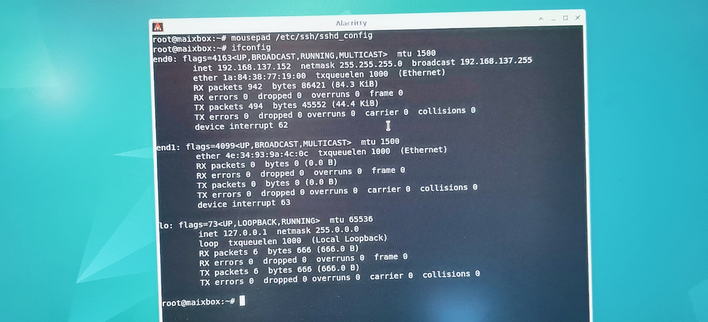

# 桌面系统基础使用


## 登录系统

系统默认为debian系统，插入网线，插入显示器，鼠标、键盘，介绍基础系统使用操作。
将 M4N-Dock 连接上显示器后，可以看到图形化交互界面了。
在登录界面，输入用户名 `root`，密码 `root` 就可以登录进系统了。

  

  
进入系统后的界面如下：
  

## 打开命令行

在M4N-Dock的 Debian 图形化系统中，使用快捷键 `Ctrl` + `Alt` + `T` 三个组合键可以直接打开命令行终端，来快速方便地操作系统，系统默认为`root`用户。


  


## 连接网络

### 连接有线网络

M4N-Dock 有两个网络接口（靠近HDMI1的为eth1，另一个为eth0）；将已经接通网络的网线插入到 LicheePi 4A 的网络接口中节能实现连接有线网络了。
准备材料：

1. 连上网络的笔记本（或者台式机）
2. M4N-Dock
3. 网线

- 笔记本的设置
1. 控制面板---->网络和 Internet---->网络连接
2. 右击连接wifi的WLAN---->属性---->共享（勾选运行其他网络用户连接并选中连接为以太网（没有配置过渡会是一个下拉框可以挑选））
3. 出现下图三，点击是
4. 会出现以太网（未识别的网络）是因为我已经插上了和板子连接的网线，查看以太网IPV4是否为下图四框选一样，如果没有，则手动设置为下图一样。

  

  

  

  


- 开发板设置
```
vim /etc/network/interfaces
在里面添加（按i后输入以下代码，设置后是开机自启动总会有，当然你也可以临时设置）
auto eth0
iface eth0 inet static
address 192.168.137.30
netmask 255.255.255.0
gateway 192.168.137.1
重启
reboot
```
  

- 测试是否联网成功


```
ping www.baidu.com
```

  


## 基本软件安装

由于 Debian 镜像在制作过程中为了控制大小方便版本分发，因此常用的板级软件开发工具并未预装，保证完成了网络连接后，可进行软件包的更新，安装。
```
apt update
apt install build-essential
apt install libopencv-dev
apt install cmake
apt-get install net-tools
  
sudo apt install mousepad
```

## SSH
```
apt install ssh openssh-server
mousepad /etc/ssh/sshd
修改 PermitRootLogin yes
service sshd restart
```

  

安装之后即可使用 ssh 来远程登录到其它机器操作，或者在其它机器上使用 ssh 登录到 M4N-Dock
以Mobaxterm为例

  

登录成功：
  


