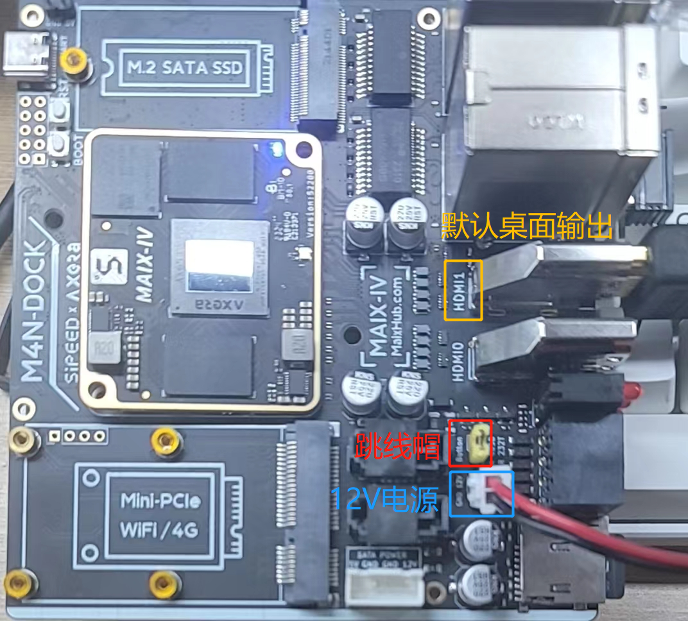
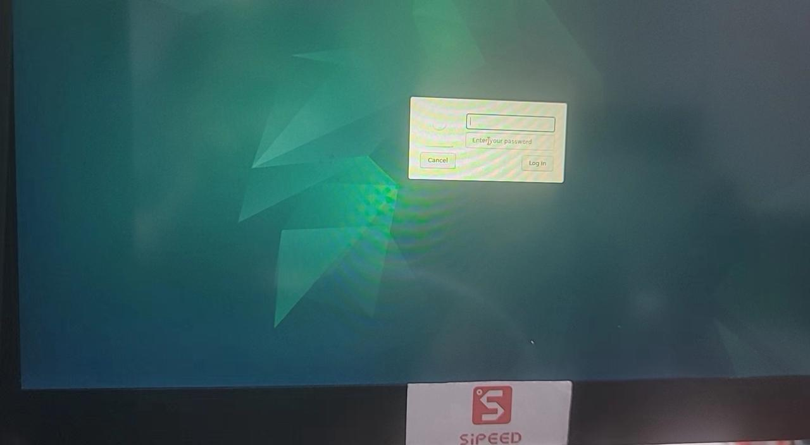
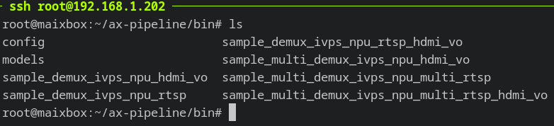

## 系统开机与登录
注意：要求必须通过 12V DC 进行供电，否则仅通过 USB 会出现供电不足进而导致系统不稳定

### 开机前准备
开机前硬件准备：
1. 12V DC 供电电源
2. HDMI 线缆和显示器
3. Type-C 线缆（可选：串口调试和登录）
4. RJ45 网络线缆（可选：连接网络及 SSH 登录）

首次使用请根据您手上版本确认以下状态符合，否则系统无法正常使用
- 外壳上开关处于已打开状态（有外壳版本）
- Button 丝印处保持跳线帽短接（裸板版本）



### 正常开机
通过 HDMI1 连接显示器并接入 12V DC 供电，等待片刻约 20 多秒后显示器屏幕将会如下显示 LightDM 登录界面，表示系统启动成功。



板载 USB-A 口连接鼠标、键盘，方便后续系统操作和输入。登录界面等待输入用户名和密码，默认都为 root，确认登录即可进入 Debian 桌面系统。

### 串口和SSH登录（进阶）
板载 USB Type-C 接口为默认调试串口，波特率相关配置为 **115200 8n1**。

用户可通过串口工具打开该串口，以查看内核调试信息，也可在此处通过用户名和密码直接登录系统终端进行命令操作。

注意：本系统仅内置 root 超级用户，且考虑到安全性并未开启超级用户 SSH 密码登录。

若用户需要使用 SSH 登录 root 用户，推荐使用密钥登录，可以免输密码不仅方便快捷且安全。

所需操作如下：通过串口或桌面登录系统后，手动粘贴个人公钥保存到`/root/.ssh/authorized_keys`文件内，该文件不存在可手动创建。更详细过程可搜索 SSH 密钥登录或直接查看该[教程](https://www.runoob.com/w3cnote/set-ssh-login-key.html)。


## 交互式图像分割和修复（Segment and Inpaint Anything）

交互式图像分割和修复，基于QT的GUI交互界面，实现了交互式点选、框选的实时分割和进一步可选修复，具体效果预览和操作流程如下。


代码由爱芯官方开源于 GITHUB：https://github.com/ZHEQIUSHUI/SAM-ONNX-AX650-CPP 可下载官方预编译版本或按仓库内文档自行编译进行体验，下图是移除照片某球员的效果展示。

<div><table><tr>
<td></td>
<td></td>
</tr></table></div>

以下是实机操作画面。

<div><table><tr>
<td></td>
<td></td>
<td></td>
</tr><tr>
<td>RAW</td>
<td>SAM</td>
<td>Inpaint</td>
</tr></table></div>


## 32路AI BOX（人车检测）
BoxDemo 是本机搭载的 BOX 产品类的演示应用程序，包括从 ××H264/H.265×× 视频解码，经 AI 全结构化检测，最后经 HDMI 显示的 PIPE 流程。
`/opt/bin/BoxDemo/run.sh`为启动脚本。需要连接 HDMI0 到显示器，默认数据流是视频文件输入 经AI运算和视频处理后输出到 HDMI0 单显 32 路（6x6 布局，最后4路为无信号窗口）。支持双屏 HDMI (支持同显和异显)，此时实际测量整机功耗为不到 7W。
该应用原理为输入 32 路视频复制为共 64 通道，其中32通道为 472 x 264 分辨率输出 HDMI 缩放拼接供显示，剩余32通道为 1024 x 576 分辨率同步输入加载所选模型的 NPU 进行 AI 分析并将结果按需反馈到前 32 路对应视频流。目前仅使用了 3.6T（三分之一性能）算力轻松覆盖使用， 帧率15到20，瓶颈在于 CPU 的前后处理任务。另可额外再开启编码功能用于本地存储或网络推流。
如需要修改输入为 RTSP 流，请手动修改`/opt/bin/BoxDemo/box.conf`文件中`streamxx`行为有效 RTSP 地址。
如需要双屏显示，请手动修改`/opt/bin/BoxDemo/box.conf`文件中DISP1值为1，代表额外输出到 HDMI1。
视频流示意图如下：


## DINO v2 单目深度估计（Depth Estimation）
DINO v2 单目深度估计，仅使用单颗彩色摄像头，使用 Facebook 的 DINO v2 大模型提取多维度视觉特征，并搭配下游模型进行估算场景相对深度




```bash
cd ~/ax-pipeline/bin

./sample_multi_demux_ivps_npu_multi_rtsp_hdmi_vo \
        -p ./config/dinov2_depth.json \
        -f ~/boxvideos/13.mp4
```
注：可指定其它 H.264 编码的视频文件或者 RTSP 流。

基于 Facebook 开源大模型 DINOv2 的深度估计移植效果预览。


<div><table><tr>
<td></td>
<td></td>
</tr></table></div>


## YOLOv5 行人检测追踪（Pedestrian Detection，Person re-identification）

```bash
cd ~/ax-pipeline/bin

./sample_multi_demux_ivps_npu_multi_rtsp_hdmi_vo \
        -p ./config/yolov5_seg.json \
        -f ~/boxvideos/25.mp4
```


