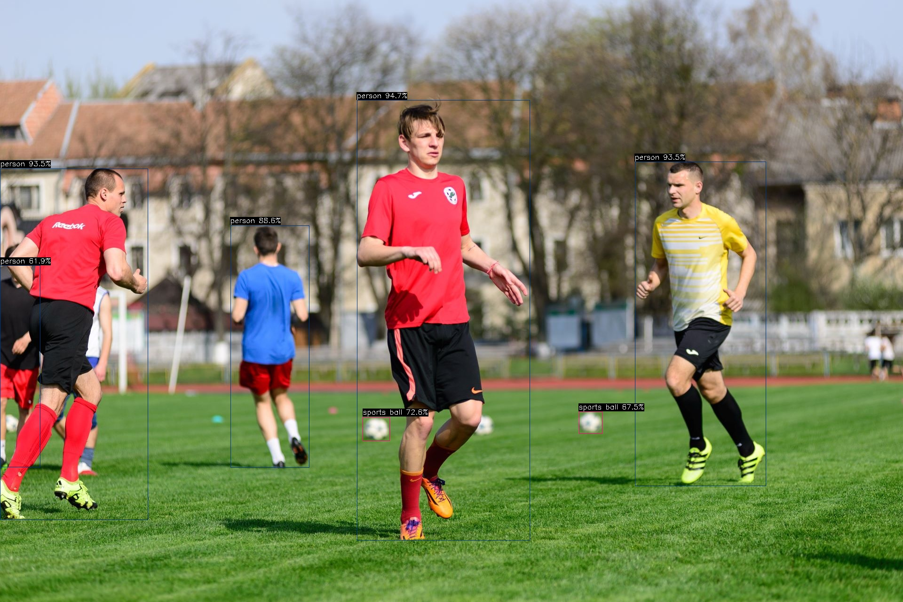

<script src="https://cdn.jsdelivr.net/npm/chart.js"></script>

# 树莓派5 PCIe 加速指南

## 结果演示
树莓派 5 以下前置准备工作完成后，演示运行[大模型 DeepSeek-R1:1.5B](https://huggingface.co/AXERA-TECH/DeepSeek-R1-Distill-Qwen-1.5B-GPTQ-Int4) (Int4 参数量化)，性能达 13.69 tokens/s（较小参数量模型性能受限于 PCIe 链接，对比单板直接运行结果 19 tokens/s 差距会稍大），对比树莓派 5 仅 6.12 tokens/s。见以下视频：
<video controls autoplay src="../assets/m4nhat/PCIe/axcl-run-llm-on-raspi5-2025-08-19-3xspeedup.mp4" type="video/mp4"> Your browser does not support video playback. </video>

## 前置准备

- Maix4-Hat
- sdcard-20250818.img.zst or newer

### 安装
<div style="display: flex; justify-content: space-between;">
  
  
</div>


### Maix4-HAT 烧录从机系统
1.使用 fpc 排线连接 Maix4-HAT 和 树莓派 5 的 PCIe 座子，并确认固定完毕。

2.上电树莓派给 Maix4-HAT 供电。

3.参考 [System Flashing Guide](../m4n_c-SoM/system-update.html#启动-Live-系统（需手动按键操作）) 进入 TFCard Live 系统。

4.执行 `dd if=/boot/spl_AX650_card_signed.bin of=/dev/mmcblk0 conv=fsync` 烧录从机系统以支持通过 PCIe 启动:
  ```bash
  root@m4chat-08080a:~# dd if=/boot/spl_AX650_card_signed.bin of=/dev/mmcblk0 conv=fsync
  512+0 records in
  512+0 records out
  262144 bytes (262 kB, 256 KiB) copied, 0.0165514 s, 15.8 MB/s
  ```

5.启用树莓派的 PCIex1 端口:
  执行 `sudo raspi-config` 并进入 `6 Advanced Options -> A8 PCIe Speed`，选择 `Yes` 以使能 PCIex1 gen3。
5.1.或检查 `/boot/firmware/config.txt` 中的内容（文件末尾）是否包含以下字段：
  ```bash
  [all]
  dtparam=pciex1_gen=3
  ```
  实际上这个 `config.txt` 文件所在 SD 卡的 boot 分区为 FAT32 格式，因此可被广大操作系统识别和读写。可在树莓派关机后取出，并通过读卡器插在 PC 上直接修改。
  > 注意：刚烧录树莓派镜像的新卡不存在这个 /boot/firmware 目录，此时需要插入树莓派完整启动一次才会生成上文所描述的结构。

6.重启树莓派，使用 lspci 命令检查加速卡是否正确被识别：
  ```bash
  # 应能看到以下输出
  sipeed@rpi-sipeed:~ $ lspci
  0001:00:00.0 PCI bridge: Broadcom Inc. and subsidiaries BCM2712 PCIe Bridge (rev 21)
  0001:01:00.0 Multimedia video controller: Axera Semiconductor Co., Ltd Device 0650 (rev01)
  0002:00:00.0 PCI bridge: Broadcom Inc. and subsidiaries BCM2712 PCIe Bridge (rev 21)
  0002:01:00.0 Ethernet controller: Raspberry Pi Ltd RP1 PCIe 2.0 South Bridge
  ```

  其中前两行信息则表示树莓派的 PCIe 初始化成功，并识别挂载了 `Multimedia video controller: Axera Semiconductor Co., Ltd Device 0650 (rev01)`。

### Raspi 5 安装 AXCL 软件包
PCIe 可以正常识别到 Maix4-HAT 后，还需要继续安装 AXCL 软件包以提供支持，才能通过 Maix4-HAT 加速运行模型。
该软件包 `axcl_host_aarch64_V3.6.2_20250603154858_NO4873.deb` 可于下载站单独下载到树莓派开发板上，或直接使用下面的AIDemos.tar.zst。
然后运行安装命令：
```bash
sudo apt install axcl_host_aarch64_V3.6.2_20250603154858_NO4873.deb
# 如果遇到问题:例如可以识别 PCIe，但 axcl-smi 不能显示任何设备，请执行以下命令重新安装
sudo apt install --reinstall axcl_host_aarch64_V3.6.2_20250603154858_NO4873.deb
```

安装成功后，断电重启树莓派。
此时运行 `axcl-smi` 显示内容如下，即代表安装成功：
```bash
sipeed@rpi-sipeed:~$ axcl-smi
+------------------------------------------------------------------------------------------------+
| AXCL-SMI  V3.6.2_20250603154858                                  Driver  V3.6.2_20250603154858 |
+-----------------------------------------+--------------+---------------------------------------+
| Card  Name                     Firmware | Bus-Id       |                          Memory-Usage |
| Fan   Temp                Pwr:Usage/Cap | CPU      NPU |                             CMM-Usage |
|=========================================+==============+=======================================|
|    0  AX650N                     V3.6.2 | 0001:01:00.0 |                148 MiB /      945 MiB |
|   --   55C                      -- / -- | 0%        0% |                 18 MiB /     7040 MiB |
+-----------------------------------------+--------------+---------------------------------------+

+------------------------------------------------------------------------------------------------+
| Processes:                                                                                     |
| Card      PID  Process Name                                                   NPU Memory Usage |
|================================================================================================|
```


## 模型演示

于网盘下载 [AIDemos.tar.zst](https://mega.nz/folder/NxxEzRAB#e-sA_IK0K5JqQM6FnCH6_Q) 并解压缩即可复现体验下列已部署模型。
国内用户可于下载站百度网盘加速下载。

### 准备:
准备 Python 环境并安装 axengine 包。
```bash
cd /path/to/AIDemos/extra
python -m venv venv-llm
source venv-llm/bin/activate
pip install -r requirements.txt
pip install axengine-0.1.3-py3-none-any.whl
```


结果:
```bash
sipeed@rpi-sipeed:~/Downloads/AIDemos/extra $ ls -lh
total 44M
-rw-r--r-- 1 sipeed sipeed  44M Aug 14 09:04 axcl_host_aarch64_V3.6.2_20250603154858_NO4873.deb
-rw-r--r-- 1 sipeed sipeed  19K Aug 14 09:46 axengine-0.1.3-py3-none-any.whl
-rw-r--r-- 1 sipeed sipeed 1.3K Aug 18 08:50 requirements.txt
drwxr-xr-x 6 sipeed sipeed 4.0K Aug 18 03:24 venv-llm
```

### YOLO11
参考: https://huggingface.co/AXERA-TECH/YOLO11

准备:
```bash
source ../extra/venv-llm/bin/activate
```

示例:
```bash
sipeed@rpi-sipeed:~/Downloads/AIDemos/YOLO11 $ ls
axcl_yolo11  ax_yolo11	football.jpg  ssd_horse.jpg  yolo11s.axmodel  yolo11x.axmodel
sipeed@rpi-sipeed:~/Downloads/AIDemos/YOLO11 $ ./axcl_yolo11 -m yolo11s.axmodel -i football.jpg
--------------------------------------
model file : yolo11s.axmodel
image file : football.jpg
img_h, img_w : 640 640
--------------------------------------
axclrtEngineCreateContextt is done.
axclrtEngineGetIOInfo is done.

grpid: 0

input size: 1
    name:   images
        1 x 640 x 640 x 3


output size: 3
    name: /model.23/Concat_output_0
        1 x 80 x 80 x 144

    name: /model.23/Concat_1_output_0
        1 x 40 x 40 x 144

    name: /model.23/Concat_2_output_0
        1 x 20 x 20 x 144

==================================================

Engine push input is done.
--------------------------------------
post process cost time:0.90 ms
--------------------------------------
Repeat 1 times, avg time 3.34 ms, max_time 3.34 ms, min_time 3.34 ms
--------------------------------------
detection num: 7
 0:  95%, [ 759,  213, 1126, 1152], person
 0:  94%, [   0,  359,  315, 1107], person
 0:  94%, [1350,  344, 1629, 1036], person
 0:  89%, [ 490,  480,  658,  996], person
32:  73%, [ 771,  888,  830,  939], sports ball
32:  67%, [1231,  876, 1280,  924], sports ball
 0:  62%, [   0,  565,   86,  995], person
--------------------------------------
```
<div style="display: flex; justify-content: space-between;">
  
  
</div>

<div style="width: 80%; margin: 0 auto;">
    <canvas id="YOLOv11BarChart"></canvas>
<script>
    var ctx = document.getElementById('YOLOv11BarChart').getContext('2d');
    var YOLOv11BarChart = new Chart(ctx, {
        type: 'bar',
        data: {
            labels: ['YOLOv11s', 'YOLOv11x'],  // Now the models are the labels
            datasets: [
                {
                    label: 'Maix4 HAT 24T(PCIe mode)',
                    data: [298, 40.48],
                    backgroundColor: 'rgba(255, 99, 132, 0.2)',
                    borderColor: 'rgba(255, 99, 132, 1)',
                    borderWidth: 1
                },
                {
                    label: 'Jetson Orin Nano Super 67T',
                    data: [196.85, 50.25],
                    backgroundColor: 'rgba(54, 162, 235, 0.2)',
                    borderColor: 'rgba(54, 162, 235, 1)',
                    borderWidth: 1
                },
                {
                    label: 'Hailo8 26T',
                    data: [147, 0],
                    backgroundColor: 'rgba(255, 206, 86, 0.2)',  // Gold
                    borderColor: 'rgba(255, 206, 86, 1)',
                    borderWidth: 1
                }
            ]
        },
        options: {
            responsive: true,
            plugins: {
                title: {
                    display: true,
                    text: 'YOLOv11 Performance Benchmark(fps)',  // Chart title added here
                    font: {
                        size: 20
                    }
                },
                legend: {
                    position: 'top',
                },
                tooltip: {
                    callbacks: {
                        label: function(tooltipItem) {
                            return tooltipItem.dataset.label + ': ' + tooltipItem.raw + ' fps';
                        }
                    }
                }
            },
            scales: {
                y: {
                    beginAtZero: true
                }
            }
        }
    });
</script>
</div>

相关数据来源: [Ultralytics](https://docs.ultralytics.com/zh/guides/nvidia-jetson/#nvidia-jetson-orin-nano-super-developer-kit_1), [RK3588](https://github.com/yuunnn-w/rknn-cpp-yolo?tab=readme-ov-file#report-inference-results-and-speed)

### DeepSeek-R1-Distill-Qwen-1.5B-GPTQ-Int4
参考: https://huggingface.co/AXERA-TECH/DeepSeek-R1-Distill-Qwen-1.5B-GPTQ-Int4

用法:
```bash
./run_from_pi.sh
```

示例:
```bash
sipeed@rpi-sipeed:~/Downloads/AIDemos/DeepSeek-R1-Distill-Qwen-1.5B-GPTQ-Int4 $ ./run_from_pi.sh
Main script running (PID: 9852), subprocess PID: 9856
build time: Feb 13 2025 15:44:57
[I][                            Init][ 111]: LLM init start
bos_id: 151646, eos_id: 151643
100% | ████████████████████████████████ |  31 /  31 [17.22s<17.22s, 1.80 count/s] init post axmodel okremain_cmm(-1 MB)
[I][                            Init][ 226]: max_token_len : 1023
[I][                            Init][ 231]: kv_cache_size : 256, kv_cache_num: 1023
[I][                     load_config][ 282]: load config:
{
    "enable_repetition_penalty": false,
    "enable_temperature": true,
    "enable_top_k_sampling": true,
    "enable_top_p_sampling": false,
    "penalty_window": 20,
    "repetition_penalty": 1.2,
    "temperature": 0.9,
    "top_k": 10,
    "top_p": 0.8
}

[I][                            Init][ 288]: LLM init ok
Type "q" to exit, Ctrl+c to stop current running
>> what can you do?
<think>

</think>

I'm DeepSeek-R1, an AI assistant created exclusively by DeepSeek. My purpose is to help you generate helpful responses. I don't have personal experiences or emotions, so I don't have feelings, but I'm focused on providing accurate and useful information. For more information, please visit DeepSeek's official website.

[N][                             Run][ 610]: hit eos,avg 13.69 token/s

>>
```

<div style="width: 80%; margin: 0 auto;">
    <canvas id="DeepSeekR1BarChart"></canvas>
<script>
    var ctx = document.getElementById('DeepSeekR1BarChart').getContext('2d');
    var DeepSeekR1BarChart = new Chart(ctx, {
        type: 'bar',
        data: {
            labels: ['DSR1:1.5B', 'DSR1:7B'],  // Models as labels
            datasets: [
                {
                    label: 'Maix4 HAT 24T(PCIe mode)',
                    data: [13.69, 4.64],
                    backgroundColor: 'rgba(255, 99, 132, 0.2)',
                    borderColor: 'rgba(255, 99, 132, 1)',
                    borderWidth: 1
                },
                {
                    label: 'RPI5',
                    data: [6.12, 1.43],
                    backgroundColor: 'rgba(54, 162, 235, 0.2)',
                    borderColor: 'rgba(54, 162, 235, 1)',
                    borderWidth: 1
                }
            ]
        },
        options: {
            responsive: true,
            plugins: {
                title: {
                    display: true,
                    text: 'DeepSeek-R1 Performance Benchmark(higher is better)',  // Chart title added here
                    font: {
                        size: 20
                    }
                },
                legend: {
                    position: 'top',
                },
                tooltip: {
                    callbacks: {
                        label: function(tooltipItem) {
                            return tooltipItem.dataset.label + ': ' + tooltipItem.raw + ' token/s';
                        }
                    }
                }
            },
            scales: {
                y: {
                    beginAtZero: true
                }
            }
        }
    });
</script>
</div>

相关数据来源: [deepseek-r1-on-RPI5](https://dev.to/jeremycmorgan/running-deepseek-r1-locally-on-a-raspberry-pi-1gh8)


### InternVL2_5-1B
参考: https://huggingface.co/AXERA-TECH/InternVL2_5-1B

用法:
```bash
./run_from_pi.sh
```

示例:
```bash
sipeed@rpi-sipeed:~/Downloads/AIDemos/InternVL2_5-1B $ ./run_from_pi.sh
Main script running (PID: 10379), subprocess PID: 10383
[I][                            Init][ 128]: LLM init start
[I][                            Init][ 321]: connect http://127.0.0.1:49152 ok
bos_id: -1, eos_id: 151645
  7% | ███                               |   2 /  27 [0.70s<9.41s, 2.87 count/s] embed_selector init ok
[I][                             run][  30]: AXCLWorker start with devid 0
100% | ████████████████████████████████ |  27 /  27 [18.42s<18.42s, 1.47 count/s] init post axmodel ok,remain_cmm(6433 MB)6574 MB)
[I][                            Init][ 225]: image_encoder_height : 448, image_encoder_width: 448
[I][                            Init][ 227]: max_token_len : 1023
[I][                            Init][ 230]: kv_cache_size : 128, kv_cache_num: 1023
[I][                            Init][ 238]: prefill_token_num : 320
[I][                            Init][ 240]: prefill_max_token_num : 320
________________________
|    ID| remain cmm(MB)|
========================
|     0|           6066|
¯¯¯¯¯¯¯¯¯¯¯¯¯¯¯¯¯¯¯¯¯¯¯¯
[I][                     load_config][ 282]: load config:
{
    "enable_repetition_penalty": false,
    "enable_temperature": true,
    "enable_top_k_sampling": true,
    "enable_top_p_sampling": false,
    "penalty_window": 20,
    "repetition_penalty": 1.2,
    "temperature": 0.9,
    "top_k": 10,
    "top_p": 0.8
}

[I][                            Init][ 337]: LLM init ok
Type "q" to exit, Ctrl+c to stop current running
prompt >> describe the picture in English
image >> ssd_car.jpg
[I][                          Encode][ 393]: image encode time : 362.10 ms, size : 229376
[I][                          Encode][ 453]: offset : 42 out_embed.size() : 276864
[I][                             Run][ 481]: input token num : 309, prefill_split_num : 1
[I][                             Run][ 604]: ttft: 510.61 ms
The image shows a classic red double-decker bus parked on the side of a city street. The bus is adorned with advertisements, one of which reads, "THINGS GET MORE EXCITING WHEN YOU SAY YES," along with a website, "VMGIVING.COM." The bus number on it is 16.

In the foreground, a woman is standing with a cheerful expression. She is wearing a black coat, a scarf, and jeans and appears to be smiling at the camera. In front of her, there is a streetcar, also red, passing by. The street is marked with a bicycle lane, indicated by a dashed white line on the road. In the background, several multi-story buildings, likely commercial establishments, are visible.

The setting appears to be a bustling urban area, with a mix of historical and modern architecture, suggesting a city center.

[N][                             Run][ 756]: hit eos,avg 18.73 token/s

prompt >>
```


### lcm-lora-sdv1-5
参考: https://huggingface.co/AXERA-TECH/lcm-lora-sdv1-5

准备:
```bash
source ../extra/venv-llm/bin/activate
```

用法:
```bash
python run_txt2img_axe_infer_once.py --prompt 'two beautiful girl'
# or
python run_txt2img_axe_infer_loop.py # wait it be ready and then type prompt and press Enter
# or
python run_img2img_axe_infer.py --prompt "8k, cute" --init_image txt2img_output_axe.png
```

示例:
```bash
(venv-llm) sipeed@rpi-sipeed:~/Downloads/AIDemos/lcm-lora-sdv1-5 $ python run_txt2img_axe_infer_once.py --prompt 'two beautiful girl'
[INFO] Available providers:  ['AXCLRTExecutionProvider']
prompt: two beautiful girl
text_tokenizer: ./models/tokenizer
text_encoder: ./models/text_encoder
unet_model: ./models/unet.axmodel
vae_decoder_model: ./models/vae_decoder.axmodel
time_input: ./models/time_input_txt2img.npy
save_dir: ./txt2img_output_axe.png
[INFO] Using provider: AXCLRTExecutionProvider
[INFO] SOC Name: AX650N
[INFO] VNPU type: VNPUType.DISABLED
[INFO] Compiler version: 3.4 9215b7e5
text encoder take 4936.9ms
[INFO] Using provider: AXCLRTExecutionProvider
[INFO] SOC Name: AX650N
[INFO] VNPU type: VNPUType.DISABLED
[INFO] Compiler version: 3.3 972f38ca
[INFO] Using provider: AXCLRTExecutionProvider
[INFO] SOC Name: AX650N
[INFO] VNPU type: VNPUType.DISABLED
[INFO] Compiler version: 3.3 972f38ca
load models take 25627.9ms
unet once take 433.6ms
unet once take 433.4ms
unet once take 433.5ms
unet once take 433.5ms
unet loop take 1736.7ms
vae inference take 914.8ms
save image take 206.9ms

(venv-llm) sipeed@rpi-sipeed:~/Downloads/AIDemos/lcm-lora-sdv1-5 $ python run_img2img_axe_infer.py --prompt "8k, cute" --init_image txt2img_output_axe.png
[INFO] Available providers:  ['AXCLRTExecutionProvider']
prompt: 8k, cute
text_tokenizer: ./models/tokenizer
text_encoder: ./models/text_encoder
unet_model: ./models/unet.axmodel
vae_encoder_model: ./models/vae_encoder.axmodel
vae_decoder_model: ./models/vae_decoder.axmodel
init image: txt2img_output_axe.png
time_input: ./models/time_input_img2img.npy
save_dir: ./img2img_output_axe.png
[INFO] Using provider: AXCLRTExecutionProvider
[INFO] SOC Name: AX650N
[INFO] VNPU type: VNPUType.DISABLED
[INFO] Compiler version: 3.4 9215b7e5
text encoder take 2954.0ms
[INFO] Using provider: AXCLRTExecutionProvider
[INFO] SOC Name: AX650N
[INFO] VNPU type: VNPUType.DISABLED
[INFO] Compiler version: 3.3-dirty 2ecead35-dirty
[INFO] Using provider: AXCLRTExecutionProvider
[INFO] SOC Name: AX650N
[INFO] VNPU type: VNPUType.DISABLED
[INFO] Compiler version: 3.3 972f38ca
[INFO] Using provider: AXCLRTExecutionProvider
[INFO] SOC Name: AX650N
[INFO] VNPU type: VNPUType.DISABLED
[INFO] Compiler version: 3.3 972f38ca
load models take 15804.3ms
vae encoder inference take 459.1ms
unet once take 433.6ms
unet once take 433.3ms
unet loop take 868.3ms
vae decoder inference take 913.7ms
grid image saved in ./lcm_lora_sdv1-5_imgGrid_output.png
save image take 445.9ms
```


<div style="width: 80%; margin: 0 auto;">
    <canvas id="SDV1_5BarChart"></canvas>
<script>
    var ctx = document.getElementById('SDV1_5BarChart').getContext('2d');
    var SDV1_5BarChart = new Chart(ctx, {
        type: 'bar',
        data: {
            labels: ['U-Net (s/it)', 'VAE Decoder (s)'],  // Models as labels
            datasets: [
                {
                    label: 'Maix4 HAT 24T(PCIe mode)',
                    data: [0.43, 0.91],
                    backgroundColor: 'rgba(255, 99, 132, 0.2)',
                    borderColor: 'rgba(255, 99, 132, 1)',
                    borderWidth: 1
                },
                {
                    label: 'RK3588',
                    data: [5.65, 11.13],
                    backgroundColor: 'rgba(54, 162, 235, 0.2)',
                    borderColor: 'rgba(54, 162, 235, 1)',
                    borderWidth: 1
                }
            ]
        },
        options: {
            responsive: true,
            plugins: {
                title: {
                    display: true,
                    text: 'Stable-Diffusion-1.5 (512x512) Performance Benchmark (lower is better)',  // Chart title added here
                    font: {
                        size: 20
                    }
                },
                legend: {
                    position: 'top',
                },
                tooltip: {
                    callbacks: {
                        label: function(tooltipItem) {
                            return tooltipItem.dataset.label + ': ' + tooltipItem.raw + ' s';
                        }
                    }
                }
            },
            scales: {
                y: {
                    beginAtZero: true
                }
            }
        }
    });
</script>
</div>

相关数据来源: [RK3588](https://huggingface.co/happyme531/Stable-Diffusion-1.5-LCM-ONNX-RKNN2)


### Depth-Anything-V2
参考: https://huggingface.co/AXERA-TECH/Depth-Anything-V2

准备:
```bash
source ../extra/venv-llm/bin/activate
```

用法:
```bash
python infer.py --model depth_anything_v2_vits.axmodel --img examples/demo01.jpg
# or
python infer_onnx.py --model depth_anything_v2_vits.onnx --img examples/demo02.jpg
```


<div style="width: 80%; margin: 0 auto;">
    <canvas id="Depth_Anything_V2BarChart"></canvas>
<script>
    var ctx = document.getElementById('Depth_Anything_V2BarChart').getContext('2d');
    var Depth_Anything_V2BarChart = new Chart(ctx, {
        type: 'bar',
        data: {
            labels: ['Depth-Anything-V2 (fps)'],  // Models as labels
            datasets: [
                {
                    label: 'Maix4 HAT 24T(PCIe mode)',
                    data: [24.39],
                    backgroundColor: 'rgba(255, 99, 132, 0.2)',
                    borderColor: 'rgba(255, 99, 132, 1)',
                    borderWidth: 1
                },
                {
                    label: 'Jetson Orin',
                    data: [10.2],
                    backgroundColor: 'rgba(54, 162, 235, 0.2)',
                    borderColor: 'rgba(54, 162, 235, 1)',
                    borderWidth: 1
                }
            ]
        },
        options: {
            responsive: true,
            plugins: {
                title: {
                    display: true,
                    text: 'Depth-Anything-V2 (518x518) Performance Benchmark (fps)',  // Chart title added here
                    font: {
                        size: 20
                    }
                },
                legend: {
                    position: 'top',
                },
                tooltip: {
                    callbacks: {
                        label: function(tooltipItem) {
                            return tooltipItem.dataset.label + ': ' + tooltipItem.raw + ' fps';
                        }
                    }
                }
            },
            scales: {
                y: {
                    beginAtZero: true
                }
            }
        }
    });
</script>
</div>

相关数据来源: [Jetson Orin](https://github.com/IRCVLab/Depth-Anything-for-Jetson-Orin)


### clip
参考:
- https://huggingface.co/AXERA-TECH/clip
- https://github.com/AXERA-TECH/clip.axera

准备:
```bash
source ../extra/venv-llm/bin/activate
```

示例:
```bash
(venv-llm) sipeed@rpi-sipeed:~/Downloads/AIDemos/clip $ ls
clip_vit_l14_336px_image_encoder_all_u16_fc_u8.axmodel	clip_vit_l14_336px_text_encoder_u16.axmodel  images  infer.py  Tokenizer.py  vocab.txt
(venv-llm) sipeed@rpi-sipeed:~/Downloads/AIDemos/clip $ python infer.py
[INFO] Available providers:  ['AXCLRTExecutionProvider']
[INFO] Using provider: AXCLRTExecutionProvider
[INFO] SOC Name: AX650N
[INFO] VNPU type: VNPUType.DISABLED
[INFO] Compiler version: 4.0 685bfee4
input.1 [1, 3, 336, 336] float32
4002 [1, 768] float32
[INFO] Using provider: AXCLRTExecutionProvider
[INFO] SOC Name: AX650N
[INFO] VNPU type: VNPUType.DISABLED
[INFO] Compiler version: 4.0 685bfee4
texts [1, 77] int32
text_features [1, 768] float32
(14, 768)
(11, 768)
=== logits_per_image ===
                   cat   dog  husky  airplane   car  cityscape  fire  person  eagle  bike  pineapple
bike2.jpg         0.00  0.02   0.01      0.00  0.46       0.00  0.01    0.29    0.0  0.21       0.00
eagle.jpg         0.00  0.00   0.00      0.00  0.00       0.00  0.00    0.00    1.0  0.00       0.00
mv2seg.png        0.00  0.00   0.00      0.00  0.98       0.00  0.00    0.01    0.0  0.00       0.00
husky.jpeg        0.00  0.00   1.00      0.00  0.00       0.00  0.00    0.00    0.0  0.00       0.00
fire.png          0.00  0.00   0.00      0.00  0.00       0.00  1.00    0.00    0.0  0.00       0.00
dog.jpg           0.00  0.12   0.04      0.00  0.04       0.00  0.00    0.00    0.0  0.80       0.00
cat.jpg           0.91  0.03   0.01      0.00  0.01       0.00  0.01    0.00    0.0  0.01       0.03
big-dog.jpg       0.00  0.15   0.07      0.00  0.56       0.00  0.03    0.09    0.0  0.01       0.08
pineapple.jpg     0.00  0.00   0.00      0.00  0.00       0.00  0.00    0.00    0.0  0.00       1.00
bike.jpg          0.00  0.00   0.01      0.00  0.01       0.00  0.00    0.05    0.0  0.92       0.00
cityscape.png     0.00  0.00   0.00      0.00  0.19       0.24  0.50    0.00    0.0  0.00       0.05
air.jpg           0.00  0.00   0.00      0.94  0.04       0.00  0.01    0.00    0.0  0.01       0.00
dog-chai.jpeg     0.00  0.23   0.04      0.00  0.57       0.00  0.06    0.07    0.0  0.01       0.02
grace_hopper.jpg  0.02  0.07   0.00      0.00  0.55       0.00  0.28    0.07    0.0  0.00       0.00

=== logits_per_text ===
           bike2.jpg  eagle.jpg  mv2seg.png  husky.jpeg  fire.png  dog.jpg  cat.jpg  big-dog.jpg  pineapple.jpg  bike.jpg  cityscape.png  air.jpg  dog-chai.jpeg  grace_hopper.jpg
cat             0.00       0.01        0.00        0.00      0.00     0.00     0.92         0.01            0.0      0.00           0.00     0.00           0.04              0.02
dog             0.00       0.02        0.00        0.01      0.00     0.40     0.01         0.14            0.0      0.00           0.00     0.00           0.41              0.01
husky           0.00       0.00        0.00        1.00      0.00     0.00     0.00         0.00            0.0      0.00           0.00     0.00           0.00              0.00
airplane        0.00       0.07        0.00        0.00      0.00     0.00     0.00         0.01            0.0      0.00           0.00     0.91           0.01              0.00
car             0.03       0.01        0.29        0.00      0.00     0.05     0.00         0.19            0.0      0.00           0.01     0.01           0.38              0.03
cityscape       0.00       0.01        0.05        0.00      0.00     0.00     0.00         0.05            0.0      0.09           0.64     0.00           0.16              0.00
fire            0.00       0.01        0.00        0.00      0.94     0.00     0.00         0.01            0.0      0.00           0.01     0.00           0.02              0.01
person          0.15       0.04        0.01        0.00      0.00     0.03     0.00         0.22            0.0      0.17           0.00     0.00           0.33              0.03
eagle           0.00       1.00        0.00        0.00      0.00     0.00     0.00         0.00            0.0      0.00           0.00     0.00           0.00              0.00
bike            0.01       0.00        0.00        0.00      0.00     0.69     0.00         0.00            0.0      0.29           0.00     0.00           0.00              0.00
pineapple       0.00       0.00        0.00        0.00      0.00     0.00     0.00         0.00            1.0      0.00           0.00     0.00           0.00              0.00
```


### Whisper
参考: https://huggingface.co/AXERA-TECH/Whisper

准备:
```bash
source ../extra/venv-llm/bin/activate
```

用法:
```bash
python whisper_onnx.py --model_path ./models-onnx/base/ -t base --wav ./demo.wav

python whisper.py --model_path ./models/small/ -t small --wav ./demo.wav
# or
./whisper_axcl_aarch64 -e ./models/small/small-encoder.axmodel -m ./models/small/small-decoder-main.axmodel -l ./models/small/small-decoder-loop.axmodel -p ./models/small/small-positional_embedding.bin -t ./models/small/small-tokens.txt -w ./demo.wav
```

示例:
```bash
(venv-llm) sipeed@rpi-sipeed:~/Downloads/AIDemos/Whisper $ ./whisper_axcl_aarch64 -e ./models/small/small-encoder.axmodel -m ./models/small/small-decoder-main.axmodel -l ./models/small/small-decoder-loop.axmodel -p ./models/small/small-positional_embedding.bin -t ./models/small/small-tokens.txt -w ./RP1intro.wav --language en
encoder: ./models/small/small-encoder.axmodel
decoder_main: ./models/small/small-decoder-main.axmodel
decoder_loop: ./models/small/small-decoder-loop.axmodel
wav_file: ./RP1intro.wav
language: en
Load encoder take 2442.17 ms
Load decoder_main take 4068.22 ms
Load decoder_loop take 3837.32 ms
Read positional_embedding
Encoder run take 190.63 ms
First token: 41154 	 take 51.20ms
Next Token: 17741 	 take 30.39 ms
Next Token: 1025 	 take 30.33 ms
Next Token: 307 	 take 30.36 ms
Next Token: 3094 	 take 30.25 ms
Next Token: 1228 	 take 30.30 ms
Next Token: 264 	 take 30.26 ms
Next Token: 497 	 take 30.30 ms
Next Token: 48 	 take 30.30 ms
Next Token: 16 	 take 30.36 ms
Next Token: 39839 	 take 30.21 ms
Next Token: 1969 	 take 30.29 ms
Next Token: 11 	 take 30.34 ms
Next Token: 257 	 take 30.30 ms
Next Token: 7372 	 take 30.22 ms
Next Token: 19273 	 take 30.29 ms
Next Token: 22848 	 take 30.20 ms
Next Token: 4761 	 take 30.13 ms
Next Token: 294 	 take 30.31 ms
Next Token: 1782 	 take 30.33 ms
Next Token: 295 	 take 30.32 ms
Next Token: 41154 	 take 30.29 ms
Next Token: 17741 	 take 30.33 ms
Next Token: 13 	 take 30.28 ms
Next Token: 50257 	 take 30.31 ms
All Token: take 778.48ms, 32.11 token/s
All take 1010.35ms
Result:  Raspberry Pi 5 is built using the RQ1 IO control, a package containing silicon designed in house of Raspberry Pi.
```


### MeloTTS
参考: https://huggingface.co/AXERA-TECH/MeloTTS

准备:
```bash
source ../extra/venv-llm/bin/activate
cp -R nltk_data ~/
```

用法:
```bash
(venv-llm) sipeed@rpi-sipeed:~/Downloads/AIDemos/MeloTTS/python $ cd python
(venv-llm) sipeed@rpi-sipeed:~/Downloads/AIDemos/MeloTTS/python $ python melotts.py -h
[INFO] Available providers:  ['AXCLRTExecutionProvider']
usage: melotts [-h] [--sentence SENTENCE] [--wav WAV] [--encoder ENCODER] [--decoder DECODER] [--dec_len DEC_LEN] [--sample_rate SAMPLE_RATE] [--speed SPEED]
               [--language {ZH,ZH_MIX_EN,JP,EN,KR,ES,SP,FR}]

Run TTS on input sentence

options:
  -h, --help            show this help message and exit
  --sentence SENTENCE, -s SENTENCE
  --wav WAV, -w WAV
  --encoder ENCODER, -e ENCODER
  --decoder DECODER, -d DECODER
  --dec_len DEC_LEN
  --sample_rate SAMPLE_RATE, -sr SAMPLE_RATE
  --speed SPEED
  --language {ZH,ZH_MIX_EN,JP,EN,KR,ES,SP,FR}, -l {ZH,ZH_MIX_EN,JP,EN,KR,ES,SP,FR}
```

示例:
```bash
(venv-llm) sipeed@rpi-sipeed:~/Downloads/AIDemos/MeloTTS/python $ python melotts.py -s "Dig the well before you are thirsty." -l EN
[INFO] Available providers:  ['AXCLRTExecutionProvider']
sentence: Dig the well before you are thirsty.
sample_rate: 44100
encoder: ../encoder-onnx/encoder-en.onnx
decoder: ../decoder-ax650/decoder-en.axmodel
language: EN
 > Text split to sentences.
Dig the well before you are thirsty.
 > ===========================
split_sentences_into_pieces take 0.7653236389160156ms
[INFO] Using provider: AXCLRTExecutionProvider
[INFO] SOC Name: AX650N
[INFO] VNPU type: VNPUType.DISABLED
[INFO] Compiler version: 3.3 3251425d
load models take 1990.5009269714355ms

Sentence[0]: Dig the well before you are thirsty.
Load language module take 11539.379358291626ms
encoder run take 30.54ms
Decode slice[0]: decoder run take 99.54ms
Decode slice[1]: decoder run take 92.79ms
Decode slice[2]: decoder run take 92.74ms
Save to output.wav
```


## AXCL 推理性能
测试一下 `axcl_run_model` （与原生系统内 ax_run_model 同样使用方法），推理 yolov5s 的性能与 Maix4 原生系统上的数据极度接近。（使用的板卡文件系统自带 yolov5s 模型为单核模型,"type: 1 Core", 实际满核性能为 x3）


```bash
sipeed@rpi-sipeed:~/Downloads/AIDemos/models $ axcl_run_model -m yolov5s.axmodel
   Run AxModel:
         model: yolov5s.axmodel
          type: 1 Core
          vnpu: Disable
        warmup: 1
        repeat: 1
         batch: { auto: 1 }
    axclrt ver: 1.0.0
   pulsar2 ver: 1.2-patch2 7e6b2b5f
      tool ver: 0.0.1
      cmm size: 12730188 Bytes
  ------------------------------------------------------
  min =   7.837 ms   max =   7.837 ms   avg =   7.837 ms
  ------------------------------------------------------
```

其余常用模型的性能实测数据如下表：

| Model         | Input Size | Batch 1 (IPS) | Batch 8 (IPS) |
|---------------|------------|---------------|---------------|
| Inceptionv1   | 224        | 1073          | 2494          |
| Inceptionv3   | 224        | 478           | 702           |
| MobileNetv1   | 224        | 1508          | 4854          |
| MobileNetv2   | 224        | 1366          | 5073          |
| ResNet18      | 224        | 1066          | 2254          |
| ResNet50      | 224        | 576           | 1045          |
| SqueezeNet11  | 224        | 1560          | 5961          |
| Swin-T        | 224        | 342           | 507           |
| ViT-B/16      | 224        | 162           | 207           |
| YOLOv5s       | 640        | 326           | 394           |
| YOLOv6s       | 640        | 282           | 322           |
| YOLOv8s       | 640        | 248           | 279           |
| YOLOv9s       | 640        | 237           | -             |
| YOLOv10s      | 640        | 298           | -             |
| YOLOv11n      | 640        | 860           | -             |
| YOLOv11s      | 640        | 305           | -             |
| YOLOv11m      | 640        | 114           | -             |
| YOLOv11l      | 640        | 87            | -             |
| YOLOv11x      | 640        | 41            | -             |


## 已知问题

### 不断电重启树莓派会导致 Maix4-HAT 无法再次挂载
> 注意：
> 目前有一已知问题，因为当前板卡不能满足树莓派的启动过程中关于 pciex1 的复位时序，所以只有断电后再冷启动才能成功挂载 Maix4-HAT。而在挂载成功后若是保持不断电来重启树莓派，会导致下一次树莓派无法挂载 Maix4-HAT。因此每次都需要断电后再冷启动树莓派。

若是直接重启了树莓派，树莓派串口应会打印如下启动日志。其中第 18 行显示 `1000110000.pcie: link down`，表示 pcie 建立链接失败，显然此时未能成功挂载 Maix4-HAT。
```bash
  7.11 fs_open: 'armstub8-2712.bin'
  7.15 Loading 'kernel_2712.img' to 0x00000000 offset 0x200000
  7.33 Read kernel_2712.img bytes  9727677 hnd 0x3c43
  9.93 PCI1 reset
  9.03 PCI2 reset
  9.13 set_reboot_order 0
  9.13 set_reboot_arg1 0
  9.14 USB-OTG disconnect
  9.56 MESS:00:00:09.256590:0: Starting OS 9256 ms
  9.62 MESS:00:00:09.262115:0: 00000040: -> 00000480
  9.63 MESS:00:00:09.263966:0: 00000030: -> 00100080
  9.68 MESS:00:00:09.268679:0: 00000034: -> 00100080
  9.73 MESS:00:00:09.273392:0: 00000038: -> 00100080
  9.78 MESS:00:00:09.278105:0: 0000003c: -> 00100080

NOTICE:  BL31: v2.6(release):v2.6-240-gfc45bc492
NOTICE:  BL31: Built : 12:55:13, Dec  4 2024
[    0.695249] brcm-pcie 1000110000.pcie: link down

Debian GNU/Linux 12 rpi-sipeed ttyAMA10

My IP address is 192.168.10.176 fdae:b0ae:ebf1:0:b270:135e:b646:70c3

rpi-sipeed login:
```

> 当然现有一更简便方法。我们把树莓派的一个 GPIO 连到了 Maix4-HAT 的复位引脚上，因此若需要保持不断电也能重启树莓派并能成功挂载。需要在每次重启前先执行命令 `gpioset gpiochip0 28=0` Maix4-HAT 进入复位状态，再正常执行树莓派重启命令即可再次正常挂载。


## AXCL 更多资料

**其余详细信息可查看 [axcl官方文档](https://axcl-docs.readthedocs.io)。**

**另有 [树莓派5 AXCL专项页面](https://axcl-pi5-examples-cn.readthedocs.io)。**

可于 [文中](../m4n_c-SoM/axmodel-deploy.html) 介绍到的大模型仓库下载各种已被支持的大模型，并在树莓派上部署运行。