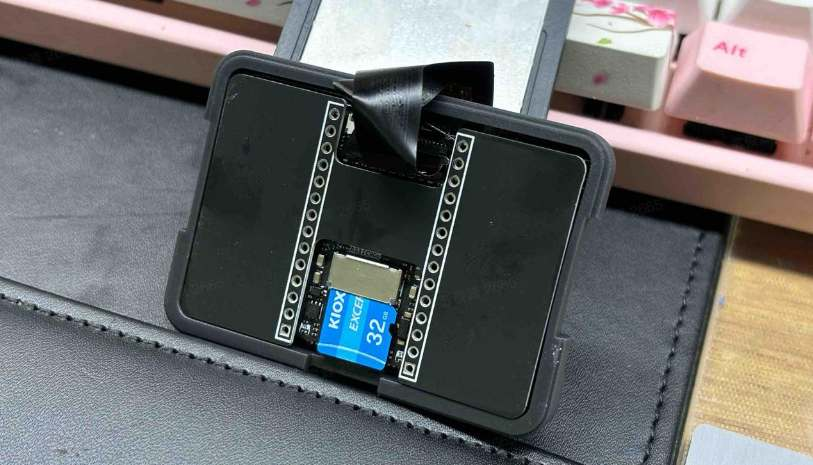

## 简介

拿到手有几个配件需要注意：
* **镜头盖**： 运输过程中保护镜头，使用时请取下，不让画面会是黑的。
* **屏幕保护膜**：为了防止运输刮花屏幕，有一个塑料薄膜，到手请直接撕掉，不然会严重影响观感。
* **镜头手动对焦**： 镜头支持手动对焦，轻轻旋动镜头即可实现手动对焦，如果画面模糊则可能对焦不正确。
* **外壳**：一个 3D 打印外壳，方便握持和安装，同时增加美观性。

## 开源模型

* [MaixCAM 外壳模型](https://makerworld.com/zh/models/440321)

* [MaixCAM 支架模型](https://makerworld.com/zh/models/463622#profileId-372189)

## 拆机

强烈建议选择带 TF 卡的套餐，出厂默认已经组装好了，可以跳过这一步直接使用。

出厂默认已经组装好了，如果你需要更换 TF 卡，或者焊接排针，可以尝试拆机。

这里有几点需要注意：
* 拆机前请确保已经断电。
* CPU和外壳之间有导热垫，拆机时请注意不要搞掉。
* 注意不要破坏摄像头、触摸、屏幕的排线（比较容易松动），不要折断排线。
* 注意排线的方向，不要插反。

## 更换TF卡

1. 向外抠开机身两侧卡扣即可分离前后盖

2. 将固定屏幕的外壳掀开后即可看见TF卡

3. 装回屏幕前请确认屏幕排线的连接是否正常，如果有歪斜，请先将排线重新插好

