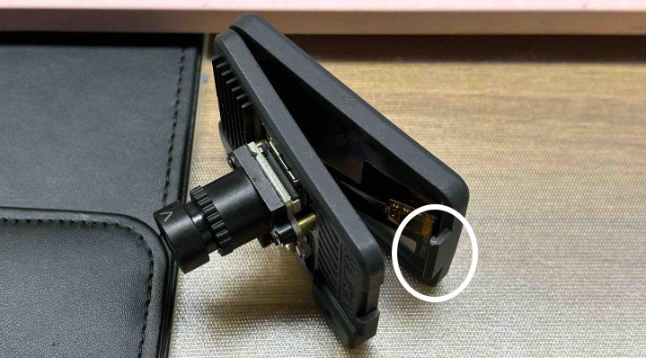
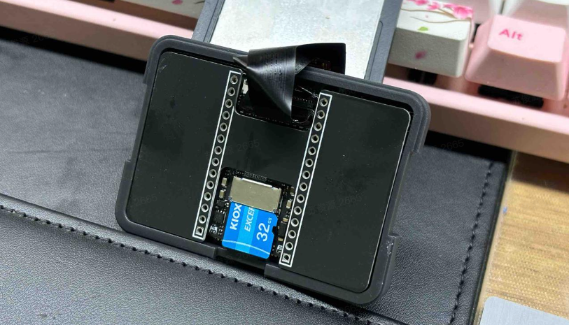

**屏幕保护膜及镜头透明盖在运输中起保护作用，使用时撕掉、取下即可。**

MaixCAM 自带了一个 3D 打印外壳，可以保护 MaixCAM 的硬件。

## 拆机

强烈建议选择带 TF 卡的套餐，出厂默认已经组装好了，可以跳过这一步直接使用。

出厂默认已经组装好了，如果你需要更换 TF 卡，或者焊接排针，可以尝试拆机。

这里有几点需要注意：
* 拆机前请确保已经断电。
* CPU和外壳之间有导热垫，拆机时请注意不要搞掉。
* 注意不要破坏摄像头、触摸、屏幕的排线，不要折断排线。
* 注意排线的方向，不要插反。

## 更换TF卡

1. 像外抠开机身两侧卡扣即可分离前后盖

2. 将固定屏幕的外壳掀开后即可看见TF卡

3. 装回屏幕前请确认屏幕排线的连接是否正常，如果有歪斜，请先将排线重新插好

## 外壳开源文件

文件已上传MakerWorld，[点此跳转](https://makerworld.com/zh/models/440321)

推荐使用耐温70度的树脂进行光固化打印