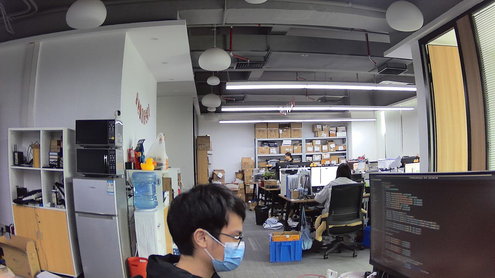
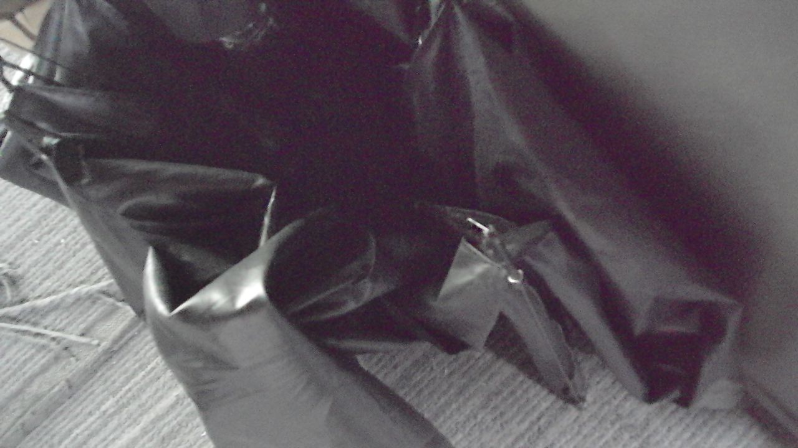

## 摄像头模块参数对比

| **传感器型号** | GC4653            | OS04A10           | SC035HGS         |
|---------------|-------------------|-------------------|------------------|
| **分辨率**     | 2560x1440         | 2688x1520         | 640x480          |
| **尺寸**       | 1/3"              | **1/1.79"**           | 1/6"             |
| **相元尺寸**   | 2.0um             | 2.9um             | 3.744um          |
| **快门类型**   | 卷帘快门          | 卷帘快门          | **全局快门**     |
| **帧率**       | 30fps@2K, 60fps@720P | 30fps@2K      | 180fps@VGA       |
| **最长曝光**   | 0.5s              | 45s               | TBD              |
| **灵敏度**     | 2.4V/Lux.s        | 32000e/Lux.s      | 6.5V/Lux.s       |
| **动态范围**   | 81dB              | 120dB             | 60dB             |
| **镜头焦距**   | 3.05mm            | 4.9mm             | --             |
| **镜头光圈**  | F2.5              | F1.65             | --             |
| **镜头畸变**  | 5%              | 25%             | --             |

> 注意：OS04A10 的镜头具有

* [传感器手册下载](https://dl.sipeed.com/shareURL/MaixCAM/Sensors)

## 传感器选型建议
1. GC4653, 适用于常规应用，画质表现不错，降分辨率到720P时可获得60fps的高帧率
2. OS04A10, 适用于对暗光有要求的场景（如天文摄影，暗场摄影，匀光摄影），噪点控制相对GC4653好很多，并且可达到接近1分钟的长曝光。sensor本身支持极高的帧率(2K@90fps,720p@180fps,360p@360fps,180p@720fps), 只是目前maixcam未调试
3. SC035HGS, 全局摄像头，不会有卷帘快门的果冻变形效应，适用于高速运动物体的抓拍，示例视频就是抓拍高速旋转的唱片上的二维码.

## 传感器实拍效果对比
| 测试项 | GC4653 | OS04A10 |
| --- | --- | --- |
|色卡色彩|||
|远处细节|||
|暗处表现|||

室内，走廊，楼梯间全黑环境下对比
<video playsinline controls muted preload style="width:100%" src="../../assets/maixcam/comapre_gc4653_os04a10.mp4"></video> 

**OS04A10拍摄星空延时摄影效果**
使用鱼眼镜头拍摄   
<video playsinline controls muted preload style="width:100%" src="../../assets/maixcam/os04a10_stars.mp4"></video> 

**OS04A10长曝光拍摄M42星云效果**
使用400mm望远镜拍摄，15s曝光，多张叠加   

**OS04A10显微拍摄硅藻效果**
使用暗场显微镜拍摄，多张拼接

局部单张细节

