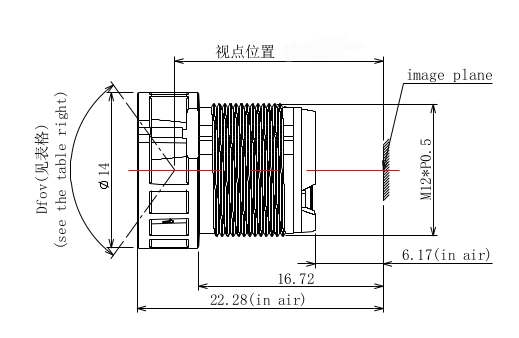

## MaixCAM2 官方支持的摄像头传感器

| 参数\型号       | OS04D10                         | SC850SL | OS04A10 |
| --------------- | ------------------------------- | ------- | ------- |
| 分辨率和帧率    | 2568x1448@30fps (2K / 4M)       | 3856x2176@60fps(10bit下) (4K / 8M) | 2688x1520@30fps(2K / 4M) |
| 像素大小        | 1.998um x 1.998um               | 2.0um x 2.0um         | 2.9um x 2.9um |
| 传感器尺寸      | 5130.864um x 2893.104um         | 7712um x 4352um       | 7841.6um x 4454.4um |
| 镜头尺寸        | 1/3"                            | 1/1.8"                | 1/1.79" |
| 输出格式        | 10bit RAW RGB                   |  12/10/8bit RAW RGB   | 16/12/10bit RAW RGB |
| 快门类型        | 卷帘快门                        | 卷帘快门              | 卷帘快门  |
| CRA             | 12°                             | 9°                    | 9° |
| 最长曝光        | 0.5s                            | -                     | 45s       |
| 动态范围        | -                               | 线性模式75dB 宽动态模式 > 100dB | >120dB(2x/3x staggered HDR) |
| 信噪比          | -                               | 39dB | - |
| 灵敏度          | -                               | 5034 mV/lux·s | 32,000 e-/Lux-sec (green pixelresponse at 530 nm illumination) |
| 工作温度        | -30°C ～ 85°C 最佳 -20°C ～ 60°C  | -30°C ～ 85°C 最佳 -20°C ～ 60°C | -30°C ～ 85°C |
| 适用范围        | 分辨率更低，发热更低，画质优良，能满足一般 AI 检测识别应用 |需要分辨率高，画质清晰，发热大一点 | 需要高清画质，彩光夜视，HDR等，发热比较大|

> `-` 代表未手册未写出或者未测试

更多摄像头传感器数据手册见[下载站](https://dl.sipeed.com/shareURL/MaixCAM/MaixCAM2/Hardware/sensors)

## 镜头和底座参数和更换

官方每个摄像头都配了一个标准 M12 镜头。
注意不同摄像头配的镜头参数不一样，如果你自己需要选购其它参数的镜头，可以根据上面摄像头传感器尺寸和下表出厂自带的镜头信息作为参考选择。
方便你选择新镜头，为了能在已有的传感器和底座上使用，需要着重注意的参数加粗表示了。

更多镜头和底座参数可以在[下载站](https://dl.sipeed.com/shareURL/MaixCAM/MaixCAM2/Hardware/len) 找找对应的数据手册。
需要注意的是，实际使用的镜头可能和手册稍微有区别，比如`OS04D10`和`SC850SL`自带的镜头都没用`650 IR-Cut`，但是数据手册中有，以实际为准，忽略即可。

### 镜头

### MaixCAM2 官方套餐镜头

| 参数\型号       | OS04D10                         | SC850SL | OS04A10  |
| --------------- | ------------------------------- | ------- | -------- |
| 接口类型        |  **M12**                        | **M12** | **M12** |
| 直径            |  12mm                           | 12mm    | 12mm |
| 螺纹间距        |  0.5mm                          | 0.5mm   | 0.5mm |
| 视场角          |  H 90° V 81° D 90°     |  水平H 86.7° 垂直V 48.8° 对角D 99.5°   | H88° V49.9° D100.2° |
| 畸变            |  无畸变                         | 有畸变, -25.6%  | 有畸变, -25.6% |
| IR-Cut          |  无                             | 无      | 无 |
| 镜头尺寸        |   **1/3"**                      | **1/1.8"**  | **1/1.8"** |
| CRA             |   12°                           | 16.2°   | 16.2° |
| 镜头总长(TTL)   |                                 | 22.28±0.2mm | 22.28±0.2mm |
| 焦距            |   **3.05**                          | **4.9±5%mm**    | **4.9±5%mm** |
| 光学后焦         |   3.1                          | 6.41±0.2mm  | 6.41±0.2mm |
| 机械后焦(法兰距) |   3.1                          | **6.17±0.2mm**  | **6.17±0.2mm** |
| 光圈数值        |   2.5                           | 1.65±10%   | 1.6±10% |
| 镜片构成        |   2G2P                          | 4G4P        | 4G4P |
| 解像标准        |   4MP                           | 8MP         | 4MP |

### 如何对焦

默认提供的 M12 镜头，是手动对焦镜头，需要手动拧动镜头进行对焦，如果画面模糊，可能就是没有对好焦。
注意是拧动镜头，部分镜头上还有一个环，那是用来辅助固定镜头的，防止对好焦后震动导致对焦变化。
可以先拧松固定环，再拧镜头对焦，对好焦后再将固定环拧紧以固定。

### 是否可变焦

默认提供的 M12 镜头，是定焦镜头，只能对焦（清晰模糊），不能变焦（光学放大缩小画面），有需要可以自行购买 M12 变焦镜头，购买时参考后文的镜头选择文档。

### 如何更换镜头

选择同样 M12 规格的镜头更换即可，大多数参数都是影响成像效果，但是`镜头的长度`和`底座的长度`以及`焦距`会影响到是否能对上焦，要保证：
1. 镜头拧到底前能对上焦： 即至少镜头拧到底后, `镜头底部到传感器的距离` 必须小于等于 `机械后焦(法兰距)`。比如法兰距很短，镜头也很短，底座太高了，可能就无法对焦。
2. 镜头拧到掉出底座前能对上焦：由`1/f = 1/u + 1/v`, 物距`u`越小，像距`v`应该越大也就是镜头要远离传感器, 已知`u`无穷大时 `f=v`，`u`减小时得到新的像距`v2`,对比`v`增加了距离`v_d`，也就是说镜头要往外移动`v_d`，为了保证镜头不掉出底座，`机械后焦(法兰距)` + `v_d` 后要小于底座的高度，否则现象就是镜头拧出了底座焦点仍然对不上近处目标物体。
> 如果搞不清楚，直接告诉镜头店家传感器参数和底座参数应该也可以帮你判定。

### 底座

底座一般不建议更换，因为和传感器 PCB 用胶水粘在一起不好拆卸，换镜头时适配底座即可。

| 参数\型号       | OS04D10                         | SC850SL          | OS04A10 |
| --------------- | ------------------------------- | ---------------- |  ------  |
| IR-Cut          |  **650mm IR-Cut**               | **650mm IR-Cut** |  **650mm IR-Cut** |
| 高度            |  **12mm**                       | **13mm (12mm底座+1mm垫片)** |  **13mm (12mm底座+1mm垫片)** |

* **IR-Cut**: 过滤红外光，如果你要捕捉红外光得手动破坏这个过滤片或者更换底座，会比较麻烦。

## 是否可以更换传感器

理论可以，官方适配的传感器是经过调教的，可以直接用，如果你要适配新的传感器，需要有 sensor 适配经验以增加驱动支持。
以及需要进行图像调教，过程比较复杂。
本文不提供教程，有能力的可以自行根据芯片原厂资料进行探索。

## 不同摄像头实测效果对比

TODO:

