## PMOD_Thermal32

PMOD_Thermal32 模块是符合PMOD接口标准的低成本热成像模块，可以直接插入MaixCAM系列的PMOD插槽上使用，并和与可见光摄像头组合，实现双光融合的功能。

|**模块名**  | PMOD_Thermal32   |
|-----------|------------------|
|**分辨率**  |32x24|
|**测温范围**|-40～450摄氏度|
|**视角**   | 55°x35°|
|**帧率**   | 1~30fps|
|**接口**   | I2C |

PMOD_Thermal32安装方式

| 平台                | 安装方法                                                     |
| ------------------- | ------------------------------------------------------------ |
| MaixCAM Pro | 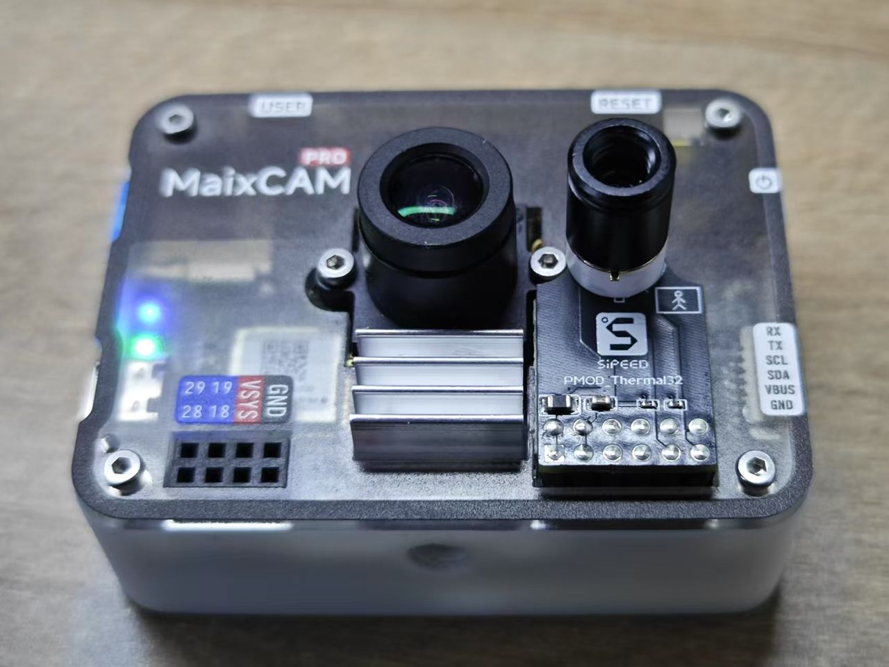 |
| MaixCAM2            | 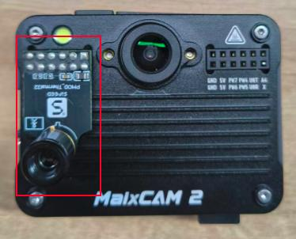 |

单热成像伪彩显示
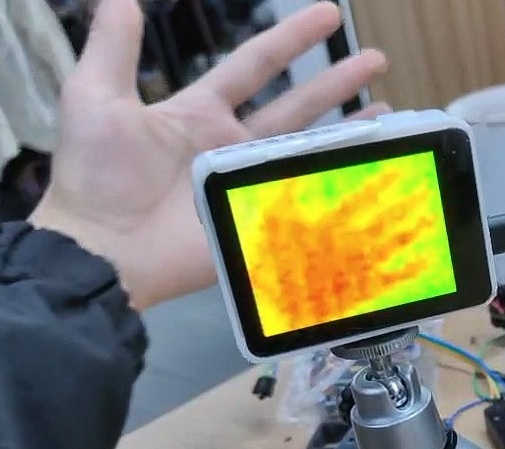

热成像+可见光融合显示
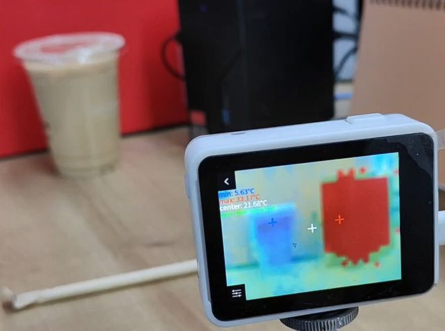

参考使用代码：  
<https://github.com/sipeed/MaixPy/blob/main/examples/ext_dev/sensors/thermography_mlx90640/mlx90640_example.py>

## PMOD_TOF100

PMOD_TOF100 模块是符合PMOD接口标准的低成本面阵TOF模块，可以直接插入MaixCAM系列的PMOD插槽上使用，并和与可见光摄像头组合，实现双光融合的功能。

|**模块名**  | PMOD_TOF100   |
|-----------|------------------|
|**分辨率**  |100x100, 50x50, 25x25|
|**测距范围**|0.2~2.5m|
|**视角**   | 70°Hx60°V|
|**激光发射器**| 940nm VCSEL|
|**帧率**  |100x100 6fps, 50x50 22fps, 25x25 30fps|
|**接口**   | SPI |

PMOD_TOF100安装方式

| 平台                | 安装方法                                                     |
| ------------------- | ------------------------------------------------------------ |
| MaixCAM Pro | 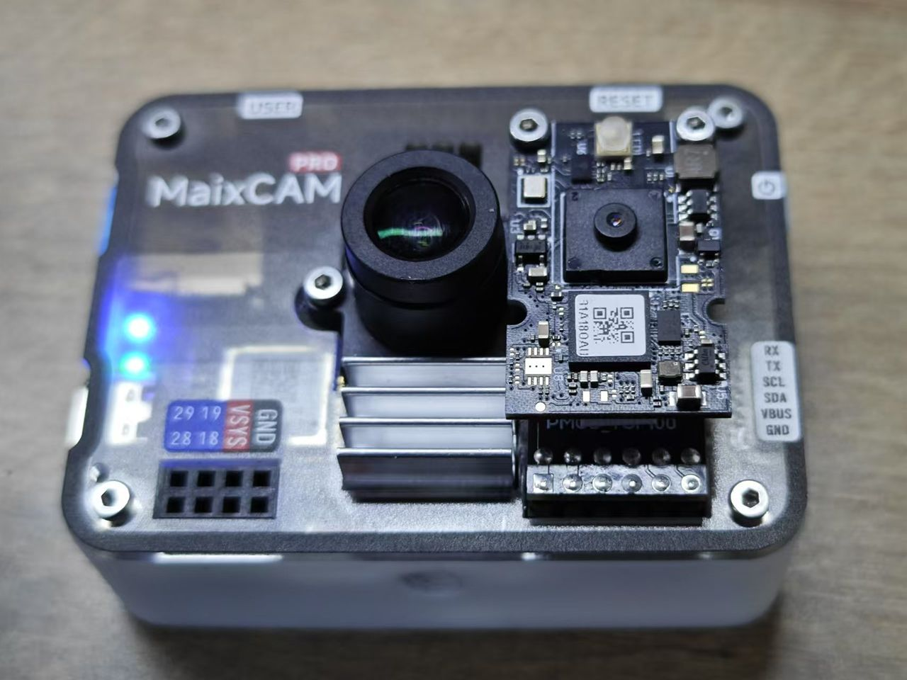 |
| MaixCAM2            | 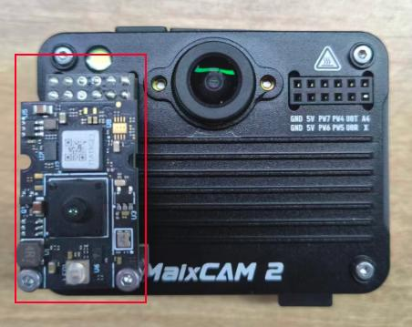 |

单深度伪彩显示
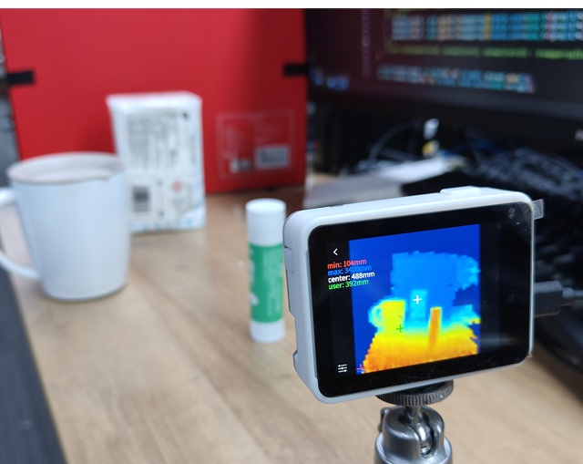

深度+可见光融合显示
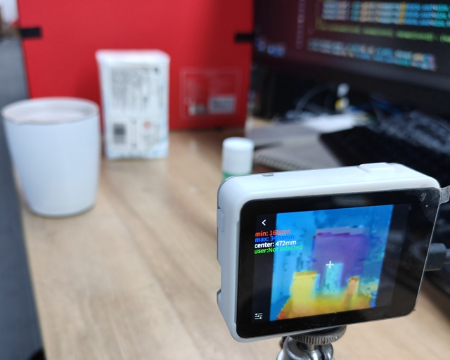

参考使用代码：  
<https://github.com/sipeed/MaixPy/blob/main/examples/ext_dev/sensors/tof100/tof100_example.py>

## PMOD_Thermal160

PMOD_Thermal160 模块是符合PMOD接口标准的低成本热成像模块，可以直接插入MaixCAM系列的PMOD插槽上使用，并和与可见光摄像头组合，实现双光融合的功能。

|**模块名**  | PMOD_Thermal160   |
|-----------|------------------|
|**分辨率**  |160x120|
|**测温范围**|0～80℃|
|**视角**   | 34°x26°|
|**帧率**   | 25fps|
|**接口**   | 图像接口:UART/USB 控制接口:I2C |
|**NETD**|<50mK @25℃|

PMOD_Thermal160安装方式

| 平台                | 安装方法                                                     |
| ------------------- | ------------------------------------------------------------ |
| MaixCAM Pro | 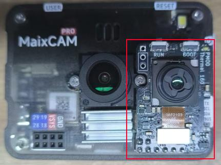 |
| MaixCAM2            | 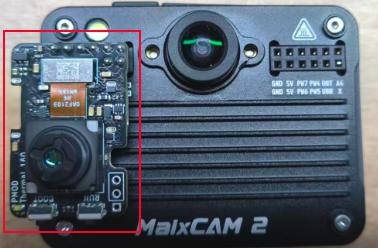 |

参考使用代码：<https://github.com/sipeed/MaixPy/blob/dev/projects/app_thermal160_camera/main.py>

固件下载：

| 项目 | 内容 |
| :--- | :--- |
| 文件 | [pico_tn160_2026-05-28.elf.uf2](../../assets/maixcam/firmware/pmod_thermal160/pico_tn160_2026-05-28.elf.uf2) |
| 大小 | `438272` bytes |
| SHA256 | `55a8776114e4696c2f3f3eb363b05777e9362523250b743c10192abc77e38885` |
| 输出模式 | USB UVC，`160x120`，`YUY2`，`10fps` |
| USB 传输 | full-speed Bulk UVC |

烧录方法：按住模块上的 `BOOT` / `BOOTSEL` 按键后接入 USB，使 RP2350 进入 UF2 下载模式；电脑出现 RP2350/RPI-RP2 类似名称的 U 盘后，将上方 UF2 文件复制到该 U 盘根目录，等待设备自动重启。

## PMOD_Thermal256

PMOD_Thermal256 模块是符合PMOD接口标准的低成本热成像模块，可以直接插入MaixCAM系列的PMOD插槽上使用，并和与可见光摄像头组合，实现双光融合的功能。

|**模块名**  | PMOD_Thermal256   |
|-----------|------------------|
|**分辨率**  |256x192|
|**测温范围**|-15～150℃ (高增益), 50～550℃ (低增益)|
|**视角**   | 56°x42°|
|**帧率**   | 25fps|
|**接口**   | 图像接口:SPI 控制接口:I2C |
|**NETD**|<50mK @25℃|

PMOD_Thermal256安装方式

| 平台                | 安装方法                                                     |
| ------------------- | ------------------------------------------------------------ |
| MaixCAM Pro | 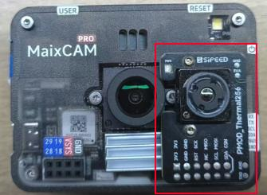 |
| MaixCAM2            | 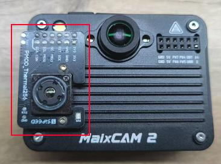 |

参考使用代码：
<https://github.com/sipeed/MaixPy/blob/main/examples/ext_dev/sensors/tiny1c/tiny1c_example.py>
> 如果要使用该示例，请先删除于`x3c_192x256`相关的代码
