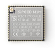

# K210 核心模块

现有四款基于 K210 开发的 AIOT 模块：M1, M1w, M1n, MF0

- 特性说明：

这四款模块都是基于嘉楠堪智科技的边缘智能计算芯片K210（RISC-V架构）设计的。主控芯片内置64位双核高性能低功耗处理器，每个核都有浮点运算单元（FPU），具备卷积人工神经网络智能硬件加速器（KPU）和快速傅里叶变换加速器（FFT）、搭载现场可编程IO阵列（FPIOA），支持多种主流AI编程框架。

### Maix AIOT 模块差异对比

|                            | M1                                                           | M1w                                                         | M1n                                                          | MF0                                                          |
| -------------------------- | ------------------------------------------------------------ | ----------------------------------------------------------- | ------------------------------------------------------------ | ------------------------------------------------------------ |
| 外观                       |  |  |  |  |
| 尺寸                       | 25.4x25.4x3.3（mm）                                          | 25.4x25.4x3.3（mm）                                         | 25.0x22.0x2.7（mm）                                          | 20.0x20.0x4.5（mm）                                          |
| 电压输出（提供给底板使用） | 1.8V和3.3V                                                   | 1.8V和3.3V                                                  | 1.8V和3.3V                                                   | 3.3V                                                         |
| 最大功耗（非瞬态）         | 1.5W                                                         | 3W                                                          | 1.5W                                                         | 1.5W                                                         |
| WIFI功能                   | 无                                                           | 有（K210与ESP8285通过SPI接口和串口连接）                    | 无                                                           | 无                                                           |
| 板载摄像头连接器           | 无                                                           | 无                                                          | 有（仅兼容单摄像头）                                         | 有（仅兼容单摄像头）                                         |
| 引脚形式                   | 邮票孔                                                       | 邮票孔                                                      | NGFF金手指 B-KEY                                             | 2.54mm间距直插焊盘+SMD焊盘                                   |
| 是否引出摄像头信号         | 全引出                                                       | 全引出                                                      | 全引出                                                       | 无                                                           |
| 是否引出屏幕信号           | 全引出                                                       | 全引出                                                      | 全引出                                                       | 无                                                           |
| 引出普通IO口数量           | 48个（全引出）                                               | 48个（全引出）                                              | 44个（IO0-3没引出）                                          | 9个                                                          |

## 模块引脚定义

具体可下载规格书

M1/M1w: https://dl.sipeed.com/MAIX/HDK/Sipeed-M1&M1W/Specifications

M1n: https://dl.sipeed.com/MAIX/HDK/Sipeed-M1n

MF0: https://dl.sipeed.com/MAIX/HDK/Sipeed-MF0/MF0-2802

## M1/M1W(k210) ISP 模式(烧录模式)

更新 K210 时，需要让 K210 进入 ISP 模式，相关信息如下：

- ISP 引脚

  | ISP 引脚 | 描述       | 备注     |
  | ------------- | ---------- | -------- |
  | BOOT (IO_16)         | 启动模式选择 | 低电平进入，ISP 模式 |
  | ISP_RX (IO_4)         | ISP 串口数据接收 |  |
  | ISP_TX (IO_5)         | ISP 串口数据发送 |  |

- Boot 选择

 **IO_16** 用于 **boot** 模式选择，上电时，拉高进入 **Flash** 启动，拉低进入 **ISP** 模式

  | Boot 选择引脚 | 拉高       | 拉低     |
  | ------------- | ---------- | -------- |
  | IO_16         | Flash 启动 | ISP 模式 |

> K210 ISP 模式下，串口波特率建议配置为: 115200，1 停止位，8 数据位，不校验。

- 参考自动进入下载模式电路：

参考来源：

> 《K210技术规格书 v0.1.5》
> - 2.5 特殊引脚:
    IO_16 用于 boot 模式选择，上电复位时，拉高进入 FLASH 启动，拉低进入 ISP 模式。复位后，IO_0、
    IO_1、IO_2、IO_3 为 JTAG 引脚。IO_4、IO_5 为 ISP 引脚。

## MF PCB 注意事项

使用 K210(M1/M1W) 自行设计人脸识别产品，请参考 [《MF 人脸识别模块 PCB 设计注意事项》](../mf_ml_module/mf_precautions.md)
