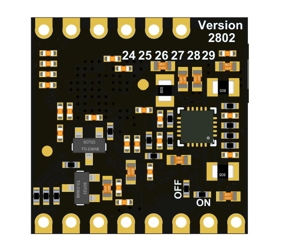

# MF0 机器学习核心模组

## 软硬件概述

MF0 人脸识别模块外观一览

<table border="3">
    <tr>
        <th colspan=3>MF0</th>
    </tr>
    <tr>
        <td width="100">描述</td>
        <td>正面视图</td>
        <td>背面视图</td>
    </tr>
    <tr>
        <td  width="100">MF0</td>
        <td>
            
            Pin Map 
        </td>
        <td>
            
        </td>
    </tr>
    <tr>
        <td>MF0 Dock</td>
        <td>
            <!--  -->
        </td>
        <td>
        </td>
    </tr>
</table>

### 模块特性：

- CPU ：RISC-V 64bit 双核处理器, 400Mhz 标准频率（可超频）
- 图像识别：QVGA@60FPS/VGA@30FPS
- 深度学习框架：TensorFlow/Keras/Darknet
- 外设：FPIOA、UART、GPIO、SPI、I²C、I²S、WDT、TIMER、etc
- 2.54mm 间距 DIP/SMT 焊盘
- 能连接到面包板
- 板载摄像头连接器
- ROM：4MByte
- RAM：6MByte （通用） + 2MByte （ KPU 专用）

### 硬件 pin

| No. | 描述 |
| --- | --- |
| 24 | 用户 IO24 |
| 25 | 用户 IO25 |
| 26 | 用户 IO26，MF0_Dock(LCD_RST) |
| 27 | 用户 IO27，MF0_Dock(LCD_CLK) |
| 28 | 用户 IO28，MF0_Dock(LCD_DC) |
| 29 | 用户 IO29，MF0_Dock(LCD_SDA) |
| ---  | --- |
| BOOT | 上电 boot 模式选择（用户 IO16，不建议用户使用） |
| IO5  | 用户 IO5（ISP_TX） |
| IO4  | 用户 IO4（ISP_RX） |
| EN   | MF0 电源使能引脚, 默认高电平使能 |
| RST  | K210 复位引脚 |
| VIN  | 外部供电电源 3.4-5.9V（推荐 5.0V） |
| GND  | 外部供电电源地 |
| 3V3  | 模块电源 3.3V 输出 |

## 协议

串口协议：

MFO 默认烧录 HEX 协议固件
MF0 有两种协议固件，方便用户根据具体需求使用

- HEX 格式串口协议固件
- JSON 格式串口协议固件

HEX 例程

### 串口协议助手

## 更新 MF0 固件

MF0 硬件连接：

| No. | USB 转串口模块 | MF0 IO | 备注 |
| --- | --- | --- | --- |
| 1 | 5V | VIN | --- |
| 2 | GND | GND | --- |
| 3 | TX | IO4 | --- |
| 4 | RX | IO5 | --- |
| 5 | DTR | BOOT | --- |
| 6 | RTS | RST | --- |

MF0 Dock 硬件连接：

根据下表连接之后，使用 kflash_gui 下载时，需要按下 boot 和 rst 按键，并先松开 rst 再松开 boot 按键，确保 K210 进入下载模式（ISP 模式）

| No. | USB 转串口模块 | MF0 Dock IO | 备注 |
| --- | --- | --- | --- |
| 1 | 5V | VIN | --- |
| 2 | GND | GND | --- |
| 3 | TX | IO4 | --- |
| 4 | RX | IO5 | --- |

然后使用 kflash_gui 下载 MF0 固件

