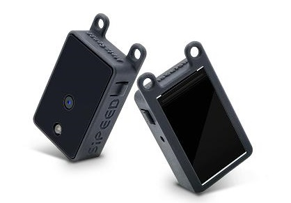
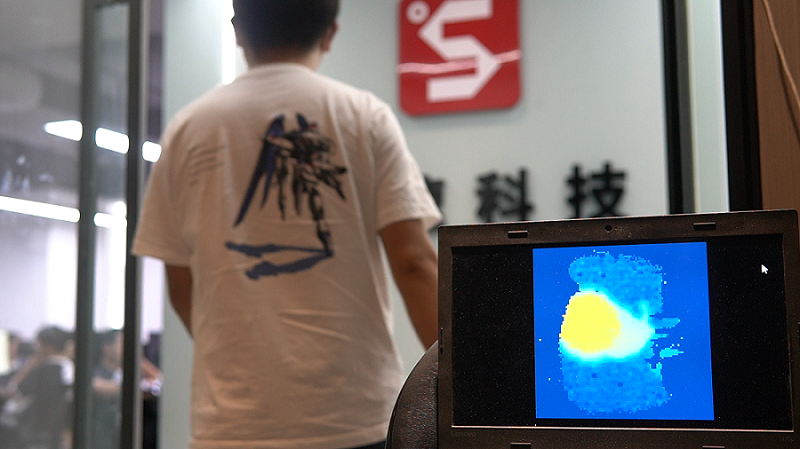

# MaixSense-A010

## 产品概述


MaixSense-A010 是由 Sipeed 所推出的一款由 BL702 + 炬佑 100x100 TOF 所组成的极致性价比 3D 传感器模组，最大支持 100x100 的分辨率和 8 位精度，并且自带 240×135 像素的 LCD 显示屏来实时预览 colormap 后的深度图 。

**资料汇总**

硬件资料：[点击查看下载](https://dl.sipeed.com/shareURL/MaixSense/MaixSense_A010)

## 产品开箱指南

### 准备工作

这款设备采用串口协议对外提供接口和传输数据，物理接口对外提供了 type-c（虚拟串口）及 1.0mm 的 4pin 母座（UART）都能获取深度图数据用于集成。

**产品接线说明**
通过 type-c 接口连接电脑后，可以识别到 /dev/ttyUSBx（Linux）或COMx（Windows）。


还可通过 usb2ttl 模组按照硬件引脚图连接 4pin 母座。
硬件引脚图：屏幕正面朝下
<html>
  
  
</html>

<table>
    <tr>
        <td>MS-A010</td>
        <td>TX</td>
        <td>RX</td>
        <td>GND</td>
        <td>5V</td>
    </tr>
    <tr>
        <td>usb2ttl 模块</td>
        <td>RX</td>
        <td>TX</td>
        <td>GND</td>
        <td>5V</td>
    </tr>
</table>

**COMTOOL 软件包**

Windows 系统连接：[点击查看软件包](https://dl.sipeed.com/shareURL/MaixSense/MaixSense_A010/software_pack/comtool)
Linux 系统：不提供软件包，需用户自行编译[点击跳转](https://github.com/sipeed/MaixSense-ComTool)。
注意：Win 7 及以下系统需装驱动，可自行前往 FTDI 官网下载。

### 上电互动预览
将设备通电后，可在设备上自带 LCD 屏实时预览 color map 后的深度伪彩图。


### PC 互动预览

1. 打开 COMTOOL 软件后，如果软件上方无 Graph 的话，可在右上角 + 号处添加 Graph 。创建 Graph 后若居中部分为白无图，则**双击**左下角 MaixSenseLite 即可打开界面显示端口。

2. 左侧选择小的 Port 和对应波特率（任意选择高波特率），点击 open 再勾选下方 USB 即可接收大量数据,左下角处会显示 Connected。

3. 设定 Header 为 \x00\xFF 即可正确解析图像数据并观察到深度图，可以直观感受二维平面图像上的深度。


### 互动配置说明

COMTOOL 上位机的配置控件说明
- Header 设置识别包头
- RawCMD 用户可以手动发送指令（USB 和 UART 串口行为相同）
- ISP 启动停止
- LCD 显示自带屏的开启关闭
- USB 串口传输深度图开启关闭
- UART 串口传输深度图开启关闭
- ANTIMMI 自动抗多机干扰开启关闭（易受干扰，关闭的效果都要更好些）
- Binn 可下拉设置 BINNING，Baud 设置 UART 波特率
- X、Y 设置坐标：D 左侧多选框开启后显示出该摄像头的距离。
- Unit 设置量化单位（16位量化到8位，比例缩小，设置太小的话会只能看清很近处的影像）
- FPS 设置出图帧率（不宜过高，根据对接设备的性能合理设置即可，减小帧率可以减少传输数据量）
- Ev 曝光间隙控制（最左代表 AE，其他是固定曝光时间）

## 案例：远近中物体实拍
物体之间放置的距离形成深度值的差异，模块捕捉到差异后显示冷暖色，距离近时显示暖色而远则显示冷色。


## 案例：检测人流
高精度，大分辨率的实时监测人流走动的情况并统计。



## 案例：键盘灯跟随
实现超酷炫的键盘灯跟随，实时跟踪手部的位置，再根据手部的位置映射键盘灯。

相关支持：[点击查看代码](https://dl.sipeed.com/shareURL/others/maixsense_example)


## 案例：接入 MCU 
- MS-A010 拥有强大的兼容性，可基于串口协议外接 K210 bit 这样的单片机开发板或树莓派之类的 linux 开发板来进行二次开发。
- k210 Bit 开发板是 sipeed Maix 中产品线的一员，基于嘉楠堪智科技的边缘智能计算芯片 K210 (RISC-V 架构 64位双核) 设计的一款 AIOT 开发板。

[K210 Bit 购买链接指路](https://item.taobao.com/item.htm?spm=a230r.1.14.11.681570a1yq4sJD&id=586580351110&ns=1&abbucket=10&mt=)
[点击了解 K210 Bit](https://wiki.sipeed.com/hardware/zh/maix/maixpy_develop_kit_board/maix_bit.html)
[MS-A010 外接 K210 bit 源码获取](http://wiki.sipeed.com/hardware/zh/maixsense/maixsense-a010/mcu.html)


## 二次开发：串口协议

MS-A010 二次开发手册：[点击查看](http://wiki.sipeed.com/hardware/zh/maixsense/maixsense-a010/at_command.html)
可参考上方的案例：**MS-A010 外接 K210 bit**

## 二次开发：接入 ROS
### 接入 ROS1 

**1. 准备工作** 
首先，准备适用的环境：`Linux` 系统
可使用虚拟机 `virtual box` 或者 `vmware` 也可安装双系统，安装方法请自行查询。

**2. 安装运行**
由于我们提供的是 ROS2 的接入功能包，运行 ROS1 的话只需切换分支即可。
接入功能包：[点击下载](https://dl.sipeed.com/shareURL/MaixSense/MaixSense_A010/software_pack/SDK)
```bash

#解压缩sipeed_tof_ms_a010.zip，并进入目录
git switch ros1 #切换到ros1分支
source /opt/ros/*/setup.sh
catkin_make
source devel/setup.sh
rosrun sipeed_tof_ms_a010 a010_publisher _device:="/dev/ttyUSB0"
#之后终端会持续刷新显示[sipeed_tof]: Publishing，即正常工作

```
**3. 可自行在 RQT 查看帧率**

**4. RVIZ2 预览**
打开 `rviz2` 后，在界面左下角的 `Add`->`By topic`->`PointCloud2或/depth` ->`Image 添加` ->`Display/Global Options/Fixed Frame` 需要修改成 `tof`，才能正常显示点云，根据添加的内容，左侧会显示 `Image` 而中间则显示点云。


### 接入 ROS2 

**1. 准备工作**
首先，准备适用的环境：`Linux` 系统
可使用虚拟机 `virtual box` 或者 `vmware` 也可安装双系统，安装方法请自行查询。

**2. 安装运行**
我们提供了 ROS2 的接入功能包，用户需要在运行 ROS2 的系统上编译安装。
接入功能包：[点击下载](https://dl.sipeed.com/shareURL/MaixSense/MaixSense_A010/software_pack/SDK)

```bash
#解压缩 sipeed_tof_ms_a010.zip，并进入目录
source /opt/ros/*/setup.sh
colcon build #如提示缺少colcon时需要sudo apt install python3-colcon-ros
ros2 run sipeed_tof_ms_a010 publisher --ros-args -p device:="/dev/ttyUSB0"
source install/setup.sh
#之后终端会持续刷新显示[sipeed_tof]: Publishing，即正常工作。
```

**3. RQT 查看帧率**


**4. RVIZ2 预览**
打开 `rviz2` 后，在界面左下角的 `Add`->`By topic`->`PointCloud2或/depth` ->`Image 添加` ->`Display/Global Options/Fixed Frame` 需要修改成 `tof`，才能正常显示点云，根据添加的内容，左侧会显示 `Image` 而中间则显示点云。


