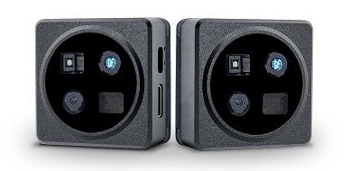
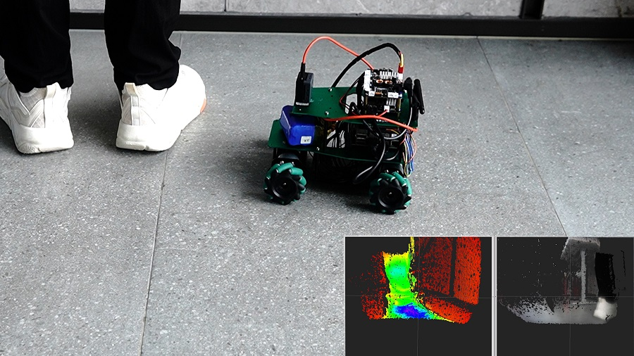
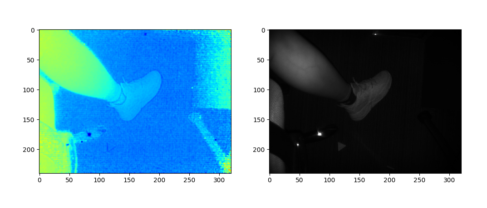
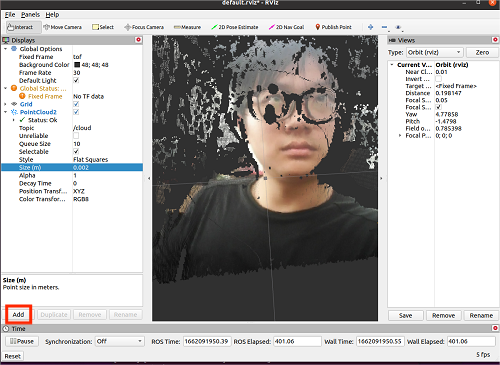
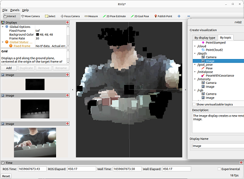

# MaixSense-A075V

|     时间      | 负责人 |   更新内容   |
| :-----------: | :----: | :----------: |
| 2022.08.10 | lyx | 初次编写文档 |
| 2022.11.15 | lyx | 补充细节 |

## 产品概述



**MaixSense-A075V** 是一款具有 **320x240** 分辨率及 **RGB** 功能的 **3D TOF** 摄像机模组，
支持 **Linux** 下免驱的即插即用，可通过上位机显示彩色 **3D** 画面并记录点云

## 产品开箱指南

### 准备工作

在 Windows 系统上运行预览 **MaixSense-A075V** 的话需要安装驱动。

**Windows 安装驱动教程**：[点击查看](./install_drivers.md)

### 网页上位机预览

>**注意**：模组上电前一定要确保网络环境中没有使用 `192.168.233.0/24` 的地址段，
>**MaixSense-A075V** 会使用 **RNDIS** 并设置自己的 `iP` 地址为 `http://192.168.233.1`.


根据上图将模组通电接入 `PC` 端，这时自带的风扇会开始工作以及镜头处会显示有蓝灯在闪烁，选择浏览器输入 `http://192.168.233.1` 预览 3D 点云图，上电后有延迟等待 `10s-15s` 系统和程序才会启动完成。

**使用网页上位机快速预览（正面和侧面）：**

<html>
  
  
</html>

可选预览深度伪彩点云，取消勾选页面右侧的交互面板上的第一行 `RGB_Map` 即可。


### 互动配置

网页上位机交互面板提供了一系列配置和功能，可以实时预览变动的效果。


**交互面板控件说明**

- **RGB_Map**：多选框 开关 RGB 映射，即关闭时只显示深度伪彩点云，打开时显示 RGB 映射点云。
- **colorMap**：下拉栏 提供了几个伪彩映射选项(即 cmap )，推荐使用 jet，RGB_Map 关闭时有效。
- **deepRangeMax** 和 **deepRangeMin** 滑动条是设定 cmap 的映射范围的，即只有位于 deepRangeMin 和 deepRangeMax 之间的数值（深度值）会通过 cmap，RGB_Map 关闭时有效。
- **NormalPoint**：多选框 开关显示正常点（TOF 成像会有无效点，对应的相反描述），需要打开。
- **OE_Points**：多选框 开关显示 OE 点，建议关闭。
- **UE_Points**：多选框 开关显示 UE 点，建议关闭。
- **Bad_Points**：多选框 开关显示无效点，建议关闭。
- **SpatialFilter**：多选框 开关空间滤波，基于下面的 SpatialFilterSize 值和 SpatialFilterType 指定的算法进行处理。
- **TemporalFilter**：多选框 开关时间滤波，基于下面的 TemporalFilteralpha 值做了一个时间上的平均。
- **TemporalFilteralpha**：滑动条 设定时间滤波所需时长，适中即可，可自行尝试体验其它效果。
- **SpatialFilterType**：下拉栏 设定空间滤波算法，提供高斯滤波（Gaussian）和双边滤波（Bilateral），双边滤波性能要求较高，不建议使用。
- **SpatialFilterSize**：滑动条 设定空间滤波所需范围，适中即可，可自行尝试体验其它效果。
- **FlyingPointFilter**：多选框 开关飞点过滤，基于下面的 FlyingPointThreshold 值作为过滤阈值，超过阈值的将被过滤掉，建议适中配置，否则有效点也会被剔除。

### 保存数据

网页版上位机控件栏最下方提供两个按钮，用户可根据以下的说明去使用。

**SaveRaw**：可保存一帧 raw 数据，如果需要使用深度或 IR 或 RGB 数据进行二次开发的话，则需要了解 raw 的数据结构。不过我们也提供详细的 `jupyter notebook` 供用户和开发者使用和了解 raw 数据的处理过程。

**SavePointCloud**：可保存一帧 3D 点云图，保存格式为 `pcd` ，同样可以通过上述提供的脚本预览。

>注意：**raw** 数据可通过开放的接口获取，开发者进行解析即可基于此二次开发，但点云 **pointcloud** 是基于 **raw** 数据和相机内参进行计算得到的，无相应接口提供。

### SSH 登录

除了直接使用网页上位机进行预览，我们还可以使用 SSH 进行登录操作。

.. details::点此展开查看 MobaXterm 介绍

    MobaXterm 是在 Windows 下使用的全能终端管理软件，而 Linux 系统可以使用 ssh 远程被操作，使用 MobaXterm 进行 ssh 登陆板子直接编辑板内的代码或执行命令，也能方便的拖拽文件上传或下载到电脑里，类似的工具还有 vscode remote 远程登录 linux 服务器。

    

**MobaXterm**：[点击前往下载](mobaxterm.mobatek.net/download) 分别有付费与免费双版本，下载免费版本即可。
**MobaXterm 使用例程**：[点击查看](https://wiki.sipeed.com/hardware/zh/maixII/M2/tools/mobaxterm.html?highlight=ssh)

根据上面网页预览的画面可以知道所使用的 ip 为 `192.168.233.1`, 所以我们可以使用这个 ip 和登录密码 `root` 来登录到 TOF 模组的终端系统中。

Windows：参照上文例程使用模组自带的 `ip` 地址 `192.168.233.1` 进行登录。
Linux：使用登录密码 `root` 直接使用以下的命令行登录终端进行操作。

```bash
ssh root@192.168.233.1
```

### 固件更新

替换 `/root/maix_dist` 下对应的文件即可。

[点击下载更新文件](https://dl.sipeed.com/shareURL/MaixSense/MaixSense_A075V/03_Firmware)

## 案例：远中近点云实拍

高精度的映射物品摆放距离的差异，点云图可直观清楚感受到更真实的可视化。


## 案例：避障小车

模组可搭载小车或无人机来回移动获取障碍物的远近深度值，并通过差异判断画面中是否有障碍物，做出快速反应并精准规避障碍物。



>例程暂未开源，待整理公开

## 案例：检测人流

可实时监控人流，进行更高精度以及大分辨率的统计。


>例程暂未开源，待整理公开。

## 二次开发：SDK 支持

### python SDK

这是基于 `python 3` 软件开发工具包，MaixSense-A075V 对外开发了 `http` 接口，我们可通过 `http` 请求获取到原生数据（包括深度图，ir 图，rgb 图），为了方便用户理解数据包的结构及获取还有解码的相关逻辑，因此我们提供封装了 `http` 请求和原生数据的解码相关函数，用户基于此可进行二次开发。

**SDK 获取方式**：[点击下载](https://dl.sipeed.com/fileList/others/maixsense_example/maixsense_075_tutorial.ipynb)
**使用方式**：安装 `jupyter` 后连接模组打开我们提供的 `toturial.py` 即可。

### 解包推流

理解了上述 `python SDK` 数据获取和解码的逻辑后，我们可以尝试进阶版，连续获取解码并调用第三方 `python` 图像库。例如：`matplotlib` 进行实时显示，而 `toturial.py` 给出了获取一帧数据的逻辑实现，通过 `plt` 显示并外套循环即可做到实时显示。

**解包推流**：[点此展开查看 stream.py 内容](./../maixsense-a010/code.html#streampy)
**使用方式**：装好所有的依赖包后即可 `python stream.py` 运行。



### 检测体积

基于第三方 `python` 包，理解了上述数据获取和解码的逻辑后再次进阶，
持续显示多帧并且再通过 `SDK` 获取模组内参数计算出粗略的点云，并进行累加得到物品的总体积。

>限制：要求俯视图可以看到除底面外的所有细节

**检测体积**：[点此展开查看 calVolumes.py 内容](./../maixsense-a010/code.html#calvolumespy)
**使用方式**：装好所有的依赖包后即可 `python calVolumes.py` 运行，命令行有后续操作提示。


## 二次开发：接入 ROS

> 首先需要根据自己电脑安装对应版本的 ROS

### 接入 ROS1
**1. 准备工作**

运行 ROS 前我们要准备适用的环境：`Linux` 系统。
可使用虚拟机 `virtual box` 或者 `vmware`：[点击前往下载](https://www.vmware.com/cn/products/workstation-player/workstation-player-evaluation.html)
也可以自行安装双系统，安装方法请自行搜索或参考右侧：[双系统安装教程](https://neucrack.com/p/330)

**2. 安装运行**

ROS1 接入包：[点击前往下载](https://dl.sipeed.com/shareURL/MaixSense/MaixSense_A075V/software/SDK)

```bash
#解压缩sipeed-tofv075-ros.zip，并进入目录
source /opt/ros/*/setup.sh
catkin_make
source devel/setup.sh
rosrun sipeed_tof_cpp publisher
#之后终端会持续刷新命令行
```


**3. 可自行在 RQT 查看帧率**


**4. RVIZ 预览**

打开 `rviz2` 后，在界面左下角的 `Add`->`By topic`->`PointCloud2或/depth` ->`Image 添加` ->`Display/Global Options/Fixed Frame` 需要修改成 `tof` 才能正常显示点云，根据添加的内容左侧会显示 **Image** 而中间则显示点云。



### 接入 ROS2
**1. 准备工作**

运行 ROS 前我们要准备适用的环境：`Linux` 系统。
可使用虚拟机 `virtual box` 或者 `vmware`：[点击获取](https://www.vmware.com/cn/products/workstation-player/workstation-player-evaluation.html)
也可以自行安装双系统，安装方法请自行搜索或参考右侧：[双系统安装教程](https://neucrack.com/p/330)

**2. 安装运行**

我们提供了 ROS2 的接入功能包，用户需要在运行 ROS2 的系统上编译安装。
ROS2 接入包：[点击前往下载](https://dl.sipeed.com/shareURL/MaixSense/MaixSense_A075V/software/SDK)

``` bash
#解压缩sipeed-tofv075-ros2.zip，并进入目录
source /opt/ros/*/setup.sh
colcon build #（如提示缺少colcon时需要sudo apt install python3-colcon-ros）
source install/setup.sh
ros2 run sipeed_tof_cpp publisher
#之后终端会持续刷新显示[sipeed_tof]: Publishing，即正常工作
```

**3. RQT 查看帧率**

打开 `RQT` 后选择 `Plugins`->`Topics`->`Topic Monitor`。


**4. RVIZ2 预览**

打开 `rviz2` 后，在界面左下角的 `Add`->`By topic`->`PointCloud2` 或 `/depth、/intensity、/rgb`->`Image 添加`->`Display/Global Options/Fixed Frame` 需要修改成 `“tof”` 才能正常显示点云。根据添加的内容左侧会显示 **Image** 而中间则显示点云。

**伪彩点云和 RGBD 融合的点云效果：**
<html>
  
  
</html>

