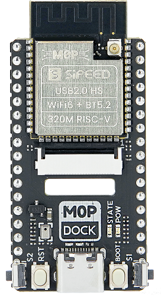

## 板卡概述

Sipeed M0P Dock 是使用 [Sipeed M0P](https://wiki.sipeed.com//hardware/zh/maixzero/m0p/m0p.html) 模组设计的开发板，主控是 [博流智能科技](http://www.bouffalolab.com/) 的 BL618 芯片，支持 Wifi6 和蓝牙 5.2 无线协议，默认最高主频 320MHz，支持 USB2.0 HS。板卡上有 DVP 接口来连接摄像头，有 FPC 座子来连接屏幕，有 TF 卡槽来扩展存储，还有一颗 WMM7027ATSN1 MEMS 麦克风用于自定义功能，板卡上还有电池充电管理电路，支持使用锂电池供电。

购买链接：[淘宝](https://item.taobao.com/item.htm?id=710359411812)

## 板卡特点

- 主芯片 BL618 RV32 320MHz RISC-V
- 支持 2.4G WIFI6（IEEE 802.11 b/g/n/ax）
- 支持蓝牙 5.x 双模（BT+BLE）和 Zigbee / IEEE 802.15.4
- USB 2.0 Type-C（480Mhz）（可用作下载固件和USB转串口）
- DVP 摄像头连接器
- SPI 屏幕连接器（可以连接3.92寸320x320方形电容触摸屏）
- 4.2V 锂电池充电电路
- 1 个 TF 卡连接器（SDIO接口）
- 1 个模拟麦克风、2 个 ADC 按键和 1 个状态指示灯

## 板卡参数

<table>
    <tbody>
        <tr>
            <th colspan="3" style="white-space:nowrap"> M0P Dock 参数 </td>
        </tr>
        <tr>
            <td rowspan="18" style="white-space:nowrap"> M0P 模组 </td>
        </tr>
        <tr>
            <td colspan="2"> RISC-V CPUs：RV32 320MHz </td>
        </tr>
        <tr>
            <td colspan="2"> SRAM: 480KB + 4MB </td>
        </tr>
        <tr>
            <td rowspan="15"> 支持接口 </td>
        </tr>
        <tr>
            <td>DVP Camera</td>
        </tr>
        <tr>
            <td>Display（QSPI、DBI）</td>
        </tr>
        <tr>
            <td>USB2.0 HS OTG(High-Speed 480Mhz)</td>
        </tr>
        <tr>
            <td>SPI</td>
        </tr>
        <tr>
            <td>UART * 2</td>
        </tr>
        <tr>
            <td>IIC * 2</td>
        </tr>
        <tr>
            <td>IIS</td>
        </tr>
        <tr>
            <td>10bit-GPDAC</td>
        </tr>
        <tr>
            <td>12~16bit GPADC</td>
        </tr>
        <tr>
            <td>ACOMP</td>
        </tr>
        <tr>
            <td>PWM</td>
        </tr>
        <tr>
            <td>SDIO2.0</td>
        </tr>
        <tr>
            <td>Audio Codec</td>
        </tr>
        <tr>
            <td> 无线： · 支持Wi-Fi 802.11 b/g/n/ax（WiFi6） · 支持蓝牙 5.x 双模(BT+BLE) · 支持Wi-Fi / 蓝牙/ Zigbee
                共存 （更详细的特性请查看芯片 <a href="https://gitee.com/wonderfullook/bl_docs/tree/main/BL616_DS/zh_CN">
                    datasheet</a>）</td>
        </tr>
        </td>
        </tr>
        <tr>
            <td colspan="1" rowspan="11" style="white-space:nowrap"> 板载部件 </td>
        </tr>
        <tr>
            <td colspan="2">USB2.0 Type-C 母座连接器:   可用作USB通信、下载固件和USB转串口</td>
        </tr>
        <tr>
            <td colspan="2">DVP 摄像头连接器：  通用接口，可以连接 GC0328 摄像头模组</td>
        </tr>
        <tr>
            <td colspan="2">SPI 屏幕连接器： 可以连接 3.92 寸 320x320 方形电容触摸屏</td>
        </tr>
        <tr>
            <td colspan="2">SPI FLASH（默认8MByte）</td>
        </tr>
        <tr>
            <td colspan="2">1 个 TF 卡连接器（SDIO接口）</td>
        </tr>
        <tr>
            <td colspan="2">1 个模拟麦克风：WMM7027ATSN1（全指向，灵敏度 -38dB，信噪比 59dB ）</td>
        </tr>
        <tr>
            <td colspan="2">2 个 ADC 按键（在板子两侧）</td>
        </tr>
        <tr>
            <td colspan="2">1 个电源指示灯和 1 个状态指示灯</td>
        </tr>
        <tr>
            <td colspan="2">两侧排针引出所有 IO（出厂已经焊接好排针）</td>
        </tr>
        <tr>
            <td colspan="2">4.2V 锂电池充电电路： · USB 给整板供电，整板给电池供电，电池与整板主电源之间有二极管防倒灌 · 电池电压低于 3.3V 时 BL618 芯片会被强制处于复位状态 ·
                只支持最大电压是 4.2V 的可充电锂电池，不支持最大电压小于 4.2V 的可充电锂电池及不可充电的电池</td>
        </tr>
    </tbody>
    </tbody>
</table>

## 引脚分布

- STATE LED 接到 GPIO21
- POW LED 接到 3.3V。板卡正常运行时亮起

## 产品对比

| ---           | M0P Dock                          | ESP32-S3-DevKitC                 |
| ------------- | --------------------------------- | -------------------------------- |
| MCU           | 单核320Mhz RISC-V                 | 双核240Mhz                       |
| SRAM          | 480KB + 4MB                       | 512KB + 2MB(optional)            |
| ROM           | √                                 | √                                |
| SPI Nor Flash | 8MB(optional)                     | 8MB(optional)                    |
| WIFI          | IEEE 802.11 b/g/n/ax (WiFi6)      | IEEE 802.11 b/g/n                |
| BLE           | √                                 | √                                |
| I2C/UART/SPI  | √                                 | √                                |
| Microphone    | 模拟麦克风                        | ×                                |
| LCD           | 支持 3.92 英寸电容触摸屏          | ×                                |
| Camera        | DVP camera                        | ×                                |
| USB           | USB 2.0 High speed OTG（480Mbps） | USB 2.0 Full speed OTG（12Mbps） |
| 固件下载方式  | USB                               | USB                              |

## 软件描述

<table>
    <thead>
        <tr>
            <th colspan = "2" > M0P 模组 </th>   
        </tr>
    </thead>
    <tbody>
        <tr>
          <td>OS</td>
          <td> 支持FreeRTOS</td>
        </tr>
        <tr>
          <td>开发方式</td>
          <td>· 原生C SDK · MaixHAL C 模块 · PikaPython </td>
        </tr>
        <tr>
          <td> SDK </td>
          <td><a href="https://github.com/bouffalolab/bouffalo_sdk"> github </a></td>
        </tr>
        <tr>
          <td>Examples</td>
          <td><a href="https://github.com/sipeed/M0P_BL618_examples"> github </a></td>
        </tr>
    </tbody>
</table>

## 板卡资料

- [板卡规格书](https://dl.sipeed.com/shareURL/Maix-Zero/M0P/M0P%20Dock/1_datasheet)
- [板卡原理图](https://dl.sipeed.com/shareURL/Maix-Zero/M0P/M0P%20Dock/2_Schematic)
- [板卡尺寸图](https://dl.sipeed.com/shareURL/Maix-Zero/M0P/M0P%20Dock/4_Dimensional_drawing)
- [板卡位号图](https://dl.sipeed.com/shareURL/Maix-Zero/M0P/M0P%20Dock/3_Bit_number_map)
- [3D 模型文件](https://dl.sipeed.com/shareURL/Maix-Zero/M0P/M0P%20Dock/5_3D_File)

---

- [博流官方文档](https://dev.bouffalolab.com/home/)
- [BL618 数据手册](https://gitee.com/wonderfullook/bl_docs/tree/main/BL616_DS/zh_CN) (gitee)
- [BL618 参考手册](https://gitee.com/wonderfullook/bl_docs/tree/main/BL616_RM/zh_CN) (gitee)

---

- [Sipeed Examples](https://github.com/sipeed/M0P_BL618_examples)（github）
- [Bouffalolab SDK](https://github.com/bouffalolab/bouffalo_sdk) (github)
- 交流 QQ 群：`816177882` 。[点我加群](https://jq.qq.com/?_wv=1027&k=4lroNFnI)
- 论坛：[bbs.sipeed.com](https://bbs.sipeed.com/)

## 注意事项

<table>
    <tr>
        <th>项目</th>
        <th>注意事项</th>
    </tr>
    <tr>
        <td>静电防护</td>
        <td>· 请注意避免静电打到 PCBA 上；接触 PCBA 之前请把手的静电释放掉
        </td>
    </tr>
    <tr>
        <td>容忍电压</td>
        <td> 所有 GPIO 都是 3.3V 电平，请不要让 GPIO 的实际工作的电压超过额定值，否则会引起 PCBA 的永久性损坏 </td>
    </tr>
    <tr>
        <td>避免短路</td>
        <td>请在上电过程中，避免任何液体和金属触碰到 PCBA 上的元件的焊盘，否则会导致短路，烧毁 PCBA</td>
    </tr>
    <tr>
        <td>FPC 座子</td>
        <td>在连接 FPC 软排线的时候，请确保排线无偏移地完整地插入到排线中</td>
    </tr>
    <tr>
        <td>BOOT 模式选择</td>
        <td>
        在启动时，芯片判定 BOOT 引脚的电平，选择两个启动选项之一 
        · BOOT 低电平：从 FLASH 加载固件 
        · BOOT 高电平：进入 USB 下载模式
        </td>
    </tr>
</table>

## 充电说明

板卡上板载了 TP4057 充电 IC，板卡底面有两个锂电池状态指示 LED。

- FULL LED：锂电池充电 IC 的 STDBY 脚，当电池充电结束后，该灯亮起
- CHRG LED：处于充电状态时，该灯亮起

## 联系方式

M0P Dock 开发板可以在多种场景实现客户不同方面的需要，技术支持和商业合作请联系邮箱 [support@sipeed.com](support@sipeed.com)